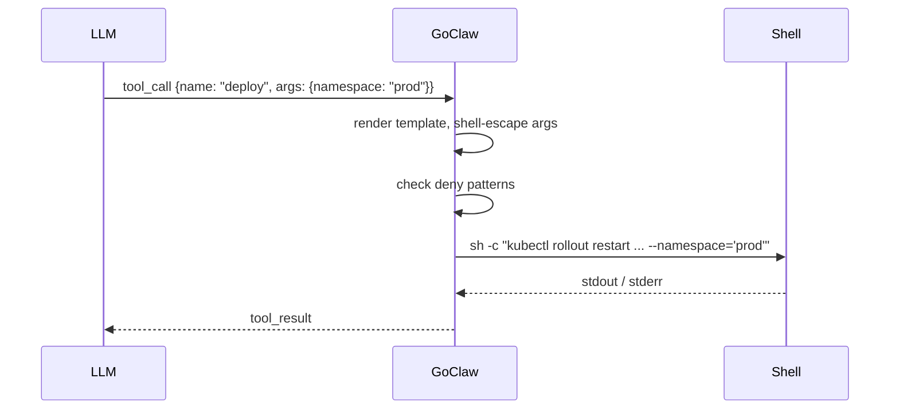

> 翻译自 [English version](/custom-tools)

# 自定义工具

> 在运行时为你的 agent 添加基于 shell 的新能力 — 无需重新编译，无需重启。

## 概述

自定义工具让你可以用服务器上运行的命令来扩展任意 agent。你定义一个名称、一段供 LLM 决策调用时机的描述、参数的 JSON Schema，以及一个 shell 命令模板。GoClaw 将定义存储在 PostgreSQL 中，在请求时加载，并对 shell 进行转义处理，防止 LLM 注入任意 shell 语法。

工具可以是**全局的**（对所有 agent 可用），也可以通过设置 `agent_id` 将其**限定到单个 agent**。



## 创建工具

### 通过 HTTP API

```bash
curl -X POST http://localhost:8080/v1/tools/custom \
  -H "Authorization: Bearer $GOCLAW_TOKEN" \
  -H "Content-Type: application/json" \
  -d '{
    "name": "deploy",
    "description": "Roll out the latest image to a Kubernetes namespace. Use when the user asks to deploy or restart a service.",
    "parameters": {
      "type": "object",
      "properties": {
        "namespace": {
          "type": "string",
          "description": "Target Kubernetes namespace (e.g. production, staging)"
        },
        "deployment": {
          "type": "string",
          "description": "Name of the Kubernetes deployment"
        }
      },
      "required": ["namespace", "deployment"]
    },
    "command": "kubectl rollout restart deployment/{{.deployment}} --namespace={{.namespace}}",
    "timeout_seconds": 120,
    "agent_id": "3f2a1b4c-0000-0000-0000-000000000000"
  }'
```

**必填字段：** `name` 和 `command`。名称必须是 slug 格式（仅小写字母、数字、连字符），且不能与内置工具或 MCP 工具名称冲突。

### 字段说明

| 字段 | 类型 | 默认值 | 描述 |
|---|---|---|---|
| `name` | string | — | 唯一 slug 标识符 |
| `description` | string | — | 展示给 LLM 以触发工具调用 |
| `parameters` | JSON Schema | `{}` | LLM 必须提供的参数 |
| `command` | string | — | Shell 命令模板 |
| `working_dir` | string | agent 工作空间 | 覆盖工作目录 |
| `timeout_seconds` | int | 60 | 执行超时时间 |
| `agent_id` | UUID | null | 限定到单个 agent；省略则为全局 |
| `enabled` | bool | true | 禁用而不删除 |

### 命令模板

使用 `{{.paramName}}` 占位符。GoClaw 通过简单字符串替换来替换这些占位符，并对值进行 shell 转义 — 不使用 Go 的 `text/template` 引擎，因此不支持模板函数和管道。每个替换值都会被单引号包裹，内嵌的单引号也会被转义，即使是恶意 LLM 也无法突破参数边界。

```bash
# 这些占位符始终视为字面字符串 — 不支持模板逻辑
kubectl rollout restart deployment/{{.deployment}} --namespace={{.namespace}}
git -C {{.repo_path}} pull origin {{.branch}}
```

### 添加环境变量（密钥）

密钥必须在创建后通过单独的 `PUT` 请求设置 — 不能包含在初始 `POST` 中。它们在存储前使用 AES-256-GCM 加密，且**不会通过 API 返回**。

```bash
curl -X PUT http://localhost:8080/v1/tools/custom/{id} \
  -H "Authorization: Bearer $GOCLAW_TOKEN" \
  -H "Content-Type: application/json" \
  -d '{
    "env": {
      "KUBE_TOKEN": "eyJhbGc...",
      "SLACK_WEBHOOK": "https://hooks.slack.com/services/..."
    }
  }'
```

这些变量仅注入到子进程中 — 不会对 LLM 可见，也不会写入日志。

## 管理工具

```bash
# 列表（分页）— 仅返回已启用的工具
GET /v1/tools/custom?limit=50&offset=0

# 按 agent 过滤 — 仅返回该 agent 的已启用工具
GET /v1/tools/custom?agent_id=<uuid>

# 按名称或描述搜索（不区分大小写）
GET /v1/tools/custom?search=deploy

# 获取单个工具
GET /v1/tools/custom/{id}

# 更新（部分更新 — 任意字段）
PUT /v1/tools/custom/{id}

# 删除
DELETE /v1/tools/custom/{id}
```

## 安全性

每个自定义工具命令都会经过与内置 `exec` 工具相同的**拒绝模式列表**检查。被拦截的类别包括：

- 破坏性文件操作（`rm -rf`、`rm --recursive`、`dd if=`、`mkfs`、`shutdown`、`reboot`、fork bomb）
- 数据泄露（`curl | sh`、带 POST/PUT 参数的 `curl`、`wget --post-data`、DNS 工具：`nslookup`、`dig`、`host`、`/dev/tcp/` 重定向）
- 反弹 shell（`nc -e`、`ncat`、`socat`、`openssl s_client`、`telnet`、`mkfifo`、脚本语言 socket 导入）
- 危险的 eval / 代码注入（`eval $`、`base64 -d | sh`）
- 提权（`sudo`、`su -`、`nsenter`、`unshare`、`mount`、`capsh`、`setcap`）
- 危险路径操作（对 `/` 路径执行 `chmod`，在 `/tmp`、`/var/tmp`、`/dev/shm` 中执行 `chmod +x`）
- 环境变量注入（`LD_PRELOAD=`、`DYLD_INSERT_LIBRARIES=`、`LD_LIBRARY_PATH=`、`BASH_ENV=`）
- 环境变量转储（`printenv`、裸 `env`、`env | ...`、`env > file`、`set`/`export -p`/`declare -x` 转储、`/proc/PID/environ`、`/proc/self/environ`）
- 容器逃逸（`/var/run/docker.sock`、`/proc/sys/`、`/sys/kernel/`）
- 加密挖矿（`xmrig`、`cpuminer`、stratum 协议）
- 过滤器绕过模式（`sed /e`、`sort --compress-program`、`git --upload-pack=`、`grep --pre=`）
- 网络侦察（`nmap`、`masscan`、带 `@` 的出站 `ssh`/`scp`）
- 持久化（`crontab`、写入 shell RC 文件如 `.bashrc`、`.zshrc`）
- 进程操控（`kill -9`、`killall`、`pkill`）

检查在所有 `{{.param}}` 替换后的**完整渲染命令**上运行。

## 示例

### 检查磁盘使用情况

```json
{
  "name": "check-disk",
  "description": "Report disk usage for a directory on the server.",
  "parameters": {
    "type": "object",
    "properties": {
      "path": { "type": "string", "description": "Directory path to check" }
    },
    "required": ["path"]
  },
  "command": "df -h {{.path}}"
}
```

### 查看应用日志

```json
{
  "name": "tail-logs",
  "description": "Show the last N lines of an application log file.",
  "parameters": {
    "type": "object",
    "properties": {
      "service": { "type": "string", "description": "Service name, e.g. api, worker" },
      "lines":   { "type": "integer", "description": "Number of lines to show" }
    },
    "required": ["service", "lines"]
  },
  "command": "tail -n {{.lines}} /var/log/app/{{.service}}.log"
}
```

## 常见问题

| 问题 | 原因 | 解决方法 |
|---|---|---|
| `name must be a valid slug` | 名称含大写字母或空格 | 仅使用小写字母、数字、连字符 |
| `tool name conflicts with existing built-in or MCP tool` | 与 `exec`、`read_file` 或 MCP 工具冲突 | 选择其他名称 |
| `command denied by safety policy` | 匹配到拒绝模式 | 重构命令以避免被拦截的操作 |
| 工具对 agent 不可见 | `agent_id` 错误或 `enabled: false` | 核对 agent ID；如已禁用则重新启用 |
| 执行超时 | 默认 60 秒对该任务过短 | 增大 `timeout_seconds` |

## 内置工具：send_file

`send_file` 工具将工作空间中已存在的文件以附件形式发送——**不创建或修改文件**，仅负责投递。

| 参数 | 必填 | 描述 |
|------|------|------|
| `path` | 是 | 文件路径（相对于工作空间或绝对路径） |
| `caption` | 否 | 随文件附带的说明文字 |

**示例：** agent 已在 `reports/summary.pdf` 生成报告，随后调用：

```json
{ "path": "reports/summary.pdf", "caption": "本周报告" }
```

### DeliveredMedia 跨工具去重协议

GoClaw 在整个 agent run 生命周期中维护一个 `DeliveredMedia` 跟踪器。当 `message` 工具发送 `MEDIA:<path>` 时，该路径被标记为已投递。若 agent 随后对同一路径调用 `send_file`，该调用为 **no-op**——文件不会被重复发送。

这可防止常见模式下的重复投递：agent 同时调用 `write_file(deliver=true)`（会通过 `message` 自动发送）和对同一文件调用 `send_file`。

> 源码：`internal/tools/send_file.go`、`internal/tools/message.go`

---

## 内置 Vault 工具

除自定义 shell 工具外，GoClaw 还提供用于知识管理的内置 vault 工具。这些工具在 vault store 启用时始终可用。

### `vault_link` — 链接 vault 文档

在两个 vault 文档之间创建显式链接，类似 Obsidian 或 Roam 中的 `[[wikilinks]]`。

| 参数 | 必填 | 描述 |
|---|---|---|
| `from` | 是 | 源文档路径（workspace 相对路径） |
| `to` | 是 | 目标文档路径（workspace 相对路径） |
| `context` | 否 | 描述关系的备注 |
| `link_type` | 否 | `wikilink`（默认）或 `reference` |

**文档类型推断**：如果任一文档尚未在 vault 中注册，GoClaw 会自动将其注册为存根，并从文件路径推断 `doc_type`（如 `.md` → `note`，媒体扩展名 → `media`）。跨团队链接被阻止——两个文档必须属于同一团队。

```json
{
  "from": "projects/goclaw/overview.md",
  "to": "projects/goclaw/architecture.md",
  "context": "Architecture details expand on the overview",
  "link_type": "reference"
}
```

### `vault_backlinks` — 查找链接到某文档的文档

返回所有链接到指定路径的文档。遵守团队边界——团队 context 仅显示同团队文档；个人 context 仅显示个人文档。

| 参数 | 必填 | 描述 |
|---|---|---|
| `path` | 是 | 要查找反向链接的文档路径 |

## 下一步

- [MCP 集成](/mcp-integration) — 连接外部工具服务器，而非编写 shell 命令
- [Exec 审批](/exec-approval) — 在命令执行前要求人工审批
- [Sandbox](/sandbox) — 在 Docker 中运行命令以获得额外隔离

<!-- goclaw-source: 29457bb3 | 更新: 2026-04-25 -->
