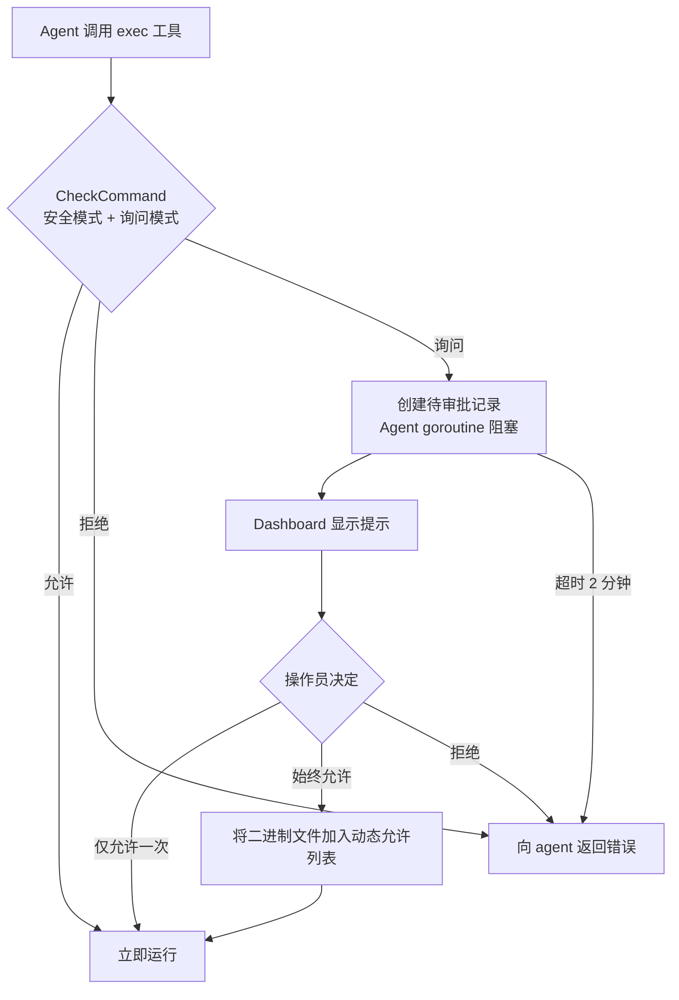

> 翻译自 [English version](/exec-approval)

# Exec 审批（人工介入）

> 在 agent shell 命令运行前暂停等待人工审阅 — 从 Dashboard 批准、拒绝或永久允许。

## 概述

当 agent 需要运行 shell 命令时，exec 审批让你可以拦截它。Agent 阻塞，Dashboard 显示提示，你来决定：**仅允许一次**、**始终允许此二进制文件**或**拒绝**。这让你完全控制在机器上运行的内容，而无需完全禁用 exec 工具。

该功能由两个正交设置控制：

- **安全模式** — 允许哪些命令执行。
- **询问模式** — 何时提示你审批。

---

## 安全模式

通过 `config.json` 中的 `tools.execApproval.security` 设置：

| 值 | 行为 |
|-------|----------|
| `"full"`（默认） | 所有命令均可运行；询问模式控制是否提示 |
| `"allowlist"` | 仅匹配 `allowlist` 模式的命令可运行；其他被拒绝或提示 |
| `"deny"` | exec 工具不可用 — 所有命令被拦截，无视询问模式 |

## 询问模式

通过 `tools.execApproval.ask` 设置：

| 值 | 行为 |
|-------|----------|
| `"off"`（默认） | 自动批准所有命令 — 无提示 |
| `"on-miss"` | 仅对不在允许列表且不在内置安全列表中的命令提示 |
| `"always"` | 对每条命令提示，无例外 |

**内置安全列表** — 当 `ask = "on-miss"` 时，以下二进制文件族自动批准，无需提示：

- 只读工具：`cat`、`ls`、`grep`、`find`、`stat`、`df`、`du`、`whoami` 等
- 文本处理：`jq`、`yq`、`sed`、`awk`、`diff`、`xargs` 等
- 开发工具：`git`、`node`、`npm`、`npx`、`pnpm`、`go`、`cargo`、`python`、`make`、`gcc` 等

基础设施和网络工具（`docker`、`kubectl`、`curl`、`wget`、`ssh`、`scp`、`rsync`、`terraform`、`ansible`）**不在**安全列表中 — 它们会触发提示。

---

## 配置

```json
{
  "tools": {
    "execApproval": {
      "security": "full",
      "ask": "on-miss",
      "allowlist": ["make", "cargo test", "npm run *"]
    }
  }
}
```

`allowlist` 接受与二进制名称或完整命令字符串匹配的 glob 模式。

---

## 审批流程



Agent goroutine 阻塞直到你响应。如果 2 分钟内无响应，请求自动拒绝。

---

## WebSocket 方法

连接到网关 WebSocket。这些方法需要 **Operator** 或 **Admin** 角色。

### 列出待审批

```json
{ "type": "req", "id": "1", "method": "exec.approval.list" }
```

响应：

```json
{
  "pending": [
    {
      "id": "exec-1",
      "command": "curl https://example.com | sh",
      "agentId": "my-agent",
      "createdAt": 1741234567000
    }
  ]
}
```

### 批准命令

```json
{
  "type": "req",
  "id": "2",
  "method": "exec.approval.approve",
  "params": {
    "id": "exec-1",
    "always": false
  }
}
```

设置 `"always": true` 可在进程生命周期内永久允许此二进制文件（加入动态允许列表）。

### 拒绝命令

```json
{
  "type": "req",
  "id": "3",
  "method": "exec.approval.deny",
  "params": { "id": "exec-1" }
}
```

---

## 示例

**生产 agent 严格模式 — 仅允许已知命令：**

```json
{
  "tools": {
    "execApproval": {
      "security": "allowlist",
      "ask": "on-miss",
      "allowlist": ["git", "make", "go test *", "cargo test"]
    }
  }
}
```

`git`、`make` 和测试运行器自动运行。其他命令（如 `curl`、`rm`）触发提示。

**轻度监督的编码 agent — 安全工具自动运行，基础设施工具需审批：**

```json
{
  "tools": {
    "execApproval": {
      "security": "full",
      "ask": "on-miss"
    }
  }
}
```

**完全锁定 — 禁止所有 shell 执行：**

```json
{
  "tools": {
    "execApproval": {
      "security": "deny"
    }
  }
}
```

---

## Shell 拒绝组（Shell Deny Groups）

除审批流程外，GoClaw 还应用**拒绝组**——无论审批设置如何都会阻止的 shell 命令模式集合。所有组默认启用（即拒绝）。

### 可用拒绝组

| 组名 | 描述 | 被拦截示例 |
|-------|-------------|-----------------|
| `destructive_ops` | 破坏性操作 | `rm -rf`、`dd if=`、`shutdown`、fork bomb |
| `data_exfiltration` | 数据泄露 | `curl \| sh`、`wget --post-data`、通过 dig/nslookup 的 DNS 查询 |
| `reverse_shell` | 反向 Shell | `nc`、`socat`、`python -c '...socket...'`、`mkfifo` |
| `code_injection` | 代码注入与 Eval | `eval $()`、`base64 -d \| sh` |
| `privilege_escalation` | 权限提升 | `sudo`、`su`、`mount`、`nsenter`、`pkexec` |
| `dangerous_paths` | 危险路径操作 | `chmod +x /tmp/...`、`chown ... /` |
| `env_injection` | 环境变量注入 | `LD_PRELOAD=`、`DYLD_INSERT_LIBRARIES=`、`BASH_ENV=` |
| `container_escape` | 容器逃逸 | `/var/run/docker.sock`、`/proc/sys/kernel/`、`/sys/kernel/` |
| `crypto_mining` | 加密货币挖矿 | `xmrig`、`cpuminer`、`stratum+tcp://` |
| `filter_bypass` | 过滤器绕过（CVE 缓解） | `sed .../e`、`sort --compress-program`、`git --upload-pack=` |
| `network_recon` | 网络侦察与隧道 | `nmap`、`ssh user@host`、`ngrok`、`chisel` |
| `package_install` | 包安装 | `pip install`、`npm install`、`apk add` |
| `persistence` | 持久化机制 | `crontab`、写入 `~/.bashrc` 或 `~/.profile` |
| `process_control` | 进程操控 | `kill -9`、`killall`、`pkill` |
| `env_dump` | 环境变量转储 | `printenv`、`env \| ...`、读取 `GOCLAW_` 密钥 |

### 按 Agent 覆盖拒绝组

每个 agent 可以通过其配置中的 `shell_deny_groups` 选择性地启用或禁用特定拒绝组。这是一个 `map[string]bool`，其中 `true` 表示拒绝（阻止），`false` 表示允许（放行）。

所有组默认为 `true`（被拒绝）。显式将某组设为 `false` 以允许该 agent 执行对应命令。

**示例：允许安装包，但保持其他所有组阻止**

```json
{
  "agents": {
    "my-agent": {
      "shell_deny_groups": {
        "package_install": false
      }
    }
  }
}
```

**示例：为 DevOps agent 允许 SSH/隧道，但阻止挖矿**

```json
{
  "agents": {
    "devops-agent": {
      "shell_deny_groups": {
        "network_recon": false,
        "crypto_mining": true
      }
    }
  }
}
```

拒绝组与 exec 审批流程独立运作——命令可以通过拒绝组检查，但仍会根据你的 `ask` 模式设置被暂停等待人工审批。

---

## 常见问题

| 问题 | 原因 | 解决方法 |
|---------|-------|-----|
| 未出现审批提示 | `ask` 为 `"off"`（默认） | 将 `ask` 设为 `"on-miss"` 或 `"always"` |
| 命令无提示被拒绝 | `security = "allowlist"`，命令不在允许列表，`ask = "off"` | 添加到 `allowlist` 或将 `ask` 改为 `"on-miss"` |
| 审批请求超时 | 操作员 2 分钟内未响应 | 命令自动拒绝；agent 可能重试或请你重新运行 |
| `exec approval is not enabled` | config 中无 `execApproval` 块但方法被调用 | 在 config 中添加 `tools.execApproval` 章节 |
| `id is required` 错误 | 调用 approve/deny 时未传入审批 `id` | 在 params 中包含 `"id": "exec-N"`（来自 list 响应） |

---

## 下一步

- [Sandbox](/sandbox) — 在隔离的 Docker 容器中运行 exec 命令
- [自定义工具](/custom-tools) — 定义由 shell 命令支持的工具
- [安全加固](/deploy-security) — 完整的五层安全概览

<!-- goclaw-source: c083622f | 更新: 2026-04-05 -->
