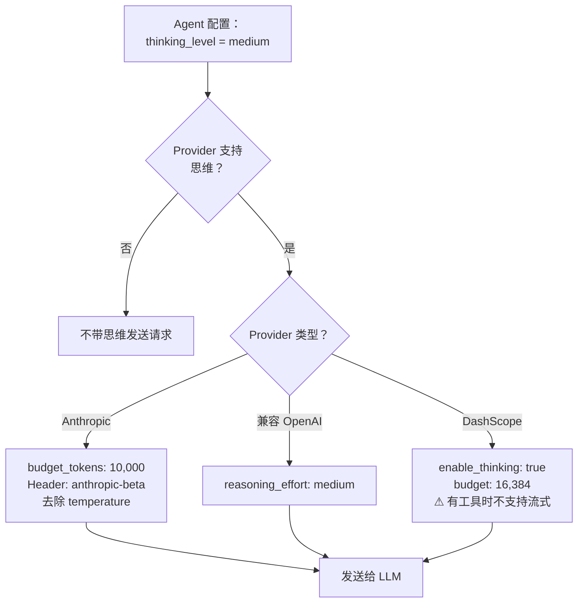
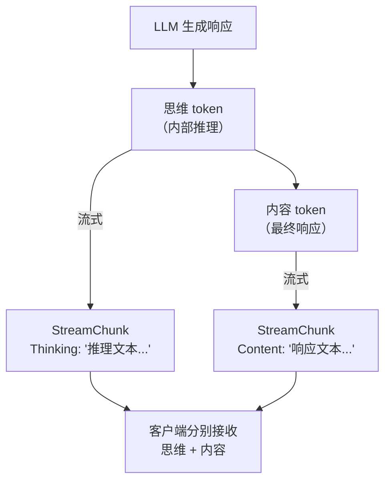
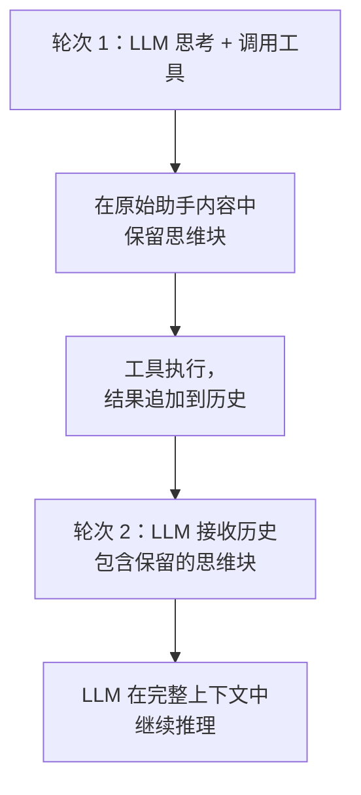

> 翻译自 [English version](/extended-thinking)

# 扩展思维

> 让 agent 在回答前"大声思考" — 在复杂任务上获得更好的结果，代价是额外的 token 和延迟。

## 概述

扩展思维让支持的 LLM 在生成最终回复前先推理问题。模型生成不出现在可见响应中的内部推理 token，但能提升复杂分析、多步规划和决策的质量。

GoClaw 通过单一的 `thinking_level` 设置支持四个 provider 系列的扩展思维 — Anthropic、兼容 OpenAI 的、DashScope（阿里 Qwen）和 Codex（阿里 AI Reasoning）。

---

## 配置

在 agent 配置中设置 `thinking_level`：

| 级别 | 行为 |
|-------|----------|
| `off` | 禁用思维（默认） |
| `low` | 最少思维 — 快速、轻量推理 |
| `medium` | 中等思维 — 质量与成本均衡 |
| `high` | 最大思维 — 深度推理，适合复杂任务 |

这是按 agent 配置的，对该 agent 的所有用户生效。

---

## Provider 映射

每个 provider 对 `thinking_level` 的翻译方式不同：



### Anthropic

| 级别 | Budget tokens |
|-------|:---:|
| `low` | 4,096 |
| `medium` | 10,000 |
| `high` | 32,000 |

思维激活时，GoClaw：

- 在请求体中添加 `thinking: { type: "enabled", budget_tokens: N }`
- 设置 `anthropic-beta: interleaved-thinking-2025-05-14` 请求头
- **去除 `temperature` 参数** — Anthropic 拒绝包含 temperature 的思维请求
- 自动将 `max_tokens` 调整为 `budget_tokens + 8,192` 以容纳思维开销

### 兼容 OpenAI（OpenAI、Groq、DeepSeek 等）

将 `thinking_level` 直接映射到 `reasoning_effort`：

- `low` → `reasoning_effort: "low"`
- `medium` → `reasoning_effort: "medium"`
- `high` → `reasoning_effort: "high"`

推理内容在流式传输期间通过 `reasoning_content` 到达，不需要在轮次间特殊传递。

### DashScope（阿里 Qwen）

| 级别 | Budget tokens |
|-------|:---:|
| `low` | 4,096 |
| `medium` | 16,384 |
| `high` | 32,768 |

通过 `enable_thinking: true` 加 `thinking_budget` 参数启用思维。

**每模型保护**：GoClaw 在发送 `enable_thinking` 之前会检查所解析的模型是否在支持思维的模型列表中。如果模型不支持思维（如较旧的 Qwen2 变体），这些参数会被静默忽略并输出一条 debug 日志。此保护意味着即使你后续切换到不支持思维的 Qwen 模型，DashScope agent 上设置 `thinking_level` 也是安全的。

**重要限制**：DashScope 在有工具时无法流式传输响应 — 这是 provider 层面的限制，与思维无关。只要 agent 定义了工具，GoClaw 自动回退到非流式模式（单次 `Chat()` 调用），并合成 chunk 回调，使客户端的事件流保持一致。

---

## 流式传输

思维激活时，推理内容与常规回复内容并行流式传输。客户端分别接收两者：



| Provider | 思维事件 | 内容事件 |
|----------|---------------|---------------|
| Anthropic | 内容块中的 `thinking_delta` | 内容块中的 `text_delta` |
| 兼容 OpenAI | delta 中的 `reasoning_content` | delta 中的 `content` |
| DashScope | 有工具时不流式（回退到非流式） | 同上 |
| Codex | 追踪 `OutputTokensDetails.ReasoningTokens` | 标准内容 |

思维 token 按 `字符数 / 4` 估算用于上下文窗口追踪。

---

## 工具循环处理

当 agent 使用工具时，思维必须在多个轮次间保留。GoClaw 自动处理这一点 — 但不同 provider 的机制不同。



**Anthropic**：思维块包含必须在后续轮次中完整回传的加密 `signature` 字段。GoClaw 在流式传输期间累积原始内容块（包括 `thinking` 类型块）并在下一轮次重新发送。删除或修改这些块会导致 API 拒绝请求或产生降级响应。

**兼容 OpenAI**：推理内容视为元数据。每个轮次的推理是独立的 — 不需要回传。

---

## 限制

| Provider | 限制 |
|----------|-----------|
| DashScope | 有工具时无法流式传输（provider 层面，非思维特有）— 回退到非流式 |
| Anthropic | 思维激活时 `temperature` 被去除 |
| 所有 | 思维 token 计入上下文窗口预算 |
| 所有 | 思维增加延迟和成本，与预算级别成正比 |

---

## 示例

**为 Anthropic agent 启用中等思维：**

```json
{
  "agent": {
    "key": "analyst",
    "provider": "claude-opus-4-5",
    "thinking_level": "medium"
  }
}
```

`medium` 级别时，Anthropic 获得 `budget_tokens: 10,000`。agent 的可见回复不变 — 思维在内部进行。

**为复杂研究 agent 开启高思维：**

```json
{
  "agent": {
    "key": "researcher",
    "provider": "claude-opus-4-5",
    "thinking_level": "high"
  }
}
```

设置 `budget_tokens: 32,000`，适用于需要深度多步分析的任务。预期延迟和 token 成本会更高。

**低推理的 OpenAI o 系列 agent：**

```json
{
  "agent": {
    "key": "quick-reviewer",
    "provider": "o4-mini",
    "thinking_level": "low"
  }
}
```

映射到 OpenAI API 的 `reasoning_effort: "low"`。

---

## 常见问题

| 问题 | 原因 | 解决方法 |
|-------|-------|-----|
| `temperature` 被意外去除 | Anthropic 思维已启用 | 预期行为 — Anthropic 要求思维时不带 temperature |
| DashScope agent 有工具时很慢 | 有工具时流式传输始终禁用 | 预期行为 — DashScope provider 限制；如延迟重要则减少工具数量 |
| 上下文使用率高 | 思维 token 填满窗口 | 使用 `low` 或 `medium` 级别；在日志中监控上下文百分比 |
| 看不到思维输出 | 思维默认是内部的 | 推理 chunk 单独流式传输；检查客户端 WebSocket 事件 |
| 思维无效 | Provider 不支持思维 | 检查 provider 类型 — 仅支持 Anthropic、兼容 OpenAI 和 DashScope |

---

## 下一步

- [Agent 概览](/agents-explained) — 按 agent 配置参考
- [Hooks 与质量门控](/hooks-quality-gates) — 推理后验证 agent 输出

<!-- goclaw-source: 050aafc9 | 更新: 2026-04-09 -->
