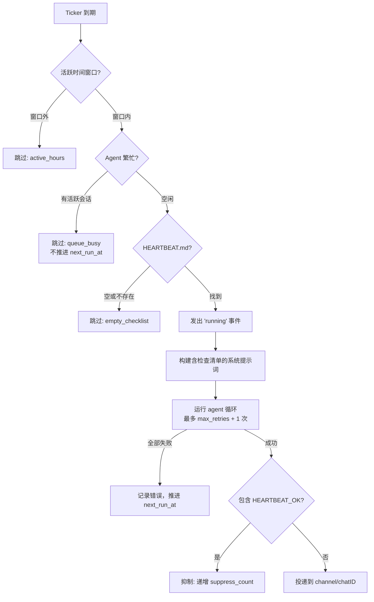

> 翻译自 [English version](/heartbeat)

# Heartbeat

> 主动定期检查 — agent 按计时器执行可配置的检查清单，并将结果报告到你的 channel。

## 概述

Heartbeat 是一个应用级监控功能：你的 agent 按计划唤醒，执行 HEARTBEAT.md 检查清单，并将结果投递到消息 channel（Telegram、Discord、Feishu）。如果一切正常，agent 可以使用 `HEARTBEAT_OK` 令牌完全抑制投递，让你的 channel 在没有内容需要报告时保持安静。

这**不是** WebSocket 保活机制，而是一个面向用户的主动监控系统，具备智能抑制、活跃时间窗口和每次 heartbeat 的模型覆盖功能。

## 快速设置

### 通过 Dashboard

1. 打开 **Agent Detail** → **Heartbeat** 标签
2. 点击 **Configure**（未配置时为 **Setup**）
3. 设置间隔、投递 channel，并编写 HEARTBEAT.md 检查清单
4. 点击 **Save** — agent 将按计划运行

### 通过 agent 工具

Agent 可以在对话中自行配置 heartbeat：

```json
{
  "action": "set",
  "enabled": true,
  "interval": 1800,
  "channel": "telegram",
  "chat_id": "-100123456789",
  "active_hours": "08:00-22:00",
  "timezone": "Asia/Ho_Chi_Minh"
}
```

## HEARTBEAT.md 检查清单

HEARTBEAT.md 是一个 agent 上下文文件，定义了 agent 在每次 heartbeat 运行时应做的事情。它与其他上下文文件（BOOTSTRAP.md、SKILLS.md 等）放在一起。

**编写建议：**

- 列出使用 agent 工具的具体任务 — 而不仅仅是把清单读回来
- 当所有检查通过且没有内容需要投递时，在末尾使用 `HEARTBEAT_OK`
- 保持简洁：短清单运行更快，消耗更少 token

**HEARTBEAT.md 示例：**

```markdown
# Heartbeat Checklist

1. Check https://api.example.com/health — if non-200, alert immediately
2. Query the DB for any failed jobs in the last 30 minutes — summarize if any
3. If all clear, respond with: HEARTBEAT_OK
```

agent 在系统提示词中收到你的检查清单，并附有明确指令：使用工具执行任务，而不仅仅是重复清单文本。

## 配置

| 字段 | 类型 | 默认值 | 描述 |
|---|---|---|---|
| `enabled` | bool | `false` | 总开关 |
| `interval_sec` | int | 1800 | 两次运行之间的秒数（最小 300） |
| `prompt` | string | — | 自定义检查消息（默认："Execute your heartbeat checklist now."） |
| `provider_id` | UUID | — | heartbeat 运行的 LLM provider 覆盖 |
| `model` | string | — | 模型覆盖（如 `gpt-4o-mini`） |
| `isolated_session` | bool | `true` | 每次运行使用全新会话，运行后自动删除 |
| `light_context` | bool | `false` | 跳过上下文文件，仅注入 HEARTBEAT.md |
| `max_retries` | int | 2 | 失败重试次数（0–10，指数退避） |
| `active_hours_start` | string | — | 时间窗口开始，`HH:MM` 格式 |
| `active_hours_end` | string | — | 时间窗口结束，`HH:MM` 格式（支持跨午夜） |
| `timezone` | string | — | 活跃时间的 IANA 时区（默认 UTC） |
| `channel` | string | — | 投递 channel：`telegram`、`discord`、`feishu` |
| `chat_id` | string | — | 目标聊天或群组 ID |
| `ack_max_chars` | int | — | 为未来阈值逻辑保留（暂未激活） |

## 调度与唤醒模式

Heartbeat ticker 每 30 秒轮询一次到期的 agent。触发 heartbeat 运行有四种方式：

| 模式 | 触发条件 |
|---|---|
| **Ticker 轮询** | 后台 goroutine 每 30 秒运行 `ListDue(now)` |
| **手动测试** | Dashboard UI 中的"Test"按钮或 agent 工具调用 `{"action": "test"}` |
| **RPC 测试** | `heartbeat.test` WebSocket RPC 调用 |
| **Cron 唤醒** | 带 `wake_heartbeat: true` 的 cron 任务完成后触发立即运行 |

**错开机制：** 首次启用 heartbeat 时，初始 `next_run_at` 通过确定性偏移量错开（agent UUID 的 FNV-1a 哈希，上限为 `interval_sec` 的 10%）。这防止同时启用的多个 agent 同时触发。后续运行按固定间隔推进，不再错开。

## 执行流程



**步骤：**

1. **活跃时间过滤** — 如果在配置窗口外，跳过并推进 `next_run_at`
2. **队列感知检查** — 如果 agent 有活跃聊天会话，跳过但**不**推进 `next_run_at`（在下次 30 秒轮询时重试）
3. **检查清单加载** — 从 agent 上下文文件中读取 HEARTBEAT.md；为空则跳过
4. **发出事件** — 向所有 WebSocket 客户端广播 `heartbeat: running`
5. **构建提示词** — 将检查清单和抑制规则注入 agent 的额外系统提示词
6. **运行 agent 循环** — 指数退避：立即 → 1s → 2s → ... 最多 `max_retries + 1` 次
7. **抑制检查** — 如果响应任意位置包含 `HEARTBEAT_OK`，取消投递
8. **投递** — 通过消息总线发布到配置的 `channel` + `chat_id`

## 智能抑制

当 agent 响应的**任意位置**包含 `HEARTBEAT_OK` 令牌时，**整个响应被抑制** — 不向 channel 发送任何内容。这让你的聊天在例行"一切正常"的运行中保持安静。

**使用 `HEARTBEAT_OK` 的时机：**
- 所有监控检查通过
- 未发现异常
- 检查清单不要求发送内容

**不要使用 `HEARTBEAT_OK` 的时机：**
- 检查清单明确要求报告、摘要、笑话、问候等
- 任何检查失败或需要关注

`suppress_count` 字段追踪抑制触发的频率，为你的检查清单质量提供信噪比参考。

## Provider 与模型覆盖

你可以在比 agent 默认模型更便宜的模型上运行 heartbeat：

```json
{
  "action": "set",
  "provider_name": "openai",
  "model": "gpt-4o-mini"
}
```

这仅在 heartbeat 运行期间应用。agent 的常规对话继续使用其配置的模型。当 heartbeat 频率较高时，此覆盖有助于控制成本。

## 轻量上下文模式

默认情况下，agent 在每次运行前加载所有上下文文件（BOOTSTRAP.md、SKILLS.md、INSTRUCTIONS.md 等）。启用 `light_context` 会跳过所有上下文文件，仅注入 HEARTBEAT.md：

```json
{ "action": "set", "light_context": true }
```

这减少了上下文大小，加快执行速度，降低 token 成本 — 当检查清单自包含且不依赖通用 agent 指令时非常理想。

## 投递目标

Heartbeat 将结果投递到你配置的 `channel` + `chat_id` 组合。GoClaw 可以通过检查 agent 的会话历史自动建议目标：

- 在 Dashboard → **Delivery** 标签 → 点击 **Fetch targets**
- 通过 RPC：`heartbeat.targets` 返回已知的 `(channel, chatId, title, kind)` 元组

当 agent 在真实 channel 对话中使用 `set` 操作自行配置 heartbeat 时，投递目标从当前对话上下文自动填充。

## Agent 工具

内置的 `heartbeat` 工具让 agent 可以读取和管理自己的 heartbeat 配置：

| 操作 | 需要权限 | 描述 |
|---|---|---|
| `status` | 否 | 单行状态：启用状态、间隔、运行计数、上次/下次时间 |
| `get` | 否 | 完整配置 JSON |
| `set` | 是 | 创建或更新配置（upsert） |
| `toggle` | 是 | 启用或禁用 |
| `set_checklist` | 是 | 写入 HEARTBEAT.md 内容 |
| `get_checklist` | 否 | 读取 HEARTBEAT.md 内容 |
| `test` | 否 | 触发立即运行 |
| `logs` | 否 | 查看分页运行历史 |

变更操作（`set`、`toggle`、`set_checklist`）的权限回退顺序：拒绝列表 → 允许列表 → agent 所有者 → 在系统上下文（cron、subagent）中始终允许。

## RPC 方法

| 方法 | 描述 |
|---|---|
| `heartbeat.get` | 获取 agent 的 heartbeat 配置 |
| `heartbeat.set` | 创建或更新配置（upsert） |
| `heartbeat.toggle` | 启用或禁用（`agentId` + `enabled: bool`） |
| `heartbeat.test` | 通过唤醒 channel 触发立即运行 |
| `heartbeat.logs` | 分页运行历史（`limit`、`offset`） |
| `heartbeat.checklist.get` | 读取 HEARTBEAT.md 内容 |
| `heartbeat.checklist.set` | 写入 HEARTBEAT.md 内容 |
| `heartbeat.targets` | 列出会话历史中已知的投递目标 |

## Dashboard UI

**HeartbeatCard**（Agent Detail → 概览）— 快速状态概览：启用切换、间隔、活跃时间、投递目标、模型覆盖徽章、上次运行时间、下次运行倒计时、运行/抑制计数和上次错误。

**HeartbeatConfigDialog** — 五个部分：
1. **Basic** — 启用开关、间隔滑块（5–300 分钟）、自定义提示词
2. **Schedule** — 活跃时间开始/结束（HH:MM）、时区选择器
3. **Delivery** — Channel 下拉、聊天 ID、获取目标按钮
4. **Model & Context** — Provider/模型选择器、独立会话切换、轻量上下文切换、最大重试次数
5. **Checklist** — HEARTBEAT.md 编辑器，含字符计数、加载/保存按钮

**HeartbeatLogsDialog** — 分页运行历史表：时间戳、状态徽章（ok / suppressed / error / skipped）、持续时间、token 用量、摘要或错误文本。

## Heartbeat 与 Cron 对比

| 方面 | Heartbeat | Cron |
|---|---|---|
| 用途 | 健康监控 + 主动检查 | 通用定时任务 |
| 调度类型 | 仅固定间隔 | `at`、`every`、`cron`（5 字段表达式） |
| 最小间隔 | 300 秒 | 无限制 |
| 检查清单来源 | HEARTBEAT.md 上下文文件 | 任务中的 `message` 字段 |
| 抑制 | `HEARTBEAT_OK` 令牌 | 无 |
| 队列感知 | agent 繁忙时跳过（不推进） | 无论如何运行 |
| 模型覆盖 | 可按 heartbeat 配置 | 不可用 |
| 轻量上下文 | 可配置 | 不可用 |
| 活跃时间 | 内置 HH:MM + 时区 | 非内置 |
| 基数 | 每个 agent 一个 | 每个 agent 可多个 |

## 常见问题

| 问题 | 原因 | 解决方法 |
|---|---|---|
| Heartbeat 从未触发 | `enabled: false` 或无 `next_run_at` | 通过 Dashboard 或 `{"action": "toggle", "enabled": true}` 启用 |
| 运行但无投递 | 所有响应中都有 `HEARTBEAT_OK` | 检查清单逻辑；仅在真正静默时使用 HEARTBEAT_OK |
| 每次都被跳过 | agent 始终繁忙 | Heartbeat 等待空闲；减少用户对话负载或检查会话泄漏 |
| 活跃时间窗口外 | `active_hours` 配置错误 | 验证 `timezone` 匹配你的 IANA 时区，以及 HH:MM 值正确 |
| `interval_sec < 300` 错误 | 最小值为 5 分钟 | 将 `interval_sec` 设为 300 或更高 |
| 无投递目标 | agent 无会话历史 | 先在目标 channel 开始一次对话；目标会自动发现 |
| 错误状态但无详情 | 所有重试均失败 | 检查 `heartbeat.logs` 中的 `error` 字段；验证工具和 provider 可达 |

## 下一步

- [定时任务与 Cron](scheduling-cron.md) — 通用定时任务和 cron 表达式
- [自定义工具](custom-tools.md) — 为 agent 提供在 heartbeat 运行期间调用的 shell 命令和 API
- [Sandbox](sandbox.md) — 在 agent 运行期间隔离代码执行

<!-- goclaw-source: 050aafc9 | 更新: 2026-04-09 -->
