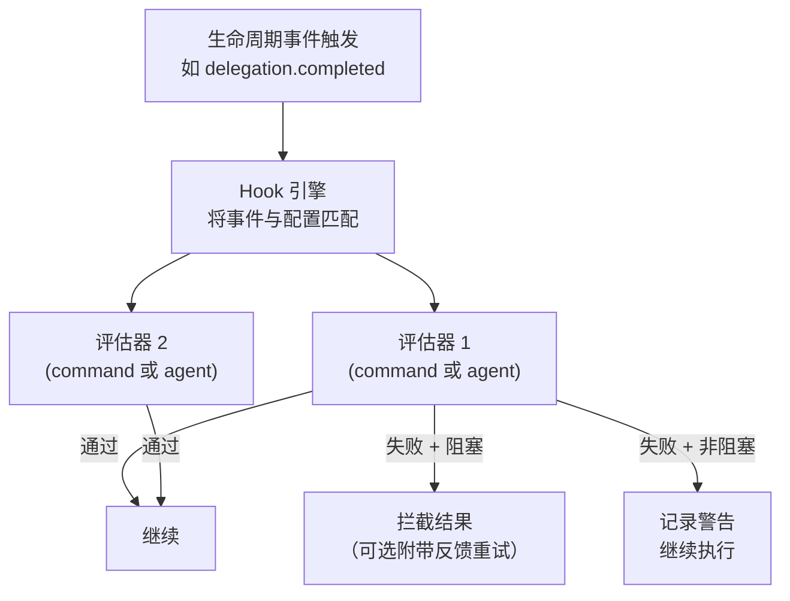

> 翻译自 [English version](/hooks-quality-gates)

# Hooks 与质量门控

> 在 agent 操作前后自动运行检查 — 拦截不良输出、要求审批或触发自定义验证逻辑。

## 概述

GoClaw 的 hook 系统让你可以将质量门控附加到 agent 生命周期事件。Hook 是在特定事件时运行的检查。目前唯一支持的事件是 `delegation.completed`，在子 agent 完成委托任务后触发。如果检查失败，GoClaw 可以拦截结果，并可选地附带反馈重试。

质量门控配置在**源 agent** 的 `other_config` JSON 中的 `quality_gates` 键下。源 agent 是发起委托的 agent（编排者），而非目标 agent。

两种评估器类型：

| 类型 | 验证方式 |
|------|-----------------|
| `command` | 运行 shell 命令 — 退出码 0 = 通过，非零 = 失败 |
| `agent` | 委托给审阅 agent — `APPROVED` = 通过，`REJECTED: ...` = 失败 |

---

## Hook 配置字段

质量门控放在源 agent 的 `other_config` 的 `quality_gates` 数组中：

```json
{
  "quality_gates": [
    {
      "event": "delegation.completed",
      "type": "command",
      "command": "./scripts/check-output.sh",
      "block_on_failure": true,
      "max_retries": 2,
      "timeout_seconds": 60
    }
  ]
}
```

| 字段 | 类型 | 描述 |
|-------|------|-------------|
| `event` | string | 触发此 hook 的生命周期事件 — 目前仅支持 `"delegation.completed"` |
| `type` | string | `"command"` 或 `"agent"` |
| `command` | string | 要运行的 shell 命令（type=command 时） |
| `agent` | string | 审阅 agent 的 key（type=agent 时） |
| `block_on_failure` | bool | `true` 时，hook 失败触发重试；`false` 时，失败被记录但继续执行 |
| `max_retries` | int | 阻塞失败后重试目标 agent 的次数（0 = 不重试） |
| `timeout_seconds` | int | 每个 hook 的超时（默认 60 秒） |

---

## 引擎架构



引擎按顺序评估质量门控。**阻塞**失败触发该门控的重试循环（最多 `max_retries` 次）。如果所有重试耗尽，GoClaw 记录警告并接受最后一个结果 — 不会硬性失败委托。非阻塞失败被记录但不中断流程。如果所有 hook 通过（或没有匹配事件的 hook），正常继续执行。

---

## 命令评估器

命令评估器通过 `sh -c` 运行 shell 命令。被验证的内容通过 **stdin** 传入。退出码 0 表示 hook 通过；任何其他退出码表示失败。stderr 输出作为重试时反馈给 agent 的内容。

命令内可用的环境变量：

| 变量 | 值 |
|----------|-------|
| `HOOK_EVENT` | 事件名称 |
| `HOOK_SOURCE_AGENT` | 产生输出的 agent 的 key |
| `HOOK_TARGET_AGENT` | 被委托的 agent 的 key |
| `HOOK_TASK` | 原始任务字符串 |
| `HOOK_USER_ID` | 触发请求的用户 ID |

**示例 — 基本内容长度检查：**

```bash
#!/bin/sh
# check-output.sh: 如果输出太短则失败
content=$(cat)
length=${#content}
if [ "$length" -lt 100 ]; then
  echo "Output is too short ($length chars). Provide a more complete response." >&2
  exit 1
fi
exit 0
```

Hook 配置：

```json
{
  "event": "delegation.completed",
  "type": "command",
  "command": "./scripts/check-output.sh",
  "block_on_failure": true,
  "max_retries": 1,
  "timeout_seconds": 10
}
```

---

## Agent 评估器

Agent 评估器委托给一个审阅 agent。GoClaw 发送包含原始任务、源/目标 agent key 和要审阅输出的结构化提示词。审阅 agent 必须精确回复：

- `APPROVED`（可附上评论）— hook 通过
- `REJECTED: <具体反馈>` — hook 失败；反馈作为重试提示词

评估使用 `WithSkipHooks` 运行，防止无限递归。

**示例 — 代码审阅门控：**

```json
{
  "event": "delegation.completed",
  "type": "agent",
  "agent": "code-reviewer",
  "block_on_failure": true,
  "max_retries": 2,
  "timeout_seconds": 120
}
```

`code-reviewer` agent 接收如下提示词：

```
[Quality Gate Evaluation]
You are reviewing the output of a delegated task for quality.

Original task: Write a Go function to parse JSON...
Source agent: orchestrator
Target agent: backend-dev

Output to evaluate:
<agent 输出内容>

Respond with EXACTLY one of:
- "APPROVED" if the output meets quality standards
- "REJECTED: <specific feedback>" with actionable improvement suggestions
```

---

## 使用场景

**内容过滤** — 使用命令 hook grep 禁止模式，拦截包含违禁内容的回复。

**长度/格式验证** — 拒绝过短、缺少必要章节或格式错误的输出。

**审批工作流** — 使用 `agent` hook 连接到严格的审阅 agent，在结果被接受前检查正确性。

**安全扫描** — 运行脚本，在执行前检查生成的代码或 shell 命令是否包含危险模式。

**非阻塞审计** — 设置 `block_on_failure: false`，将所有输出记录到审计系统而不阻塞流程。

---

## 示例

**双门控配置：格式检查后接 agent 审阅**（源 agent 的 `other_config`）：

```json
{
  "quality_gates": [
    {
      "event": "delegation.completed",
      "type": "command",
      "command": "python3 ./scripts/validate-format.py",
      "block_on_failure": true,
      "max_retries": 0,
      "timeout_seconds": 15
    },
    {
      "event": "delegation.completed",
      "type": "agent",
      "agent": "quality-reviewer",
      "block_on_failure": true,
      "max_retries": 2,
      "timeout_seconds": 90
    }
  ]
}
```

**非阻塞审计日志记录**（源 agent 的 `other_config`）：

```json
{
  "quality_gates": [
    {
      "event": "delegation.completed",
      "type": "command",
      "command": "curl -s -X POST https://audit.internal/log -d @-",
      "block_on_failure": false,
      "timeout_seconds": 5
    }
  ]
}
```

---

## 常见问题

| 问题 | 原因 | 解决方法 |
|-------|-------|-----|
| `hooks: unknown hook type, skipping` | `type` 字段拼写错误 | 精确使用 `"command"` 或 `"agent"` |
| 即使退出码为 1 命令也通过 | 包装脚本吞掉了退出码 | 确保脚本没有 `|| true` 掩盖失败 |
| Agent 评估器挂起 | 审阅 agent 缓慢或卡住 | 将 `timeout_seconds` 设为合理值 |
| 重试耗尽但流程继续 | 预期行为 — GoClaw 在达到最大重试后接受最后结果并记录警告 | 降低 `max_retries` 或修复质量门控条件 |
| Hook 在审阅 agent 自身上触发 | 递归 | GoClaw 自动为 agent 评估器调用注入 `WithSkipHooks` |
| 非阻塞 hook 仍然阻塞 | 误设了 `block_on_failure: true` | 检查配置；仅观察的 hook 设为 `false` |

---

## 下一步

- [扩展思维](/extended-thinking) — 生成输出前的深度推理
- [Exec 审批](/exec-approval) — shell 命令的人工审批

<!-- goclaw-source: 57754a5 | 更新: 2026-03-18 -->
