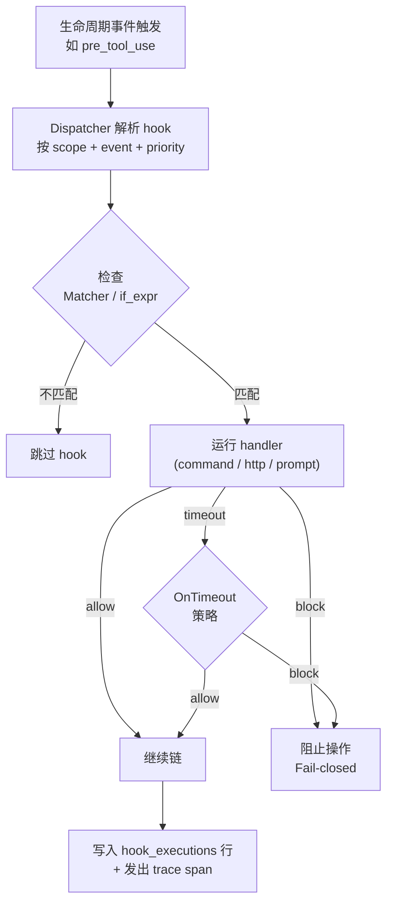

> 翻译自 [English version](/hooks-quality-gates)

# Agent Hooks

> 在 agent 循环的定义节点拦截、观察或注入行为 — 阻止不安全的 tool call、写入后自动审计、注入 session 上下文，或在停止时发出通知。

## 概述

GoClaw 的 hook 系统将生命周期处理器附加到 agent session。每个 hook 针对特定的 **event**，运行一个 **handler**（shell 命令、HTTP webhook 或 LLM 评估器），并为 blocking event 返回 **allow/block** 决定。

Hook 存储在 `agent_hooks` 数据库表（migration `000052`）中，通过 `hooks.*` WebSocket 方法或 Web UI 的 **Hooks** 面板管理。

---

## 概念

### 事件（Events）

agent session 期间触发七个生命周期事件：

| 事件 | 是否阻塞 | 触发时机 |
|---|---|---|
| `session_start` | 否 | 新 session 建立时 |
| `user_prompt_submit` | **是** | 用户消息进入 pipeline 前 |
| `pre_tool_use` | **是** | 任何 tool call 执行前 |
| `post_tool_use` | 否 | tool call 完成后 |
| `stop` | 否 | agent session 正常终止时 |
| `subagent_start` | **是** | 子 agent 被生成时 |
| `subagent_stop` | 否 | 子 agent 完成时 |

**Blocking** 事件在 pipeline 继续之前等待完整 hook 链返回 allow/block 决定。非 blocking 事件以异步方式触发，仅用于观察。

### Handler 类型

| Handler | 适用版本 | 说明 |
|---|---|---|
| `command` | 仅 Lite | 本地 shell 命令；exit 2 → block，exit 0 → allow |
| `http` | Lite + Standard | POST 到端点；JSON body → 决定。SSRF 保护 |
| `prompt` | Lite + Standard | 基于 LLM 的评估，使用结构化 tool-call 输出。有 budget 限制，需要 `matcher` 或 `if_expr` |

### 作用域（Scope）

- **global** — 适用于所有 tenant。创建时需要 master scope。
- **tenant** — 适用于一个 tenant（任意 agent）。
- **agent** — 适用于 tenant 内的特定 agent。

Hook 按优先级顺序解析（最高优先）。单个 `block` 决定会短路整个链。

---

## 执行流程



---

## Handler 参考

### command

```json
{
  "handler_type": "command",
  "event": "pre_tool_use",
  "scope": "tenant",
  "config": {
    "command": "bash /path/to/script.sh",
    "allowed_env_vars": ["MY_VAR"],
    "cwd": "/workspace"
  }
}
```

- **Stdin**：JSON 编码的 event payload。
- **Exit 0**：allow（可选 `{"continue": false}` → block）。
- **Exit 2**：block。
- **其他非零退出码**：error → blocking event 时 fail-closed。
- **Env 白名单**：只有 `allowed_env_vars` 中列出的 key 会被传递；防止 secret 泄露。

### http

```json
{
  "handler_type": "http",
  "event": "user_prompt_submit",
  "scope": "tenant",
  "config": {
    "url": "https://example.com/webhook",
    "headers": { "Authorization": "<AES-encrypted>" }
  }
}
```

- 方法：POST，body = event JSON。
- Authorization header 值以 AES-256-GCM 加密存储；dispatch 时解密。
- 响应限制 1 MiB。5xx 重试一次（1 s 退避）；4xx fail-closed。
- 期望响应 body：
  ```json
  { "decision": "allow", "additionalContext": "...", "updatedInput": {}, "continue": true }
  ```
- 非 JSON 的 2xx → allow。

### prompt

```json
{
  "handler_type": "prompt",
  "event": "pre_tool_use",
  "scope": "tenant",
  "matcher": "^(exec|shell|write_file)$",
  "config": {
    "prompt_template": "评估此 tool call 的安全性。",
    "model": "haiku",
    "max_invocations_per_turn": 5
  }
}
```

- `prompt_template` — 评估器接收的系统级指令。
- `matcher` 或 `if_expr` — 必填；防止对每个事件都触发 LLM。
- 评估器必须调用 `decide(decision, reason, injection_detected, updated_input)` tool。纯文本响应 → fail-closed。
- 只有 `tool_input` 到达评估器（反注入沙箱）；用户的原始消息不包含在内。

---

## Matchers

| 字段 | 说明 |
|---|---|
| `matcher` | 应用于 `tool_name` 的 POSIX 正则。示例：`^(exec|shell|write_file)$` |
| `if_expr` | 针对 `{tool_name, tool_input, depth}` 的 [cel-go](https://github.com/google/cel-go) 表达式。示例：`tool_name == "exec" && size(tool_input.cmd) > 80` |

`command`/`http` 均为可选。`prompt` 至少需要其中一个。

---

## 配置字段参考

| 字段 | 类型 | 必填 | 说明 |
|---|---|---|---|
| `event` | string | 是 | 生命周期事件名称 |
| `handler_type` | string | 是 | `command`、`http` 或 `prompt` |
| `scope` | string | 是 | `global`、`tenant` 或 `agent` |
| `name` | string | 否 | 人类可读标签 |
| `matcher` | string | 否 | tool name 正则过滤 |
| `if_expr` | string | 否 | CEL 表达式过滤 |
| `timeout_ms` | int | 否 | 每个 hook 超时（默认 5000，最大 10000）|
| `on_timeout` | string | 否 | `block`（默认）或 `allow` |
| `priority` | int | 否 | 越高越先运行（默认 0）|
| `enabled` | bool | 否 | 默认 true |
| `config` | object | 是 | handler 特定子配置 |
| `agent_ids` | array | 否 | 限定特定 agent UUID（scope=agent）|

---

## 安全模型

- **版本门控**：`command` handler 在 Standard 版本的配置和 dispatch 阶段均被阻止（纵深防御）。
- **Tenant 隔离**：所有读写按 `tenant_id` 范围限定，master scope 除外。全局 hook 使用哨兵 tenant id。
- **SSRF 防护**：HTTP handler 在请求前验证 URL，固定解析的 IP，阻止 loopback/link-local/私有范围。
- **PII 脱敏**：audit 行将错误文本截断为 256 字符；完整错误以 AES-256-GCM 加密存储在 `error_detail` 中。
- **Fail-closed**：blocking event 中任何未处理的错误都会产生 `block`。超时遵循 `on_timeout`（blocking event 默认为 `block`）。
- **断路器**：在 1 分钟滚动窗口内连续 5 次 block/timeout 会自动禁用 hook（`enabled=false`）。
- **循环检测**：子 agent hook 链限制在深度 3。

---

## 防护措施总结

| 防护措施 | 默认值 | 每个 hook 可覆盖 |
|---|---|---|
| 每个 hook 超时 | 5 秒 | 是（`timeout_ms`，最大 10 秒）|
| 链 budget | 10 秒 | 否 |
| 断路器阈值 | 1 分钟内 5 次 block | 否 |
| prompt 每 turn 上限 | 5 次调用 | 是（`max_invocations_per_turn`）|
| prompt 决定缓存 TTL | 60 秒 | 否 |
| 每 tenant 月度 token budget | 1,000,000 tokens | 在 `tenant_hook_budget` 中按 tenant 设定 |

---

## 通过 WebSocket 管理 Hook

所有 CRUD 操作均可通过 `hooks.*` WS 方法完成（参见 [WebSocket 协议](/websocket-protocol#hooks)）。

**创建 hook：**
```json
{
  "type": "req", "id": "1", "method": "hooks.create",
  "params": {
    "event": "pre_tool_use",
    "handler_type": "http",
    "scope": "tenant",
    "name": "Safety webhook",
    "matcher": "^exec$",
    "config": { "url": "https://safety.internal/check" }
  }
}
```

响应：
```json
{ "type": "res", "id": "1", "ok": true, "payload": { "hookId": "uuid..." } }
```

**启用/禁用 hook：**
```json
{ "type": "req", "id": "2", "method": "hooks.toggle",
  "params": { "hookId": "uuid...", "enabled": false } }
```

**Dry-run 测试（不写入 audit 行）：**
```json
{
  "type": "req", "id": "3", "method": "hooks.test",
  "params": {
    "config": { "event": "pre_tool_use", "handler_type": "command",
                "scope": "tenant", "config": { "command": "cat" } },
    "sampleEvent": { "toolName": "exec", "toolInput": { "cmd": "ls" } }
  }
}
```

---

## Web UI 操作指南

在侧边栏导航到 **Hooks**。

1. **Create** — 选择 event、handler type（Standard 版本下 `command` 不可用）、scope、matcher，然后填写 handler 特定子表单。
2. **Test 面板** — 用示例 event 触发 hook（`dryRun=true`，不写入 audit 行）。显示决定徽章、耗时、stdout/stderr（command）、状态码（http）、原因（prompt）。如果响应包含 `updatedInput`，渲染 JSON 并排 diff。
3. **History 标签页** — 来自 `hook_executions` 的分页执行记录。
4. **Overview 标签页** — 包含 event、type、scope、matcher 的摘要卡片。

---

## 数据库 Schema

Migration `000052_agent_hooks` 创建三个表：

**`agent_hooks`** — hook 定义：

| 列 | 类型 | 说明 |
|---|---|---|
| `id` | UUID PK | — |
| `tenant_id` | UUID FK | 全局 scope 使用哨兵 UUID |
| `agent_ids` | UUID[] | 空 = 适用于 scope 内所有 agent |
| `event` | VARCHAR(32) | 7 个事件名之一 |
| `handler_type` | VARCHAR(16) | `command`、`http`、`prompt` |
| `scope` | VARCHAR(16) | `global`、`tenant`、`agent` |
| `config` | JSONB | handler 子配置 |
| `matcher` | TEXT | tool name 正则（可选）|
| `if_expr` | TEXT | CEL 表达式（可选）|
| `timeout_ms` | INT | 默认 5000 |
| `on_timeout` | VARCHAR(16) | `block` 或 `allow` |
| `priority` | INT | 越高越先触发 |
| `enabled` | BOOL | 断路器在此写入 false |
| `version` | INT | 更新时递增；清除 prompt 缓存 |
| `source` | VARCHAR(16) | `builtin`（只读）或 `user` |

**`hook_executions`** — 审计日志：

| 列 | 说明 |
|---|---|
| `hook_id` | `ON DELETE SET NULL` — hook 删除后执行记录仍保留 |
| `dedup_key` | 唯一索引防止重试时写入重复行 |
| `error` | 截断为 256 字符 |
| `error_detail` | BYTEA，AES-256-GCM 加密完整错误 |
| `metadata` | JSONB：`matcher_matched`、`cel_eval_result`、`stdout_len`、`http_status`、`prompt_model`、`prompt_tokens`、`trace_id` |

**`tenant_hook_budget`** — 每 tenant 月度 token 限额（仅 prompt handler）。

---

## 可观测性

每次 hook 执行都会发出名为 `hook.<handler_type>.<event>` 的 trace span（如 `hook.prompt.pre_tool_use`），包含字段：`status`、`duration_ms`、`metadata.decision`、`parent_span_id`。

Slog keys：
- `security.hook.circuit_breaker` — 断路器触发。
- `security.hook.audit_write_failed` — audit 行写入错误。
- `security.hook.loop_depth_exceeded` — `MaxLoopDepth` 违规。
- `security.hook.prompt_parse_error` — 评估器返回格式错误的结构化输出。
- `security.hook.budget_deduct_failed` / `budget_precheck_failed` — budget store 错误。

---

## 故障排查

| 现象 | 可能原因 | 解决方法 |
|---|---|---|
| HTTP hook 始终返回 `error` | SSRF 阻止 loopback | 使用 gateway 进程可访问的 public/internal URL |
| Prompt hook 阻止所有请求 | 评估器返回纯文本（无 tool call）| 精简 `prompt_template`；保持简短且使用祈使句 |
| Hook 停止触发 | 断路器触发（5 次 block/分钟）| 修复根本原因，然后重新启用：`hooks.toggle { enabled: true }` |
| UI 中 `command` 单选框变灰 | Standard 版本 | 使用 `http` 或 `prompt`，或升级到 Lite |
| 达到 per-turn 上限 | `max_invocations_per_turn` 太低 | 在 hook config 中提高；收紧 `matcher` 减少 LLM 调用 |
| Budget 超限 | Tenant 消耗完月度 token budget | 提高 `tenant_hook_budget.budget_total` 或等待滚动重置 |
| `handler_type, event, and scope are required` | create payload 缺少字段 | 包含全部三个必填字段 |

---

## 从旧版质量门控迁移

在 hook 系统之前，委派质量门控通过源 agent 的 `other_config.quality_gates` 数组内联配置。旧系统仅支持 `delegation.completed` 事件和两种 handler 类型（`command`、`agent`）。

新 hook 系统替代方案：

| 旧版 | 新版 |
|---|---|
| `other_config.quality_gates[].event: "delegation.completed"` | `subagent_stop`（非阻塞）或 `subagent_start`（阻塞）|
| `other_config.quality_gates[].type: "command"` | `handler_type: "command"`（Lite）或 `handler_type: "http"`（Standard）|
| `other_config.quality_gates[].type: "agent"` | `handler_type: "prompt"` 配合 LLM 评估器 |
| `block_on_failure: true` + `max_retries` | 内置阻塞语义；无需重试循环 |

从 hooks 之前的版本升级无需数据迁移。Migration `000052_agent_hooks` 会干净地创建全部三个表。

---

## 下一步

- [WebSocket 协议](/websocket-protocol) — 完整的 `hooks.*` 方法参考
- [Exec 审批](/exec-approval) — shell 命令的人工审批
- [扩展思维](/extended-thinking) — 生成输出前的深度推理

<!-- goclaw-source: hooks-rewrite | 更新: 2026-04-17 -->
