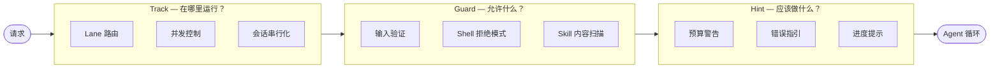
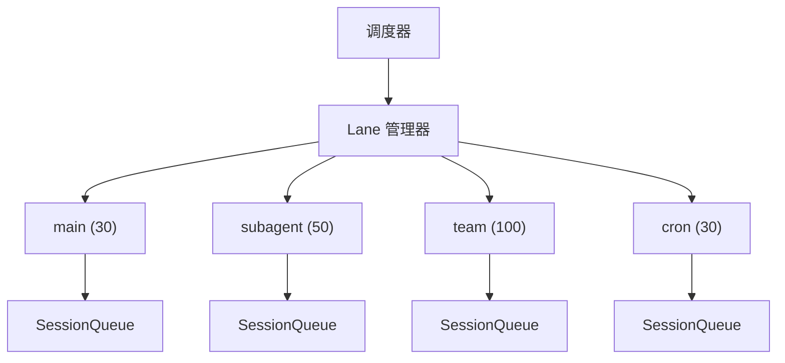
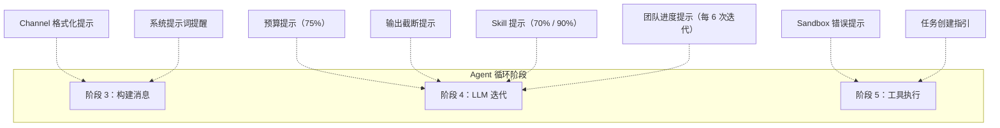
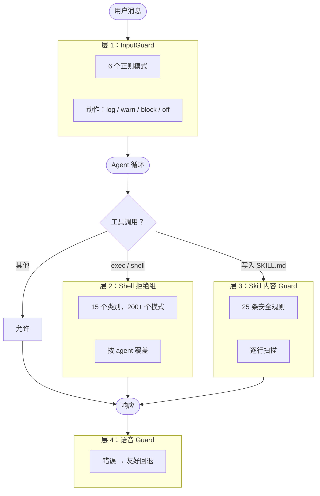
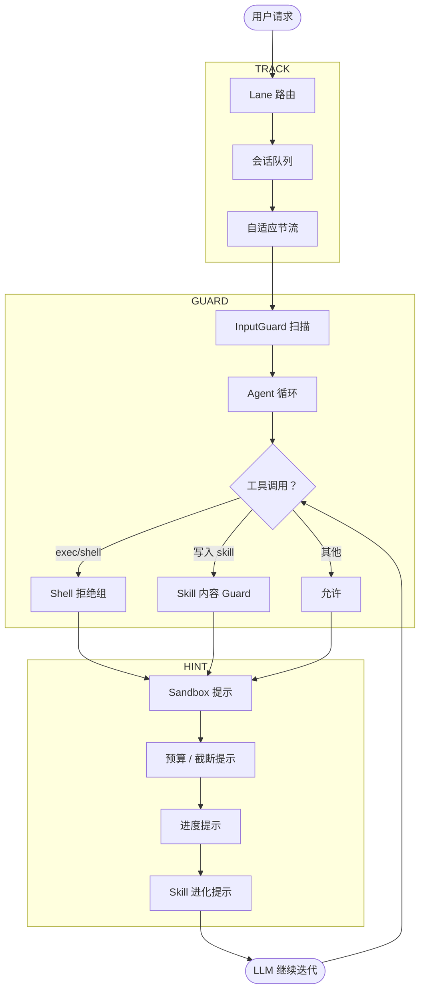

> 翻译自 [English version](/model-steering)

# 模型引导

> GoClaw 如何通过 3 个控制层引导小型模型：Track（调度）、Hint（上下文提示）和 Guard（安全边界）。

## 概述

运行 agent 循环的小型模型（< 70B 参数）通常遇到三个问题：

| 问题 | 症状 |
|---------|---------|
| **迷失方向** | 耗尽迭代预算却未给出答案，在无意义的工具调用中循环 |
| **遗忘上下文** | 不报告进度，忽略已有信息 |
| **安全违规** | 运行危险命令、被提示注入攻击、编写恶意代码 |

GoClaw 通过在每次请求时并发运行的 **3 个引导层**来解决这些问题：



**设计原则：**
- **Track** — 基础设施层；模型对自己在哪个 lane 运行没有感知
- **Guard** — 硬边界；无论运行哪个模型都阻止危险行为
- **Hint** — 软引导；作为消息注入对话；模型可以忽略提示（但通常不会）

---

## Track 系统（基于 Lane 的调度）

Track 按工作类型路由每个请求。每个 lane 有自己的并发限制，不同工作负载类型不会竞争资源。

### Lane 架构



### Lane 分配

| Lane | 最大并发 | 请求来源 | 用途 |
|------|:--------------:|---------------|---------|
| `main` | 30 | 用户聊天（WebSocket / channel） | 主要对话会话 |
| `subagent` | 50 | 子 agent 通知 | 主 agent 派生的子 agent |
| `team` | 100 | 团队任务分发 | agent 团队中的成员 |
| `cron` | 30 | Cron 调度器 | 定时周期性任务 |

Lane 分配是**确定性的** — 基于请求类型，而非 agent 配置。agent 无法选择自己的 lane。

### 每会话队列

lane 内每个会话有自己的队列：

- **私聊会话** — `maxConcurrent = 1`（串行，无重叠）
- **群聊会话** — `maxConcurrent = 3`（允许并行回复）
- **自适应节流** — 当会话历史超过上下文窗口的 60% 时，并发度降至 1

自适应节流专门为保护小型模型而设计：当上下文接近满时，并行处理更多消息会导致模型跟丢对话。

---

## Hint 系统（上下文引导注入）

Hint 是在 agent 循环的关键时刻**注入到对话中的消息**。小型模型从 hint 中受益最多，因为它们容易在对话变长时遗忘初始指令。

### Hint 注入时机



### 8 种 Hint 类型

#### 1. 预算提示 — 防止无方向循环

当模型耗尽迭代预算而未生成文字回复时触发：

| 触发条件 | 注入消息 |
|---------|-----------------|
| 已用 75% 迭代次数，尚无文字回复 | "You've used 75% of your budget. Start synthesizing results." |
| 达到最大迭代次数 | 循环停止并返回最终结果 |

这对小型模型特别有效 — 不让它们无限循环，而是强制提前总结。

#### 2. 输出截断提示 — 错误恢复

当 LLM 响应因 `max_tokens` 被截断时：

> `[System] Output was truncated. Tool call arguments are incomplete. Retry with shorter content — split writes or reduce text.`

小型模型通常不会意识到输出被截断。此提示解释原因并促使它们调整。

#### 3. Skill 进化提示 — 鼓励自我改进

| 触发条件 | 内容 |
|---------|---------|
| 已用 70% 迭代预算 | 建议创建 skill 以复用当前工作流 |
| 已用 90% 迭代预算 | 更强烈地提醒创建 skill |

这些提示是**短暂的**（不持久化到会话历史）并支持 **i18n**（en/vi/zh）。

#### 4. 团队进度提示 — 进度报告提醒

当 agent 执行团队任务时，每 6 次迭代注入：

> `[System] You're at iteration 12/20 (~60% budget) for task #3: 'Implement auth module'. Report progress now: team_tasks(action="progress", percent=60, text="...")`

没有此提示，小型模型容易忘记调用进度报告 → 主 agent 不知道状态 → 瓶颈。

#### 5. Sandbox 错误提示 — 解释环境错误

当 Docker sandbox 中的命令遇到错误时，提示**直接附加到错误输出上**：

| 错误模式 | 提示 |
|--------------|------|
| 退出码 127 / "command not found" | 二进制文件未安装在 sandbox 镜像中 |
| "permission denied" / EACCES | 工作空间以只读方式挂载 |
| "network is unreachable" / DNS 失败 | `--network none` 已启用 |
| "read-only file system" / EROFS | 写入工作空间卷外部 |
| "no space left" / ENOSPC | 容器中磁盘/内存耗尽 |
| "no such file" | 文件在 sandbox 中不存在 |

提示优先级：首先检查退出码 127，然后按优先级顺序匹配模式。

#### 6. Channel 格式化提示 — 平台专属指引

根据 channel 类型注入到系统提示词：

- **Zalo** — "使用纯文本，不用 Markdown，不用 HTML"
- **群聊** — 关于在消息不需要回复时使用 `NO_REPLY` 令牌的说明

#### 7. 任务创建指引 — 主 Agent 帮助

当模型列出或搜索团队任务时，响应包含：
- 团队成员列表 + 各自的模型
- 4 条规则：编写自包含描述、拆分复杂任务、匹配任务复杂度与模型能力、确保任务独立性

当小型模型（MiniMax、Qwen）作为主 agent 时特别有用 — 它们往往创建模糊的任务或错误分配复杂度。

#### 8. 系统提示词提醒 — 近因区强化

注入到系统提示词末尾（"近因区" — 模型最关注的部分）：
- 回答前搜索记忆的提醒
- 如果 agent 有自定义身份则强化人格/角色
- 新用户的引导提示

### Hint 摘要表

| Hint | 触发条件 | 短暂？ | 注入点 |
|------|---------|:----------:|-----------------|
| 预算 75% | iteration == max×¾，尚无文字 | 是 | 消息列表（阶段 4） |
| 输出截断 | `finish_reason == "length"` | 是 | 消息列表（阶段 4） |
| Skill 提示 70% | iteration/max ≥ 0.70 | 是 | 消息列表（阶段 4） |
| Skill 提示 90% | iteration/max ≥ 0.90 | 是 | 消息列表（阶段 4） |
| 团队进度 | iteration % 6 == 0 且有 TeamTaskID | 是 | 消息列表（阶段 4） |
| Sandbox 错误 | stderr/退出码模式匹配 | 否 | 工具结果后缀（阶段 5） |
| Channel 格式 | channel 类型 == "zalo" 等 | 否 | 系统提示词（阶段 3） |
| 任务创建 | `team_tasks` 列出/搜索响应 | 否 | 工具结果 JSON（阶段 5） |
| 记忆/人格 | 配置标志 | 否 | 系统提示词（阶段 3） |

---

## Guard 系统（安全边界）

Guard 创建**硬边界** — 不依赖模型合规性。即使小型模型被提示注入攻击欺骗，Guard 也会在基础设施层阻止危险行为。

### 4 层 Guard 架构



### 层 1：InputGuard — 提示注入检测

在**每条用户消息**进入 agent 循环前扫描，以及注入消息和 web fetch/search 结果。

| 模式 | 检测内容 |
|---------|---------|
| `ignore_instructions` | "忽略所有之前的指令…" |
| `role_override` | "你现在是…"、"假装你是…" |
| `system_tags` | `<system>`、`[SYSTEM]`、`[INST]`、`<<SYS>>`、`<\|im_start\|>system` |
| `instruction_injection` | "新指令："、"覆盖："、"系统提示词：" |
| `null_bytes` | `\x00` 字符（空字节注入） |
| `delimiter_escape` | "系统结束"、`</instructions>`、`</prompt>` |

**4 种动作模式**（config：`gateway.injection_action`）：

| 模式 | 行为 |
|------|---------|
| `log` | 记录 info，不阻止 |
| `warn` | 记录 warning（默认） |
| `block` | 拒绝消息，向用户返回错误 |
| `off` | 完全禁用扫描 |

**3 个扫描点：** 传入用户消息（阶段 2）、运行中注入的消息，以及 `web_fetch`/`web_search` 的工具结果。

### 层 2：Shell 拒绝组 — 命令安全

15 个拒绝组，全部**默认开启**。管理员必须明确允许才能禁用某个组。

| 组 | 示例模式 |
|-------|-----------------|
| `destructive_ops` | `rm -rf`、`mkfs`、`dd if=`、`shutdown`、fork bomb |
| `data_exfiltration` | `curl \| sh`、`wget POST`、DNS 查询、`/dev/tcp/` |
| `reverse_shell` | `nc`、`socat`、`openssl s_client`、Python/Perl socket |
| `code_injection` | `eval $()`、`base64 -d \| sh` |
| `privilege_escalation` | `sudo`、`su`、`doas`、`pkexec`、`runuser`、`nsenter` |
| `dangerous_paths` | 对系统路径执行 `chmod`/`chown` |
| `env_injection` | `LD_PRELOAD`、`BASH_ENV`、`GIT_EXTERNAL_DIFF` |
| `container_escape` | Docker socket、`/proc/sys/`、`/sys/` |
| `crypto_mining` | `xmrig`、`cpuminer`、`stratum+tcp://` |
| `filter_bypass` | `sed -e`、`git --exec`、`rg --pre` |
| `network_recon` | `nmap`、`ssh`/`scp`/`sftp`、隧道 |
| `package_install` | `pip install`、`npm install`、`apk add` |
| `persistence` | `crontab`、shell RC 文件写入 |
| `process_control` | `kill -9`、`killall`、`pkill` |
| `env_dump` | `env`、`printenv`、`/proc/*/environ`、`GOCLAW_*` |

**特殊情况：** `package_install` 触发审批流程（而非硬拒绝）— agent 暂停并请求用户许可。所有其他组为硬阻止。

**按 agent 覆盖：** 管理员可以通过 DB 配置为特定 agent 允许特定拒绝组。

### 层 3：Skill 内容 Guard

在写入文件前扫描 **SKILL.md 内容**。25 条正则规则检测：

- Shell 注入和破坏性操作
- 代码混淆（`base64 -d`、`eval`、`curl | sh`）
- 凭据窃取（`/etc/passwd`、`.ssh/id_rsa`、`AWS_SECRET_ACCESS_KEY`）
- 路径遍历（`../../..`）
- SQL 注入（`DROP TABLE`、`TRUNCATE`）
- 提权（`sudo`、`chmod 777`）

任何违规导致**硬拒绝** — 文件不会写入，模型收到错误。

### 层 4：语音 Guard

专为 Telegram 语音 agent 设计。当语音/音频处理遇到技术错误时，语音 Guard 将原始错误消息替换为对终端用户友好的回退消息。这是 UX guard，而非安全 guard。

### Guard 摘要

| Guard | 作用范围 | 默认动作 | 可配置？ |
|-------|-------|:--------------:|:-------------:|
| InputGuard | 所有用户消息 + 注入消息 + 工具结果 | warn | 是（log/warn/block/off） |
| Shell 拒绝 | 所有 `exec`/`shell` 工具调用 | 硬阻止 | 是（按 agent 组覆盖） |
| Skill 内容 | SKILL.md 文件写入 | 硬拒绝 | 否 |
| 语音 Guard | Telegram 语音错误回复 | 友好回退 | 否 |

---

## 3 层协同工作



| 层 | 回答的问题 | 机制 | 性质 |
|-------|------------------|-----------|--------|
| **Track** | 在哪里运行？ | Lane + 队列 + 信号量 | 基础设施，对模型不可见 |
| **Guard** | 允许什么？ | 正则模式匹配，硬拒绝 | 安全边界，与模型无关 |
| **Hint** | 应该做什么？ | 将消息注入到对话 | 软引导，模型可以忽略 |

**使用大型模型时**（Claude、GPT-4）：Guard 仍然必要。Hint 不那么关键，因为大型模型能更好地追踪上下文。

**使用小型模型时**（MiniMax、Qwen、Gemini Flash）：3 层全部至关重要。

---

## Mode Prompt 系统

除了运行时引导层之外，GoClaw 还通过根据上下文改变 system prompt 中包含的部分来应用**提示级引导**。这在保持用户交互完整引导的同时降低了后台任务的 token 成本。

### Prompt Mode

| Mode | 适用对象 | 包含的部分 |
|------|---------|-----------|
| `full` | 直接面向用户的 agent | 全部——persona、skills、MCP、memory、spawn guidance |
| `task` | 企业自动化 agent | 精简但功能完整——execution bias、skills search、safety slim |
| `minimal` | 通过 `spawn` 创建的子 agent | 缩减——tooling、safety、workspace |
| `none` | 仅 identity（罕见） | 仅 identity 行 |

**优先级解析**（最高优先级优先）：runtime override → 自动检测 → agent config → 默认（`full`）。

### 编排模式（Orchestration Mode）

每个 agent 根据其能力分配编排模式，决定可用的 inter-agent tool：

| Mode | 条件 | 可用 tool | Prompt 部分 |
|------|------|-----------|------------|
| `spawn` | 默认（无链接或团队） | 仅 `spawn` | Sub-Agent Spawning |
| `delegate` | Agent 有 AgentLink 目标 | `spawn` + `delegate` | Delegation Targets |
| `team` | Agent 属于团队 | `spawn` + `delegate` + `team_tasks` | Team Workspace + Team Members |

优先级：team > delegate > spawn。模式不允许时，`delegate` 和 `team_tasks` 对 LLM 隐藏。

### 提示缓存边界

对于 Anthropic provider，GoClaw 在隐藏标记处分割 system prompt：

```
<!-- GOCLAW_CACHE_BOUNDARY -->
```

**边界上方（稳定——已缓存）：** Identity、Persona、Tooling、Safety、Skills、MCP Tools、Workspace、Team sections、Sandbox、User Identity、稳定 Project Context 文件（AGENTS.md、CAPABILITIES.md 等）。

**边界下方（动态——不缓存）：** Time、Channel Formatting Hints、Extra Prompt、动态 Project Context 文件（USER.md、BOOTSTRAP.md）、Runtime、Recency Reinforcements。

---

## 常见问题

| 问题 | 原因 | 解决方法 |
|-------|-------|-----|
| Agent 循环而不回答 | 预算提示未触发或模型忽略它 | 验证 `max_iterations` 已设置；检查模型是否响应注入消息 |
| Shell 命令静默被拒绝 | 命中了某个拒绝组 | 检查 agent 日志中的 `shell_deny` 阻止；管理员可以在需要时添加按 agent 覆盖 |
| SKILL.md 写入因 guard 错误失败 | 内容匹配了某条安全规则 | 检查 SKILL.md 中的混淆命令、凭据引用或路径遍历 |
| 日志中出现提示注入警告 | 用户消息匹配了 `injection_action: warn` 模式 | 预期行为；如果需要硬拒绝则升级为 `block` |
| 小型模型忘记报告团队进度 | 团队进度提示需要设置 `TeamTaskID` | 确保任务是通过 `team_tasks` 工具分配的 |

---

## 下一步

- [Sandbox](sandbox.md) — 为 agent 隔离 shell 命令执行
- [Agent 团队](../agent-teams/what-are-teams.md) — Track 和 Hint 最活跃的多 agent 协调
- [定时任务与 Cron](scheduling-cron.md) — cron lane 请求如何通过 Track 路由

<!-- goclaw-source: 1296cdbf | 更新: 2026-04-11 -->
