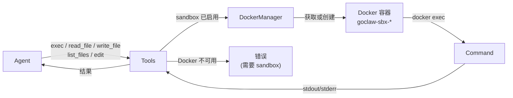

> 翻译自 [English version](/sandbox)

# Sandbox

> 在隔离的 Docker 容器中运行 agent shell 命令，让不受信任的代码永远无法接触宿主机。

## 概述

启用 sandbox 模式后，所有涉及文件系统或命令执行的工具调用（`exec`、`read_file`、`write_file`、`list_files`、`edit`）都会被路由到 Docker 容器中，而非直接在宿主机上运行。容器是临时的、网络隔离的，默认受到严格限制 — 删除所有 capability、只读根文件系统、`/tmp` 使用 tmpfs、内存上限 512 MB。

如果运行时 Docker 不可用，GoClaw 返回错误并拒绝执行 — **不会**回退到未沙箱化的宿主机执行。



## Sandbox 模式

设置 `GOCLAW_SANDBOX_MODE`（或 config 中的 `agents.defaults.sandbox.mode`）为以下之一：

| 模式 | 沙箱化的 agent |
|---|---|
| `off` | 无 — 所有命令在宿主机运行（默认） |
| `non-main` | 除 `main` 和 `default` 之外的所有 agent |
| `all` | 每个 agent |

## 容器作用域

作用域控制容器如何在请求间复用：

| 作用域 | 容器生命周期 | 适用场景 |
|---|---|---|
| `session` | 每个会话一个容器 | 最大隔离（默认） |
| `agent` | 一个 agent 的所有会话共享一个容器 | agent 内持久化状态 |
| `shared` | 所有 agent 共享一个容器 | 最低开销 |

## 默认安全配置

开箱即用，每个 sandbox 容器运行时：

| 设置 | 值 |
|---|---|
| 根文件系统 | 只读（`--read-only`） |
| Capabilities | 全部删除（`--cap-drop ALL`） |
| 新特权 | 阻止（`--security-opt no-new-privileges`） |
| tmpfs 挂载 | `/tmp`、`/var/tmp`、`/run` |
| 网络 | 禁用（`--network none`） |
| 内存限制 | 512 MB |
| CPU | 1.0 |
| 执行超时 | 300 秒 |
| 最大输出 | 1 MB（stdout + stderr 合计） |
| 容器前缀 | `goclaw-sbx-` |
| 工作目录 | `/workspace` |

如果命令输出超过 1 MB，输出将被截断并附加 `...[output truncated]`。

## 配置

所有设置可通过环境变量或 `config.json` 的 `agents.defaults.sandbox` 提供。

### 环境变量

```bash
GOCLAW_SANDBOX_MODE=all
GOCLAW_SANDBOX_IMAGE=goclaw-sandbox:bookworm-slim
GOCLAW_SANDBOX_WORKSPACE_ACCESS=rw   # none | ro | rw
GOCLAW_SANDBOX_SCOPE=session         # session | agent | shared
GOCLAW_SANDBOX_MEMORY_MB=512
GOCLAW_SANDBOX_CPUS=1.0
GOCLAW_SANDBOX_TIMEOUT_SEC=300
GOCLAW_SANDBOX_NETWORK=false
```

### config.json

```json
{
  "agents": {
    "defaults": {
      "sandbox": {
        "mode": "all",
        "image": "goclaw-sandbox:bookworm-slim",
        "workspace_access": "rw",
        "scope": "session",
        "memory_mb": 512,
        "cpus": 1.0,
        "timeout_sec": 300,
        "network_enabled": false,
        "read_only_root": true,
        "max_output_bytes": 1048576,
        "idle_hours": 24,
        "max_age_days": 7,
        "prune_interval_min": 5
      }
    }
  }
}
```

### 完整配置参考

| 字段 | 类型 | 默认值 | 描述 |
|---|---|---|---|
| `mode` | string | `off` | `off`、`non-main` 或 `all` |
| `image` | string | `goclaw-sandbox:bookworm-slim` | 使用的 Docker 镜像 |
| `workspace_access` | string | `rw` | 以 `none`、`ro` 或 `rw` 挂载工作空间 |
| `scope` | string | `session` | 容器复用：`session`、`agent` 或 `shared` |
| `memory_mb` | int | 512 | 内存限制（MB） |
| `cpus` | float | 1.0 | CPU 配额 |
| `timeout_sec` | int | 300 | 每条命令超时（秒） |
| `network_enabled` | bool | false | 启用容器网络 |
| `read_only_root` | bool | true | 以只读方式挂载根文件系统 |
| `tmpfs_size_mb` | int | 0 | tmpfs 挂载的默认大小（0 = Docker 默认） |
| `user` | string | — | 容器用户，如 `1000:1000` 或 `nobody` |
| `max_output_bytes` | int | 1048576 | 每次 exec 的最大 stdout+stderr 捕获（1 MB） |
| `setup_command` | string | — | 容器创建后运行一次的 shell 命令 |
| `env` | object | — | 注入容器的额外环境变量 |
| `idle_hours` | int | 24 | 清理空闲超过 N 小时的容器 |
| `max_age_days` | int | 7 | 清理存在超过 N 天的容器 |
| `prune_interval_min` | int | 5 | 后台清理检查间隔（分钟） |

安全加固默认值（`--cap-drop ALL`、`--tmpfs /tmp:/var/tmp:/run`、`--security-opt no-new-privileges`）自动应用，不可通过 config 覆盖。

## 工作空间访问

工作空间目录在容器内挂载到 `/workspace`：

- `none` — 无文件系统挂载；容器无法访问项目文件
- `ro` — 只读挂载；agent 可读取文件但无法写入
- `rw` — 读写挂载（默认）；agent 可读写项目文件

## 容器生命周期

1. **创建** — 第一次针对某个作用域键执行 exec 时，`docker run -d ... sleep infinity` 启动一个长期运行的容器。
2. **执行** — 每条命令通过 `docker exec` 在运行中的容器内执行。
3. **清理** — 后台 goroutine 每 `prune_interval_min` 分钟检查一次，销毁空闲超过 `idle_hours` 或存在超过 `max_age_days` 的容器。
4. **销毁** — 清理、会话结束或关机时 `ReleaseAll` 调用 `docker rm -f <id>`。

容器名称遵循 `goclaw-sbx-<sanitized-scope-key>` 模式，作用域键根据配置的作用域从会话键、agent ID 或 `"shared"` 派生。

## 通过 docker-compose 设置

先构建 sandbox 镜像：

```bash
docker build -t goclaw-sandbox:bookworm-slim -f Dockerfile.sandbox .
```

然后在 compose 命令中添加 sandbox overlay：

```bash
docker compose \
  -f docker-compose.yml \
  -f docker-compose.postgres.yml \
  -f docker-compose.sandbox.yml \
  up
```

`docker-compose.sandbox.yml` overlay 挂载 Docker socket 并设置 sandbox 环境变量：

```yaml
services:
  goclaw:
    build:
      args:
        ENABLE_SANDBOX: "true"
    volumes:
      - /var/run/docker.sock:/var/run/docker.sock
    environment:
      - GOCLAW_SANDBOX_MODE=all
      - GOCLAW_SANDBOX_IMAGE=goclaw-sandbox:bookworm-slim
      - GOCLAW_SANDBOX_WORKSPACE_ACCESS=rw
      - GOCLAW_SANDBOX_SCOPE=session
      - GOCLAW_SANDBOX_MEMORY_MB=512
      - GOCLAW_SANDBOX_CPUS=1.0
      - GOCLAW_SANDBOX_TIMEOUT_SEC=300
      - GOCLAW_SANDBOX_NETWORK=false
    cap_drop: []
    cap_add:
      - NET_BIND_SERVICE
    security_opt: []
    group_add:
      - ${DOCKER_GID:-999}
```

> **安全提示：** 挂载 Docker socket 会赋予 GoClaw 容器对宿主机 Docker daemon 的控制权。仅在你信任 GoClaw 进程本身的环境中使用 sandbox 模式。

## 示例

### 仅对子 agent 沙箱化，不对主 agent

```bash
GOCLAW_SANDBOX_MODE=non-main
```

`main` 和 `default` agent 在宿主机运行命令，其他所有 agent（子 agent、专用 worker）被沙箱化。

### 只读工作空间加自定义设置命令

```json
{
  "agents": {
    "defaults": {
      "sandbox": {
        "mode": "all",
        "workspace_access": "ro",
        "setup_command": "pip install -q pandas numpy",
        "memory_mb": 1024,
        "timeout_sec": 120
      }
    }
  }
}
```

`setup_command` 在容器创建后运行一次，预装依赖，后续每次 `exec` 都可使用。

### 检查活跃的 sandbox 容器

GoClaw 未暴露 sandbox 统计的公开 HTTP 端点。可直接用 Docker 检查运行中的容器：

```bash
docker ps --filter "label=goclaw.sandbox=true"
```

## 常见问题

| 问题 | 原因 | 解决方法 |
|---|---|---|
| 日志中出现 `docker not available` | Docker daemon 未运行或 socket 未挂载 | 启动 Docker；确保 socket 在 compose 中挂载 |
| 命令因 sandbox 错误失败 | 执行时 Docker 不可用 | 启动 Docker；确保 socket 已挂载；sandbox 模式不回退到宿主机 |
| 容器创建时 `docker run failed` | 镜像未找到或权限不足 | 构建 sandbox 镜像；检查 `DOCKER_GID` |
| 输出在 1 MB 处被截断 | 命令产生了非常大的输出 | 增大 `max_output_bytes` 或将输出管道到文件 |
| 会话结束后容器未清理 | 清理器未运行或 `idle_hours` 过高 | 降低 `idle_hours`；检查日志中的 `sandbox pruning started` |
| 容器内写入失败 | `workspace_access: ro` 或 `read_only_root: true` 且无 tmpfs | 切换到 `rw` 或为目标路径添加 tmpfs 挂载 |

## 下一步

- [自定义工具](/custom-tools) — 定义同样受益于 sandbox 隔离的 shell 工具
- [Exec 审批](/exec-approval) — 在任何命令运行前要求人工审批，无论是否沙箱化
- [定时任务与 Cron](/scheduling-cron) — 按计划运行沙箱化的 agent 轮次

<!-- goclaw-source: 050aafc9 | 更新: 2026-04-09 -->
