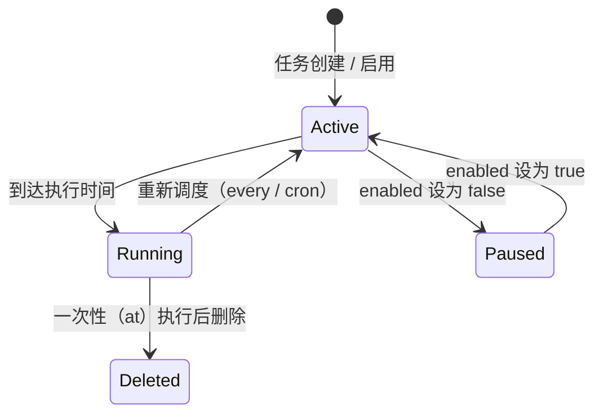

> 翻译自 [English version](/scheduling-cron)

# 定时任务与 Cron

> 自动触发 agent 执行 — 单次、按固定间隔或按 cron 表达式。

## 概述

GoClaw 的 cron 服务让你可以为任意 agent 安排固定计划执行的消息任务。任务持久化到 PostgreSQL，重启后不丢失。调度器每秒检查到期任务，并在并行 goroutine 中执行。

支持三种调度类型：

| 类型 | 字段 | 描述 |
|---|---|---|
| `at` | `atMs` | 在特定 Unix 时间戳（毫秒）一次性执行 |
| `every` | `everyMs` | 按毫秒间隔重复执行 |
| `cron` | `expr` | 标准 5 字段 cron 表达式（由 gronx 解析） |

一次性（`at`）任务执行后自动删除。



## 创建任务

### 通过 Dashboard

进入 **Cron → New Job**，填写计划、agent 要处理的消息，以及可选的投递 channel。

### 通过网关 WebSocket API

GoClaw 使用 WebSocket RPC。发送 `cron.create` 方法调用：

```json
{
  "method": "cron.create",
  "params": {
    "name": "daily-standup-summary",
    "schedule": {
      "kind": "cron",
      "expr": "0 9 * * 1-5",
      "tz": "Asia/Ho_Chi_Minh"
    },
    "message": "Summarize yesterday's GitHub activity and post a standup update.",
    "deliver": true,
    "channel": "telegram",
    "to": "123456789",
    "agentId": "3f2a1b4c-0000-0000-0000-000000000000"
  }
}
```

### 通过内置 `cron` 工具（agent 创建的任务）

Agent 可以在对话中使用 `cron` 工具（`action: "add"`）为自己安排后续任务。GoClaw 会自动去除 `description` 字段开头的 tab 缩进，并验证参数以防止格式错误的任务创建。

```json
{
  "action": "add",
  "job": {
    "name": "check-server-health",
    "schedule": { "kind": "every", "everyMs": 300000 },
    "message": "Check if the API server is responding and alert me if it's down."
  }
}
```

### 通过 CLI

```bash
# 列出任务（仅活跃任务）
goclaw cron list

# 列出所有任务（包括已禁用）
goclaw cron list --all

# 以 JSON 格式列出
goclaw cron list --json

# 启用或禁用任务
goclaw cron toggle <jobId> true
goclaw cron toggle <jobId> false

# 删除任务
goclaw cron delete <jobId>
```

## 任务字段

| 字段 | 类型 | 描述 |
|---|---|---|
| `name` | string | Slug 标签 — 仅小写字母、数字、连字符（如 `daily-report`）。每个 agent 和 tenant 内必须唯一 — 重复名称会被自动去重 |
| `agentId` | string | 执行任务的 agent UUID（省略则使用默认 agent） |
| `enabled` | bool | `true` = 活跃，`false` = 暂停 |
| `schedule.kind` | string | `at`、`every` 或 `cron` |
| `schedule.atMs` | int64 | Unix 时间戳（毫秒，用于 `at`） |
| `schedule.everyMs` | int64 | 间隔毫秒数（用于 `every`） |
| `schedule.expr` | string | 5 字段 cron 表达式（用于 `cron`） |
| `schedule.tz` | string | IANA 时区 — 适用于**所有**调度类型（`at`、`every`、`cron`），不仅限于 cron 表达式。省略则使用网关默认时区 |
| `message` | string | agent 接收的输入文本 |
| `stateless` | bool | 无需会话历史运行 — 为简单定时任务节省 token。默认 `false` |
| `deliver` | bool | `true` = 将结果投递到 channel；`false` = agent 静默处理。当任务从真实 channel（Telegram 等）创建时自动默认为 `true` |
| `channel` | string | 目标 channel：`telegram`、`discord` 等。`deliver` 为 `true` 时从上下文自动填充 |
| `to` | string | 聊天 ID 或收件人标识符。`deliver` 为 `true` 时从上下文自动填充 |
| `deleteAfterRun` | bool | `at` 任务自动设为 `true`；可手动设置在任意任务上 |
| `wakeHeartbeat` | bool | 为 `true` 时，cron 任务完成后立即触发一次 [Heartbeat](heartbeat.md) 运行。适合需要通过 heartbeat 系统报告状态的任务 |

## 调度表达式

### `at` — 在特定时间运行一次

```json
{
  "kind": "at",
  "atMs": 1741392000000
}
```

任务触发后删除。如果创建时 `atMs` 已是过去时间，则永远不会运行。

### `every` — 重复间隔

```json
{ "kind": "every", "everyMs": 3600000 }
```

常用间隔：

| 表达式 | 间隔 |
|---|---|
| `60000` | 每分钟 |
| `300000` | 每 5 分钟 |
| `3600000` | 每小时 |
| `86400000` | 每 24 小时 |

### `cron` — 5 字段 cron 表达式

```json
{ "kind": "cron", "expr": "30 8 * * *", "tz": "UTC" }
```

5 字段格式：`分钟 小时 日 月 星期`

| 表达式 | 含义 |
|---|---|
| `0 9 * * 1-5` | 工作日 09:00 |
| `30 8 * * *` | 每天 08:30 |
| `0 */4 * * *` | 每 4 小时 |
| `0 0 1 * *` | 每月 1 日午夜 |
| `*/15 * * * *` | 每 15 分钟 |

表达式在创建时使用 [gronx](https://github.com/adhocore/gronx) 验证，无效表达式将被拒绝并返回错误。

## 管理任务

GoClaw 通过 WebSocket RPC 方法暴露 cron 管理功能：

| 方法 | 描述 |
|---|---|
| `cron.list` | 列出任务（`includeDisabled: true` 包含已禁用任务） |
| `cron.create` | 创建新任务 |
| `cron.update` | 更新任务（`jobId` + `patch` 对象） |
| `cron.delete` | 删除任务（`jobId`） |
| `cron.toggle` | 启用或禁用任务（`jobId` + `enabled: bool`） |
| `cron.run` | 手动触发任务（`jobId` + `mode: "force"` 或 `"due"`） |
| `cron.runs` | 查看运行历史（`jobId`、`limit`、`offset`） |
| `cron.status` | 调度器状态（活跃任务数、运行标志） |

**示例：**

```json
// 暂停任务
{ "method": "cron.toggle", "params": { "jobId": "<id>", "enabled": false } }

// 更新计划
{ "method": "cron.update", "params": { "jobId": "<id>", "patch": { "schedule": { "kind": "cron", "expr": "0 10 * * *" } } } }

// 手动触发（无视计划立即运行）
{ "method": "cron.run", "params": { "jobId": "<id>", "mode": "force" } }

// 查看运行历史（默认最近 20 条）
{ "method": "cron.runs", "params": { "jobId": "<id>", "limit": 20, "offset": 0 } }
```

## 任务生命周期

- **Active** — `enabled: true`，`nextRunAtMs` 已设置；到期时触发。
- **Paused** — `enabled: false`，`nextRunAtMs` 已清除；调度器跳过。
- **Running** — 正在执行 agent 轮次；执行完成前 `nextRunAtMs` 被清除，防止重复运行。
- **Completed（一次性）** — `at` 任务触发后从存储中删除。

调度器每 1 秒检查一次任务。到期任务在并行 goroutine 中分发。运行日志持久化到 `cron_run_logs` PostgreSQL 表，可通过 `cron.runs` 方法访问。

失败的任务记录 `lastStatus: "error"` 和 `lastError` 消息。任务保持启用状态，并在下次计划时间重试（除非是一次性 `at` 任务）。

## 重试 — 指数退避

cron 任务执行失败时，GoClaw 在记录错误之前自动以指数退避方式重试。

| 参数 | 默认值 |
|-----------|---------|
| 最大重试次数 | 3 |
| 基础延迟 | 2 秒 |
| 最大延迟 | 30 秒 |
| 抖动 | ±25% |

**公式：** `delay = min(base × 2^attempt, max) ± 25% jitter`

示例序列：失败 → 2s → 重试 → 失败 → 4s → 重试 → 失败 → 8s → 重试 → 失败 → 记录错误。

## 调度器通道与队列行为

GoClaw 将所有请求 — cron 任务、用户对话、委托 — 路由到具有可配置并发度的命名调度器通道。

### 通道默认值

| 通道 | 并发度 | 用途 |
|------|:-----------:|---------|
| `main` | 30 | 主要用户聊天会话 |
| `subagent` | 50 | 主 agent 派生的子 agent |
| `team` | 100 | Agent 团队/委托执行 |
| `cron` | 30 | 定时 cron 任务 |

所有值可通过环境变量配置（`GOCLAW_LANE_MAIN`、`GOCLAW_LANE_SUBAGENT`、`GOCLAW_LANE_TEAM`、`GOCLAW_LANE_CRON`）。

### 会话队列默认值

每个会话维护自己的消息队列。队列满时，最旧的消息被丢弃以腾出空间。

| 参数 | 默认值 | 描述 |
|-----------|---------|-------------|
| `mode` | `queue` | 队列模式（见下文） |
| `cap` | 10 | 队列中的最大消息数 |
| `drop` | `old` | 溢出时丢弃最旧消息 |
| `debounce_ms` | 800 | 在此窗口内合并快速连续消息 |

### 队列模式

| 模式 | 行为 |
|------|----------|
| `queue` | FIFO — 消息等待运行槽位 |
| `followup` | 同 `queue` — 消息作为后续加入队列 |
| `interrupt` | 取消当前运行，清空队列，立即开始新消息 |

### 自适应节流

当会话对话历史超过**上下文窗口的 60%** 时，调度器自动将该会话的并发度降至 1，防止高吞吐量期间上下文窗口溢出。

### /stop 和 /stopall

`/stop` 和 `/stopall` 命令在 800ms 去抖动器**之前**拦截，因此不会与传入的用户消息合并。

| 命令 | 行为 |
|---------|----------|
| `/stop` | 取消最旧的活跃任务；其他任务继续 |
| `/stopall` | 取消所有活跃任务并清空队列 |

## 示例

### 每日 Telegram 新闻简报

```json
{
  "name": "morning-briefing",
  "schedule": { "kind": "cron", "expr": "0 7 * * *", "tz": "Asia/Ho_Chi_Minh" },
  "message": "Give me a brief summary of today's tech news headlines.",
  "deliver": true,
  "channel": "telegram",
  "to": "123456789"
}
```

### 定期健康检查（静默 — 由 agent 决定是否告警）

```json
{
  "name": "api-health-check",
  "schedule": { "kind": "every", "everyMs": 300000 },
  "message": "Check https://api.example.com/health and alert me on Telegram if it returns a non-200 status.",
  "deliver": false
}
```

### 一次性提醒

```json
{
  "name": "meeting-reminder",
  "schedule": { "kind": "at", "atMs": 1741564200000 },
  "message": "Remind me that the quarterly review meeting starts in 15 minutes.",
  "deliver": true,
  "channel": "telegram",
  "to": "123456789"
}
```

## 常见问题

| 问题 | 原因 | 解决方法 |
|---|---|---|
| 任务从未运行 | `enabled: false` 或 `atMs` 已是过去时间 | 检查任务状态；重新启用或更新计划 |
| 创建时 `invalid cron expression` | 表达式格式错误（如 6 字段 Quartz 语法） | 使用标准 5 字段 cron |
| `invalid timezone` | IANA 时区字符串未知 | 使用 IANA tz 数据库中的有效时区，如 `America/New_York` |
| 任务运行但 agent 无消息 | `message` 字段为空 | 设置非空 `message` |
| `name` 验证错误 | 名称不是有效 slug | 仅使用小写字母、数字和连字符（如 `daily-report`） |
| 任务名称重复 | 该 agent 和 tenant 已存在相同 `name` | 任务名称按 `(agent_id, tenant_id, name)` 唯一约束（migration 047）——同一 agent/tenant 内自动去重。请使用不同名称或更新已有任务 |
| 重复执行 | 重启间的时钟偏移（极端情况） | 调度器在分发前在 DB 中清除 `next_run_at`；重启时自动重新计算旧任务 |
| 运行日志为空 | 任务尚未触发 | 通过 `cron.run` 方法手动触发（`mode: "force"`） |

## 进化 Cron（v3 后台工作者）

GoClaw 为 v3 agent 进化引擎运行内部后台 cron。这不是用户管理的任务——它在网关启动时自动开始。

| 执行频率 | 操作 |
|---------|--------|
| 启动后 1 分钟（预热） | 为所有启用进化的 agent 进行初始建议分析 |
| 每 24 小时 | 为所有 `evolution_metrics: true` 的活跃 agent 重新运行建议分析（`SuggestionEngine.Analyze`） |
| 每 7 天 | 评估已应用的建议；若质量指标下降则回滚（`EvaluateApplied`） |

**工作原理：**

1. 启动时，`runEvolutionCron` 在 `cmd/gateway_evolution_cron.go` 中作为后台 goroutine 启动
2. 列出所有活跃 agent 并检查每个 agent 上的 `evolution_metrics` v3 标志
3. 对符合条件的 agent，`SuggestionEngine.Analyze` 根据对话指标生成改进建议
4. 每周，`EvaluateApplied` 对照护栏阈值检查已应用的建议，并自动回滚退化的建议

**为 agent 启用进化**，请通过 dashboard 在 agent 的 `other_config` 中设置 `evolution_metrics: true`。无需修改 config.json。

> 进化 cron 每个周期运行超时为 5 分钟。单个 agent 的错误以 debug 级别记录，不会中止其他 agent 的周期。

## 下一步

- [Heartbeat](heartbeat.md) — 带智能抑制的主动定期检查
- [自定义工具](/custom-tools) — 为 agent 提供在计划轮次中运行的 shell 命令
- [Skills](/skills) — 注入领域知识使计划任务的 agent 更高效
- [Sandbox](/sandbox) — 在计划 agent 运行期间隔离代码执行

<!-- goclaw-source: 050aafc9 | 更新: 2026-04-15 -->
