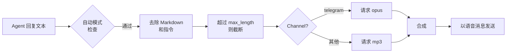

> 翻译自 [English version](/tts-voice)

# TTS 语音

> 为 agent 添加语音回复 — 从四个 provider 中选择，精确控制音频触发时机。

## 概述

GoClaw 的 TTS 系统将 agent 的文字回复转换为音频，并在支持的 channel 上以语音消息形式投递（如 Telegram 语音气泡）。你配置主 provider 和自动触发模式，GoClaw 处理其余一切 — 去除 Markdown、截断长文本、并为不同 channel 选择正确的音频格式。

支持四个 provider：

| Provider | Key | 要求 |
|----------|-----|---------|
| OpenAI | `openai` | API key |
| ElevenLabs | `elevenlabs` | API key |
| Microsoft Edge TTS | `edge` | `edge-tts` CLI（免费）— 始终可作为回退 |
| MiniMax | `minimax` | API key + Group ID |

---

## 自动触发模式

`auto` 字段控制 TTS 的触发时机：

| 模式 | 发送音频的时机 |
|------|--------------------|
| `off` | 从不（默认） |
| `always` | 每个符合条件的回复 |
| `inbound` | 仅当用户发送了语音/音频消息时 |
| `tagged` | 仅当回复包含 `[[tts]]` 时 |

`mode` 字段限定哪些回复类型符合条件：

| 值 | 行为 |
|-------|----------|
| `final` | 仅最终回复（默认） |
| `all` | 所有回复，包括工具结果 |

少于 10 个字符的文本或包含 `MEDIA:` 路径的文本始终跳过。超过 `max_length`（默认 1500）的文本截断并附加 `...`。

---

## Provider 配置

### OpenAI

```json
{
  "tts": {
    "provider": "openai",
    "auto": "inbound",
    "openai": {
      "api_key": "sk-...",
      "model": "gpt-4o-mini-tts",
      "voice": "alloy"
    }
  }
}
```

可用音色：`alloy`、`echo`、`fable`、`onyx`、`nova`、`shimmer`。默认模型：`gpt-4o-mini-tts`。

---

### ElevenLabs

```json
{
  "tts": {
    "provider": "elevenlabs",
    "auto": "always",
    "elevenlabs": {
      "api_key": "xi-...",
      "voice_id": "pMsXgVXv3BLzUgSXRplE",
      "model_id": "eleven_multilingual_v2"
    }
  }
}
```

在 [ElevenLabs 音色库](https://elevenlabs.io/voice-library) 中查找音色 ID。默认模型：`eleven_multilingual_v2`。

#### ElevenLabs 模型变体

| 模型 ID | 特点 | 最适合 |
|---------|------|--------|
| `eleven_v3` | 最新旗舰（2025 年 11 月），最高质量 | 高级语音、复杂语音内容 |
| `eleven_multilingual_v2` | 高质量，支持 29 种语言 | 默认；多语言内容 |
| `eleven_turbo_v2_5` | 成本优化，速度快 | 大批量、注重成本 |
| `eleven_flash_v2_5` | 最低延迟，支持 32 种语言 | 实时 / 交互式使用 |

仅接受以上四个模型 ID — 未知 ID 在 gateway 边界处被拒绝。

---

### Edge TTS（免费）

Edge TTS 通过 `edge-tts` Python CLI 使用微软的神经网络语音 — 无需 API key。

```bash
pip install edge-tts
```

```json
{
  "tts": {
    "provider": "edge",
    "auto": "tagged",
    "edge": {
      "enabled": true,
      "voice": "en-US-MichelleNeural",
      "rate": "+0%"
    }
  }
}
```

`enabled` 字段必须为 `true` 才能激活 Edge provider — 它没有可自动检测的 API key。

浏览可用音色：

```bash
edge-tts --list-voices
```

常用音色：`en-US-MichelleNeural`、`en-GB-SoniaNeural`、`vi-VN-HoaiMyNeural`。`rate` 字段调整语速（如 `+20%` 加快，`-10%` 减慢）。输出始终为 MP3。

---

### MiniMax

MiniMax 的 T2A API 支持 300+ 系统音色和 40+ 种语言。

```json
{
  "tts": {
    "provider": "minimax",
    "auto": "always",
    "minimax": {
      "api_key": "...",
      "group_id": "your-group-id",
      "model": "speech-02-hd",
      "voice_id": "Wise_Woman"
    }
  }
}
```

模型：`speech-02-hd`（高质量）、`speech-02-turbo`（更快）。支持的输出格式：`mp3`、`opus`、`pcm`、`flac`、`wav`。

---

## 完整配置参考

```json
{
  "tts": {
    "provider": "openai",
    "auto": "inbound",
    "mode": "final",
    "max_length": 1500,
    "timeout_ms": 30000,
    "openai": { "api_key": "sk-...", "voice": "nova" },
    "edge":   { "enabled": true, "voice": "en-US-MichelleNeural" }
  }
}
```

当主 provider 失败时，GoClaw 自动尝试其他已注册的 provider。

---

## Channel 集成

### Telegram 语音气泡

当来源 channel 为 `telegram` 时，GoClaw 自动请求 `opus` 格式（Ogg/Opus 容器）而非 MP3 — Telegram 语音消息要求此格式。无需额外配置。



### 标记模式

在 agent 回复的任意位置添加 `[[tts]]` 以在 `tagged` 模式下触发合成：

```
Here's your daily briefing. [[tts]]
```

---

## 示例

**使用 Edge TTS 的最简免费配置：**

```bash
pip install edge-tts
```

```json
{
  "tts": {
    "provider": "edge",
    "auto": "inbound",
    "edge": { "enabled": true, "voice": "en-US-JennyNeural" }
  }
}
```

**OpenAI 主 provider 配合 ElevenLabs 回退：**

```json
{
  "tts": {
    "provider": "openai",
    "auto": "always",
    "openai":     { "api_key": "sk-...", "voice": "alloy" },
    "elevenlabs": { "api_key": "xi-...", "voice_id": "pMsXgVXv3BLzUgSXRplE" }
  }
}
```

---

## Agent 级语音配置

每个 agent 可以通过 `other_config` JSONB 字段覆盖全局 TTS 语音和模型，让不同 agent 使用不同音色，无需更改系统级配置。

| Key | 类型 | 说明 |
|-----|------|------|
| `tts_voice_id` | string | 该 agent 使用的 ElevenLabs 音色 ID |
| `tts_model_id` | string | 该 agent 使用的 ElevenLabs 模型 ID（须为[允许的模型](#elevenlabs-模型变体)） |

**解析优先级：** CLI 参数 → agent `other_config` → 租户覆盖 → provider 默认值。

**示例** — 通过 Web UI 或 API 为每个 agent 设置独立音色：

```json
{
  "other_config": {
    "tts_voice_id": "pMsXgVXv3BLzUgSXRplE",
    "tts_model_id": "eleven_flash_v2_5"
  }
}
```

---

## STT 内置工具

`stt` 内置工具（由 migration 050 种子化）允许 agent 使用 ElevenLabs Scribe 或兼容代理对语音/音频输入进行转录 — 启用和配置方式请参阅 [Tools Overview](/tools-overview)。

---

## 常见问题

| 问题 | 原因 | 解决方法 |
|-------|-------|-----|
| `tts provider not found: edge` | `enabled` 未设置 | 在 `edge` 章节添加 `"enabled": true` |
| `edge-tts failed` | CLI 未安装 | `pip install edge-tts` |
| `all tts providers failed` | 所有 provider 报错 | 检查 API key；查看网关日志 |
| Telegram 中无语音 | `auto` 为 `off` | 设置 `auto: "inbound"` 或 `"always"` |
| 工具结果触发了语音 | `mode` 为 `all` | 设置 `mode: "final"` |
| MiniMax 返回空音频 | 缺少 `group_id` | 从 MiniMax 控制台添加 `group_id` |
| 文本以 `...` 截断 | 超过 `max_length` | 在 config 中增大 `max_length` |

---

## 下一步

- [定时任务与 Cron](/scheduling-cron) — 按计划触发 agent
- [扩展思维](/extended-thinking) — 复杂回复的深度推理

<!-- goclaw-source: 050aafc9 | 更新: 2026-04-17 -->
