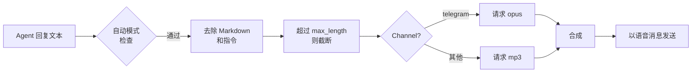
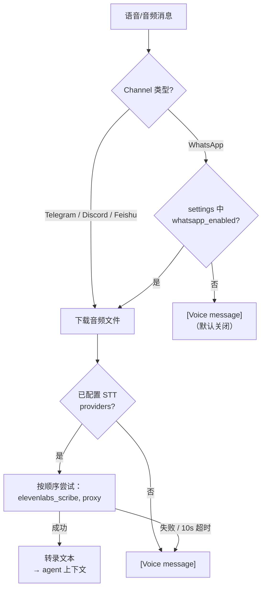

> 翻译自 [English version](/tts-voice)

# TTS 语音

> 为 agent 添加语音回复 — 从五个 provider 中选择，精确控制音频触发时机。

## 概述

GoClaw 的 TTS 系统将 agent 的文字回复转换为音频，并在支持的 channel 上以语音消息形式投递（如 Telegram 语音气泡）。你配置主 provider 和自动触发模式，GoClaw 处理其余一切 — 去除 Markdown、截断长文本、并为不同 channel 选择正确的音频格式。

支持五个 provider：

| Provider | Key | 要求 |
|----------|-----|---------|
| OpenAI | `openai` | API key |
| ElevenLabs | `elevenlabs` | API key |
| Microsoft Edge TTS | `edge` | `edge-tts` CLI（免费）— 始终可作为回退 |
| MiniMax | `minimax` | API key + Group ID |
| Google Gemini TTS | `gemini` | API key |

---

## 自动触发模式

`auto` 字段控制 TTS 的触发时机：

| 模式 | 发送音频的时机 |
|------|--------------------|
| `off` | 从不（默认） |
| `always` | 每个符合条件的回复 |
| `inbound` | 仅当用户发送了语音/音频消息时 |
| `tagged` | 仅当回复包含 `[[tts]]` 时 |

`mode` 字段限定哪些回复类型符合条件：

| 值 | 行为 |
|-------|----------|
| `final` | 仅最终回复（默认） |
| `all` | 所有回复，包括工具结果 |

少于 10 个字符的文本或包含 `MEDIA:` 路径的文本始终跳过。超过 `max_length`（默认 1500）的文本截断并附加 `...`。

---

## Provider 配置

### OpenAI

```json
{
  "tts": {
    "provider": "openai",
    "auto": "inbound",
    "openai": {
      "api_key": "sk-...",
      "model": "gpt-4o-mini-tts",
      "voice": "alloy"
    }
  }
}
```

可用音色：`alloy`、`ash`、`ballad`、`coral`、`echo`、`fable`、`onyx`、`nova`、`sage`、`shimmer`、`verse`、`marin`、`cedar`。注意：`ballad`、`verse`、`marin`、`cedar` 仅与 `gpt-4o-mini-tts` 兼容。

支持的模型：`tts-1`、`tts-1-hd`、`gpt-4o-mini-tts`（默认）。

#### OpenAI 高级参数

| 参数 | 类型 | 默认值 | 说明 |
|------|------|--------|------|
| `speed` | range | 1.0 | 0.25–4.0；agent 可覆盖 |
| `response_format` | enum | `mp3` | mp3、opus、aac、flac、wav、pcm |
| `instructions` | text | — | 风格提示；仅 `gpt-4o-mini-tts`（高级） |

---

### ElevenLabs

```json
{
  "tts": {
    "provider": "elevenlabs",
    "auto": "always",
    "elevenlabs": {
      "api_key": "xi-...",
      "voice_id": "pMsXgVXv3BLzUgSXRplE",
      "model_id": "eleven_multilingual_v2"
    }
  }
}
```

在 [ElevenLabs 音色库](https://elevenlabs.io/voice-library) 中查找音色 ID。默认模型：`eleven_multilingual_v2`。

#### ElevenLabs 模型变体

| 模型 ID | 特点 | 最适合 |
|---------|------|--------|
| `eleven_v3` | 最新旗舰（2025 年 11 月），最高质量 | 高级语音、复杂语音内容 |
| `eleven_multilingual_v2` | 高质量，支持 29 种语言 | 默认；多语言内容 |
| `eleven_turbo_v2_5` | 成本优化，速度快 | 大批量、注重成本 |
| `eleven_flash_v2_5` | 最低延迟，支持 32 种语言 | 实时 / 交互式使用 |

仅接受以上四个模型 ID — 未知 ID 在 gateway 边界处被拒绝。

#### ElevenLabs 高级参数

| 参数 | 类型 | 默认值 | 说明 |
|------|------|--------|------|
| `voice_settings.stability` | range | 0.5 | 0–1；语音一致性 |
| `voice_settings.similarity_boost` | range | 0.75 | 0–1；与原始音色的相似度 |
| `voice_settings.style` | range | 0.0 | 0–1；agent 可通过 `style` 覆盖 |
| `voice_settings.use_speaker_boost` | boolean | true | — |
| `voice_settings.speed` | range | 1.0 | 0.7–1.2；agent 可通过 `speed` 覆盖 |
| `apply_text_normalization` | enum | auto | auto / on / off |
| `seed` | integer | 0 | 可复现输出的确定性种子（高级） |
| `optimize_streaming_latency` | range | 0 | 0–4（高级） |
| `language_code` | string | — | ISO 639-1 语言提示（高级） |
| `output_format` | enum | `mp3_44100_128` | 编解码器 + 比特率；更高质量需 Creator+/Pro+（高级） |

---

### Edge TTS（免费）

Edge TTS 通过 `edge-tts` Python CLI 使用微软的神经网络语音 — 无需 API key。

```bash
pip install edge-tts
```

```json
{
  "tts": {
    "provider": "edge",
    "auto": "tagged",
    "edge": {
      "enabled": true,
      "voice": "en-US-MichelleNeural",
      "rate": "+0%"
    }
  }
}
```

`enabled` 字段必须为 `true` 才能激活 Edge provider — 它没有可自动检测的 API key。

浏览可用音色：

```bash
edge-tts --list-voices
```

常用音色：`en-US-MichelleNeural`、`en-GB-SoniaNeural`、`vi-VN-HoaiMyNeural`。`rate` 字段调整语速（如 `+20%` 加快，`-10%` 减慢）。输出始终为 MP3。

#### Edge TTS 参数

| 参数 | 类型 | 默认值 | 说明 |
|------|------|--------|------|
| `rate` | integer | 0 | 语速偏移 −50 至 +100（%） |
| `pitch` | integer | 0 | 音调偏移 −50 至 +50（Hz） |
| `volume` | integer | 0 | 音量偏移 −50 至 +100（%） |

---

### MiniMax

MiniMax 的 T2A API 支持 300+ 系统音色和 40+ 种语言。音色列表动态获取 — 使用 [Voices API](#voices-api) 并加上 `?provider=minimax`。

```json
{
  "tts": {
    "provider": "minimax",
    "auto": "always",
    "minimax": {
      "api_key": "...",
      "group_id": "your-group-id",
      "model": "speech-02-hd",
      "voice_id": "Wise_Woman"
    }
  }
}
```

支持的模型：`speech-02-hd`（高质量）、`speech-02-turbo`（更快）、`speech-01-hd`、`speech-01-turbo`。

#### MiniMax 高级参数

| 参数 | 类型 | 默认值 | 说明 |
|------|------|--------|------|
| `speed` | range | 1.0 | 0.5–2.0；agent 可通过 `speed` 覆盖 |
| `vol` | range | 1.0 | 音量 0.01–10.0 |
| `pitch` | integer | 0 | 音调（半音）−12 至 +12 |
| `emotion` | enum | — | happy/sad/angry/fearful/disgusted/surprised/neutral/excited/anxious；agent 可覆盖 |
| `text_normalization` | boolean | — | 未设置时省略 |
| `audio.format` | enum | `mp3` | mp3、pcm、flac、wav |
| `language_boost` | enum | Auto | 18 种语言；改善发音自然度 |
| `subtitle_enable` | boolean | — | 返回逐词时间戳数据 |
| `audio.sample_rate` | enum | 默认 | 8k–44.1 kHz（高级） |
| `audio.bitrate` | enum | 默认 | 32–256 kbps；仅 MP3（高级） |
| `audio.channel` | enum | 默认 | 单声道 / 立体声（高级） |
| `pronunciation_dict` | text | — | `"词/音素"` 规则的 JSON 数组，最大 8 KB（高级） |

音色的性别和语言元数据从 MiniMax 命名规范中自动解析，并以标签形式显示在音色选择器中。

---

### Google Gemini TTS

Gemini TTS 使用 Google 最新的预览版模型，需要 API key。

```json
{
  "tts": {
    "provider": "gemini",
    "auto": "always",
    "gemini": {
      "api_key": "AIza...",
      "model": "gemini-2.5-flash-preview-tts",
      "voice": "Kore"
    }
  }
}
```

支持的模型（均为预览阶段 — UI 显示 **Preview** 徽章）：

| 模型 | 说明 |
|------|------|
| `gemini-2.5-flash-preview-tts` | 速度快、成本低 |
| `gemini-2.5-pro-preview-tts` | 最高质量 |
| `gemini-3.1-flash-tts-preview` | **默认** |

#### Gemini 音色（30 个预置音色）

每个音色有一个风格标签，在 UI 中以徽章形式显示：

| 音色 | 风格 | 音色 | 风格 |
|------|------|------|------|
| Zephyr | Bright | Puck | Upbeat |
| Charon | Informative | Kore | Firm |
| Fenrir | Excitable | Leda | Youthful |
| Orus | Firm | Aoede | Breezy |
| Callirrhoe | Easy-going | Autonoe | Bright |
| Enceladus | Breathy | Iapetus | Clear |
| Umbriel | Easy-going | Algieba | Smooth |
| Despina | Smooth | Erinome | Clear |
| Algenib | Gravelly | Rasalgethi | Informative |
| Laomedeia | Upbeat | Achernar | Soft |
| Alnilam | Firm | Schedar | Even |
| Gacrux | Mature | Pulcherrima | Forward |
| Achird | Friendly | Zubenelgenubi | Casual |
| Vindemiatrix | Gentle | Sadachbia | Lively |
| Sadaltager | Knowledgeable | Sulafat | Warm |

#### Gemini 参数

| 参数 | 类型 | 默认值 | 分组 |
|------|------|--------|------|
| `temperature` | range | API 默认（1.0） | 基础 — 影响细微；主要表达力来自 audio tags |
| `seed` | integer | — | 高级 |
| `presencePenalty` | range | — | 高级 — 实验性 |
| `frequencyPenalty` | range | — | 高级 — 实验性 |

#### Gemini 多说话人模式

每次请求最多 2 位说话人。每位说话人有 `name` 和从 30 个预置音色中选择的 `voice`。通过 portal 的 Voice Picker 配置 — 以 `tts.gemini.speakers` JSON blob 存储。

#### Gemini Audio Tags

直接在文本中插入表达性标记：

```
Hello [laughs] world [sighs] how are you?
```

类别：情绪、节奏、效果、音质。完整标记列表在界面的 tag picker 中。

#### Gemini 语言支持

支持 70+ 种语言 — 无需明确指定语言参数。Gemini 自动从输入文本中检测语言。

#### Gemini 验证错误（422）

| 错误 | 触发条件 |
|------|---------|
| `ErrInvalidVoice` | 音色 ID 不在 30 个预置音色中 |
| `ErrSpeakerLimit` | 多说话人模式下超过 2 位说话人 |
| `ErrInvalidModel` | 模型 ID 不在允许列表中 |
| `MsgTtsGeminiTextOnly` | 自动重试后 Gemini 仍返回文本而非音频（详见故障排查） |

---

## Agent 级语音覆盖

每个 agent 可以通过 `other_config` JSONB 字段覆盖 TTS 参数，无需更改系统级配置。

### 音色和模型（ElevenLabs）

| Key | 类型 | 说明 |
|-----|------|------|
| `tts_voice_id` | string | 该 agent 使用的 ElevenLabs 音色 ID |
| `tts_model_id` | string | 该 agent 使用的 ElevenLabs 模型 ID（须为[允许的模型](#elevenlabs-模型变体)） |

### 按 Agent 覆盖参数（v3.10.0+）

Agent 可通过 `other_config.tts_params` 覆盖部分 provider 参数。仅以下通用 key 被允许：

| 通用 key | OpenAI | ElevenLabs | MiniMax | Edge / Gemini |
|---------|--------|------------|---------|---------------|
| `speed` | `speed` | `voice_settings.speed` | `speed` | 不映射 |
| `emotion` | 不映射 | 不映射 | `emotion` | 不映射 |
| `style` | 不映射 | `voice_settings.style` | 不映射 | 不映射 |

不在此列表中的 key 在写入时被拒绝。适配器在 provider 回退循环的每次尝试中运行，确保每个 provider 使用正确的映射。

**解析优先级：** CLI 参数 → agent `other_config` → 租户覆盖 → provider 默认值。

**示例：**

```json
{
  "other_config": {
    "tts_voice_id": "pMsXgVXv3BLzUgSXRplE",
    "tts_model_id": "eleven_flash_v2_5",
    "tts_params": {
      "speed": 1.1,
      "style": 0.3
    }
  }
}
```

---

## 完整配置参考

```json
{
  "tts": {
    "provider": "openai",
    "auto": "inbound",
    "mode": "final",
    "max_length": 1500,
    "timeout_ms": 30000,
    "openai": { "api_key": "sk-...", "voice": "nova" },
    "edge":   { "enabled": true, "voice": "en-US-MichelleNeural" }
  }
}
```

当主 provider 失败时，GoClaw 自动尝试其他已注册的 provider。

### 租户合成超时

合成超时由 `system_configs` 中的 `tts.timeout_ms` 键控制（租户 admin → Config → Audio → TTS）。默认值为 **120000 ms（120 秒）**。对于较慢的 provider 或长音频，可适当调大；gateway 对每次请求应用等于该值的 context deadline。

```
tts.timeout_ms = 120000   # 默认值；对慢速 provider 可调大
```

---

## Voices API

GoClaw 提供用于发现可用 TTS 音色的 HTTP 端点。这些端点按租户隔离，需要租户 admin 或 operator 角色。

| Method | Path | 说明 |
|--------|------|------|
| `GET` | `/v1/voices` | 列出可用音色（内存缓存，TTL 1 小时） |
| `GET` | `/v1/voices?provider=minimax` | 列出 MiniMax 动态音色 |
| `POST` | `/v1/voices/refresh` | 强制使音色缓存失效（仅 admin） |

### `GET /v1/voices`

返回当前租户已配置 provider 的音色列表。结果按租户在内存中缓存，TTL 1 小时。ElevenLabs 音色与用户账号绑定。MiniMax 需加 `?provider=minimax` 参数动态获取。

```json
[
  {
    "voice_id": "pMsXgVXv3BLzUgSXRplE",
    "name": "Alice",
    "labels": {
      "use_case": "conversational",
      "accent": "american"
    }
  }
]
```

缓存未命中时立即从 provider 拉取。Provider 不可达时返回 `500`。

### `POST /v1/voices/refresh`

使当前租户的音色缓存失效，下次 `GET /v1/voices` 请求将从 provider 获取最新列表。响应为 `202 Accepted`。

---

## Capabilities API

```
GET /v1/tts/capabilities
```

返回所有已注册 provider 的完整 `ProviderCapabilities` schema — 模型、静态音色、参数 schema 及自定义功能标志。Portal 使用此端点渲染动态 provider 设置表单和 agent 覆盖界面。

---

## Channel 集成

### Telegram 语音气泡

当来源 channel 为 `telegram` 时，GoClaw 自动请求 `opus` 格式（Ogg/Opus 容器）而非 MP3 — Telegram 语音消息要求此格式。无需额外配置。



### 标记模式

在 agent 回复的任意位置添加 `[[tts]]` 以在 `tagged` 模式下触发合成：

```
Here's your daily briefing. [[tts]]
```

---

## 示例

**使用 Edge TTS 的最简免费配置：**

```bash
pip install edge-tts
```

```json
{
  "tts": {
    "provider": "edge",
    "auto": "inbound",
    "edge": { "enabled": true, "voice": "en-US-JennyNeural" }
  }
}
```

**OpenAI 主 provider 配合 ElevenLabs 回退：**

```json
{
  "tts": {
    "provider": "openai",
    "auto": "always",
    "openai":     { "api_key": "sk-...", "voice": "alloy" },
    "elevenlabs": { "api_key": "xi-...", "voice_id": "pMsXgVXv3BLzUgSXRplE" }
  }
}
```

**Gemini 多说话人配合 audio tags：**

```json
{
  "tts": {
    "provider": "gemini",
    "auto": "always",
    "gemini": {
      "api_key": "AIza...",
      "model": "gemini-2.5-flash-preview-tts"
    }
  }
}
```

在 portal 的 Voice Picker 中配置说话人 — 最多 2 位，每位有独立名称和一个 Gemini 预置音色。

---

## 语音识别（STT）

GoClaw 通过统一的 `audio.Manager` 和 provider 链处理所有语音/音频转录。Telegram、Discord、Feishu、WhatsApp 等 channel 共享同一 STT 基础设施。

### 统一转录流程



### WhatsApp 选择加入

WhatsApp STT **默认关闭**（`whatsapp_enabled: false`）。原因：WhatsApp 语音消息经过端到端加密，将音频发送到外部 STT provider 会破坏 E2E 加密。管理员须在 **Config → Audio → STT** 中明确启用并确认此变更。

关闭时（默认）：语音消息在 agent 上下文中显示为 `[Voice message]`——音频不会离开设备。
启用后：音频通过配置的 STT 链转录；失败或超时（10 秒）时回退到 `[Voice message]`。

### STT Provider 链

| 设置 | 行为 |
|------|------|
| `providers: ["elevenlabs_scribe", "proxy_stt"]` | 优先尝试 ElevenLabs Scribe；回退到旧版代理 |
| `providers: []`（空） | 跳过所有 STT；语音 → `[Voice message]` |
| `providers` 缺失（nil） | 启动时检查旧版 `STTProxyURL` bridge |

通过 Web UI 的 **Config → Audio → STT** 配置（存储在 `builtin_tools[stt].settings.providers`）。该列表存在时，将覆盖所有旧版 channel 专属 STT 配置。

---

## STT 内置工具

`stt` 内置工具（由 migration 050 种子化）允许 agent 使用 ElevenLabs Scribe 或兼容代理对语音/音频输入进行转录 — 启用和配置方式请参阅 [Tools Overview](/tools-overview)。

---

## 常见问题

| 问题 | 原因 | 解决方法 |
|------|------|---------|
| `tts provider not found: edge` | `enabled` 未设置 | 在 `edge` 章节添加 `"enabled": true` |
| `edge-tts failed` | CLI 未安装 | `pip install edge-tts` |
| `all tts providers failed` | 所有 provider 报错 | 检查 API key；查看网关日志 |
| Telegram 中无语音 | `auto` 为 `off` | 设置 `auto: "inbound"` 或 `"always"` |
| 工具结果触发了语音 | `mode` 为 `all` | 设置 `mode: "final"` |
| MiniMax 返回空音频 | 缺少 `group_id` | 从 MiniMax 控制台添加 `group_id` |
| 文本以 `...` 截断 | 超过 `max_length` | 在 config 中增大 `max_length` |
| Gemini 422 `ErrInvalidVoice` | 音色 ID 不在 30 个预置音色中 | 使用上表中的有效音色 ID |
| Gemini 422 `ErrSpeakerLimit` | 超过 2 位说话人 | 在 Voice Picker 中减少至 ≤ 2 位 |
| Gemini 422 `MsgTtsGeminiTextOnly` | 自动重试后 Gemini 仍返回文本而非音频 | GoClaw 会自动重试一次并附加 inline audio 前缀；若 Gemini 仍拒绝，则返回 HTTP 422。请缩短文本、去除翻译或评论内容，或更换模型。 |
| `tts_params` key 被拒绝 | key 不在允许列表中 | 仅使用 `speed`、`emotion`、`style` |

---

## 下一步

- [定时任务与 Cron](/scheduling-cron) — 按计划触发 agent
- [扩展思维](/extended-thinking) — 复杂回复的深度推理

<!-- goclaw-source: 29457bb3 | 更新: 2026-04-25 -->
