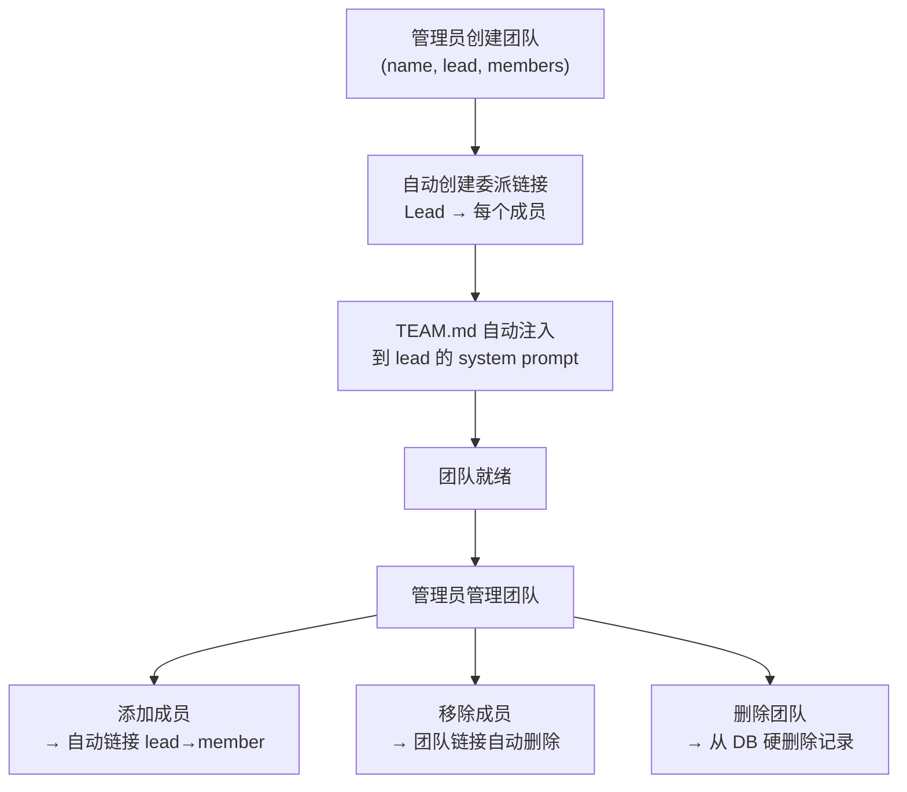

> 翻译自 [English version](/teams-creating)

# 创建与管理团队

通过 API、Dashboard 或 CLI 创建团队。系统自动建立 lead 与所有成员之间的委派链接，将 `TEAM.md` 注入 lead 的 system prompt，并为所有成员开启任务板访问权限。

## 快速开始

**创建团队**，指定 lead agent 和成员：

```bash
# CLI
./goclaw team create \
  --name "Research Team" \
  --lead researcher_agent \
  --members analyst_agent,writer_agent \
  --description "Parallel research and writing"
```

**通过 WebSocket RPC**（`teams.create`）：

```json
{
  "name": "Research Team",
  "lead": "researcher_agent",
  "members": ["analyst_agent", "writer_agent"],
  "description": "Parallel research and writing"
}
```

**Dashboard**：Teams → Create Team → 选择 Lead → 添加成员 → Save

Teams 列表页支持**卡片/列表切换**，可在可视卡片布局与紧凑列表视图之间切换。

## 创建时发生了什么

创建团队时，系统会：

1. **验证** lead 和 member agent 是否存在
2. **创建团队记录**，`status=active`
3. **将 lead 添加为成员**，`role=lead`
4. **添加每个成员**，`role=member`
5. **自动创建委派链接**（lead → 每个成员）：
   - 方向：`outbound`（lead 可委派给成员）
   - 每个链接最大并发委派数：`3`
   - 标记 `team_id`（系统识别这些是团队管理的链接）
6. **注入 TEAM.md** 到 lead 的 system prompt，包含完整编排指令
7. **为所有团队成员启用任务板**

## 团队生命周期



## 管理团队成员

**添加成员**（默认角色为 `member`）：

```bash
./goclaw team add-member \
  --team-id 550e8400-e29b-41d4-a716-446655440000 \
  --agent analyst_agent \
  --role member

# 添加后，自动创建从 lead → 新成员的委派链接
```

**移除成员**：

```bash
./goclaw team remove-member \
  --team-id 550e8400-e29b-41d4-a716-446655440000 \
  --agent-id <agent-uuid>

# 移除时自动清理团队专属的委派链接
```

**列出团队成员**：

```bash
./goclaw team list-members --team-id 550e8400-e29b-41d4-a716-446655440000

# 输出：
# Agent Key        Role        Display Name
# researcher_agent lead        Research Expert
# analyst_agent    member      Data Analyst
# writer_agent     member      Content Writer
```

API 返回的成员信息包含完整的 **agent 元数据**（display name、emoji、描述、模型），便于 dashboard 渲染丰富的成员卡片。

## Lead 与 Member 角色对比

| 能力 | Lead | Member |
|------|------|--------|
| 接收完整 TEAM.md（编排指令） | 是 | 否（通过工具按需获取 context） |
| 在任务板上创建任务 | 是 | 否 |
| 委派任务给成员 | 是 | 否 |
| 执行委派的任务 | 否 | 是 |
| 通过任务板报告进度 | 否 | 是 |
| 发送/接收 mailbox 消息 | 是 | 是 |
| Spawn / 委派权限 | 是 | 否 |
| 自我分配任务 | 否 | 不适用 |

> **注意**：Lead agent 不能自我分配任务。尝试这样做会被拒绝，以防止 lead 同时充当协调者和执行者的双会话循环。

成员在团队结构内工作。他们没有 spawn 或委派能力——其职责是执行分配的任务并报告结果。

## 团队设置与访问控制

团队通过设置 JSON 支持细粒度的访问控制和行为配置：

```json
{
  "allow_user_ids": ["user_123", "user_456"],
  "deny_user_ids": [],
  "allow_channels": ["telegram", "slack"],
  "deny_channels": [],
  "progress_notifications": true,
  "followup_interval_minutes": 30,
  "followup_max_reminders": 3,
  "escalation_mode": "notify_lead",
  "escalation_actions": [],
  "workspace_scope": "isolated",
  "workspace_quota_mb": 500,
  "blocker_escalation": {
    "enabled": true
  }
}
```

**访问控制字段**：
- `allow_user_ids`：仅这些用户可触发团队工作（空 = 开放访问）
- `deny_user_ids`：屏蔽这些用户（deny 优先于 allow）
- `allow_channels`：仅来自这些 channel 的消息触发团队工作（空 = 开放）
- `deny_channels`：屏蔽来自这些 channel 的消息

系统 channel（`teammate`、`system`）无论设置如何始终通过访问检查。

**跟进与升级字段**：
- `followup_interval_minutes`：进行中任务自动跟进提醒的间隔（分钟）
- `followup_max_reminders`：每个任务最大跟进提醒次数
- `escalation_mode`：处理过期任务的方式——`"notify_lead"`（发送通知）或 `"fail_task"`（自动使任务失败）
- `escalation_actions`：升级时的额外操作

**阻塞升级**：
- `blocker_escalation.enabled`：blocker 评论是否自动使任务失败并升级给 lead（默认：`true`）

启用 `blocker_escalation`（默认）时，若成员在任务上发布 blocker 评论，任务会自动失败，lead 会收到包含阻塞原因和重试指令的升级消息。设置 `enabled: false` 可保存 blocker 评论但不触发自动失败。

**Workspace 字段**：
- `workspace_scope`：`"isolated"`（默认，每次对话独立文件夹）或 `"shared"`（所有成员共享一个文件夹）
- `workspace_quota_mb`：团队 workspace 的磁盘配额（MB）

**其他字段**：
- `progress_notifications`：异步委派期间发送定期更新

**设置团队配置**：

```bash
./goclaw team update \
  --team-id 550e8400-e29b-41d4-a716-446655440000 \
  --settings '{
    "allow_user_ids": ["user_123"],
    "allow_channels": ["telegram"],
    "blocker_escalation": {"enabled": true},
    "escalation_mode": "notify_lead"
  }'
```

## 团队状态

团队有一个 `status` 字段：

- `active`：团队运行中
- `archived`：团队存在但已禁用

要完全移除团队，使用删除操作——从数据库中硬删除记录。没有 `deleted` 状态。

**更改团队状态**：

```bash
./goclaw team update \
  --team-id 550e8400-e29b-41d4-a716-446655440000 \
  --status archived
```

## System Prompt 中的团队成员

团队激活时，GoClaw 会在 lead agent 的 system prompt 中注入 `## Team Members` 部分，列出所有队友。每条记录包含 agent 元数据，包括 emoji 图标（来自 `other_config`）：

```
## Team Members
- agent_key: analyst_agent | display_name: 🔍 Data Analyst | role: member | expertise: Data analysis and visualization...
- agent_key: writer_agent | display_name: ✍️ Content Writer | role: member | expertise: Technical writing...
```

这让 lead 可以通过 key 正确分配任务，无需猜测。成员添加或移除时，该部分自动更新。

## Lead Workspace 解析

分派团队任务时，lead agent 会为 lead 和成员解析各自的团队 workspace 目录。此解析过程完全透明——agent 使用普通文件路径，**WorkspaceInterceptor** 会自动将请求重写到正确的团队 workspace context。

isolated 模式（`workspace_scope: "isolated"`）下，每次对话拥有独立文件夹；shared 模式下，所有成员读写同一个团队目录。

## 媒体自动复制

从包含媒体文件（图片、文档）的对话中创建任务时，GoClaw 会自动将这些文件复制到团队 workspace 的 `{team_workspace}/attachments/` 目录。尽可能使用硬链接以提高效率，无法硬链接时回退为复制。文件经过验证并以严格权限（0640）保存。

## TEAM.md 注入

`TEAM.md` 是在 agent 解析时动态生成的虚拟文件——不存储在磁盘上。注入到 system prompt 时用 `<system_context>` 标签包裹。

**Lead 的 TEAM.md** 包含：
- 团队名称和描述
- 队友列表（含角色和专业能力）
- **强制工作流**：先创建任务，再用任务 ID 委派——没有有效 `team_task_id` 的委派会被拒绝
- **编排模式**：顺序、迭代、并行、混合
- 通信指南

**成员的 TEAM.md** 包含：
- 团队名称和队友列表
- 专注于委派工作的指令
- 如何通过 `team_tasks(action="progress", percent=50, text="...")` 报告进度
- 可用的任务板操作：`claim`、`complete`、`list`、`get`、`search`、`progress`、`comment`、`attach`、`retry`（无 `create`、`cancel`、`approve`、`reject`）

当团队配置变更（成员添加/移除、设置更新）时，context 自动刷新。

## 下一步

- [Task Board](./task-board.md) — 创建和管理任务
- [Team Messaging](./team-messaging.md) — 成员间通信
- [Delegation & Handoff](./delegation-and-handoff.md) — 编排工作

<!-- goclaw-source: 050aafc9 | updated: 2026-04-09 -->
