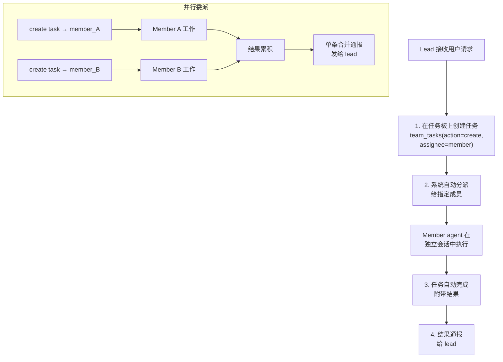

> 翻译自 [English version](/teams-delegation)

# 委派与交接（Delegation & Handoff）

委派（Delegation）允许 lead 通过任务板向成员 agent 分配工作。交接（Handoff）在不中断用户会话的情况下，将对话控制权转移给另一个 agent。

## Agent 委派流程

委派通过 `team_tasks` 工具进行——lead 创建带有 assignee 的任务，系统自动将其分派给指定成员：



> **注意**：`spawn` 工具**仅用于自克隆子 agent**——它不接受 `agent` 参数。委派给团队成员时，始终使用 `team_tasks(action="create", assignee=...)`。

## 创建委派任务

使用 `team_tasks` 工具，`action: "create"`，并填写必填的 `assignee`：

```json
{
  "action": "create",
  "subject": "分析 Q1 报告中的市场趋势",
  "description": "重点关注 Q1 营收数据和竞争对手分析",
  "assignee": "analyst_agent"
}
```

系统验证并自动分派：
- **`assignee` 必填** — 每个任务必须分配给一个团队成员
- **Assignee 必须是团队成员** — 非成员会被拒绝
- **Lead 不能自我分配** — 防止双会话执行循环
- **自动分派**：lead 的回合结束后，待处理任务自动分派给其指定的 agent

**已执行的保护措施**：
- 每个任务最多 **3 次分派** — 超过 3 次自动失败，防止无限循环
- 分派给 lead agent 的任务被阻塞并自动失败
- 成员请求（非 lead）可选择在分派前要求 lead 审批

> **V2 Lead**：团队 V2 lead 在当前回合未发出 spawn 前不能手动创建任务。这可防止过早创建任务破坏结构化编排流程。

## 并行委派

在同一个回合中创建多个任务——它们在回合结束后同时分派：

```json
// Lead 在一个回合中创建 2 个任务
{"action": "create", "subject": "提取事实", "assignee": "analyst1"}
{"action": "create", "subject": "提取观点", "assignee": "analyst2"}
```

结果通过**生产者-消费者通告队列**（`BatchQueue[T]`）收集，将零散完成的结果合并为单次 LLM 通告运行。Lead 收到一条合并消息，而非每个成员分别打断——显著降低 token 开销。

## 并行子 Agent 增强（#600）

除了向团队成员委派外，lead 还可以使用 `spawn` 工具为不需要特定团队成员的并行工作负载生成**自克隆子 agent**：

```json
{"action": "spawn", "task": "总结 PDF 报告", "label": "pdf-summarizer"}
```

并行子 agent 增强引入的关键行为：

### 智能 Leader 委派

leader 委派提示是**条件性的**——仅在情况真正需要委派时激活，而非强制应用于每次 spawn。这避免了在直接回复更合适时浪费 LLM 回合。

### `spawn(action=wait)` — WaitAll 编排

阻塞父 agent，直到所有已 spawn 的子 agent 完成：

```json
{"action": "wait", "timeout": 300}
```

- 父 agent 回合暂停，直到所有活跃子 agent 完成（或超时）
- 支持需要 lead 先获取所有结果再继续的协调式多步骤工作流
- 默认超时：300 秒

### 线性退避自动重试

子 agent LLM 失败时触发自动重试。通过 `SubagentConfig` 配置：

| 字段 | 默认值 | 说明 |
|------|--------|------|
| `MaxRetries` | `2` | 每个子 agent 最大重试次数 |
| 退避 | 线性 | 每次重试等待 `attempt × 2s` 后再运行 |

### 按 Edition 的速率限制

Edition 结构上的租户范围并发限制：

| 限制 | 字段 | 说明 |
|------|------|------|
| 并发子 agent | `MaxSubagentConcurrent` | 每个租户最大同时子 agent 数 |
| Spawn 深度 | `MaxSubagentDepth` | 最大嵌套深度（子 agent spawn 子 agent） |

达到限制时，spawn 被拒绝并返回明确错误，便于 LLM 调整策略。

### `subagent_tasks` 表（Migration 34）

子 agent 任务状态持久化到 `subagent_tasks` 数据库表（migration 000034）。带 PostgreSQL 实现的 `SubagentTaskStore` 接口提供：
- 跨重启的持久任务跟踪
- 来自 `SubagentManager` 的写透持久化
- 每个任务的 token 成本存储

### Token 成本追踪

每个子 agent 的输入和输出 token 数量被累计并包含在：
- 发送给 lead 的通告消息中
- `subagent_tasks` DB 记录中（用于计费和可观测性）

### Compaction 提示持久化

当 lead agent 的 context 被压缩（摘要化）时，待处理的子 agent 和团队任务状态会保留在压缩提示中。工作连续性得以维持——lead 在摘要化后不会丢失对进行中任务的跟踪。

### Telegram 命令

两个 Telegram bot 命令可用于监控子 agent 工作：

| 命令 | 说明 |
|------|------|
| `/subagents` | 列出所有活跃子 agent 任务及状态 |
| `/subagent <id>` | 从 DB 显示特定子 agent 任务的详情 |

### 子 Agent 工具限制

`team_tasks` 通过 `SubagentDenyAlways` 在子 agent 内部被阻止。子 agent 不能创建团队任务或执行团队编排——只有 lead 才能协调团队任务板。

## 自动完成与产出物

委派完成时：

1. 关联任务标记为 `completed`，附带委派结果
2. 结果摘要持久化
3. 媒体文件（图片、文档）转发
4. 委派产出物与团队 context 关联存储
5. 会话清理

**通报内容包括**：
- 每个 member agent 的结果
- 可交付成果和媒体文件
- 耗时统计
- 引导：向用户呈现结果、委派后续任务或请求修改

## 委派搜索

当 agent 的委派目标过多，超出静态 `AGENTS.md` 的范围（>15 个），使用 `delegate_search` 工具：

```json
{
  "query": "数据分析和可视化",
  "max_results": 5
}
```

**搜索范围**：
- Agent 名称和 key（全文搜索）
- Agent 描述（全文搜索）
- 语义相似度（若有 embedding provider）

**结果**：
```json
{
  "agents": [
    {
      "agent_key": "analyst_agent",
      "display_name": "Data Analyst",
      "frontmatter": "Analyzes data and creates visualizations"
    }
  ],
  "count": 1
}
```

**混合搜索**：结合关键词匹配（FTS）和语义 embedding 以获得最佳结果。

## 访问控制：Agent Link

每个委派链接（lead → member）可有独立的访问控制：

```json
{
  "user_allow": ["user_123", "user_456"],
  "user_deny": []
}
```

**并发限制**：
- 每链接：通过 agent link 上的 `max_concurrent` 配置
- 每 agent：默认最多 5 个并发委派指向任意单个成员（通过 agent 的 `max_delegation_load` 配置）

达到限制时，错误消息：`"Agent at capacity. Try a different agent or handle it yourself."`

## Handoff：对话转移

将对话控制权转移给另一个 agent，不中断用户体验：

```json
{
  "action": "transfer",
  "agent": "specialist_agent",
  "reason": "您的请求下一部分需要专家知识",
  "transfer_context": true
}
```

使用 `handoff` 工具并传入上述参数。

### 发生的事情

1. 设置路由覆盖：用户的后续消息转到目标 agent
2. 对话 context（摘要）传递给目标 agent
3. 目标 agent 收到带 context 的 handoff 通知
4. 向 UI 广播事件
5. 用户的下一条消息路由到新 agent
6. 可交付的 workspace 文件复制到目标 agent 的团队 workspace

### Handoff 参数

- `action`：`transfer`（默认）或 `clear`
- `agent`：目标 agent key（`transfer` 必填）
- `reason`：交接原因（`transfer` 必填）
- `transfer_context`：传递对话摘要（默认 true）

### 清除 Handoff

```json
{
  "action": "clear"
}
```

消息将路由到该对话的默认 agent。

### Handoff 通知

发送给目标 agent 的 handoff 通知：
```
[Handoff from researcher_agent]
Reason: 您的请求下一部分需要专家知识

Conversation context:
[最近对话摘要]

Please greet the user and continue the conversation.
```

### 使用场景

- 用户的问题变得专业化 → 交接给专家
- Agent 达到容量上限 → 交接给另一个实例
- 复杂问题需要多种专业能力 → 部分解决后交接
- 从研究转向实现 → 交接给工程师

## 评估循环（Generator-Evaluator 模式）

对于迭代工作，使用带任务创建的评估模式：

```json
{"action": "create", "subject": "生成初始提案", "assignee": "generator_agent"}

// 等待结果，然后：

{"action": "create", "subject": "审阅提案并提供反馈", "assignee": "evaluator_agent"}

// Generator 根据反馈进行优化...
```

**注意**：系统不对此模式强制设置最大迭代次数。在 lead 的指令中设置自己的限制，避免无限循环。

## 进度通知

对于异步委派，若团队启用了进度通知，lead 会定期收到分组更新：

```
🏗 Your team is working on it...
- Data Analyst (analyst_agent): 2m15s
- Report Writer (writer_agent): 45s
```

**间隔**：30 秒。通过团队设置启用/禁用（`progress_notifications`）。

## 最佳实践

1. **用 `team_tasks` 委派**：创建带 `assignee` 的任务——系统自动分派
2. **不要用 `spawn` 进行委派**：`spawn` 仅用于自克隆，不用于团队成员
3. **一个回合中创建多个任务**：它们在回合结束后并行分派
4. **使用 `blocked_by`**：通过依赖关系协调任务顺序
5. **使用 `spawn(action=wait)`**：当 lead 需要所有结果后再继续时
6. **优雅处理 handoff**：通知用户转移；传递 context
7. **在指令中设置迭代限制**：防止无限评估循环

<!-- goclaw-source: 050aafc9 | updated: 2026-04-09 -->
