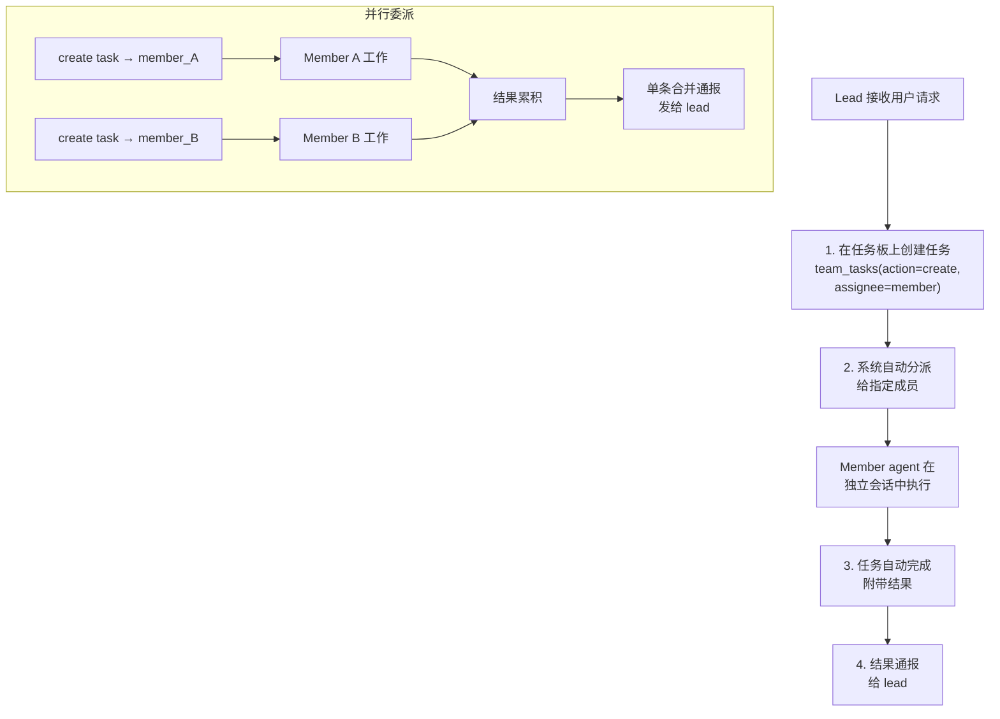

> 翻译自 [English version](/teams-delegation)

# 委派与交接（Delegation & Handoff）

委派（Delegation）允许 lead 通过任务板向成员 agent 分配工作。交接（Handoff）在不中断用户会话的情况下，将对话控制权转移给另一个 agent。

## Agent 委派流程

委派通过 `team_tasks` 工具进行——lead 创建带有 assignee 的任务，系统自动将其分派给指定成员：



> **注意**：`spawn` 工具**仅用于自克隆子 agent**——它不接受 `agent` 参数。委派给团队成员时，始终使用 `team_tasks(action="create", assignee=...)`。

## 创建委派任务

使用 `team_tasks` 工具，`action: "create"`，并填写必填的 `assignee`：

```json
{
  "action": "create",
  "subject": "Analyze the market trends in the Q1 report",
  "description": "Focus on Q1 revenue data and competitor analysis",
  "assignee": "analyst_agent"
}
```

系统验证并自动分派：
- **`assignee` 必填** — 每个任务必须分配给一个团队成员
- **Assignee 必须是团队成员** — 非成员会被拒绝
- **Lead 不能自我分配** — 防止双会话执行循环
- **自动分派**：lead 的回合结束后，待处理任务自动分派给其指定的 agent

**已执行的保护措施**：
- 每个任务最多 **3 次分派** — 超过 3 次自动失败，防止无限循环
- 分派给 lead agent 的任务被阻塞并自动失败
- 成员请求（非 lead）可选择在分派前要求 lead 审批

## 并行委派

在同一个回合中创建多个任务——它们在回合结束后同时分派：

```json
// Lead 在一个回合中创建 2 个任务
{"action": "create", "subject": "Extract facts", "assignee": "analyst1"}
{"action": "create", "subject": "Extract opinions", "assignee": "analyst2"}
```

所有任务完成后，结果一起收集并通报。

## 自动完成与产出物

委派完成时：

1. 关联任务标记为 `completed`，附带委派结果
2. 结果摘要持久化
3. 媒体文件（图片、文档）转发
4. 委派产出物与团队 context 关联存储
5. 会话清理

**通报内容包括**：
- 每个 member agent 的结果
- 可交付成果和媒体文件
- 耗时统计
- 引导：向用户呈现结果、委派后续任务或请求修改

## 委派搜索

当 agent 的委派目标过多，超出静态 `AGENTS.md` 的范围（>15 个），使用委派搜索：

```json
{
  "query": "data analysis and visualization",
  "max_results": 5
}
```

使用 `delegate_search` 工具并传入上述参数。

**搜索范围**：
- Agent 名称和 key（全文搜索）
- Agent 描述（全文搜索）
- 语义相似度（若有 embedding provider）

**结果**：
```json
{
  "agents": [
    {
      "agent_key": "analyst_agent",
      "display_name": "Data Analyst",
      "frontmatter": "Analyzes data and creates visualizations"
    }
  ],
  "count": 1
}
```

**混合搜索**：结合关键词匹配（FTS）和语义 embedding 以获得最佳结果。

## 访问控制：Agent Link

每个委派链接（lead → member）可有独立的访问控制：

```json
{
  "user_allow": ["user_123", "user_456"],
  "user_deny": []
}
```

**并发限制**：
- 每链接：通过 agent link 上的 `max_concurrent` 配置
- 每 agent：默认最多 5 个并发委派指向任意单个成员（通过 agent 的 `max_delegation_load` 配置）

达到限制时，错误消息：`"Agent at capacity. Try a different agent or handle it yourself."`

## Handoff：对话转移

将对话控制权转移给另一个 agent，不中断用户体验：

```json
{
  "action": "transfer",
  "agent": "specialist_agent",
  "reason": "You need specialist expertise for the next part of your request",
  "transfer_context": true
}
```

使用 `handoff` 工具并传入上述参数。

### 发生的事情

1. 设置路由覆盖：用户的后续消息转到目标 agent
2. 对话 context（摘要）传递给目标 agent
3. 目标 agent 收到带 context 的 handoff 通知
4. 向 UI 广播事件
5. 用户的下一条消息路由到新 agent
6. 可交付的 workspace 文件复制到目标 agent 的团队 workspace

### Handoff 参数

- `action`：`transfer`（默认）或 `clear`
- `agent`：目标 agent key（`transfer` 必填）
- `reason`：交接原因（`transfer` 必填）
- `transfer_context`：传递对话摘要（默认 true）

### 清除 Handoff

```json
{
  "action": "clear"
}
```

消息将路由到该对话的默认 agent。

### Handoff 通知

发送给目标 agent 的 handoff 通知：
```
[Handoff from researcher_agent]
Reason: You need specialist expertise for the next part of your request

Conversation context:
[recent conversation summary]

Please greet the user and continue the conversation.
```

### 使用场景

- 用户的问题变得专业化 → 交接给专家
- Agent 达到容量上限 → 交接给另一个实例
- 复杂问题需要多种专业能力 → 部分解决后交接
- 从研究转向实现 → 交接给工程师

## 评估循环（Generator-Evaluator 模式）

对于迭代工作，使用带任务创建的评估模式：

```json
{"action": "create", "subject": "Generate initial proposal", "assignee": "generator_agent"}

// 等待结果，然后：

{"action": "create", "subject": "Review proposal and provide feedback", "assignee": "evaluator_agent"}

// Generator 根据反馈进行优化...
```

**注意**：系统不对此模式强制设置最大迭代次数。在 lead 的指令中设置自己的限制，避免无限循环。

## 进度通知

对于异步委派，若团队启用了进度通知，lead 会定期收到分组更新：

```
🏗 Your team is working on it...
- Data Analyst (analyst_agent): 2m15s
- Report Writer (writer_agent): 45s
```

**间隔**：30 秒。通过团队设置启用/禁用（`progress_notifications`）。

## 最佳实践

1. **用 `team_tasks` 委派**：创建带 `assignee` 的任务——系统自动分派
2. **不要用 `spawn` 进行委派**：`spawn` 仅用于自克隆，不用于团队成员
3. **一个回合中创建多个任务**：它们在回合结束后并行分派
4. **使用 `blocked_by`**：通过依赖关系协调任务顺序
5. **关联依赖**：在任务板上使用 `blocked_by` 协调执行顺序
6. **优雅处理 handoff**：通知用户转移；传递 context
7. **在指令中设置迭代限制**：防止无限评估循环

<!-- goclaw-source: 0dab087f | 更新: 2026-03-27 -->
