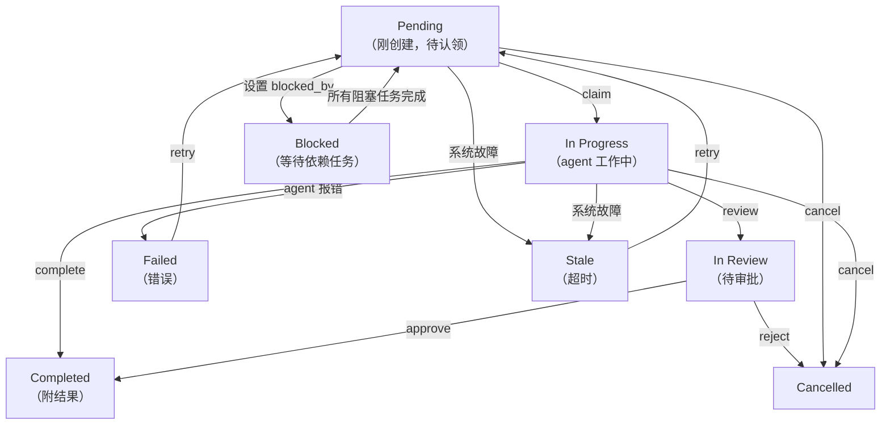
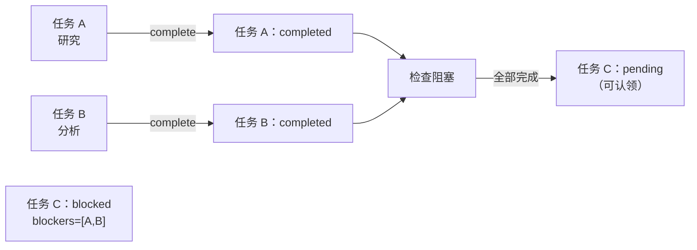

> 翻译自 [English version](/teams-task-board)

# 任务板

任务板是所有团队成员均可访问的共享工作跟踪器。任务可设置优先级、依赖关系和阻塞约束。成员认领待处理任务，独立工作，并标记完成并附上结果。

Dashboard 以 **Kanban 布局**渲染任务板，每个状态对应一列。任务板工具栏包含 workspace 按钮和 agent emoji 显示，便于快速识别每个任务的负责人。

## 任务生命周期



## 核心工具：`team_tasks`

所有团队成员通过 `team_tasks` 工具访问任务板。可用操作：

| 操作 | 必填参数 | 说明 |
|------|----------|------|
| `list` | `action` | 显示任务（默认：所有状态；每页 30 条） |
| `get` | `action`, `task_id` | 获取完整任务详情（含评论、事件、附件；结果限 8000 字符） |
| `create` | `action`, `subject`, `assignee` | 创建新任务（仅 lead）；`assignee` **必填**；可选：`description`、`priority`、`blocked_by`、`require_approval` |
| `claim` | `action`, `task_id` | 原子性认领待处理任务 |
| `complete` | `action`, `task_id`, `result` | 标记任务完成并附结果摘要 |
| `cancel` | `action`, `task_id` | 取消任务（仅 lead）；可选：`text`（原因） |
| `assign` | `action`, `task_id`, `assignee` | 管理员将待处理任务分配给 agent |
| `search` | `action`, `query` | 对 subject + description 进行全文搜索（创建前检查以避免重复） |
| `review` | `action`, `task_id` | 提交进行中任务进行审阅；转为 `in_review`（仅 owner） |
| `approve` | `action`, `task_id` | 审批 review 中的任务 → `completed`（仅 lead/admin） |
| `reject` | `action`, `task_id` | 拒绝 review 中的任务 → `cancelled`，原因注入给 lead（仅 lead/admin）；可选：`text` |
| `comment` | `action`, `task_id`, `text` | 添加评论；用 `type="blocker"` 标记阻塞（触发自动失败 + lead 升级） |
| `progress` | `action`, `task_id`, `percent` | 更新进度 0-100（仅 owner）；可选：`text`（步骤描述） |
| `update` | `action`, `task_id` | 更新任务 subject 或 description（仅 lead） |
| `attach` | `action`, `task_id`, `file_id` | 将 workspace 文件附加到任务 |
| `ask_user` | `action`, `task_id`, `text` | 设置定期发给用户的跟进提醒（仅 owner） |
| `clear_followup` | `action`, `task_id` | 清除 ask_user 提醒（owner 或 lead） |
| `retry` | `action`, `task_id` | 将 `stale` 或 `failed` 任务重新分派回 `pending`（admin/lead） |
| `delete` | `action`, `task_id` | 从任务板硬删除终态任务（completed/cancelled/failed） |

## 创建任务

**Lead 创建任务**供成员完成：

> **注意**：创建任务时 `assignee` 字段**必填**。缺省将返回错误：`"assignee is required — specify which team member should handle this task"`。

> **注意**：Agent 在 `create` 前必须调用 `search` 以避免重复创建。未先检查直接创建会返回错误，提示先搜索。

> **注意**：团队 V2 lead 在当前回合未发出 spawn 前不能手动创建任务——这可防止过早创建任务破坏结构化编排流程。

```json
{
  "action": "create",
  "subject": "从研究论文中提取关键点",
  "description": "阅读 PDF 并以要点形式总结主要发现",
  "priority": 10,
  "assignee": "researcher",
  "blocked_by": []
}
```

**响应**：
```
Task created: 从研究论文中提取关键点 (id=<uuid>, identifier=TSK-1, status=pending)
```

`identifier` 字段（如 `TSK-1`）是由团队名称前缀和任务序号生成的简短可读引用。

**带依赖**（blocked_by）：

```json
{
  "action": "create",
  "subject": "撰写摘要",
  "priority": 5,
  "assignee": "writer_agent",
  "blocked_by": ["<first-task-uuid>"]
}
```

此任务保持 `blocked` 状态，直到第一个任务 `completed`。完成阻塞任务后，此任务自动转换为 `pending` 并可被认领。

**需要审批**（require_approval）：

```json
{
  "action": "create",
  "subject": "部署到生产环境",
  "assignee": "devops_agent",
  "require_approval": true
}
```

任务以 `pending` 状态创建，带有 `require_approval` 标志。成员调用 `review` 后进入 `in_review`，必须审批后方可完成。

## 认领与完成任务

**Member 认领待处理任务**：

```json
{
  "action": "claim",
  "task_id": "550e8400-e29b-41d4-a716-446655440000"
}
```

**原子性认领**：数据库确保只有一个 agent 成功。若两个 agent 同时认领同一任务，一个得到 `claimed successfully`；另一个得到 `failed to claim task`（被人抢先了）。

**Member 完成任务**：

```json
{
  "action": "complete",
  "task_id": "550e8400-e29b-41d4-a716-446655440000",
  "result": "提取了 12 项关键发现：\n1. 主要假设得到确认\n2. 数据显示..."
}
```

**自动认领**：可跳过 claim 步骤。对待处理任务调用 `complete` 会自动先认领（一次 API 调用而非两次）。

> **注意**：委派 agent 不能直接调用 `complete`——其结果在委派完成时自动完成。

## 删除任务

终态任务（completed、cancelled、failed）可从任务板硬删除：

```json
{
  "action": "delete",
  "task_id": "550e8400-e29b-41d4-a716-446655440000"
}
```

删除仅在任务处于终态时允许。尝试删除活跃任务会返回错误。Dashboard 在任务详情页也提供删除按钮。成功时发出 `team.task.deleted` WebSocket 事件。

## 任务依赖与自动解除阻塞

创建带 `blocked_by: [task_A, task_B]` 的任务时：
- 任务状态设为 `blocked`
- 任务不可认领
- 当**所有**阻塞任务均 `completed` 后，任务自动转换为 `pending`
- 成员收到任务就绪通知



**blocked_by 验证**：系统验证 `blocked_by` 引用不会产生循环依赖，也不会引用处于终态（导致无法解除阻塞）的任务。

## Blocker 升级

成员遇到阻塞时，发布 blocker 评论：

```json
{
  "action": "comment",
  "task_id": "550e8400-...",
  "text": "找不到 API 文档",
  "type": "blocker"
}
```

自动触发：
1. 评论以 `comment_type='blocker'` 保存
2. 任务**自动失败**（`in_progress` → `failed`）
3. 成员会话取消；UI dashboard 实时更新
4. **Lead 收到来自 `system:escalation` 的升级消息**，包含被阻塞成员名称、任务编号、阻塞原因和 `retry` 指令

Lead 修复问题后可重新分派：

```json
{
  "action": "retry",
  "task_id": "550e8400-..."
}
```

Blocker 升级默认启用。通过设置关闭：`{"blocker_escalation": {"enabled": false}}`。

## 审阅工作流

对于需要人工审批的任务，创建时设置 `require_approval: true`：

1. **成员提交审阅**：`action="review"` → 任务转为 `in_review`
2. **人工审批**（dashboard）：`action="approve"` → 任务转为 `completed`
3. **人工拒绝**（dashboard）：`action="reject"` → 任务转为 `cancelled`；lead 收到带原因的通知

无 `require_approval` 时，任务在调用 `complete` 后直接转为 `completed`（无 in_review 阶段）。

**筛选**：Dashboard 支持按所有任务状态筛选，包括 `in_review`、`cancelled` 和 `failed`。默认状态筛选显示**所有**任务（每页 30 条）。

## 任务快照

已完成任务自动在 `metadata` 字段中存储快照，用于任务板可视化：

```json
{
  "snapshot": {
    "completed_at": "2026-03-16T12:34:56Z",
    "result_preview": "结果的前 100 个字符...",
    "final_status": "completed",
    "ai_summary": "AI 生成的简短完成摘要"
  }
}
```

Kanban 任务板以卡片形式显示这些快照，让用户无需打开完整任务详情即可回顾已完成的工作。

## 列表与搜索

**列出任务**（默认显示所有状态，每页 30 条）：

```json
{
  "action": "list"
}
```

**按状态筛选**：

```json
{
  "action": "list",
  "status": "in_review"
}
```

有效的 `status` 筛选值：

| 值 | 返回内容 |
|----|---------|
| `""` 或 `"all"`（默认） | 所有状态的任务 |
| `"active"` | 活跃任务：pending、in_progress、blocked |
| `"completed"` | 已完成和已取消的任务 |
| `"in_review"` | 待审批的任务 |

**搜索**特定任务：

```json
{
  "action": "search",
  "query": "研究论文"
}
```

结果显示完整结果的片段（最多 500 字符）。使用 `action=get` 查看完整结果。

## 优先级与排序

任务按优先级（最高优先）排序，然后按创建时间排序。优先级越高 = 排在列表越靠前：

```json
{
  "action": "create",
  "subject": "紧急修复",
  "assignee": "fixer_agent",
  "priority": 100
}
```

## 用户范围

不同 channel 的访问权限不同：

- **委派/系统 channel**：查看团队所有任务
- **终端用户**：只能查看自己触发的任务（按用户 ID 筛选）

结果截断：
- `action=list`：结果不显示（使用 `get` 获取完整内容）
- `action=get`：最多 8000 字符
- `action=search`：500 字符片段

## 获取完整任务详情

```json
{
  "action": "get",
  "task_id": "550e8400-e29b-41d4-a716-446655440000"
}
```

**响应**包含：
- 完整任务元数据（含 `identifier`、`task_number`、`progress_percent`、快照）
- 完整结果文本（超过 8000 字符时截断）
- 负责 agent 的 key 和带 emoji 的 display name
- 时间戳
- 评论、审计事件和附件（如有）

## 取消任务

**Lead 取消任务**：

```json
{
  "action": "cancel",
  "task_id": "550e8400-e29b-41d4-a716-446655440000",
  "text": "用户需求已变更，不再需要"
}
```

注意：取消原因通过 `text` 参数传递（不是 `reason`）。

**发生的事情**：
- 任务状态 → `cancelled`
- 若该任务正在运行委派，立即停止
- 依赖该任务的后续任务（通过 `blocked_by` 指向此任务）自动解除阻塞

## 改进的任务分派并发

任务分派使用回合后队列以避免竞争条件：lead 在一个回合中创建的任务被入队，在回合结束后统一分派。这意味着：

- 通过 `blocked_by` 设置的依赖关系在任何分派触发前已完全解析
- 每个 assignee 每轮只分派一个任务（按优先级排序）以防止取消冲突
- 已完成阻塞任务的结果自动追加到解除阻塞任务的分派内容中

## 最佳实践

1. **先创建任务**：委派工作前始终先创建任务（仅 lead）
2. **始终设置 assignee**：`assignee` 字段必填——创建时指定团队成员
3. **创建前先搜索**：使用 `action=search` 检查类似任务，避免重复创建
4. **使用优先级**：根据紧急程度设置优先级（100 = 紧急，10 = 高，0 = 普通）
5. **添加依赖**：用 `blocked_by` 关联相关任务以确保执行顺序
6. **提供 context**：写清晰的描述，让成员知道需要做什么
7. **使用 blocker 评论**：遇到阻塞时，发布 `type="blocker"` 评论——lead 会自动收到通知
8. **清理已完成任务**：对终态任务使用 `action=delete` 保持任务板整洁

<!-- goclaw-source: 050aafc9 | updated: 2026-04-09 -->
