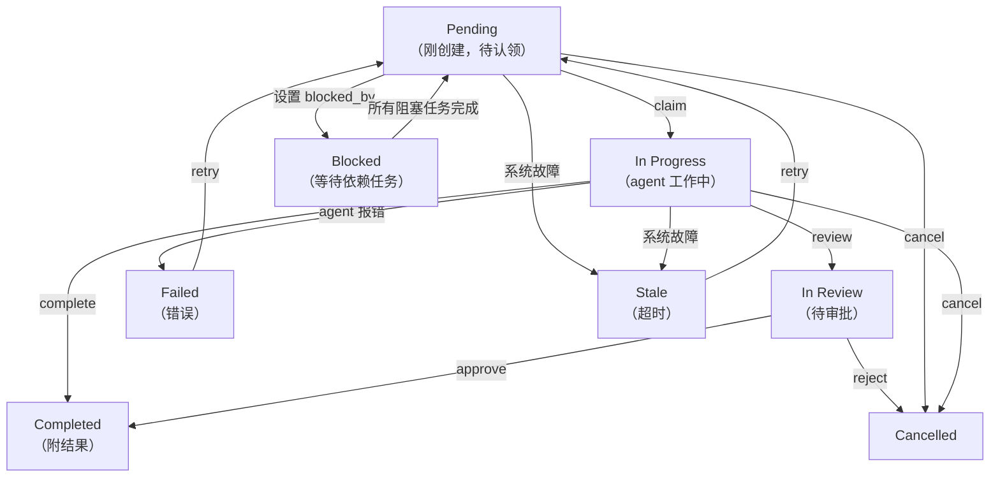
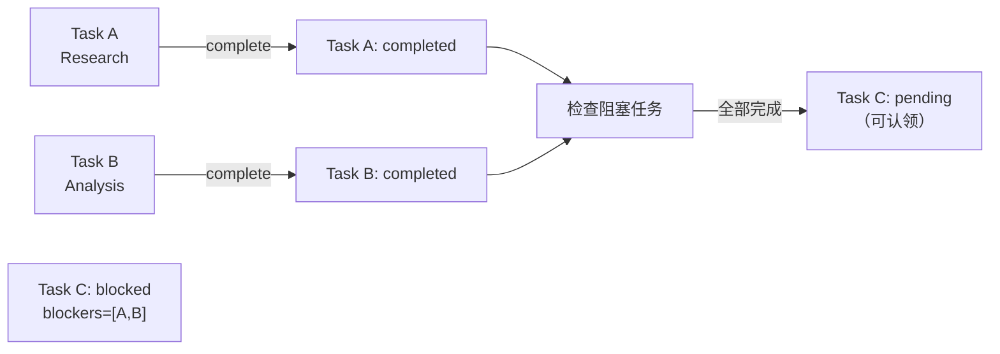

> 翻译自 [English version](/teams-task-board)

# 任务板

任务板是所有团队成员均可访问的共享工作跟踪器。任务可设置优先级、依赖关系和阻塞约束。成员认领待处理任务，独立工作，并标记完成并附上结果。

## 任务生命周期



## 核心工具：`team_tasks`

所有团队成员通过 `team_tasks` 工具访问任务板。可用操作：

| 操作 | 必填参数 | 说明 |
|------|---------|------|
| `list` | `action` | 显示活跃任务（分页：每页 30 条） |
| `get` | `action`, `task_id` | 获取任务完整详情，含评论、事件、附件（result 上限 8,000 字符） |
| `create` | `action`, `subject`, `assignee` | 创建新任务（仅 lead）；`assignee` **必填**；可选：`description`、`priority`、`blocked_by`、`require_approval` |
| `claim` | `action`, `task_id` | 原子性认领一个待处理任务 |
| `complete` | `action`, `task_id`, `result` | 标记任务完成并附结果摘要 |
| `cancel` | `action`, `task_id` | 取消任务（仅 lead）；可选：`text`（原因） |
| `assign` | `action`, `task_id`, `assignee` | 管理员将待处理任务指定给某 agent |
| `search` | `action`, `query` | 对主题 + 描述进行全文搜索（创建前检查以避免重复） |
| `review` | `action`, `task_id` | 将进行中的任务提交审核；转为 `in_review`（仅所有者） |
| `approve` | `action`, `task_id` | 批准审核中的任务 → `completed`（仅 lead/admin） |
| `reject` | `action`, `task_id` | 拒绝审核中的任务 → `cancelled`，原因注入给 lead（仅 lead/admin）；可选：`text` |
| `comment` | `action`, `task_id`, `text` | 添加评论；用 `type="blocker"` 标记阻塞（触发自动失败 + lead 升级） |
| `progress` | `action`, `task_id`, `percent` | 更新进度 0-100（仅所有者）；可选：`text`（步骤描述） |
| `update` | `action`, `task_id` | 更新任务主题或描述（仅 lead） |
| `attach` | `action`, `task_id`, `file_id` | 将 workspace 文件附加到任务 |
| `ask_user` | `action`, `task_id`, `text` | 设置发送给用户的定期跟进提醒（仅所有者） |
| `clear_followup` | `action`, `task_id` | 清除 ask_user 提醒（所有者或 lead） |
| `retry` | `action`, `task_id` | 将 `stale` 或 `failed` 任务重新分派为 `pending`（admin/lead） |

## 创建任务

**Lead 为成员创建任务**：

> **注意**：`assignee` 字段在创建任务时**必填**。省略会返回错误：`"assignee is required — specify which team member should handle this task"`。

> **注意**：Agent 必须在 `create` 前调用 `search` 检查重复任务。未检查直接创建会返回提示搜索的错误。

```json
{
  "action": "create",
  "subject": "Extract key points from research paper",
  "description": "Read the PDF and summarize main findings in bullet points",
  "priority": 10,
  "assignee": "researcher",
  "blocked_by": []
}
```

**响应**：
```
Task created: Extract key points from research paper (id=<uuid>, identifier=TSK-1, status=pending)
```

`identifier` 字段（如 `TSK-1`）是由团队名称前缀和任务编号生成的简短人类可读引用。

**带依赖关系**（blocked_by）：

```json
{
  "action": "create",
  "subject": "Write summary",
  "priority": 5,
  "blocked_by": ["<first-task-uuid>"]
}
```

此任务保持 `blocked` 状态，直到第一个任务 `completed`。阻塞任务完成后，此任务自动转为 `pending` 并可被认领。

**需要审批**（require_approval）：

```json
{
  "action": "create",
  "subject": "Deploy to production",
  "require_approval": true
}
```

任务以 `in_review` 状态开始，必须获批后才变为 `pending`。

## 认领与完成任务

**Member 认领待处理任务**：

```json
{
  "action": "claim",
  "task_id": "550e8400-e29b-41d4-a716-446655440000"
}
```

**原子性认领**：数据库确保只有一个 agent 成功。若两个 agent 同时认领同一任务，一个收到 `claimed successfully`；另一个收到 `failed to claim task`（被人抢先了）。

**Member 完成任务**：

```json
{
  "action": "complete",
  "task_id": "550e8400-e29b-41d4-a716-446655440000",
  "result": "Extracted 12 key findings:\n1. Main hypothesis confirmed\n2. Data suggests..."
}
```

**自动认领**：可跳过 claim 步骤。对待处理任务调用 `complete` 会自动认领（一次 API 调用代替两次）。

> **注意**：委派 agent 不能直接调用 `complete`——委派完成时结果会自动提交。

## 任务依赖与自动解除阻塞

当你创建任务时设置 `blocked_by: [task_A, task_B]`：
- 任务状态设为 `blocked`
- 任务不可认领
- 当**所有**阻塞任务 `completed` 后，任务自动转为 `pending`
- 成员收到任务就绪通知



## 阻塞升级

成员遇到阻塞时，发布 blocker 评论：

```json
{
  "action": "comment",
  "task_id": "550e8400-...",
  "text": "Cannot find API documentation",
  "type": "blocker"
}
```

自动发生的事情：
1. 评论以 `comment_type='blocker'` 保存
2. 任务**自动失败**（`in_progress` → `failed`）
3. 成员会话取消；Dashboard UI 实时更新
4. **Lead 收到来自 `system:escalation` 的升级消息**，包含被阻塞的成员名称、任务编号、阻塞原因和 `retry` 指令

Lead 可以修复问题后重新分派：

```json
{
  "action": "retry",
  "task_id": "550e8400-..."
}
```

阻塞升级默认启用。通过团队设置禁用：`{"blocker_escalation": {"enabled": false}}`。

## 审核工作流

对需要人工审批的任务，创建时设置 `require_approval: true`：

1. **Member 提交**：`action="review"` → 任务转为 `in_review`
2. **人工批准**（dashboard）：`action="approve"` → 任务转为 `completed`
3. **人工拒绝**（dashboard）：`action="reject"` → 任务转为 `cancelled`；lead 收到通知

不设置 `require_approval` 时，任务在 `complete` 后直接转为 `completed`（无 in_review 阶段）。

## 列表与搜索

**列出活跃任务**（默认）：

```json
{
  "action": "list"
}
```

**响应**：
```json
{
  "tasks": [
    {
      "id": "550e8400-e29b-41d4-a716-446655440000",
      "subject": "Extract key points",
      "description": "Read PDF and summarize...",
      "status": "pending",
      "priority": 10,
      "owner_agent_id": null,
      "created_at": "2025-03-08T10:00:00Z"
    }
  ],
  "count": 1
}
```

**按状态筛选**：

```json
{
  "action": "list",
  "status": "all"
}
```

有效的 `status` 筛选值：

| 值 | 返回 |
|----|------|
| `""`（默认） | 活跃任务：pending、in_progress、blocked |
| `"completed"` | 已完成和已取消的任务 |
| `"in_review"` | 待审批的任务 |
| `"all"` | 所有任务，不限状态 |

**搜索**特定任务：

```json
{
  "action": "search",
  "query": "research paper"
}
```

结果显示完整结果的片段（最多 500 字符）。使用 `action=get` 获取完整结果。

## 优先级与排序

任务按优先级（最高优先）排序，优先级相同时按创建时间排序。优先级越高 = 排在列表越前：

```json
{
  "action": "create",
  "subject": "Urgent fix needed",
  "priority": 100
}
```

## 用户范围

访问权限因 channel 而异：

- **委派/系统 channel**：可查看所有团队任务
- **终端用户**：只能查看自己触发的任务（按用户 ID 筛选）

结果会被截断：
- `action=list`：不显示结果（用 `get` 获取完整内容）
- `action=get`：最多 8,000 字符
- `action=search`：500 字符片段

## 获取完整任务详情

```json
{
  "action": "get",
  "task_id": "550e8400-e29b-41d4-a716-446655440000"
}
```

**响应**包含：
- 完整任务元数据（含 `identifier`、`task_number`、`progress_percent`）
- 完整结果文本（超过 8,000 字符时截断）
- 所有者 agent key
- 时间戳
- 评论、审计事件和附件（若有）

## 取消任务

**Lead 取消任务**：

```json
{
  "action": "cancel",
  "task_id": "550e8400-e29b-41d4-a716-446655440000",
  "text": "User request changed, no longer needed"
}
```

注意：取消原因通过 `text` 参数传入（不是 `reason`）。

**发生的事情**：
- 任务状态 → `cancelled`
- 若该任务正在运行委派，立即停止
- 依赖此任务的任务（`blocked_by` 指向此任务）自动解除阻塞

## 最佳实践

1. **先创建任务**：委派工作前始终先创建任务（仅 lead）
2. **始终设置 assignee**：`assignee` 字段必填——创建时指定团队成员
3. **创建前先搜索**：使用 `action=search` 检查类似任务，避免重复
4. **使用优先级**：根据紧急程度设置优先级（100 = 紧急，10 = 高，0 = 普通）
5. **添加依赖关系**：用 `blocked_by` 关联相关任务以强制执行顺序
6. **包含 context**：写清晰的描述，让成员明白要做什么
7. **使用 blocker 评论**：遇到阻塞时发布 `type="blocker"` 评论——lead 会自动收到通知

<!-- goclaw-source: 57754a5 | 更新: 2026-03-23 -->
