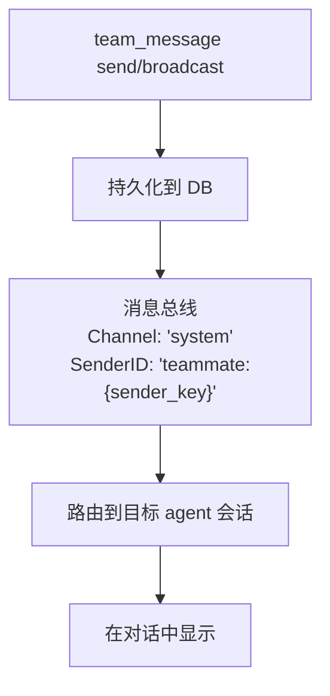

> 翻译自 [English version](/teams-messaging)

# 团队消息

团队成员通过内置 mailbox 系统进行通信。成员可发送直接消息和读取未读消息。根据策略，lead agent 没有 `team_message` 工具的访问权限——该工具已从 lead 的工具列表中移除。消息通过消息总线实时投递。

## Mailbox 工具：`team_message`

所有团队成员通过 `team_message` 工具访问 mailbox。可用操作：

| 操作 | 参数 | 说明 |
|------|------|------|
| `send` | `to`, `text`, `media`（可选） | 向特定队友发送直接消息 |
| `broadcast` | `text` | 向所有队友（除自己）发送消息；仅限 system/teammate channel |
| `read` | 无 | 获取未读消息；自动标记为已读 |

## 发送直接消息

**Member 向另一个 member 发送消息**：

```json
{
  "action": "send",
  "to": "analyst_agent",
  "text": "请审阅我在任务 123 中的发现。我需要您对方法论的意见。"
}
```

**发生的事情**：
1. 消息持久化到数据库
2. 在团队任务板上自动创建一个"message"类型任务（在 Tasks 标签中可见）
3. 接收方通过消息总线实时收到通知（channel: `system`，sender: `teammate:{sender_key}`）
4. 向 UI 广播事件以实现实时更新

**响应**：
```
Message sent to analyst_agent.
```

**跨团队保护**：只能向同团队成员发送消息。尝试向团队外成员发消息会失败，错误为 `"agent is not a member of your team"`。

## 向所有成员广播

Broadcast 同时向所有团队成员发送消息。此操作仅限 system/teammate channel（内部操作）——普通成员 agent 不能直接调用 `broadcast`。

```json
{
  "action": "broadcast",
  "text": "重要更新：我们决定聚焦于前 5 项发现。请相应调整您的工作。"
}
```

**发生的事情**：
1. 消息以广播形式持久化（to_agent_id = NULL）
2. 消息类型：`broadcast`
3. 每个团队成员（除发送者）收到消息
4. 向 UI 广播事件，供所有人查看

**响应**：
```
Broadcast sent to all teammates.
```

## 读取未读消息

**检查 mailbox**：

```json
{
  "action": "read"
}
```

**响应**：
```json
{
  "messages": [
    {
      "id": "550e8400-e29b-41d4-a716-446655440000",
      "team_id": "...",
      "from_agent_id": "...",
      "from_agent_key": "researcher_agent",
      "to_agent_key": "analyst_agent",
      "message_type": "chat",
      "content": "请审阅我的发现...",
      "read": false,
      "created_at": "2025-03-08T10:30:00Z"
    }
  ],
  "count": 1
}
```

**自动标记**：读取消息后自动标记为已读。下次调用 `read` 只会显示新的未读消息。

**分页**：每次调用最多返回 50 条未读消息。若还有更多，响应包含 `"has_more": true`，提示处理完后再次调用 `read`。

## 消息路由

消息通过系统的特殊路由流转：



**投递时的消息格式**：
```
[Team message from researcher_agent]: 请审阅我的发现...
```

sender ID 中的 `teammate:` 前缀告知消费者将消息路由到正确的团队成员会话，而非通用用户会话。

## Domain Event Bus

除 mailbox 消息外，GoClaw 还使用类型化的 **Domain Event Bus**（`eventbus.DomainEventBus`）在 v3 pipeline 内部传播事件。这与用于路由的 channel 消息总线相互独立。

Domain event bus 定义于 `internal/eventbus/domain_event_bus.go`：

```go
type DomainEventBus interface {
    Publish(event DomainEvent)                                    // 非阻塞入队
    Subscribe(eventType EventType, handler DomainEventHandler) func() // 返回取消订阅函数
    Start(ctx context.Context)
    Drain(timeout time.Duration) error
}
```

**关键特性**：
- 异步 worker 池（默认 2 个 worker，队列深度 1000）
- 基于 `SourceID` 的去重窗口（默认 5 分钟）——防止重复处理
- 可配置重试（默认 3 次，指数退避）
- 关闭时优雅 drain

**事件类型目录**（定义于 `eventbus/event_types.go`）：

| 事件类型 | 触发时机 |
|---------|---------|
| `session.completed` | 会话结束或 context 被压缩 |
| `episodic.created` | 情节记忆摘要已存储 |
| `entity.upserted` | 知识图谱实体已更新 |
| `run.completed` | Agent pipeline 运行完成 |
| `tool.executed` | 工具调用完成（用于指标采集） |
| `vault.doc_upserted` | Vault 文档已注册或更新 |
| `delegate.sent` | 委派已分派给成员 |
| `delegate.completed` | 被委派方成功完成 |
| `delegate.failed` | 委派失败 |

这些事件驱动 v3 enrichment pipeline（情节记忆、知识图谱、vault 索引），与 UI 使用的 WebSocket 团队事件相互独立。

## WebSocket 团队事件

为实现 UI 实时更新，团队活动通过 `msgBus.Broadcast` 发出 WebSocket 事件。这些事件与 domain event bus 相互独立，针对已连接的 dashboard 客户端。

消息发送时，向 UI 广播实时事件：

```json
{
  "event": "team.message.sent",
  "payload": {
    "team_id": "550e8400-e29b-41d4-a716-446655440000",
    "from_agent_key": "researcher_agent",
    "from_display_name": "Research Expert",
    "to_agent_key": "analyst_agent",
    "to_display_name": "Data Analyst",
    "message_type": "chat",
    "preview": "请审阅我的发现...",
    "user_id": "...",
    "channel": "telegram",
    "chat_id": "..."
  }
}
```

### 任务生命周期事件 API

任务生命周期事件（创建、分配、完成、审批、拒绝、评论、失败等）也可通过 REST 端点获取：

```
GET /v1/teams/{id}/events
```

该端点返回团队所有任务状态变更的分页审计日志，适用于合规审查或构建自定义 dashboard。

## 使用场景

**Member → Member**："任务 123 已准备好供您审阅。数据显示..."

**Member → Member**："我在第 2 步被阻塞——您有我需要的原始数据集吗？"

**Broadcast**（仅系统级）："调整优先级。专注于任务 1、2、5，而非 3、4。"

> **注意**：Lead 通过 `team_tasks` 协调，而非 `team_message`。使用 `team_tasks(action="progress")` 报告状态更新，而非直接发消息。

## Loop Kill 时自动失败

若成员 agent 的运行被循环检测器终止（卡死或无限循环），任务自动转换为 `failed`：

- 循环检测器识别卡死模式——相同参数和结果的相同工具调用重复出现，或没有进展的只读操作连续出现
- 触发 critical 级别时，运行被终止，团队任务管理器将任务标记为 `failed`
- Lead agent 收到通知，可重新分配或用更新的指令重试

这可防止无限循环阻塞团队进度——agent 可以安全地尝试探索性任务，而不必担心永久卡死。

## 团队通知设置

团队任务事件可转发到聊天 channel。默认配置较为保守——仅开启高信噪比事件，以减少噪音。

| 事件 | 默认 | 说明 |
|------|------|------|
| `dispatched` | 开启 | 任务分派给成员 |
| `new_task` | 开启 | 新任务创建（用户触发） |
| `completed` | 开启 | 任务完成 |
| `progress` | 关闭 | 成员更新进度 |
| `failed` | 关闭 | 任务失败 |
| `commented` | 关闭 | 任务添加评论 |
| `slow_tool` | 关闭 | 工具调用超过自适应阈值时的系统告警 |

默认投递模式为 `direct`（出站 channel）。设置 `mode: "leader"` 可将所有通知路由经由 lead agent。

在团队设置中配置通知：

```json
{
  "notifications": {
    "dispatched": true,
    "new_task": true,
    "completed": true,
    "progress": false,
    "failed": false,
    "commented": false,
    "slow_tool": false,
    "mode": "direct"
  }
}
```

## 最佳实践

1. **保持简洁**：消息聚焦且可操作
2. **用 broadcast 发送全团队信息**：不要向多个成员发送相同消息
3. **用直接消息进行讨论**：来回协调使用直接消息
4. **引用任务**：提及任务 ID 以建立 context（"任务 123 被...阻塞"）
5. **定期检查**：等待更新时，成员应检查 mailbox

## 消息持久化

所有消息持久化到数据库：
- 直接消息关联发送者 → 特定接收者
- 广播关联发送者 → NULL（即所有成员）
- 跟踪时间戳和已读状态
- 完整消息历史可用于审计/审阅

<!-- goclaw-source: 050aafc9 | updated: 2026-04-09 -->
