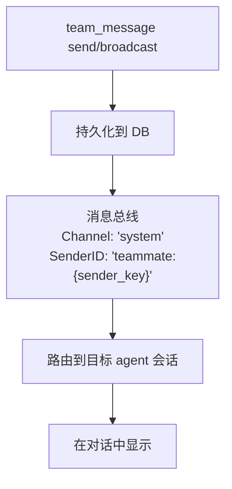

> 翻译自 [English version](/teams-messaging)

# 团队消息

团队成员通过内置 mailbox 系统进行通信。成员可发送直接消息和读取未读消息。根据策略，lead agent 没有 `team_message` 工具的访问权限——该工具已从 lead 的工具列表中移除。消息通过消息总线实时投递。

## Mailbox 工具：`team_message`

所有团队成员通过 `team_message` 工具访问 mailbox。可用操作：

| 操作 | 参数 | 说明 |
|------|------|------|
| `send` | `to`, `text`, `media`（可选） | 向特定队友发送直接消息 |
| `broadcast` | `text` | 向所有队友（除自己）发送消息；仅限 system/teammate channel |
| `read` | 无 | 获取未读消息；自动标记为已读 |

## 发送直接消息

**Member 向另一个 member 发送消息**：

```json
{
  "action": "send",
  "to": "analyst_agent",
  "text": "Please review my findings from task 123. I need your input on the methodology."
}
```

**发生的事情**：
1. 消息持久化到数据库
2. 在团队任务板上自动创建一个"message"任务（在 Tasks 标签页可见）
3. 通过消息总线实时通知接收者（channel：`system`，sender：`teammate:{sender_key}`）
4. 向 UI 广播事件以实时更新

**响应**：
```
Message sent to analyst_agent.
```

**跨团队保护**：只能向团队成员发消息。向团队外的人发消息会失败，返回 `"agent is not a member of your team"`。

## 广播给所有成员

广播将消息同时发送给所有团队成员。此操作仅限 system/teammate channel（内部操作）——普通 member agent 不能直接调用 `broadcast`。

```json
{
  "action": "broadcast",
  "text": "Important update: We've decided to focus on the top 5 findings. Please adjust your work accordingly."
}
```

**发生的事情**：
1. 消息以广播形式持久化（to_agent_id = NULL）
2. 消息类型：`broadcast`
3. 每个团队成员（除发送者外）收到消息
4. 向所有人广播 UI 事件

**响应**：
```
Broadcast sent to all teammates.
```

## 读取未读消息

**查看 mailbox**：

```json
{
  "action": "read"
}
```

**响应**：
```json
{
  "messages": [
    {
      "id": "550e8400-e29b-41d4-a716-446655440000",
      "team_id": "...",
      "from_agent_id": "...",
      "from_agent_key": "researcher_agent",
      "to_agent_key": "analyst_agent",
      "message_type": "chat",
      "content": "Please review my findings...",
      "read": false,
      "created_at": "2025-03-08T10:30:00Z"
    }
  ],
  "count": 1
}
```

**自动标记**：读取消息后自动标记为已读。下次调用 `read` 只会显示新的未读消息。

**分页**：每次调用最多返回 50 条未读消息。若有更多，响应会包含 `"has_more": true` 并提示处理完后再次调用 `read`。

## 消息路由

消息通过系统以特殊路由流转：



**投递时的消息格式**：
```
[Team message from researcher_agent]: Please review my findings...
```

sender ID 中的 `teammate:` 前缀告知消费者将消息路由到正确的团队成员会话，而非通用用户会话。

## 事件广播

发送消息时，实时事件广播到 UI：

```json
{
  "event": "team.message.sent",
  "payload": {
    "team_id": "550e8400-e29b-41d4-a716-446655440000",
    "from_agent_key": "researcher_agent",
    "from_display_name": "Research Expert",
    "to_agent_key": "analyst_agent",
    "to_display_name": "Data Analyst",
    "message_type": "chat",
    "preview": "Please review my findings...",
    "user_id": "...",
    "channel": "telegram",
    "chat_id": "..."
  }
}
```

## 使用场景

**Member → Member**："Task 123 is ready for your review. The data shows..."

**Member → Member**："I'm blocked on step 2 — do you have the raw dataset I need?"

**广播**（仅系统级）："Changing priorities. Focus on tasks 1, 2, 5 instead of 3, 4."

> **注意**：Lead 通过 `team_tasks` 协调工作，而非 `team_message`。使用 `team_tasks(action="progress")` 报告状态更新，而非直接发送消息。

## 循环终止时自动失败

### 循环终止时自动失败

如果成员 agent 的运行被循环检测器终止（死循环或卡住），任务自动转为 `failed`：

- 循环检测器识别卡住模式——相同的工具调用、相同的参数和结果重复出现，或只读操作序列没有进展
- 当触发临界级别时，运行被终止，团队任务管理器将任务标记为 `failed`
- Lead agent 收到通知，可以重新分配或使用更新的指令重试

这防止了无限循环阻塞团队进展——agent 可以安全地尝试探索性任务，不会永久卡住。

## 最佳实践

1. **保持简洁**：消息要聚焦且可操作
2. **广播用于全团队信息**：不要向多个成员发送相同的消息
3. **直接消息用于讨论**：来回协调使用直接消息
4. **引用任务**：提及任务 ID 提供 context（"Task 123 is blocked by..."）
5. **定期查看**：等待更新的成员应定期检查 mailbox

## 消息持久化

所有消息持久化到数据库：
- 直接消息关联发送者 → 特定接收者
- 广播关联发送者 → NULL（表示所有成员）
- 跟踪时间戳和已读状态
- 完整消息历史可供审计/回顾

<!-- goclaw-source: 941a965 | 更新: 2026-03-28 -->
