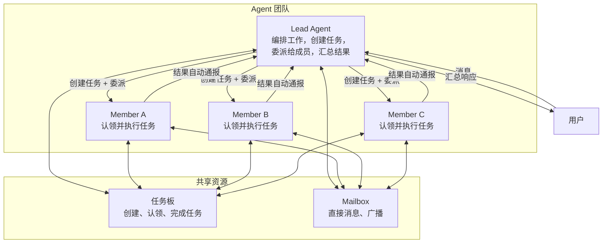

> 翻译自 [English version](/teams-what-are-teams)

# 什么是 Agent 团队？

Agent 团队让多个 agent 协作完成共享任务。**Lead** agent 负责编排工作，**member** agent 独立执行任务并将结果汇报回来。

## 团队模型

团队由以下部分组成：
- **Lead Agent**：编排工作，通过 `team_tasks` 创建和分配任务，委派给成员，汇总结果
- **Member Agent**：接收分派的任务，独立执行，完成后提交结果，可通过 mailbox 发送进度更新
- **共享任务板**：跟踪工作、依赖关系、优先级和状态
- **团队 Mailbox**：所有团队成员通过 `team_message` 进行直接通信



## 关键设计原则

**以 Lead 为中心的 TEAM.md**：只有 lead 收到包含完整编排指令的 `TEAM.md`——强制工作流、委派模式、跟进提醒。成员按需通过工具获取 context，空闲 agent 不浪费 token。

**强制任务跟踪**：lead 的每次委派必须关联任务板上的一个任务。系统强制执行——没有 `team_task_id` 的委派会被拒绝，并提供待处理任务列表供 lead 自我纠正。

**自动完成**：委派完成后，关联任务自动标记为完成。执行期间创建的文件自动关联到任务。无需手动记录。

**阻塞升级**：成员可以在任务上发布 blocker 评论标记自己被阻塞。这会自动使任务失败，并向 lead 发送升级消息，包含被阻塞的成员名称、任务主题、阻塞原因和重试指令。

**并行批处理**：当多个成员同时工作时，结果会被收集并以单条合并通报发送给 lead。

**成员范围**：成员没有 spawn 或委派权限。他们在团队结构内工作——执行任务、报告进度、通过 mailbox 通信。

## 团队 Workspace

每个团队有一个共享 workspace 用于存放任务执行期间生成的文件。Workspace 范围可配置：

| 模式 | 目录 | 使用场景 |
|------|------|----------|
| **Isolated**（默认） | `{dataDir}/teams/{teamID}/{chatID}/` | 每次对话独立隔离 |
| **Shared** | `{dataDir}/teams/{teamID}/` | 所有成员访问同一文件夹 |

通过团队设置中的 `workspace_scope: "shared"` 配置。任务执行期间写入的文件自动存储在 workspace 中并关联到当前任务。

## V3 编排变更

在 v3 中，团队采用**基于任务板的分派模型**，取代旧的 `spawn(agent=...)` 流程。

### 轮次后分派（BatchQueue）

Lead 轮次期间创建的任务会被排队（`PendingTeamDispatchFromCtx`），并在**轮次结束后**分派——而非内联分派。这确保 `blocked_by` 依赖关系在任何成员收到任务前已完全设置好。

```
Lead 轮次结束
  → BatchQueue 刷新待分派任务
  → 每个 assignee 通过 bus 收到入站消息
  → Member agent 在独立 session 中执行
```

### 领域事件总线

所有任务状态变更都在领域事件总线上 emit 类型化事件（`team_task.created`、`team_task.assigned`、`team_task.completed` 等）。Dashboard 通过 WebSocket 实时更新，无需轮询。

### 断路器

任务在 **3 次分派尝试**（`maxTaskDispatches`）后自动失败。这防止了成员 agent 反复失败或拒绝任务时的无限循环。分派次数记录在 `metadata.dispatch_count` 中。

### WaitAll 模式

Lead 可以并行创建多个任务，它们同时分派。当所有成员任务完成后，`DispatchUnblockedTasks` 自动分派等待中的依赖任务（按优先级排序）。Lead 仅在所有分支解决后才汇总结果。

> **Spawn 工具变更**：v3 中 `spawn(agent="member")` 不再有效。Lead 必须改用 `team_tasks(action="create", assignee="member")`。系统会拒绝直接 spawn-to-agent 调用并给出提示性错误。

## 真实场景示例

**场景**：用户请求 lead 分析一篇研究论文并撰写摘要。

1. Lead 接收请求
2. Lead 调用 `team_tasks(action="create", subject="Extract key points from paper", assignee="researcher")` — 系统将任务分派给 researcher，附带关联的 `team_task_id`
3. Researcher 接收任务，独立工作，调用 `team_tasks(action="complete", result="<findings>")` — 关联任务自动完成，lead 收到通知
4. Lead 调用 `team_tasks(action="create", subject="Write summary", assignee="writer", description="Use researcher findings: <findings>", blocked_by=["<researcher-task-id>"])`
5. Writer 的任务在 researcher 完成后自动解除阻塞，writer 完成并提交结果
6. Lead 汇总并向用户发送最终响应

## 团队 vs. 其他委派模型

| 方面 | Agent 团队 | 简单委派 | Agent Link |
|------|-----------|---------|-----------|
| **协调方式** | Lead 通过任务板编排 | 父级等待结果 | 点对点直连 |
| **任务跟踪** | 共享任务板、依赖关系、优先级 | 无跟踪 | 无跟踪 |
| **消息通信** | 所有成员使用 mailbox | 仅父级 | 仅父级 |
| **可扩展性** | 设计支持 3-10 名成员 | 简单父子结构 | 一对一链接 |
| **TEAM.md Context** | Lead 获得完整指令；成员获得执行引导 | 不适用 | 不适用 |
| **使用场景** | 并行研究、内容审核、分析 | 快速委派并等待 | 对话切换 |

**适合使用团队的情况**：
- 3+ 个 agent 需要协同工作
- 任务存在依赖关系或优先级
- 成员需要相互通信
- 结果需要并行批处理

**适合简单委派的情况**：
- 一个父级委派给一个子级
- 需要快速同步结果
- 不需要团队内通信

**适合 Agent Link 的情况**：
- 对话需要在 agent 之间转移
- 不需要任务板或编排

<!-- goclaw-source: 050aafc9 | 更新: 2026-04-09 -->
