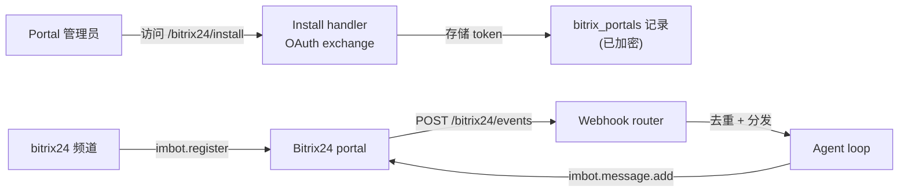

> 译自 [English version](/channel-bitrix24)

# Bitrix24 频道

通过 **imbot**（聊天机器人）API 集成 Bitrix24。GoClaw 在 Bitrix24 portal 上注册一个 bot，通过 webhook 接收聊天事件，并以该 bot 的身份回复。一个 GoClaw gateway 可以服务跨多个 portal 的多个 bot，多个 bot 也可以共用一个 portal（它们共享 OAuth token 和刷新循环）。

与基于 token 的频道（Telegram、Slack）不同，Bitrix24 使用 **OAuth portal 安装流程**：管理员在自己的 portal 上对 GoClaw 应用授权一次，GoClaw 存储并自动刷新 token，然后按需注册 bot。

## 工作原理



1. **创建 portal 记录**，填入应用的 `client_id` / `client_secret`（通过 CLI 或 dashboard）。
2. **管理员授权**，访问安装 URL — GoClaw 用 code 换取 token 并以加密形式持久化。
3. **配置频道实例**，指向该 portal 并为 bot 命名。
4. 启动时，频道调用 `imbot.register`（幂等），并将返回的 bot ID 接入 webhook router。
5. 入站聊天事件抵达 `/bitrix24/events`；GoClaw 去重、分发到 agent loop，并以 bot 身份回复。

## 设置

### 1. 创建 Bitrix24 应用

在你的 Bitrix24 portal 中，创建一个 **Local application** 或一个 **Marketplace (OAuth2) application**。你需要：

- `client_id`（应用 ID）
- `client_secret`（应用密钥）
- OAuth scope 包含 `imbot`（聊天机器人）和 `user`（以便 GoClaw 能解析发送者的显示名）

把应用的 handler / installer URL 设为你的 GoClaw 公网 URL：

- **Install / installer URL：** `https://<你的公网-url>/bitrix24/install`
- **Events：** 由 GoClaw 自动注册（`https://<你的公网-url>/bitrix24/events`）

> **必须有公网 URL。** Bitrix24 调用事件 handler 时需要绝对的、可从公网访问的 URL。GoClaw 会自动从安装回调中捕获公网 URL。如果你的 gateway 位于 tunnel 或会轮换的 ingress 之后，参见 [公网 URL 处理](#公网-url-处理)。

### 2. 创建 portal 记录

在管理员对应用授权之前，必须先存在一条 `bitrix_portals` 记录。通过 CLI 创建：

```bash
goclaw bitrix-portal create \
  --tenant-id <tenant-uuid> \
  --name acme \
  --domain acme.bitrix24.com \
  --client-id <你的-client-id> \
  --client-secret <你的-client-secret>
```

`--name`（例如 `acme`）是频道配置引用的 portal key。`--domain` 是裸主机名 — 不带 scheme，不带结尾斜杠。

> **支持自托管 portal。** 除了 Bitrix24 云域名（`*.bitrix24.{com,eu,vn,...}` 和 `*.bitrix.info`），`--domain` 还接受**自托管 Bitrix24 FQDN**，例如 `bx.mycompany.com`（允许可选的 `:port`）。自托管域名会经过一道 SSRF 安全校验：解析主机名并检查**每一个**返回的 IP，拒绝 loopback/私有/metadata IP 范围，屏蔽 `localhost` / `.local` / `.localhost` 名称，且任何端口必须在 1–65535 范围内。云域名跳过此检查（它们由 Bitrix 运营且受信任）。

> 运行此命令前请设置 `GOCLAW_ENCRYPTION_KEY`。凭据和 token 以 AES-256-GCM 加密存储；如果缺少该 key，它们将以明文存储（并附带警告）。

你也可以从 dashboard 创建 portal，它会直接返回安装 URL。

### 3. 授权 portal

引导 portal 管理员访问 create 命令打印的安装 URL：

```
https://<你的公网-url>/bitrix24/install?state=<tenant-uuid>:acme
```

管理员在 Bitrix24 内部对应用授权。GoClaw 用 code 换取 token、捕获公网 URL，并显示一个自动关闭的成功小页面。此时 portal 即处于 **installed** 状态。

两种安装流程均自动支持：

- **Marketplace (OAuth2)：** `code` 被换取为 token。
- **Local application：** Bitrix24 直接 POST token（`AUTH_ID` / `REFRESH_ID`）；没有 exchange 步骤。

### 4. 配置频道实例

创建一个 `bitrix24` 频道实例，其配置指向 portal 并为 bot 命名：

```json
{
  "portal": "acme",
  "bot_code": "support-bot",
  "bot_name": "GoClaw Assistant",
  "bot_type": "B",
  "dm_policy": "pairing",
  "group_policy": "open"
}
```

启动时，频道注册 bot（幂等 — 重启绝不会生成重复 bot）并开始接收事件。如果 portal 尚未安装，频道会报告 `failed` 健康状态，消息为 "Portal not installed — visit /bitrix24/install"。

## 配置

频道实例配置字段：

| Key | 类型 | 默认值 | 说明 |
|-----|------|---------|-------------|
| `portal` | string | 必填 | Portal 名称（匹配 `bitrix-portal create --name`） |
| `bot_code` | string | 必填 | 传给 `imbot.register` 的稳定 bot key。重启复用相同 code。 |
| `bot_name` | string | 必填 | bot 在 portal 上的显示名 |
| `bot_avatar` | string | -- | 图片 URL；启动时拉取并 base64 编码（仅 http/https，≤256 KB） |
| `bot_type` | string | `"B"` | `"B"` = 标准内部聊天机器人；`"O"` = Open Channel（面向客户）bot |
| `dm_policy` | string | `"pairing"` | `pairing`、`allowlist`、`open`、`disabled` |
| `group_policy` | string | `"open"` | `open`、`allowlist`、`disabled` |
| `allow_from` | list | -- | DM 发送者 allowlist |
| `group_allow_from` | list | -- | 群组发送者 allowlist |
| `require_mention` | bool | true | 群组聊天中要求 @mention |
| `text_chunk_limit` | int | 4000 | 每个出站分块的最大字符数 |
| `media_max_mb` | int | 20 | 媒体最大体积（MB） |
| `streaming` | bool | true | 流式回复 |
| `reaction_level` | string | `"minimal"` | `off`、`minimal`、`full` |
| `history_limit` | int | -- | 作为上下文保留的待处理群组消息数 |
| `block_reply` | bool | -- | 覆盖 gateway 的 `block_reply`（nil = 继承） |
| `chat_behavior` | object | -- | 覆盖此 channel 的 gateway [拟人化投递](/channels-overview#human-like-delivery)（nil = 继承） |
| `public_url` | string | -- | 按实例覆盖公网 URL（legacy；建议使用自动捕获的 portal URL） |
| `mcp_server_name` | string | -- | 用于按用户提供凭据的 MCP server 名称（参见 [MCP 集成](#mcp-集成)） |
| `mcp_base_url` | string | -- | MCP server 的 base URL；必须与 `mcp_server_name` 一同设置 |

### Bot 类型

| 类型 | 受众 | 备注 |
|------|----------|-------|
| `B` | 内部员工 | 始终看到 DM；仅在被 @mention 时看到群组消息。可与用户配对，并可接收按用户的 MCP 凭据。推荐：`dm_policy: pairing`、`group_policy: open`。 |
| `O` | 外部客户（Open Channel widget） | 注册后，管理员必须在 Bitrix24 UI 中将 bot 接入 Open Channel 队列。推荐：`dm_policy: open`。跳过按用户 MCP 提供（客户是临时的）。 |

> GoClaw 仅接受 `B` 或 `O`。未知类型在启动时被拒绝，以避免生成一个静默地收不到任何事件的 bot。

## 公网 URL 处理

`imbot.register` 的事件 handler 需要绝对 URL。GoClaw 按以下顺序解析公网 URL：

1. **自动捕获的 portal URL** — 从 Bitrix24 实际发出的 `/bitrix24/install` 请求中记录。这是首选来源，因为它已被证明可达。
2. **频道配置中的 `public_url`** — legacy 回退，仅当 (1) 为空时使用（例如 portal 安装在较旧的 GoClaw 版本上）。

如果你的公网 URL 改变了（tunnel 轮换、重新部署到新主机），重新运行安装流程以重新捕获，或回填：

```bash
goclaw bitrix-portal set-public-url \
  --tenant-id <tenant-uuid> \
  --name acme \
  --url https://goclaw.example.com
```

要在不重建 bot 的情况下把更改后的 URL 推回 Bitrix24 的事件 handler，用以下方式重启频道：

```bash
BITRIX24_FORCE_REREGISTER=1 goclaw gateway
```

这会绕过缓存的 bot 状态，并以当前 URL 和配置重新运行 `imbot.register`。

## 功能

### 联系人信息补全

Bitrix24 webhook 事件不携带发送者的显示名。首次见到某用户时，GoClaw 调用 `user.get` 解析一个友好名称（例如 `Name Last_Name`，回退到 login 或 email），并按频道缓存（命中 1 小时，失败 5 分钟）。这需要 `user` OAuth scope — 若缺失，名称保持为空，并有一条 debug 日志解释原因。补全是尽力而为的：失败绝不会阻塞消息处理。

### 入站去重

Bitrix24 在收到任何非 2xx 响应时会重试投递事件（可能在一阵中触发 3–5 次重试）。GoClaw 用一个有界 LRU 缓存按 `domain:event_type:message_id` 去重入站事件，因此重试的投递会返回 `{"duplicate":true}`（HTTP 200），绝不会触发第二次 agent 运行 — 这一点很重要，因为 Bitrix24 按 bot 计费，重复运行会使 token 用量翻倍。

### Token 刷新

OAuth access token（TTL 1 小时）在后台自动刷新，略早于到期，失败时采用指数退避。并发请求会合并，使同一时刻只有一次刷新运行。如果 refresh token 失效，portal 需要重新安装。

### 入站防抖

与其他频道一样，Bitrix24 遵循 gateway 级别的入站防抖窗口，将来自同一发送者的密集消息合并为一次 agent 运行。参见概览中的 [入站防抖](/channels-overview#inbound-debounce)。

## MCP 集成

Bitrix24 频道可以惰性地提供**按用户的 MCP 凭据**，使每个用户的 agent 工具以该用户身份在 Bitrix24 上操作。这是可选的、分阶段的 — 先安装频道，之后再叠加 MCP。

同时设置这两个字段以启用：

```json
{
  "portal": "acme",
  "bot_code": "support-bot",
  "bot_name": "GoClaw Assistant",
  "mcp_server_name": "bitrix-mcp",
  "mcp_base_url": "https://mcp.example.com"
}
```

工作原理：

1. 在用户首次发消息时，频道检查是否已存在 MCP 凭据。
2. 若缺失（或临近到期），它向 `{mcp_base_url}/api/auto-onboard` 发 POST，转发该用户的 Bitrix24 OAuth token。
3. MCP server 通过对 Bitrix24 `profile` 校验 access token 来认证该调用（无需共享 admin secret），然后返回一个按用户的 API key。
4. GoClaw 存储该 key；后续 agent 工具调用透明地使用它。

注意：

- `mcp_server_name` 与 `mcp_base_url` 必须一同设置，或两者都不设（半配置会在启动时失败）。具名的 MCP server 记录也必须存在。
- 提供凭据是**尽力而为**的：如果任一步骤失败，用户仍会收到回复（没有 MCP 工具），并会收到一次性提示，让其知道需要联系管理员。
- 对 Open Channel bot（`bot_type: "O"`）完全跳过 — 临时客户没有用户映射。

## 故障排查

| 问题 | 解决方案 |
|-------|----------|
| 频道 `failed`："Portal not installed" | 管理员必须先访问 `/bitrix24/install` 对应用授权。 |
| `imbot.register` 失败：public_url 未设置 | portal 没有捕获到公网 URL。重新运行 install，或执行 `goclaw bitrix-portal set-public-url`。 |
| bot 已注册但收不到聊天事件 | 安装未完成 — 在 `BX24.installFinish()` 运行前 Bitrix24 会抑制事件。通过 `/bitrix24/install` 重新安装，让成功页面发出完成信号。 |
| 联系人名称保持为空 | 缺少 OAuth scope `user`。添加该 scope 并重新安装；名称将在 5 分钟内出现。 |
| Open Channel bot 对客户静默 | `bot_type: "O"` 需要 `dm_policy: "open"`，且管理员必须在 Bitrix24 UI 中将 bot 接入 Open Channel 队列。 |
| 重新部署后事件 handler URL 过期 | 设置 `BITRIX24_FORCE_REREGISTER=1` 并重启，以把新 URL 推入 Bitrix24。 |
| 想查看原始事件 | 进程启动时设置 `BITRIX24_LOG_RAW_EVENT=1`（凭据会被脱敏）。生产环境请关闭 — 它会记录消息文本。 |
| 自托管域名被拒绝 | FQDN 必须解析到公网 IP。SSRF 校验会屏蔽 loopback/私有/metadata IP 范围以及 `localhost` / `.local` / `.localhost` 名称；端口必须在 1–65535 范围内。 |

## 下一步

- [概览](/channels-overview) — 频道概念、策略和入站防抖
- [Telegram](/channel-telegram) — Telegram bot 设置
- [Slack](/channel-slack) — Slack Socket Mode 集成
- [Browser Pairing](/channel-browser-pairing) — 配对流程

<!-- goclaw-source: fabe86b3 | 更新: 2026-06-28 -->
