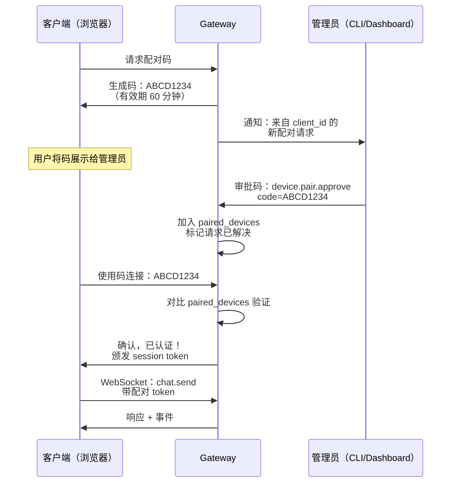

> 翻译自 [English version](/channel-browser-pairing)

# Browser Pairing

使用 8 位配对码为自定义 WebSocket 客户端提供安全认证流程。适用于需要验证设备身份的私有 Web 应用和桌面客户端。

## 配对流程



## 码的格式

**生成：**

- 长度：8 个字符
- 字母表：`ABCDEFGHJKLMNPQRSTUVWXYZ23456789`（排除歧义字符：0、O、1、I、L）
- 有效期：60 分钟
- 每个账号最多待处理：3 个

**示例码：**
- `ABCD1234`
- `XY8PQRST`
- `2M5H9JKL`

## 实现

### 步骤 1：请求码（客户端）

```bash
curl -X POST http://localhost:8080/v1/device/pair/request \
  -H "Content-Type: application/json" \
  -d '{
    "client_id": "browser_myclient_1",
    "device_name": "My Web App"
  }'
```

**响应：**

```json
{
  "code": "ABCD1234",
  "expires_at": 1709865000,
  "url": "http://localhost:8080/pair?code=ABCD1234"
}
```

向用户展示码：

```
请将此码分享给你的 gateway 管理员：

  ABCD1234

有效期 60 分钟。
```

### 步骤 2：审批码（管理员）

管理员运行 CLI 命令或使用 dashboard 审批：

```bash
goclaw device.pair.approve --code ABCD1234
```

或通过 WebSocket（仅限 admin）：

```json
{
  "type": "req",
  "id": "100",
  "method": "device.pair.approve",
  "params": {
    "code": "ABCD1234"
  }
}
```

**响应：**

```json
{
  "type": "res",
  "id": "100",
  "ok": true,
  "payload": {
    "client_id": "browser_myclient_1",
    "device_name": "My Web App",
    "paired_at": 1709864400
  }
}
```

### 步骤 3：连接（客户端）

客户端使用码进行认证：

```json
{
  "type": "req",
  "id": "1",
  "method": "connect",
  "params": {
    "pairing_code": "ABCD1234",
    "user_id": "web_user_1"
  }
}
```

**响应：**

```json
{
  "type": "res",
  "id": "1",
  "ok": true,
  "payload": {
    "protocol": 3,
    "role": "operator",
    "user_id": "web_user_1",
    "session_token": "session_xyz..."
  }
}
```

客户端存储 `session_token` 供后续连接使用。

### 步骤 4：使用 Session（客户端）

重连时使用存储的 token：

```json
{
  "type": "req",
  "id": "1",
  "method": "connect",
  "params": {
    "session_token": "session_xyz...",
    "user_id": "web_user_1"
  }
}
```

## 安全特性

- **一次性使用**：每个配对码只使用一次，之后失效
- **有效期**：码在 60 分钟后过期
- **限制待处理数**：每个账号最多 3 个待处理请求（防止滥用）
- **管理员审批**：只有 gateway 管理员可以审批码（需要 admin 角色）
- **Session token**：审批后颁发；与设备和用户绑定
- **防抖**：配对审批通知按发送者防抖（60 秒）

## JavaScript 示例

```javascript
class PairingClient {
  constructor(gatewayUrl) {
    this.url = gatewayUrl;
    this.ws = null;
    this.sessionToken = localStorage.getItem('goclaw_token');
  }

  async requestPairingCode() {
    const res = await fetch(`${this.url}/v1/device/pair/request`, {
      method: 'POST',
      headers: { 'Content-Type': 'application/json' },
      body: JSON.stringify({
        client_id: 'browser_' + Date.now(),
        device_name: navigator.userAgent
      })
    });
    const data = await res.json();
    return data.code;
  }

  connect() {
    this.ws = new WebSocket(this.url.replace('http', 'ws') + '/ws');
    this.ws.onopen = () => {
      if (this.sessionToken) {
        // 使用 token 恢复
        this.send('connect', {
          session_token: this.sessionToken,
          user_id: 'user_' + Date.now()
        });
      } else {
        console.log('No session token. Request pairing code first.');
      }
    };
    this.ws.onmessage = (e) => this.handleMessage(JSON.parse(e.data));
  }

  send(method, params) {
    this.ws.send(JSON.stringify({
      type: 'req',
      id: Date.now().toString(),
      method,
      params
    }));
  }

  handleMessage(frame) {
    if (frame.type === 'res' && frame.payload?.session_token) {
      localStorage.setItem('goclaw_token', frame.payload.session_token);
    }
    // 处理响应...
  }
}
```

## 故障排查

| 问题 | 解决方案 |
|-------|----------|
| "Code expired" | 码仅有效 60 分钟。请求新码。 |
| "Code not found" | 码从未存在或已使用。请求新码。 |
| "Max pending exceeded" | 待处理请求过多。等待或让管理员撤销旧码。 |
| "Unauthorized" | 管理员尚未审批该码。联系管理员确认。 |
| Session token 无效 | Token 可能已过期或被撤销。请求新配对码。 |

## 下一步

- [概览](/channels-overview) — Channel 概念和策略
- [WebSocket](/channel-websocket) — 直接 RPC 通信
- [Telegram](/channel-telegram) — Telegram 设置
- [WebSocket 协议](/websocket-protocol) — 完整协议参考

<!-- goclaw-source: 050aafc9 | 更新: 2026-04-09 -->
