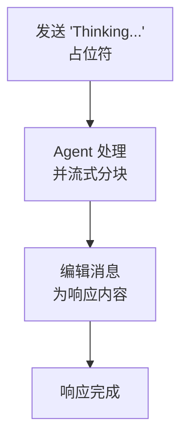

> 翻译自 [English version](/channel-discord)

# Discord Channel

通过 Discord Gateway API 集成 Discord bot。支持 DM、服务器、线程和通过消息编辑实现的流式响应。

## 设置

**创建 Discord 应用：**
1. 前往 https://discord.com/developers/applications
2. 点击"New Application"
3. 进入"Bot"标签 → "Add Bot"
4. 复制 token
5. 确保在"Privileged Gateway Intents"下启用了 `Message Content Intent`

**将 Bot 添加到服务器：**
1. OAuth2 → URL Generator
2. 选择 scopes：`bot`
3. 选择权限：`Send Messages`、`Read Message History`、`Read Messages/View Channels`
4. 复制生成的 URL 并在浏览器中打开

**启用 Discord：**

```json
{
  "channels": {
    "discord": {
      "enabled": true,
      "token": "YOUR_BOT_TOKEN",
      "dm_policy": "open",
      "group_policy": "open",
      "allow_from": ["alice_id", "bob_id"]
    }
  }
}
```

## 配置

所有配置项位于 `channels.discord`：

| 配置项 | 类型 | 默认值 | 说明 |
|-----|------|---------|-------------|
| `enabled` | bool | false | 启用/禁用 channel |
| `token` | string | 必填 | 来自 Discord 开发者门户的 bot token |
| `allow_from` | list | -- | 用户 ID 白名单 |
| `dm_policy` | string | `"open"` | `open`、`allowlist`、`pairing`、`disabled` |
| `group_policy` | string | `"open"` | `open`、`allowlist`、`disabled` |
| `require_mention` | bool | true | 服务器（channel）中是否需要 @bot 提及 |
| `history_limit` | int | 50 | 每个 channel 的待处理消息数（0=禁用） |
| `block_reply` | bool | -- | 覆盖 gateway block_reply（nil=继承） |

## 功能特性

### Gateway Intents

启动时自动请求 `GuildMessages`、`DirectMessages` 和 `MessageContent` intents。

### 消息长度限制

Discord 每条消息限制 2,000 字符。超出长度的响应会在换行处分割。

### 占位符编辑

Bot 立即发送"Thinking..."占位符，然后用实际响应编辑它。在 agent 处理期间提供视觉反馈。



### 提及过滤

在服务器（channel）中，bot 默认需要被提及才会响应（`require_mention: true`）。待处理消息存入历史缓冲区。当 bot 被提及时，历史记录作为上下文包含。

### Typing 指示器

Agent 处理期间显示 typing 指示器（9 秒保活）。

### 线程支持

Bot 自动检测并在 Discord 线程中响应。响应保持在同一线程中。

### 回复消息中的媒体

当用户回复包含媒体附件的消息时，GoClaw 提取这些附件并包含在入站消息上下文中。即使媒体在上一轮分享，agent 也能看到和处理。

### 群组媒体历史

群组会话中发送的媒体文件（图片、视频、音频）会在消息历史中追踪，允许 agent 引用之前分享的媒体。

### Bot 身份

启动时，bot 通过 `@me` 端点获取自己的用户 ID，以避免响应自己的消息。

### 群组文件 Writer 管理

Discord 支持基于斜杠命令管理群组文件 writer（类似 Telegram 的 writer 限制）。在服务器 channel 中，写入敏感操作可限制为指定 writer：

| 命令 | 说明 |
|---------|-------------|
| `/addwriter` | 添加群组文件 writer（回复目标用户） |
| `/removewriter` | 移除群组文件 writer |
| `/writers` | 列出当前群组文件 writer |

Writer 按群组管理。内部使用的群组 ID 格式为 `group:discord:{channelID}`。

## 常用模式

### 发送到 Channel

```go
manager.SendToChannel(ctx, "discord", "channel_id", "Hello!")
```

### 群组配置

Discord channel 实现暂不支持按 guild/channel 覆盖配置。使用全局 `allow_from` 和策略设置。

## 故障排查

| 问题 | 解决方案 |
|-------|----------|
| Bot 不响应 | 检查 bot 是否有必要权限。验证 `require_mention` 设置。确保 bot 可以读取消息（已启用 `Message Content Intent`）。 |
| "Unknown Application"错误 | Token 无效或已过期。重新生成 bot token。 |
| 占位符编辑失败 | 确保 bot 有 `Manage Messages` 权限。Discord 可能在设置期间撤销此权限。 |
| 消息分割不正确 | 长响应在换行处分割。通过模型 `max_tokens` 控制消息长度。 |
| Bot 提及自己 | 检查 Discord 权限。Bot 响应中不应包含 `@everyone` 或 `@here`。 |

## 下一步

- [概览](/channels-overview) — Channel 概念和策略
- [Telegram](/channel-telegram) — Telegram bot 设置
- [Larksuite](/channel-feishu) — Larksuite 流式卡片集成
- [Browser Pairing](/channel-browser-pairing) — 配对流程

<!-- goclaw-source: 120fc2d | 更新: 2026-03-18 -->
