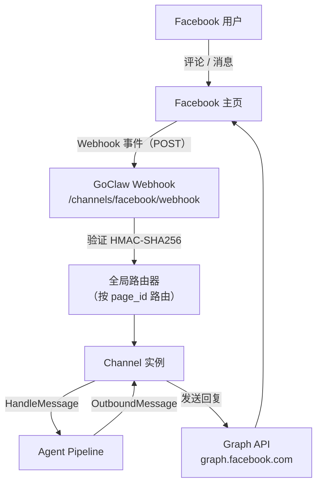

> 翻译自 [English version](/channel-facebook)

# Facebook Channel

Facebook 主页集成，支持 Messenger 收件箱自动回复、评论自动回复，以及通过 Facebook Graph API 发送首次私信。

## 设置

### 1. 创建 Facebook App

1. 前往 [developers.facebook.com](https://developers.facebook.com) 创建新应用
2. 选择 **Business** 类型
3. 添加 **Messenger** 和 **Webhooks** 产品
4. 在 **Messenger Settings** → **Access Tokens** 下为你的主页生成 Page Access Token
5. 复制 **App ID**、**App Secret** 和 **Page Access Token**
6. 记录 **Facebook Page ID**（在主页的"关于"部分或 URL 中可见）

### 2. 配置 Webhook

在 Facebook App Dashboard → **Webhooks** → **Page**：

1. 设置回调 URL：`https://your-goclaw-host/channels/facebook/webhook`
2. 设置 verify token（任意字符串——在 GoClaw 配置中用作 `verify_token`）
3. 订阅以下事件：`messages`、`messaging_postbacks`、`feed`

### 3. 启用 Facebook Channel

```json
{
  "channels": {
    "facebook": {
      "enabled": true,
      "instances": [
        {
          "name": "my-fanpage",
          "credentials": {
            "page_access_token": "YOUR_PAGE_ACCESS_TOKEN",
            "app_secret": "YOUR_APP_SECRET",
            "verify_token": "YOUR_VERIFY_TOKEN"
          },
          "config": {
            "page_id": "YOUR_PAGE_ID",
            "features": {
              "messenger_auto_reply": true,
              "comment_reply": false,
              "first_inbox": false
            }
          }
        }
      ]
    }
  }
}
```

## 配置

### 认证信息（加密存储）

| 配置项 | 类型 | 说明 |
|--------|------|------|
| `page_access_token` | string | 来自 Facebook App Dashboard 的主页级 token（必填） |
| `app_secret` | string | 用于 webhook 签名验证的 App Secret（必填） |
| `verify_token` | string | 用于验证 webhook endpoint 所有权的 token（必填） |

### 实例配置

| 配置项 | 类型 | 默认值 | 说明 |
|--------|------|--------|------|
| `page_id` | string | 必填 | Facebook Page ID |
| `features.messenger_auto_reply` | bool | false | 启用 Messenger 收件箱自动回复 |
| `features.comment_reply` | bool | false | 启用评论自动回复 |
| `features.first_inbox` | bool | false | 在首次回复评论后发送一次性私信 |
| `comment_reply_options.include_post_context` | bool | false | 获取帖子内容以丰富评论上下文 |
| `comment_reply_options.max_thread_depth` | int | 10 | 获取父评论线程的最大深度 |
| `messenger_options.session_timeout` | string | -- | 覆盖 Messenger 会话超时（如 `"30m"`） |
| `post_context_cache_ttl` | string | -- | 帖子内容获取的缓存 TTL（如 `"10m"`） |
| `first_inbox_message` | string | -- | 首次回复评论后发送的自定义私信内容（为空则默认越南语） |
| `allow_from` | list | -- | 发送者 ID 白名单 |

## 架构



- **单一 webhook endpoint 共享** — 所有 Facebook channel 实例共用 `/channels/facebook/webhook`，按 `page_id` 路由
- **HMAC-SHA256 验证** — 每次 webhook delivery 通过 `X-Hub-Signature-256` header 和 `app_secret` 验证
- **Graph API v25.0** — 所有出站调用使用带版本号的 Graph API endpoint

## 功能特性

### fb_mode：主页模式 vs 评论模式

`fb_mode` 元数据字段控制 agent 回复的发送方式：

| `fb_mode` | 触发条件 | 回复方式 |
|-----------|---------|---------|
| `messenger` | Messenger 收件箱消息 | `POST /me/messages` 发送给发送者 |
| `comment` | 主页帖子评论 | `POST /{comment_id}/comments` 回复 |

channel 根据事件类型自动设置 `fb_mode`。Agent 可读取此元数据以调整回复风格。

### Messenger 自动回复

当 `features.messenger_auto_reply` 启用时：

- 回复 Messenger 中用户的文本消息和 postback
- Session key 为 `senderID`（channel 范围内的 1:1 会话）
- 跳过已读回执、投递回执及纯附件消息
- 长回复自动在 2,000 字符处拆分

### 评论自动回复

当 `features.comment_reply` 启用时：

- 回复主页帖子上的新评论（`verb: "add"`）
- 忽略评论编辑和删除
- Session key：`{post_id}:{sender_id}` — 将同一用户在同一帖子上的所有评论归为一组
- 可选：获取帖子内容和父评论线程以丰富上下文（见 `comment_reply_options`）

### 管理员回复检测

GoClaw 自动检测人工页面管理员回复会话的情况，并在 **5 分钟冷却窗口**内抑制 bot 的自动回复，防止 bot 在管理员已回复后发送重复消息。

检测逻辑：
1. 当收到 `sender_id == page_id` 的消息时，GoClaw 将接收方标记为管理员已回复
2. Bot 回声检测：如果 bot 本身在 15 秒内刚发送过消息，则忽略"管理员回复"（那是 bot 自己的回声）
3. 冷却期在 5 分钟后过期 — 自动回复恢复

### 首次私信（First Inbox DM）

当 `features.first_inbox` 启用时，GoClaw 在 bot 首次回复用户评论后向其发送一次性 Messenger 私信：

- 每个用户在进程生命周期内最多发送一次（内存去重）
- 通过 `first_inbox_message` 自定义消息内容；为空则默认越南语
- Best-effort：发送失败会记录日志，并在下次评论时重试

### Webhook 设置

Webhook handler：

1. **GET** — 当 `hub.verify_token` 匹配时，通过回显 `hub.challenge` 验证所有权
2. **POST** — 处理 webhook delivery：
   - 通过 `X-Hub-Signature-256` 验证 HMAC-SHA256 签名
   - 解析 `feed` 变更以获取评论事件
   - 解析 `messaging` 事件以获取 Messenger 事件
   - 始终返回 HTTP 200（非 2xx 会导致 Facebook 重试 24 小时）

请求体大小限制为 4 MB，超大 payload 会被丢弃并记录警告。

### 消息去重

Facebook 可能多次投递同一 webhook 事件。GoClaw 按事件 key 去重：

- Messenger：`msg:{message_mid}`
- Postback：`postback:{sender_id}:{timestamp}:{payload}`
- 评论：`comment:{comment_id}`

去重条目在 24 小时后过期（与 Facebook 最大重试窗口一致）。后台清理器每 5 分钟驱逐过期条目。

### Graph API

所有出站调用发往 `graph.facebook.com/v25.0`，支持自动重试：

- **3 次重试**，指数退避（1s、2s、4s）
- **限速处理**：解析 `X-Business-Use-Case-Usage` header 并遵守 `Retry-After`
- **Token 通过 `Authorization: Bearer` header 传递**（绝不放在 URL 中）
- **24 小时消息窗口**：错误码 551 / subcode 2018109 不可重试（用户 24 小时内未发送消息）

### 媒体支持

**入站**（Messenger）：附件 URL 包含在消息元数据中。类型：`image`、`video`、`audio`、`file`。

**出站**：仅支持文本回复。原生 Facebook channel 当前不支持 agent 发送媒体。使用 [Pancake](/channel-pancake) 获取 Facebook 及其他平台的完整媒体支持。

## 故障排查

| 问题 | 解决方案 |
|------|---------|
| Webhook 验证失败 | 检查 GoClaw 中的 `verify_token` 是否与 Facebook App Dashboard 中的 token 一致。 |
| `page_access_token is required` | 在 credentials 中添加 `page_access_token`。 |
| `page_id is required` | 在实例配置中添加 `page_id`。 |
| 启动时 token 验证失败 | `page_access_token` 可能已过期。从 Facebook App Dashboard 重新生成。 |
| 未收到事件 | 确保 webhook 回调 URL 可公开访问。检查 Facebook App → Webhooks 订阅（`messages`、`feed`）。 |
| 签名无效警告 | 确保 GoClaw 中的 `app_secret` 与 Facebook App Dashboard 中的 App Secret 一致。 |
| 管理员已回复后 bot 仍然回复 | 这是预期行为 — bot 在管理员回复后抑制 5 分钟。将 `features.messenger_auto_reply: false` 完全禁用。 |
| 24 小时消息窗口错误 | 用户在过去 24 小时内未发送消息。Facebook 限制 bot 在此窗口外发起消息。 |
| 消息重复 | 去重自动处理。如果持续出现，检查是否有多个 GoClaw 实例使用相同的 `page_id`。 |

## 下一步

- [概览](/channels-overview) — Channel 概念和策略
- [Pancake](/channel-pancake) — 多平台代理（Facebook + Zalo + Instagram + 更多）
- [Zalo OA](/channel-zalo-oa) — Zalo 官方账号
- [Telegram](/channel-telegram) — Telegram bot 设置

<!-- goclaw-source: 050aafc9 | 更新: 2026-04-15 -->
