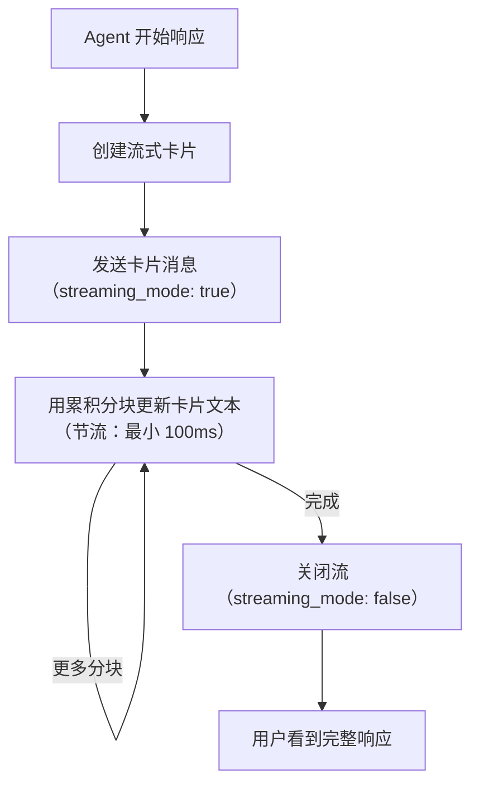

> 翻译自 [English version](/channel-larksuite)

# Larksuite Channel

[Larksuite](https://www.larksuite.com/) 消息集成，支持 DM、群组、流式卡片和通过 WebSocket 或 webhook 实现的实时更新。

## 设置

**创建 Larksuite 应用：**

1. 前往 https://open.larksuite.com
2. 创建自定义应用 → 填写基本信息
3. 在"Bots"下 → 启用"Bot"能力
4. 设置 bot 名称和头像
5. 复制 `App ID` 和 `App Secret`
6. 授予所需 API scopes（见下方[所需 API Scopes](#required-api-scopes)）
7. 在 Permissions & Scopes → Contacts 下将 Contact Range 设置为 **"All members"**
8. 发布应用版本（scopes 仅在发布后生效）

**启用 Larksuite：**

```json
{
  "channels": {
    "feishu": {
      "enabled": true,
      "app_id": "YOUR_APP_ID",
      "app_secret": "YOUR_APP_SECRET",
      "connection_mode": "websocket",
      "domain": "lark",
      "dm_policy": "pairing",
      "group_policy": "open"
    }
  }
}
```

## 配置

所有配置项位于 `channels.feishu`：

| 配置项 | 类型 | 默认值 | 说明 |
|-----|------|---------|-------------|
| `enabled` | bool | false | 启用/禁用 channel |
| `app_id` | string | 必填 | Larksuite 开发者控制台的 App ID |
| `app_secret` | string | 必填 | Larksuite 开发者控制台的 App Secret |
| `encrypt_key` | string | -- | 可选消息加密密钥 |
| `verification_token` | string | -- | 可选 webhook 验证 token |
| `domain` | string | `"lark"` | `"lark"`（Larksuite）或自定义域名 |
| `connection_mode` | string | `"websocket"` | `"websocket"` 或 `"webhook"` |
| `webhook_port` | int | 3000 | Webhook 服务器端口（0=挂载到 gateway mux） |
| `webhook_path` | string | `"/feishu/events"` | Webhook 端点路径 |
| `allow_from` | list | -- | 用户 ID 白名单（DM） |
| `dm_policy` | string | `"pairing"` | `pairing`、`allowlist`、`open`、`disabled` |
| `group_policy` | string | `"open"` | `open`、`allowlist`、`disabled` |
| `group_allow_from` | list | -- | 群组 ID 白名单 |
| `require_mention` | bool | true | 群组中是否需要提及 bot |
| `topic_session_mode` | string | `"disabled"` | `"disabled"` 或 `"enabled"`（线程隔离） |
| `text_chunk_limit` | int | 4000 | 每条消息最大文本字符数 |
| `media_max_mb` | int | 30 | 最大媒体文件大小（MB） |
| `render_mode` | string | `"auto"` | `"auto"`（自动检测）、`"card"`、`"raw"` |
| `streaming` | bool | true | 启用流式卡片更新 |
| `reaction_level` | string | `"off"` | `off`、`minimal`（仅 ⏳）、`full` |

## 传输模式

### WebSocket（默认）

持久连接，自动重连。推荐用于低延迟场景。

```json
{
  "connection_mode": "websocket"
}
```

### Webhook

Larksuite 通过 HTTP POST 发送事件。两种选项：

1. **挂载到 gateway mux**（`webhook_port: 0`）：处理器共享主 gateway 端口
2. **独立服务器**（`webhook_port: 3000`）：专用 webhook 监听器

```json
{
  "connection_mode": "webhook",
  "webhook_port": 0,
  "webhook_path": "/feishu/events"
}
```

然后在 Larksuite 开发者控制台配置 webhook URL：
- Gateway mux：`https://your-gateway.com/feishu/events`
- 独立服务器：`https://your-webhook-host:3000/feishu/events`

## 所需 API Scopes

你的 Larksuite 应用需要这 15 个 scopes。创建或编辑飞书 channel 时，Dashboard 在可折叠面板中显示完整列表。

| Scope | 用途 |
|-------|---------|
| `im:message` | 核心消息功能 |
| `im:message:readonly` | 读取消息（回复上下文） |
| `im:message.p2p_msg:send` | 发送 DM |
| `im:message.group_msg:send` | 发送群组消息 |
| `im:message.group_at_msg` | 发送 @提及消息 |
| `im:message.group_at_msg:readonly` | 读取 @提及消息 |
| `im:chat` | 会话管理 |
| `im:chat:readonly` | 读取会话信息 |
| `im:resource` | 上传/下载媒体 |
| `contact:user.base:readonly` | 读取用户档案 |
| `contact:user.id:readonly` | 解析用户 ID |
| `contact:user.employee_id:readonly` | 解析员工 ID |
| `contact:user.phone:readonly` | 解析电话号码 |
| `contact:user.email:readonly` | 解析邮箱 |
| `contact:department.id:readonly` | 部门查询 |

> **重要：** 授予 scopes 后，在 Permissions & Scopes → Contacts 下将 **Contact Range** 设置为 **"All members"**，然后发布新的应用版本。不执行此操作，联系人解析将返回空名称。

## 功能特性

### 回复上下文

当用户在 DM 中回复消息时，GoClaw 将原始消息作为 agent 的上下文包含。在 DM 中，会预置 `[From: sender_name]` 标注，让 agent 知道消息发送者。

### 流式卡片

以带动画的交互式卡片消息实时更新：



更新节流以防止频率限制。显示使用 50ms 动画频率（每步 2 个字符）。

### 媒体处理

**入站**：图片、文件、音频、视频、贴纸自动下载并保存：

| 类型 | 扩展名 |
|------|-----------|
| 图片 | `.png` |
| 文件 | 原始扩展名 |
| 音频 | `.opus` |
| 视频 | `.mp4` |
| 贴纸 | `.png` |

默认最大 30 MB（`media_max_mb`）。

**出站**：文件自动检测并以正确类型上传（opus、mp4、pdf、doc、xls、ppt 或 stream）。

**富文本 post 消息**：GoClaw 还会提取 Lark 富文本 `post` 消息中嵌入的图片（不仅限于独立图片消息）。post 正文中的图片会被下载并包含在入站消息上下文的其他媒体旁边。

### @提及支持

Bot 在群组消息中发送原生 Lark @提及。当 agent 响应包含 `@open_id` 模式（如 `@ou_abc123`）时，它们会自动转换为触发真实通知的原生 Lark `at` 元素。在 `post` 文本消息和交互式卡片消息中均有效。

### 提及解析

Larksuite 发送占位符 token（如 `@_user_1`）。Bot 解析提及列表并解析为 `@DisplayName`。

### 线程 Session 隔离

当 `topic_session_mode: "enabled"` 时，每个线程获得独立会话：

```
Session key: "{chatID}:topic:{rootMessageID}"
```

同一群组中的不同线程保持独立历史。

### list_group_members 工具

连接到 Larksuite channel 时，agent 可以使用 `list_group_members` 工具。它返回当前群聊的所有成员及其 `open_id` 和显示名称。

```
list_group_members(channel?, chat_id?) → { count, members: [{ member_id, name }] }
```

使用场景：检查群组成员、在提及前识别成员、出勤追踪。在回复中 @提及成员，使用 `@member_id`（如 `@ou_abc123`）——bot 会将其转换为带通知的原生 Lark 提及。

> 此工具仅适用于飞书/Lark channel。不会出现在其他 channel 类型的工具列表中。

### 每个话题的工具白名单

论坛话题支持自己的工具白名单。在 agent 工具设置或 channel 元数据下配置：

| 值 | 行为 |
|-------|----------|
| `nil`（省略） | 继承父群组的工具白名单 |
| `[]`（空） | 此话题不允许任何工具 |
| `["web_search", "group:fs"]` | 仅允许这些工具 |

`group:fs` 前缀选择 `fs`（Feishu/Lark）工具组中的所有工具。遵循与 Telegram 话题配置相同的 `group:xxx` 语法。

## 故障排查

| 问题 | 解决方案 |
|-------|----------|
| "Invalid app credentials" | 检查 app_id 和 app_secret。确保应用已发布。 |
| Webhook 未收到事件 | 验证 webhook URL 可公开访问。检查 Larksuite 开发者控制台的事件订阅。 |
| WebSocket 持续断连 | 检查网络。验证应用有 `im:message` 权限。 |
| 流式卡片不更新 | 确保 `streaming: true`。检查 `render_mode`（auto/card）。短于限制的消息以纯文本渲染。 |
| 媒体上传失败 | 验证文件类型匹配。检查文件大小是否在 `media_max_mb` 以内。 |
| 提及未解析 | 确保 bot 被提及。检查 webhook payload 中的提及列表。 |

## 下一步

- [概览](/channels-overview) — Channel 概念和策略
- [Telegram](/channel-telegram) — Telegram bot 设置
- [Zalo OA](/channel-zalo-oa) — Zalo 官方账号
- [Browser Pairing](/channel-browser-pairing) — 配对流程

<!-- goclaw-source: 050aafc9 | 更新: 2026-04-09 -->
