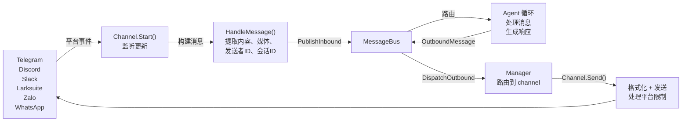
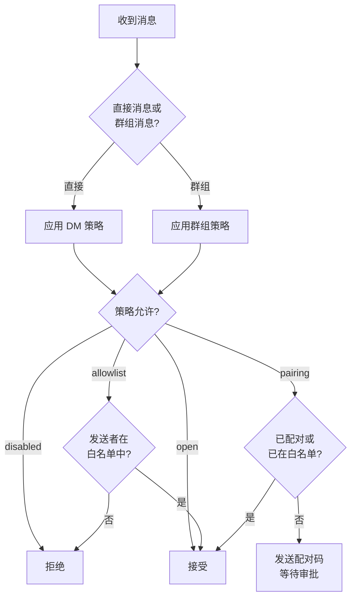

> 翻译自 [English version](/channels-overview)

# Channels 概览

Channels 将消息平台（Telegram、Discord、Larksuite 等）通过统一消息总线连接到 GoClaw agent 运行时。每个 channel 将平台特定事件转换为标准化的 `InboundMessage` 对象，并将 agent 响应转换为平台适配的输出格式。

## 消息流



## Channel 策略

通过 DM 或群组设置控制消息发送权限。

### DM 策略

| 策略 | 行为 | 适用场景 |
|--------|----------|----------|
| `pairing` | 新用户需通过 8 位配对码审批 | 安全受控访问 |
| `allowlist` | 仅接受白名单发送者 | 限制访问 |
| `open` | 接受所有 DM | 公开 bot |
| `disabled` | 拒绝所有 DM | 仅群组 |

### 群组策略

| 策略 | 行为 | 适用场景 |
|--------|----------|----------|
| `open` | 接受所有群组消息 | 公开群组 |
| `allowlist` | 仅接受白名单群组 | 限制群组 |
| `disabled` | 不接受群组消息 | 仅 DM |

### 策略执行流程



## Session Key 格式

Session key 用于标识跨平台的唯一会话和线程。所有 key 遵循标准格式 `agent:{agentId}:{rest}`。

| 场景 | 格式 | 示例 |
|---------|--------|---------|
| DM | `agent:{agentId}:{channel}:direct:{peerId}` | `agent:default:telegram:direct:386246614` |
| 群组 | `agent:{agentId}:{channel}:group:{groupId}` | `agent:default:telegram:group:-100123456` |
| 论坛话题 | `agent:{agentId}:{channel}:group:{groupId}:topic:{topicId}` | `agent:default:telegram:group:-100123456:topic:99` |
| DM 线程 | `agent:{agentId}:{channel}:direct:{peerId}:thread:{threadId}` | `agent:default:telegram:direct:386246614:thread:5` |
| Subagent | `agent:{agentId}:subagent:{label}` | `agent:default:subagent:my-task` |

## 媒体处理说明

### 回复消息中的媒体

GoClaw 会从所有支持回复功能的 channel 中提取被回复消息的媒体附件。当用户回复包含图片或文件的消息时，这些附件会自动包含在 agent 的入站消息上下文中，无需额外操作。

### 出站媒体大小限制

`media_max_bytes` 配置字段对 agent 发送的出站媒体上传设置每个 channel 的限制。超出限制的文件将被跳过并记录日志。每个 channel 有自己的默认值（如 Telegram 为 20 MB，Feishu/Lark 为 30 MB），可按需为每个 channel 单独配置。

## Channel 对比

| 功能 | Telegram | Discord | Slack | Larksuite | Zalo OA | Zalo 个人 | WhatsApp |
|---------|----------|---------|-------|--------|---------|-----------|----------|
| **传输方式** | 长轮询 | Gateway 事件 | Socket Mode (WS) | WS/Webhook | 长轮询 | 内部协议 | WS 桥接 |
| **DM 支持** | 是 | 是 | 是 | 是 | 是 | 是 | 是 |
| **群组支持** | 是 | 是 | 是 | 是 | 否 | 是 | 是 |
| **流式输出** | 是（typing） | 是（编辑） | 是（编辑） | 是（卡片） | 否 | 否 | 否 |
| **媒体** | 图片、语音、文件 | 文件、嵌入 | 文件（20MB） | 图片、文件（30MB） | 图片（5MB） | -- | JSON |
| **回复媒体** | 是 | 是 | -- | 是 | -- | -- | -- |
| **富文本格式** | HTML | Markdown | mrkdwn | 卡片 | 纯文本 | 纯文本 | 纯文本 |
| **表情回应** | 是 | -- | 是 | 是 | -- | -- | -- |
| **配对** | 是 | 是 | 是 | 是 | 是 | 是 | 是 |
| **消息长度限制** | 4,096 | 2,000 | 4,000 | 4,000 | 2,000 | 2,000 | 无限制 |

## 实现清单

添加新 channel 时，需实现以下方法：

- **`Name()`** — 返回 channel 标识符（如 `"telegram"`）
- **`Start(ctx)`** — 开始监听消息
- **`Stop(ctx)`** — 优雅关闭
- **`Send(ctx, msg)`** — 向平台发送消息
- **`IsRunning()`** — 报告运行状态
- **`IsAllowed(senderID)`** — 检查白名单

可选接口：

- **`StreamingChannel`** — 实时消息更新（分块、typing 指示器）
- **`ReactionChannel`** — 状态 emoji 回应（思考中、完成、错误）
- **`WebhookChannel`** — 可挂载到主 gateway mux 的 HTTP 处理器
- **`BlockReplyChannel`** — 覆盖 gateway block_reply 设置

## 常用模式

### 消息处理

所有 channel 使用 `BaseChannel.HandleMessage()` 将消息转发到总线：

```go
ch.HandleMessage(
    senderID,        // "telegram:123" or "discord:456@guild"
    chatID,          // 发送响应的目标
    content,         // 用户文本
    media,           // 文件 URL/路径
    metadata,        // 路由提示
    "direct",        // 或 "group"
)
```

### 白名单匹配

支持复合发送者 ID，如 `"123|username"`。白名单可包含：

- 用户 ID：`"123456"`
- 用户名：`"@alice"`
- 复合格式：`"123456|alice"`
- 通配符：不支持

### 频率限制

Channel 可以对每个用户执行频率限制。通过 channel 设置配置或实现自定义逻辑。

## 下一步

- [Telegram](/channel-telegram) — Telegram 集成完整指南
- [Discord](/channel-discord) — Discord bot 设置
- [Slack](/channel-slack) — Slack Socket Mode 集成
- [Larksuite](/channel-feishu) — Larksuite 流式卡片集成
- [WebSocket](/channel-websocket) — 通过 WS 直连 agent API
- [Browser Pairing](/channel-browser-pairing) — 8 位配对码流程

<!-- goclaw-source: 120fc2d | 更新: 2026-03-19 -->
