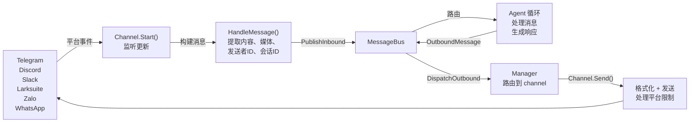
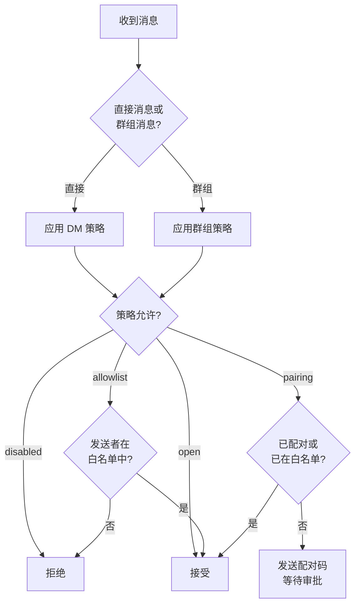

> 翻译自 [English version](/channels-overview)

# Channels 概览

Channels 将消息平台（Telegram、Discord、Larksuite 等）通过统一消息总线连接到 GoClaw agent 运行时。每个 channel 将平台特定事件转换为标准化的 `InboundMessage` 对象，并将 agent 响应转换为平台适配的输出格式。

## 消息流


```mermaid
flowchart LR
    TG["Telegram<br/>Discord<br/>Slack<br/>Larksuite<br/>Zalo<br/>WhatsApp"]

    TG -->|"平台事件"| Listen["Channel.Start()<br/>监听更新"]
    Listen -->|"构建消息"| Handle["HandleMessage()<br/>提取内容、媒体、<br/>发送者ID、会话ID"]
    Handle -->|"PublishInbound"| Bus["MessageBus"]

    Bus -->|"路由"| Agent["Agent 循环<br/>处理消息<br/>生成响应"]
    Agent -->|"OutboundMessage"| Bus

    Bus -->|"DispatchOutbound"| Manager["Manager<br/>路由到 channel"]
    Manager -->|"Channel.Send()"| Send["格式化 + 发送<br/>处理平台限制"]
    Send --> TG
```

## Channel 策略

通过 DM 或群组设置控制消息发送权限。

### DM 策略

| 策略 | 行为 | 适用场景 |
|--------|----------|----------|
| `pairing` | 新用户需通过 8 位配对码审批 | 安全受控访问 |
| `allowlist` | 仅接受白名单发送者 | 限制访问 |
| `open` | 接受所有 DM | 公开 bot |
| `disabled` | 拒绝所有 DM | 仅群组 |

### 群组策略

| 策略 | 行为 | 适用场景 |
|--------|----------|----------|
| `open` | 接受所有群组消息 | 公开群组 |
| `allowlist` | 仅接受白名单群组 | 限制群组 |
| `disabled` | 不接受群组消息 | 仅 DM |

### 策略执行流程


```mermaid
flowchart TD
    MSG["收到消息"] --> KIND{"直接消息或<br/>群组消息?"}
    KIND -->|直接| DPOLICY["应用 DM 策略"]
    KIND -->|群组| GPOLICY["应用群组策略"]

    DPOLICY --> CHECK{"策略允许?"}
    GPOLICY --> CHECK

    CHECK -->|disabled| REJECT["拒绝"]
    CHECK -->|open| ACCEPT["接受"]
    CHECK -->|allowlist| ALLOWED{"发送者在<br/>白名单中?"}
    ALLOWED -->|是| ACCEPT
    ALLOWED -->|否| REJECT
    CHECK -->|pairing| PAIRED{"已配对或<br/>已在白名单?"}
    PAIRED -->|是| ACCEPT
    PAIRED -->|否| SEND_CODE["发送配对码<br/>等待审批"]
```

## Session Key 格式

Session key 用于标识跨平台的唯一会话和线程。所有 key 遵循标准格式 `agent:{agentId}:{rest}`。

| 场景 | 格式 | 示例 |
|---------|--------|---------|
| DM | `agent:{agentId}:{channel}:direct:{peerId}` | `agent:default:telegram:direct:386246614` |
| 群组 | `agent:{agentId}:{channel}:group:{groupId}` | `agent:default:telegram:group:-100123456` |
| 论坛话题 | `agent:{agentId}:{channel}:group:{groupId}:topic:{topicId}` | `agent:default:telegram:group:-100123456:topic:99` |
| DM 线程 | `agent:{agentId}:{channel}:direct:{peerId}:thread:{threadId}` | `agent:default:telegram:direct:386246614:thread:5` |
| Subagent | `agent:{agentId}:subagent:{label}` | `agent:default:subagent:my-task` |

## 媒体处理说明

### 回复消息中的媒体

GoClaw 会从所有支持回复功能的 channel 中提取被回复消息的媒体附件。当用户回复包含图片或文件的消息时，这些附件会自动包含在 agent 的入站消息上下文中，无需额外操作。

### 出站媒体大小限制

`media_max_bytes` 配置字段对 agent 发送的出站媒体上传设置每个 channel 的限制。超出限制的文件将被跳过并记录日志。每个 channel 有自己的默认值（如 Telegram 为 20 MB，Feishu/Lark 为 30 MB），可按需为每个 channel 单独配置。

### 多附件投递（批量）

`send_file` 工具可以一次性投递多个已有的工作区文件。支持两种形式：

- **单文件：** `path`（外加可选的 `caption`）。
- **批量：** `attachments: [{ "path": "...", "caption": "..." }, ...]` — 文件顺序、MIME 类型、文件名和每个文件的 caption 都会被保留。

每个 channel 如何对批量进行分组取决于平台支持的能力：

| Channel | 分组方式 | 行为 |
|---------|----------|------|
| Telegram | 相册分块 | 兼容的媒体被分组为 `sendMediaGroup` 相册，每组 **2–10** 项。图片/视频可以共用一个分块；文档只与文档分组，音频只与音频分组。语音模式音频、单项分块、作为文档发送的超大图片，以及不兼容的序列会回退为有序的逐个发送。 |
| Discord | 单条消息 | 多个文件（外加可选文本）在**一条**消息中投递，最多 10 个附件。 |
| Slack 及其他支持媒体的 channel | 有序回退 | 除非 adapter 声明了更强的批量能力，否则文件按顺序逐个发送。 |

## 入站防抖

当用户连续快速发送多条消息（或一次上传多个文件）时，GoClaw 会在运行 agent 前把它们合并为**一条**入站消息 — 回复一次，而不是每个片段回复一次。

用 `gateway.inbound_debounce_ms`（毫秒）设置静默窗口：

```json
{
  "gateway": {
    "inbound_debounce_ms": 1500
  }
}
```

- 消息按 `channel:chatID:senderID:agentID` 键进行缓冲。每来一条新消息计时器就重置，因此合并后的消息仅在发送者静默达到配置窗口后才 flush。
- `0` 会**禁用**文本防抖 — 每条消息立即 dispatch。
- **按 agent 覆盖：** agent 可在其 `agent_config` 中设置 `inbound_debounce_ms`，使用不同于 gateway 默认值的窗口。
- **`/stop` 和 `/reset` 绕过防抖器** — 控制命令会被立即处理，绝不缓冲。
- **媒体下限：** 携带媒体的消息不再绕过防抖。生效窗口为 `max(配置值, 媒体下限)`，因此即使文本防抖设为 `0`，一次多文件上传也总会合并为一条入站消息。（agent 设置的非零覆盖会被原样尊重 — operator 设 `500` 就保持 `500`，而非下限。）由工具/subagent 内部合成的消息免于该下限。

## 拟人化投递

GoClaw 可以让 channel 回复更具对话感 — 在长时间运行前先快速确认一下、工具执行时给出简短的进度提示，并把一条长的最终答案拆成几条自然的消息。这通过 `gateway.chat_behavior` 配置，且**默认禁用**。

> 这些行为是**仅投递层面**的。确认消息、进度提示和拆分片段绝不会写入 session 历史，也不会作为对话回送给模型 — 它们只改变人在聊天中看到的内容。

```json
{
  "gateway": {
    "chat_behavior": {
      "enabled": true,
      "quick_ack": { "enabled": true, "mode": "sidecar_generated" },
      "intermediate_replies": { "enabled": true },
      "final_split": { "enabled": true }
    }
  }
}
```

### 三个子行为

| 子行为 | 作用 |
|--------------|--------------|
| `quick_ack` | 在较长的非流式运行前发送一条简短的回执，让用户知道 bot 正在工作。 |
| `intermediate_replies` | 在 agent 运行工具期间发送简短的进度更新。独立于 `quick_ack`。 |
| `final_split` | 把一条长的最终回复拆成少量段落大小的消息。 |

**`quick_ack` 模式：**

| 模式 | 行为 |
|------|----------|
| `sidecar_generated` | 一次有界的、独立的 LLM 调用生成一条简短的、感知上下文的确认消息。 |
| `llm_generated` | 向后兼容的别名；这也是默认解析出的模式。 |
| `fixed_template` | 发送 `templates` 中的第一个字符串（默认 `"Got it. Working on it..."`）。 |
| `off` | 无确认消息。 |

`quick_ack` 字段：`enabled`、`mode`、`min_delay_ms`（默认 1000）、`provider`、`model`、`timeout_ms`（默认 2500）、`max_tokens`（默认 40）、`max_chars`（默认 120）、`templates`。当 `provider`/`model` 未设置时，使用 agent 自身的 provider/model。

**`intermediate_replies`** 模式为 `sidecar_generated`（默认）或 `off`。字段：`enabled`、`mode`、`provider`、`model`、`timeout_ms`（2500）、`max_tokens`（默认 60）、`max_chars`（默认 180）。该 sidecar 只接收有界的元数据（消息预览、locale、channel/peer、agent 标签、当前工具阶段）— **绝不**接收 session 历史、工具参数/输出、记忆或 system prompt。

**`final_split`** 字段：`enabled`、`min_chars`（默认 1200）、`max_messages`（默认 3）、`delay_ms`（默认 500）。拆分是保守的 — 包含围栏代码、表格、列表、引用、JSON/XML 类块或仅含 URL 的段落的回复会保持为一条消息，媒体或流式投递绝不会被拆分。

### 覆盖顺序

`chat_behavior` 可在三个层级设置。解析顺序为 **Channel > Agent > Workspace**：

1. **Workspace** — `gateway.chat_behavior`（基础）。
2. **Agent** — `agents.other_config.delivery_behavior` 覆盖 workspace 基础。
3. **Channel** — `channels.<type>.chat_behavior`（或某个 channel 实例的 `chat_behavior`）拥有最终决定权。

每个层级只覆盖它所设置的字段，因此你可以按 channel 调一个旋钮、继承其余的。

> **Legacy `block_reply`。** 当较新的字段未设置时，较旧的 `gateway.block_reply`（及按 channel 的 `block_reply`）标志仍会作为 `intermediate_replies.enabled` 的继承默认值被读取。

### Channel 支持

拟人化投递由采用 `ChatBehaviorChannel` 接口的 channel 实现：**Bitrix24、Discord、Feishu/Lark、Pancake、Slack、Telegram、WhatsApp、Zalo OA 和 Zalo Personal**。

## Channel 对比

| 功能 | Telegram | Bitrix24 | Discord | Slack | Larksuite | Zalo OA | Zalo 个人 | WhatsApp |
|---------|----------|----------|---------|-------|--------|---------|-----------|----------|
| **传输方式** | 长轮询 | Webhook (OAuth) | Gateway 事件 | Socket Mode (WS) | WS/Webhook | 长轮询 | 内部协议 | WS 桥接 |
| **DM 支持** | 是 | 是 | 是 | 是 | 是 | 是 | 是 | 是 |
| **群组支持** | 是 | 是 | 是 | 是 | 是 | 否 | 是 | 是 |
| **流式输出** | 是（typing） | 是 | 是（编辑） | 是（编辑） | 是（卡片） | 否 | 否 | 否 |
| **媒体** | 图片、语音、文件 | 文件（20MB） | 文件、嵌入 | 文件（20MB） | 图片、文件（30MB） | 图片（5MB） | -- | JSON |
| **回复媒体** | 是 | -- | 是 | -- | 是 | -- | -- | -- |
| **富文本格式** | HTML | 文本 | Markdown | mrkdwn | 卡片 | 纯文本 | 纯文本 | 纯文本 |
| **线程支持** | 是 | -- | -- | -- | -- | -- | -- | -- |
| **表情回应** | 是 | 是 | -- | 是 | 是 | -- | -- | -- |
| **配对** | 是 | 是 | 是 | 是 | 是 | 是 | 是 | 是 |
| **消息长度限制** | 4,096 | 4,000 | 2,000 | 4,000 | 4,000 | 2,000 | 2,000 | 无限制 |

## 频道健康诊断

GoClaw 跟踪每个 channel 实例的运行时健康状态，并在出现问题时提供可操作的诊断信息。健康状态通过 `channels.status` WebSocket 方法和仪表盘概览页面暴露。

### 健康状态

| 状态 | 含义 |
|-------|---------|
| `registered` | Channel 已配置但尚未启动 |
| `starting` | Channel 正在初始化 |
| `healthy` | 正常运行 |
| `degraded` | 带问题运行 |
| `failed` | 因错误停止 |
| `stopped` | 手动停止 |

### 故障分类

当 channel 失败时，GoClaw 将错误分为四类：

| 类型 | 典型原因 | 修复方法 |
|------|---------------|-------------|
| `auth` | 无效或过期的 token/secret | 检查凭证或重新认证 |
| `config` | 缺少必填设置、无效代理 | 在 channel 设置中补全必填字段 |
| `network` | 超时、连接拒绝、DNS 故障 | 检查上游服务可达性和代理设置 |
| `unknown` | 未识别的错误 | 查看服务器日志获取完整错误 |

每个故障包含一条**修复提示** — 一条简短的操作指引，指向可解决问题的具体 UI 界面（凭证面板、高级设置或详情页）。仪表盘直接在 channel 卡片上显示这些提示。

### 健康追踪

健康系统按 channel 追踪故障历史：
- **连续故障次数** — channel 恢复时重置
- **总故障计数** — 生命周期计数器
- **首次/最近故障时间戳** — 用于诊断间歇性问题
- **最近健康时间戳** — channel 最后正常运行的时间

---

## 实现清单

添加新 channel 时，需实现以下方法：

- **`Name()`** — 返回 channel 标识符（如 `"telegram"`）
- **`Start(ctx)`** — 开始监听消息
- **`Stop(ctx)`** — 优雅关闭
- **`Send(ctx, msg)`** — 向平台发送消息
- **`IsRunning()`** — 报告运行状态
- **`IsAllowed(senderID)`** — 检查白名单

可选接口：

- **`StreamingChannel`** — 实时消息更新（分块、typing 指示器）
- **`ReactionChannel`** — 状态 emoji 回应（思考中、完成、错误）
- **`WebhookChannel`** — 可挂载到主 gateway mux 的 HTTP 处理器
- **`BlockReplyChannel`** — 覆盖 gateway block_reply 设置
- **`ChatBehaviorChannel`** — [拟人化投递](#human-like-delivery)（快速确认、进度提示、最终拆分）。由 Bitrix24、Discord、Feishu/Lark、Pancake、Slack、Telegram、WhatsApp、Zalo OA 和 Zalo Personal 实现。
- **`ReasoningDeliveryChannel`** — 控制模型推理在聊天中如何呈现。目前仅由 Telegram 实现（参见 [Telegram › 推理投递](/channel-telegram#reasoning-delivery)）。

## 常用模式

### 消息处理

所有 channel 使用 `BaseChannel.HandleMessage()` 将消息转发到总线：

```go
ch.HandleMessage(
    senderID,        // "telegram:123" or "discord:456@guild"
    chatID,          // 发送响应的目标
    content,         // 用户文本
    media,           // 文件 URL/路径
    metadata,        // 路由提示
    "direct",        // 或 "group"
)
```

### 白名单匹配

支持复合发送者 ID，如 `"123|username"`。白名单可包含：

- 用户 ID：`"123456"`
- 用户名：`"@alice"`
- 复合格式：`"123456|alice"`
- 通配符：不支持

### 频率限制

Channel 可以对每个用户执行频率限制。通过 channel 设置配置或实现自定义逻辑。

## 下一步

- [Telegram](/channel-telegram) — Telegram 集成完整指南
- [Discord](/channel-discord) — Discord bot 设置
- [Slack](/channel-slack) — Slack Socket Mode 集成
- [Larksuite](/channel-feishu) — Larksuite 流式卡片集成
- [WebSocket](/channel-websocket) — 通过 WS 直连 agent API
- [Browser Pairing](/channel-browser-pairing) — 8 位配对码流程

<!-- goclaw-source: fabe86b3 | 更新: 2026-06-28 -->
