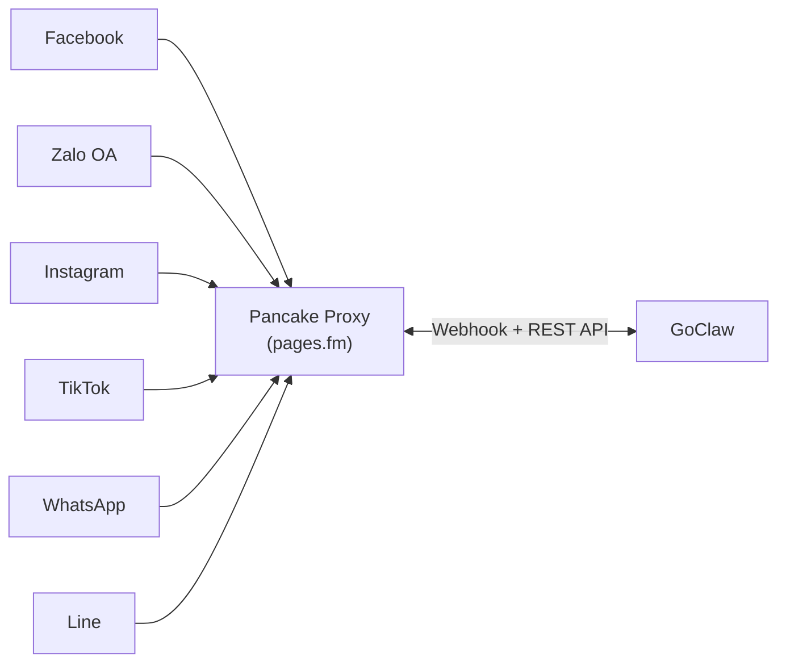

> 翻译自 [English version](/channel-pancake)

# Pancake Channel

由 Pancake (pages.fm) 驱动的统一多平台 channel 代理。一个 Pancake API key 即可访问 Facebook、Zalo OA、Instagram、TikTok、WhatsApp 和 Line——无需为每个平台单独进行 OAuth 授权。

## 什么是 Pancake？

Pancake 是一个社交电商平台，提供跨多个社交网络的统一消息代理。GoClaw 只需连接一次 Pancake，即可通过单个 channel 实例触达所有已连接平台上的用户，而无需逐一对接各平台 API。

## 支持的平台

| 平台 | 最大消息长度 | 格式 |
|------|------------|------|
| Facebook | 2,000 | 纯文本（去除 markdown） |
| Zalo OA | 2,000 | 纯文本（去除 markdown） |
| Instagram | 1,000 | 纯文本（去除 markdown） |
| TikTok | 500 | 纯文本，截断至 500 字符 |
| WhatsApp | 4,096 | WhatsApp 原生格式（*粗体*、_斜体_） |
| Line | 5,000 | 纯文本（去除 markdown） |

## 设置

### Pancake 端设置

1. 在 [pages.fm](https://pages.fm) 创建 Pancake 账号
2. 将你的社交主页（Facebook、Zalo OA 等）连接到 Pancake
3. 在账号设置中生成 Pancake API key
4. 从 Pancake dashboard 记录你的 Page ID

### GoClaw 端设置

1. **Channels > Add Channel > Pancake**
2. 填写凭据：
   - **API Key**：Pancake 用户级 API key
   - **Page Access Token**：所有 page API 的主页级 token
   - **Page ID**：Pancake 主页标识符
3. 可选设置 **Webhook Secret** 用于 HMAC-SHA256 签名验证
4. 配置平台特定功能（inbox reply、comment reply）

就这些——一个 channel 服务连接到该 Pancake 主页的所有平台。

### 通过配置文件设置

适用于基于配置文件的 channel（而非 DB 实例）：

```json
{
  "channels": {
    "pancake": {
      "enabled": true,
      "instances": [
        {
          "name": "my-facebook-page",
          "credentials": {
            "api_key": "your_pancake_api_key",
            "page_access_token": "your_page_access_token",
            "webhook_secret": "optional_hmac_secret"
          },
          "config": {
            "page_id": "your_page_id",
            "features": {
              "inbox_reply": true,
              "comment_reply": true,
              "first_inbox": true,
              "auto_react": false
            },
            "comment_reply_options": {
              "include_post_context": true,
              "filter": "all"
            }
          }
        }
      ]
    }
  }
}
```

## 配置

| 配置项 | 类型 | 默认值 | 说明 |
|--------|------|--------|------|
| `api_key` | string | -- | Pancake 用户级 API key（必填） |
| `page_access_token` | string | -- | 所有 page API 的主页级 token（必填） |
| `webhook_secret` | string | -- | 可选 HMAC-SHA256 验证 secret |
| `page_id` | string | -- | Pancake 主页标识符（必填） |
| `webhook_page_id` | string | -- | webhook 中的原生平台主页 ID（若与 `page_id` 不同） |
| `platform` | string | 自动检测 | 平台覆盖：facebook/zalo/instagram/tiktok/whatsapp/line |
| `features.inbox_reply` | bool | -- | 启用收件箱消息回复 |
| `features.comment_reply` | bool | -- | 启用评论回复 |
| `features.first_inbox` | bool | -- | 首次评论回复后向评论者发送一次性私信 |
| `features.auto_react` | bool | -- | 自动为用户评论点赞（仅限 Facebook） |
| `auto_react_options.allow_post_ids` | list | -- | 仅对这些帖子 ID 的评论点赞（nil = 所有帖子） |
| `auto_react_options.deny_post_ids` | list | -- | 永不对这些帖子 ID 点赞（覆盖 allow） |
| `auto_react_options.allow_user_ids` | list | -- | 仅对这些用户 ID 的评论点赞（nil = 所有用户） |
| `auto_react_options.deny_user_ids` | list | -- | 永不对这些用户 ID 的评论点赞（覆盖 allow） |
| `comment_reply_options.include_post_context` | bool | false | 将原帖内容附加到发送给 agent 的评论内容前 |
| `comment_reply_options.filter` | string | `"all"` | 评论过滤模式：`"all"` 或 `"keyword"` |
| `comment_reply_options.keywords` | list | -- | `filter="keyword"` 时必填——仅处理包含这些关键词的评论 |
| `first_inbox_message` | string | 内置文本 | first inbox 功能发送的自定义私信内容 |
| `post_context_cache_ttl` | string | `"15m"` | 评论 context 抓取的帖子内容缓存 TTL（如 `"30m"`） |
| `block_reply` | bool | -- | 覆盖 gateway block_reply（nil=继承） |
| `allow_from` | list | -- | 用户/群组 ID 白名单 |

## 架构



- **一个 channel 实例 = 一个 Pancake 主页**（服务多个平台）
- **平台在 Start() 时自动检测**，来源为 Pancake 主页元数据
- **基于 Webhook** — 无需轮询，Pancake 服务器主动推送事件到 GoClaw
- 单个 HTTP handler 位于 `/channels/pancake/webhook`，按 page_id 路由到正确的 channel

## 功能特性

### 多平台支持

一个 Pancake channel 实例可同时服务多个平台。平台由 Pancake 主页元数据决定：

- 启动时，GoClaw 调用 `GET /pages` 列出所有主页并匹配已配置的 page_id
- 从主页元数据中提取 `platform` 字段（facebook/zalo/instagram/tiktok/whatsapp/line）
- 如果未配置平台或检测失败，默认为 "facebook"，字符限制 2,000

### Webhook 推送

Pancake 使用 webhook 推送（非轮询）进行消息投递：

- GoClaw 注册单一路由：`POST /channels/pancake/webhook`
- 所有 Pancake 主页 webhook 经一个 handler 处理，按 `page_id` 分发
- 始终返回 HTTP 200 — 若 30 分钟窗口内错误率 >80%，Pancake 会暂停 webhook
- 通过 `X-Pancake-Signature` header 进行 HMAC-SHA256 签名验证（设置 `webhook_secret` 时生效）

Webhook payload 结构：

```json
{
  "event_type": "messaging",
  "page_id": "your_page_id",
  "data": {
    "conversation": {
      "id": "pageID_senderID",
      "type": "INBOX",
      "from": { "id": "sender_id", "name": "Sender Name" },
      "assignee_ids": ["staff_id_1"]
    },
    "message": {
      "id": "msg_unique_id",
      "message": "Hello from customer",
      "attachments": [{ "type": "image", "url": "https://..." }]
    }
  }
}
```

仅处理 `INBOX` 类型的会话事件。除非启用 `comment_reply`，否则跳过 `COMMENT` 事件。

### 消息去重

Pancake 使用至少一次投递，因此重复的 webhook 投递是正常现象：

- **消息去重**：`sync.Map` 以 `msg:{message_id}` 为 key，TTL 24 小时
- **出站回声检测**：发送前预存消息指纹，抑制我们自己回复的 webhook 回声（TTL 45 秒）
- 后台清理器每 5 分钟驱逐过期条目，防止内存无限增长
- 缺少 `message_id` 的消息跳过去重（防止共享 slot 冲突）

### 防止回复循环

多重防护机制防止 bot 回复自己的消息：

1. **主页自发消息过滤**：跳过 `sender_id == page_id` 的消息
2. **员工被分配人过滤**：跳过 Pancake 员工被分配到该会话时发送的消息
3. **出站回声检测**：将入站内容与最近发送的消息进行匹配

### 媒体支持

**入站媒体**：附件以 URL 形式出现在 webhook payload 中。GoClaw 直接将其包含在传递给 agent pipeline 的消息内容中。

**出站媒体**：文件通过 `POST /pages/{id}/upload_contents`（multipart/form-data）上传，然后在单独的 API 调用中以 `content_ids` 形式发送。媒体和文本按顺序投递：

1. 上传媒体文件，收集附件 ID
2. 发送带 content_ids 的附件消息
3. 随后发送文本消息（如有）

如果媒体上传失败，文本部分仍会发送并记录警告。媒体路径必须为绝对路径，以防目录遍历攻击。

### 消息格式化

LLM 输出从 Markdown 转换为各平台适配的格式：

| 平台 | 处理方式 |
|------|---------|
| Facebook | 去除 markdown，保留纯文本（Messenger 不支持富文本格式） |
| WhatsApp | 将 `**粗体**` 转换为 `*粗体*`，保留 `_斜体_`，去除标题 |
| TikTok | 去除 markdown + 截断至 500 个 rune |
| Instagram / Zalo / Line | 去除所有 markdown，返回纯文本 |

长消息自动按各平台字符限制拆分。基于 rune 拆分（非字节拆分）确保多字节字符（CJK、越南语、emoji）不被损坏。

### Inbox 与 Comment 模式

Pancake 支持两种会话类型：

- **INBOX**：来自用户的直接消息（默认，始终处理）
- **COMMENT**：社交帖子上的评论（由 `comment_reply` feature flag 控制）

会话类型以 `pancake_mode`（"inbox" 或 "comment"）存储在消息元数据中，使 agent 能够根据来源做出不同响应。

### 评论功能

当 `features.comment_reply: true` 时，可使用以下附加选项控制评论处理：

**评论过滤**（`comment_reply_options.filter`）：
- `"all"`（默认）—— 处理所有评论
- `"keyword"` —— 仅处理包含已配置 `keywords` 之一的评论

**帖子 context**（`comment_reply_options.include_post_context: true`）：抓取原帖内容并附加到评论内容前再发送给 agent。适用于评论过短、难以理解上下文的场景。帖子内容会被缓存（默认 TTL：15 分钟，可通过 `post_context_cache_ttl` 配置）。

**Auto-react**（`features.auto_react: true`）：自动为 Facebook 上每条有效的新评论点赞（仅限 Facebook 平台）。与 `comment_reply` 独立运作——可以只点赞不回复。

通过 `auto_react_options` 进一步限定点赞范围：

| 字段 | 类型 | 行为 |
|------|------|------|
| `allow_post_ids` | list | 仅对这些帖子 ID 的评论点赞（nil = 所有帖子） |
| `deny_post_ids` | list | 永不对这些帖子 ID 点赞（覆盖 allow） |
| `allow_user_ids` | list | 仅对这些用户 ID 的评论点赞（nil = 所有用户） |
| `deny_user_ids` | list | 永不对这些用户 ID 的评论点赞（覆盖 allow） |

Deny 列表始终优先于 allow 列表。完全省略 `auto_react_options` 表示无范围过滤（对所有有效评论点赞）。

**First inbox**（`features.first_inbox: true`）：回复评论后，向评论者发送一条一次性私信，邀请其通过收件箱继续对话。每位用户每次服务重启后仅发送一次。可通过 `first_inbox_message` 自定义私信内容。

### Channel 健康状态

API 错误映射到 channel 健康状态：

| 错误类型 | HTTP 状态码 | 健康状态 |
|----------|------------|---------|
| 认证失败 | 401、403、4001、4003 | Failed（token 过期或无效） |
| 被限速 | 429、4029 | Degraded（可恢复） |
| 未知 API 错误 | 其他 | Degraded（可恢复） |

应用层失败（HTTP 200 但 JSON body 中 `success: false`）也会被检测并视为发送错误。

## 故障排查

| 问题 | 解决方案 |
|------|---------|
| 启动时 "api_key is required" | 在 credentials 中添加 `api_key`。从 Pancake 账号设置中获取。 |
| "page_access_token is required" | 在 credentials 中添加 `page_access_token`。这是 Pancake 的主页级 token。 |
| "page_id is required" | 在 config 中添加 `page_id`。在 Pancake dashboard URL 中查找。 |
| Token 验证失败 | `page_access_token` 可能已过期或无效。从 Pancake dashboard 重新生成。 |
| 未收到消息 | 检查 Pancake webhook URL 是否已配置：`https://your-goclaw-host/channels/pancake/webhook`。 |
| Webhook 签名不匹配 | 验证 `webhook_secret` 是否与 Pancake dashboard 中配置的 secret 一致。 |
| "no channel instance for page_id" | webhook 中的 `page_id` 与任何已注册 channel 不匹配。检查配置。 |
| 平台显示为 unknown | `platform` 为自动检测。确保主页已在 Pancake 中连接。可手动覆盖。 |
| 媒体上传失败 | 媒体路径必须为绝对路径。检查文件是否存在且可读。 |
| 消息出现重复 | 这是正常现象——去重会处理。如果持续出现，检查 Pancake webhook config 是否被重复注册。 |

## 下一步

- [Channel 概览](/channels-overview) — Channel 概念和策略
- [WhatsApp](/channel-whatsapp) — 直连 WhatsApp 集成
- [Telegram](/channel-telegram) — Telegram bot 设置
- [多 Channel 设置](/recipe-multi-channel) — 配置多个 channel

<!-- goclaw-source: b9670555 | 更新: 2026-04-19 -->
