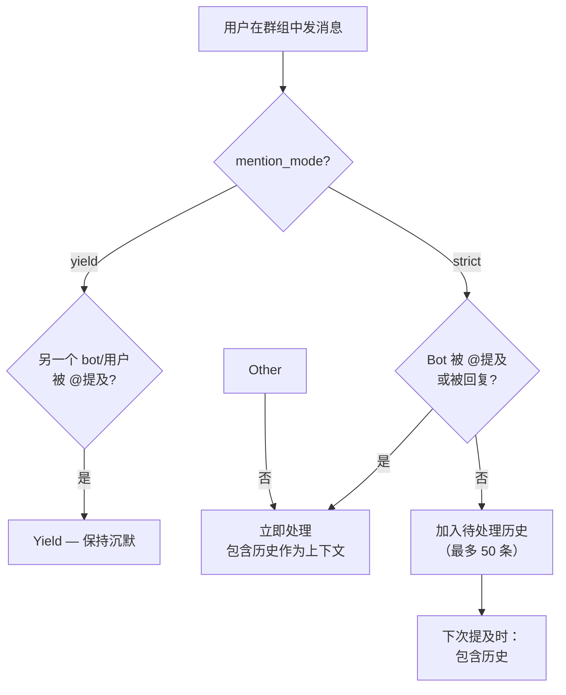

> 翻译自 [English version](/channel-telegram)

# Telegram Channel

通过长轮询（Bot API）集成 Telegram bot。支持 DM、群组、论坛话题、语音转文字和流式响应。

## 设置

**创建 Telegram Bot：**
1. 在 Telegram 上向 @BotFather 发消息
2. `/newbot` → 选择名称和用户名
3. 复制 token（格式：`123456:ABCDEFGHIJKLMNOPQRSTUVWxyz...`）

> **重要 — 群组隐私模式：** 默认情况下，Telegram bot 以**隐私模式**运行，在群组中只能看到命令（`/`）和 @提及。若要让 bot 读取所有群组消息（历史缓冲区、`require_mention: false` 和群组上下文所必需），请向 **@BotFather** 发送消息 → `/setprivacy` → 选择你的 bot → **Disable**。不执行此操作，bot 将静默忽略大多数群组消息。

**启用 Telegram：**

```json
{
  "channels": {
    "telegram": {
      "enabled": true,
      "token": "YOUR_BOT_TOKEN",
      "dm_policy": "pairing",
      "group_policy": "open",
      "allow_from": ["alice", "bob"]
    }
  }
}
```

## 配置

所有配置项位于 `channels.telegram`：

| 配置项 | 类型 | 默认值 | 说明 |
|-----|------|---------|-------------|
| `enabled` | bool | false | 启用/禁用 channel |
| `token` | string | 必填 | 来自 BotFather 的 Bot API token |
| `proxy` | string | -- | HTTP 代理（如 `http://proxy:8080`） |
| `allow_from` | list | -- | 用户 ID 或用户名白名单 |
| `dm_policy` | string | `"pairing"` | `pairing`、`allowlist`、`open`、`disabled` |
| `group_policy` | string | `"open"` | `open`、`allowlist`、`disabled` |
| `require_mention` | bool | true | 群组中是否需要 @bot 提及 |
| `mention_mode` | string | `"strict"` | `strict` = 仅在 @提及时响应；`yield` = 除非另一个 bot 被 @提及，否则响应（多 bot 群组） |
| `history_limit` | int | 50 | 每个群组的待处理消息数（0=禁用） |
| `dm_stream` | bool | false | 为 DM 启用流式输出（编辑占位符） |
| `group_stream` | bool | false | 为群组启用流式输出（新消息） |
| `draft_transport` | bool | false | 对 DM 流式使用 `sendMessageDraft`（静默预览，无逐条编辑通知） |
| `reasoning_stream` | bool | true | 将推理 token 作为独立消息显示在答案前 |
| `block_reply` | bool | -- | 覆盖此 channel 的 gateway `block_reply` 设置（nil = 继承） |
| `reaction_level` | string | `"off"` | `off`、`minimal`（仅 ⏳）、`full`（⏳💬🛠️✅❌🔄） |
| `media_max_bytes` | int | 20MB | 媒体文件最大大小 |
| `link_preview` | bool | true | 显示 URL 预览 |
| `force_ipv4` | bool | false | 强制所有 Telegram API 连接使用 IPv4 |
| `api_server` | string | -- | 自定义 Telegram Bot API 服务器 URL（如 `http://localhost:8081`） |
| `stt_proxy_url` | string | -- | STT 服务 URL（用于语音转写） |
| `stt_api_key` | string | -- | STT 代理的 Bearer token |
| `stt_timeout_seconds` | int | 30 | STT 转写请求超时 |
| `voice_agent_id` | string | -- | 将语音消息路由到指定 agent |

**媒体上传大小**：`media_max_bytes` 字段对 agent 发送的出站媒体上传设置硬限制（默认 20 MB）。超出限制的文件将被静默跳过并记录日志。不影响从用户接收的入站媒体。

## 群组配置

使用 `groups` 对象覆盖每个群组（及每个话题）的设置。

```json
{
  "channels": {
    "telegram": {
      "token": "...",
      "groups": {
        "-100123456789": {
          "group_policy": "allowlist",
          "allow_from": ["@alice", "@bob"],
          "require_mention": false,
          "topics": {
            "42": {
              "require_mention": true,
              "tools": ["web_search", "file_read"],
              "system_prompt": "You are a research assistant."
            }
          }
        },
        "*": {
          "system_prompt": "Global system prompt for all groups."
        }
      }
    }
  }
}
```

群组配置项：

- `group_policy` — 覆盖群组级策略
- `allow_from` — 覆盖白名单
- `require_mention` — 覆盖提及要求
- `mention_mode` — 覆盖提及模式（`strict` 或 `yield`）
- `skills` — 白名单技能（nil=全部，[]=无）
- `tools` — 白名单工具（支持 `group:xxx` 语法）
- `system_prompt` — 此群组的额外系统提示
- `topics` — 每个话题的覆盖配置（key 为话题/线程 ID）

## 功能特性

### 提及过滤

在群组中，bot 默认只响应提及它的消息（`require_mention: true`）。未提及时，消息存入待处理历史缓冲区（默认 50 条），当 bot 被提及时作为上下文包含。回复 bot 的消息也算作提及。

#### 提及模式

| 模式 | 行为 | 适用场景 |
|------|----------|----------|
| `strict`（默认） | 仅在 @提及或被回复时响应 | 单 bot 群组 |
| `yield` | 响应所有消息，除非另一个 bot/用户被 @提及 | 多 bot 共享群组 |

**Yield 模式**让多个 bot 共存于同一群组而不冲突：
- Bot 响应所有未指定 @提及其他 bot 的消息
- 如果用户 @提及了不同的 bot，此 bot 保持沉默（yield）
- 其他 bot 的消息自动跳过，防止 bot 间无限循环
- 跨 bot @命令仍然有效（如另一个 bot 发送 `@my_bot help`）

```json
{
  "channels": {
    "telegram": {
      "mention_mode": "yield",
      "require_mention": false
    }
  }
}
```



### 群聊消息标注

在群聊中，每条消息都添加 `[From:]` 前缀，让 agent 知道谁在发言：

```
[From: @username (显示名)]
消息内容
```

标签格式取决于可用的用户数据：
- 用户名 + 显示名：`@username (显示名)`
- 仅用户名：`@username`
- 仅显示名：`显示名`

DM 消息也会添加此标注，以保持一致的发送者识别。

### 群组并发

群组 session 支持最多 **3 个并发 agent 运行**。达到上限时，额外消息进入队列。适用于所有群组和论坛话题场景。

### 论坛话题

为每个论坛话题配置 bot 行为：

| 方面 | 配置项 | 示例 |
|--------|-----|---------|
| 话题 ID | Chat ID + 话题 ID | `-12345:topic:99` |
| 配置查找 | 分层合并 | 全局 → 通配符 → 群组 → 话题 |
| 工具限制 | `tools: ["web_search"]` | 话题内仅限 web 搜索 |
| 额外提示 | `system_prompt` | 话题专属指令 |

### 消息格式化

Markdown 输出转换为 Telegram HTML 并正确转义：

```
LLM 输出（Markdown）
  → 提取表格/代码 → 转换 Markdown 为 HTML
  → 恢复占位符 → 按 4,000 字符分块
  → 以 HTML 发送（回退：纯文本）
```

表格在 `<pre>` 标签中渲染为 ASCII。CJK 字符按 2 列宽度计算。

### 语音转文字（STT）

语音和音频消息可以转写：

```json
{
  "channels": {
    "telegram": {
      "stt_proxy_url": "https://stt.example.com",
      "stt_api_key": "sk-...",
      "stt_timeout_seconds": 30,
      "voice_agent_id": "voice_assistant"
    }
  }
}
```

当用户发送语音消息时：
1. 从 Telegram 下载文件
2. 以 multipart 形式（文件 + tenant_id）发送到 STT 代理
3. 转写文本前置到消息：`[audio: filename] Transcript: text`
4. 若配置了 `voice_agent_id` 则路由到该 agent，否则使用默认 agent

### 流式输出

启用实时响应更新：

- **DM**（`dm_stream`）：随分块到达编辑"Thinking..."占位符。默认使用 `sendMessage+editMessageText`；设置 `draft_transport: true` 可使用 `sendMessageDraft`（静默预览，无逐条编辑通知，但在某些客户端可能出现"回复已删除消息"的问题）。
- **群组**（`group_stream`）：发送占位符，以完整响应编辑

默认禁用。启用后若 `reasoning_stream: true`（默认），推理 token 在最终答案前作为独立消息显示。

### 表情回应

在用户消息上显示 emoji 状态。设置 `reaction_level`：

> Typing 指示器回应现在具有更好的错误恢复——无效的回应类型会被优雅捕获，不再导致错误。

- `off` — 无回应
- `minimal` — 仅 ⏳（思考中）
- `full` — ⏳（思考中）→ 🛠️（工具）→ ✅（完成）或 ❌（错误）

### Bot 命令

消息增强前处理的命令：

| 命令 | 行为 | 权限限制 |
|---------|----------|-----------|
| `/help` | 显示命令列表 | -- |
| `/start` | 透传到 agent | -- |
| `/stop` | 取消当前运行 | -- |
| `/stopall` | 取消所有运行 | -- |
| `/reset` | 清除 session 历史 | 仅 Writer |
| `/status` | Bot 状态 + 用户名 | -- |
| `/tasks` | 团队任务列表 | -- |
| `/task_detail <id>` | 查看任务 | -- |
| `/subagents` | 列出所有活跃 subagent 任务及其状态 | -- |
| `/subagent <id>` | 从数据库查看 subagent 任务详情 | -- |
| `/addwriter` | 添加群组文件 writer | 仅 Writer |
| `/removewriter` | 移除群组文件 writer | 仅 Writer |
| `/writers` | 列出群组 writer | -- |

Writer 是允许执行敏感命令（`/reset`、文件写入）的群组成员。通过 `/addwriter` 和 `/removewriter`（回复目标用户）管理。

## 网络隔离

每个 Telegram 实例维护独立的 HTTP transport——bot 间不共享连接池。防止跨 bot 争用，支持每账号独立网络路由。

| 选项 | 默认值 | 说明 |
|--------|---------|-------------|
| `force_ipv4` | false | 强制所有连接使用 IPv4。适用于需要固定路由或 IPv6 故障/被封锁的场景。 |
| `proxy` | -- | 此 bot 实例专用的 HTTP 代理 URL（如 `http://proxy:8080`）。 |
| `api_server` | -- | 自定义 Telegram Bot API 服务器。适用于本地 Bot API 服务器或私有部署。 |

**固定 IPv4 回退**：当 `force_ipv4: true` 时，dialer 在启动时锁定为 `tcp4`，确保所有 Telegram 请求使用一致的源 IP。有助于在 IPv6 不稳定的环境中管理频率限制。

```json
{
  "channels": {
    "telegram": {
      "token": "...",
      "force_ipv4": true,
      "proxy": "http://proxy.example.com:8080",
      "api_server": "http://localhost:8081"
    }
  }
}
```

## 故障排查

| 问题 | 解决方案 |
|-------|----------|
| Bot 在群组中不响应 | 确保通过 @BotFather 禁用了隐私模式（`/setprivacy` → Disable）。然后检查 `require_mention=true`（默认）——提及 bot 或回复其消息。对于多 bot 群组，尝试 `mention_mode: "yield"`。 |
| 媒体下载失败 | 验证 bot 在 @BotFather 中启用了"Can read all group messages"（`/setprivacy` → Disable）。检查 `media_max_bytes` 限制。 |
| STT 转写缺失 | 验证 STT 代理 URL 和 API key。检查日志中的超时记录。 |
| 流式输出不工作 | 启用 `dm_stream` 或 `group_stream`。确保 provider 支持流式输出。 |
| 话题路由失败 | 检查配置中的话题 ID（整数线程 ID）。通用话题（ID=1）在 Telegram API 中被移除。 |

## 下一步

- [概览](/channels-overview) — Channel 概念和策略
- [Discord](/channel-discord) — Discord bot 设置
- [Browser Pairing](/channel-browser-pairing) — 配对流程
- [Sessions & History](/sessions-and-history) — 会话历史

<!-- goclaw-source: c388364d | 更新: 2026-04-01 -->
