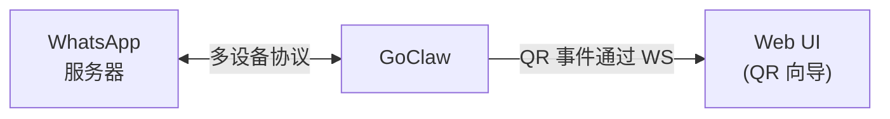

> 翻译自 [English version](/channel-whatsapp)

# WhatsApp Channel

直接集成 WhatsApp。GoClaw 直接连接 WhatsApp 多设备协议 —— 无需外部桥接或 Node.js 服务。认证状态存储在数据库中（PostgreSQL 或 SQLite）。

## 设置

1. **Channels > Add Channel > WhatsApp**
2. 选择 agent，点击 **Create & Scan QR**
3. 用 WhatsApp 扫描 QR 码（你 > 已关联的设备 > 关联设备）
4. 按需配置 DM/群组策略

就这么简单 —— 无需部署桥接，无需额外容器。

### 配置文件设置

通过配置文件（而非 DB 实例）设置 channel：

```json
{
  "channels": {
    "whatsapp": {
      "enabled": true,
      "dm_policy": "pairing",
      "group_policy": "pairing"
    }
  }
}
```

## 配置

所有配置项位于 `channels.whatsapp`（配置文件）或实例配置 JSON（DB）：

| 配置项 | 类型 | 默认值 | 说明 |
|--------|------|--------|------|
| `enabled` | bool | `false` | 启用/禁用 channel |
| `allow_from` | list | -- | 用户/群组 ID 白名单 |
| `dm_policy` | string | `"pairing"` | `pairing`、`open`、`allowlist`、`disabled` |
| `group_policy` | string | `"pairing"`（DB）/ `"open"`（配置） | `pairing`、`open`、`allowlist`、`disabled` |
| `require_mention` | bool | `false` | 仅在群组中被 @提及时回复 |
| `history_limit` | int | `200` | 群组上下文最大待处理消息数（0=禁用） |
| `block_reply` | bool | -- | 覆盖 gateway block_reply（nil=继承） |

## 架构



- **GoClaw** 通过多设备协议直接连接 WhatsApp 服务器
- 认证状态存储在数据库 —— 重启后保留
- 一个 channel 实例 = 一个 WhatsApp 手机号
- 无桥接、无 Node.js、无共享卷

## 功能特性

### QR 码认证

WhatsApp 需要扫描 QR 码来关联设备。流程：

1. GoClaw 生成 QR 码用于设备关联
2. QR 字符串编码为 PNG（base64）并通过 WS 事件发送到 UI 向导
3. Web UI 显示 QR 图片
4. 用户用 WhatsApp 扫描（你 > 已关联的设备 > 关联设备）
5. 连接事件确认认证成功

**重新认证**：在 channels 表中点击"Re-authenticate"按钮强制新 QR 扫描（登出当前 WhatsApp 会话并删除已存储的设备凭据）。

### DM 和群组策略

WhatsApp 群组的 chat ID 以 `@g.us` 结尾：

- **DM**：`"1234567890@s.whatsapp.net"`
- **群组**：`"120363012345@g.us"`

可用策略：

| 策略 | 行为 |
|------|------|
| `open` | 接受所有消息 |
| `pairing` | 需要配对码审批（DB 实例默认） |
| `allowlist` | 仅 `allow_from` 中的用户 |
| `disabled` | 拒绝所有消息 |

群组 `pairing` 策略：未配对的群组会收到配对码回复。通过 `goclaw pairing approve <CODE>` 审批。

### @提及过滤

当 `require_mention` 为 `true` 时，机器人仅在群聊中被明确 @提及时才回复。未提及的消息会被记录用于上下文 —— 当机器人被提及时，近期群组历史会被添加到消息前面。

失败关闭 —— 如果机器人的 JID 未知，消息将被忽略。

### 媒体支持

GoClaw 直接下载收到的媒体（图片、视频、音频、文档、贴纸）到临时文件，然后传入 agent 管道。

支持的入站媒体类型：image、video、audio、document、sticker（每个最大 20 MB）。

出站媒体：GoClaw 将文件上传到 WhatsApp 服务器并进行适当加密。支持带标题的 image、video、audio 和 document 类型。

### 消息格式化

LLM 输出从 Markdown 转换为 WhatsApp 原生格式：

| Markdown | WhatsApp | 显示效果 |
|----------|----------|----------|
| `**bold**` | `*bold*` | **bold** |
| `_italic_` | `_italic_` | _italic_ |
| `~~strikethrough~~` | `~strikethrough~` | ~~strikethrough~~ |
| `` `inline code` `` | `` `inline code` `` | `code` |
| `# Header` | `*Header*` | **Header** |
| `[text](url)` | `text url` | text url |
| `- list item` | `• list item` | • list item |

围栏代码块保持为 ` ``` `。来自 LLM 输出的 HTML 标签在转换前预处理为 Markdown 等效形式。长消息自动在约 4096 个字符处分割，在段落或行边界处断开。

### 输入指示器

GoClaw 在 agent 处理消息时在 WhatsApp 中显示"正在输入..."。WhatsApp 在约 10 秒后清除指示器，因此 GoClaw 每 8 秒刷新一次直到回复发送。

### 自动重连

自动处理重连。如果连接断开：
- 内置重连逻辑处理重试
- Channel 健康状态更新（degraded → healthy 重连后）
- 无需手动重连循环

### LID 寻址

WhatsApp 使用双重身份：phone JID（`@s.whatsapp.net`）和 LID（`@lid`）。群组可能使用 LID 寻址。GoClaw 标准化为 phone JID 以确保策略检查、配对查找和白名单的一致性。

## 故障排查

| 问题 | 解决方案 |
|------|----------|
| 不显示 QR 码 | 检查 GoClaw 日志。确保服务器能连接 WhatsApp 服务器（端口 443、5222）。 |
| 扫描 QR 但未认证 | 认证状态可能损坏。使用"Re-authenticate"按钮或重启 channel。 |
| 未收到消息 | 检查 `dm_policy` 和 `group_policy`。如果是 `pairing`，用户/群组需要通过 `goclaw pairing approve` 审批。 |
| 未收到媒体 | 检查 GoClaw 日志中的"media download failed"。确保临时目录可写。每个文件最大 20 MB。 |
| 输入指示器卡住 | GoClaw 在发送回复时自动取消 typing。如果卡住，WhatsApp 连接可能已断开 —— 检查 channel 健康状态。 |
| 群组消息被忽略 | 检查 `group_policy`。如果是 `pairing`，群组需要审批。如果 `require_mention` 为 true，@提及机器人。 |
| 日志中出现"logged out" | WhatsApp 撤销了会话。使用"Re-authenticate"按钮扫描新 QR 码。 |
| 启动时 `bridge_url` 错误 | `bridge_url` 已不再支持。WhatsApp 现在原生运行 —— 从 config/credentials 中删除 `bridge_url`。 |

## 从桥接迁移

如果您之前使用 Baileys 桥接（`bridge_url` 配置）：

1. 从 channel 配置或凭据中删除 `bridge_url`
2. 删除/停止桥接容器（不再需要）
3. 删除桥接共享卷（`wa_media`）
4. 在 UI 中通过 QR 扫描重新认证（桥接的认证状态不兼容）

GoClaw 会检测旧的 `bridge_url` 配置并显示清晰的迁移错误。

## 下一步

- [概览](/channels-overview) — Channel 概念和策略
- [Telegram](/channel-telegram) — Telegram bot 设置
- [Larksuite](/channel-feishu) — Larksuite 集成
- [Browser Pairing](/channel-browser-pairing) — 配对流程

<!-- goclaw-source: 050aafc9 | 更新: 2026-04-09 -->
