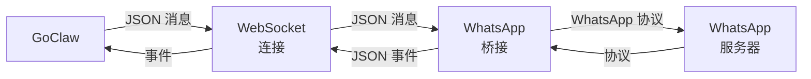

> 翻译自 [English version](/channel-whatsapp)

# WhatsApp Channel

通过外部 WebSocket 桥接集成 WhatsApp。GoClaw 连接到处理 WhatsApp 协议的桥接服务（如 whatsapp-web.js）。

## 设置

**前置条件：**
- 运行中的 WhatsApp 桥接服务（如 whatsapp-web.js）
- GoClaw 可访问的桥接 URL

**启动 WhatsApp 桥接：**

以 whatsapp-web.js 为例：

```bash
npm install -g whatsapp-web.js
# 在 localhost:3001 启动桥接服务器
whatsapp-bridge --port 3001
```

桥接应暴露 WebSocket 端点（如 `ws://localhost:3001`）。

**启用 WhatsApp：**

```json
{
  "channels": {
    "whatsapp": {
      "enabled": true,
      "bridge_url": "ws://localhost:3001",
      "dm_policy": "open",
      "group_policy": "open",
      "allow_from": []
    }
  }
}
```

## 配置

所有配置项位于 `channels.whatsapp`：

| 配置项 | 类型 | 默认值 | 说明 |
|-----|------|---------|-------------|
| `enabled` | bool | false | 启用/禁用 channel |
| `bridge_url` | string | 必填 | 到桥接的 WebSocket URL（如 `ws://bridge:3001`） |
| `allow_from` | list | -- | 用户/群组 ID 白名单 |
| `dm_policy` | string | `"open"` | `open`、`allowlist`、`pairing`、`disabled` |
| `group_policy` | string | `"open"` | `open`、`allowlist`、`disabled` |
| `block_reply` | bool | -- | 覆盖 gateway block_reply（nil=继承） |

## 功能特性

### 桥接连接

GoClaw 通过 WebSocket 连接到桥接，发送/接收 JSON 消息。



### DM 和群组支持

桥接通过 chat ID 后缀 `@g.us` 检测群聊：

- **DM**：`"1234567890@c.us"`
- **群组**：`"123-456@g.us"`

策略相应应用（DM 使用 DM 策略，群组使用群组策略）。

### 消息格式

消息为 JSON 对象：

```json
{
  "from": "1234567890@c.us",
  "body": "Hello!",
  "type": "chat",
  "id": "message_id_123"
}
```

媒体以文件路径数组传递：

```json
{
  "from": "1234567890@c.us",
  "body": "Photo",
  "media": ["/tmp/photo.jpg"],
  "type": "image"
}
```

### 自动重连

若桥接连接断开：
- 指数退避：1s → 最大 30s
- 持续重试
- 重连失败时日志警告

## 常用模式

### 发送到聊天

```go
manager.SendToChannel(ctx, "whatsapp", "1234567890@c.us", "Hello!")
```

### 检查是否为群组

```go
isGroup := strings.HasSuffix(chatID, "@g.us")
```

## 故障排查

| 问题 | 解决方案 |
|-------|----------|
| "Connection refused" | 验证桥接是否运行。检查 `bridge_url` 是否正确且可访问。 |
| "WebSocket: close normal closure" | 桥接已优雅关闭。重启桥接服务。 |
| 持续重连尝试 | 桥接已关闭或不可达。检查桥接日志。 |
| 未收到消息 | 验证桥接是否接收 WhatsApp 事件。检查桥接日志。 |
| 群组检测失败 | 确保群组 chat ID 以 `@g.us` 结尾，DM 以 `@c.us` 结尾。 |
| 媒体未发送 | 确保文件路径对桥接可访问。检查桥接是否支持媒体。 |

## 下一步

- [概览](/channels-overview) — Channel 概念和策略
- [Telegram](/channel-telegram) — Telegram bot 设置
- [Larksuite](/channel-feishu) — Larksuite 集成
- [Browser Pairing](/channel-browser-pairing) — 配对流程

<!-- goclaw-source: 57754a5 | 更新: 2026-03-18 -->
