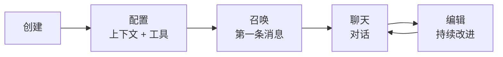

> 翻译自 [English version](/agents-explained)

# Agent 详解

> Agent 是什么、如何工作，以及开放型与预定义型的区别。

## 概述

GoClaw 中的 agent 是具备个性、工具和记忆的 LLM。你配置它知道什么（上下文文件）、能做什么（工具），以及由哪个 LLM 驱动（provider + 模型）。每个 agent 在独立循环中运行，独立处理对话。

## Agent 的构成

一个 agent 由四个要素组成：

1. **LLM** — 生成响应的语言模型（provider + 模型）
2. **上下文文件** — 定义个性、知识和规则的 Markdown 文件
3. **工具** — agent 能做什么（搜索、代码、浏览等）
4. **记忆** — 跨对话持久化的长期事实

## Agent 类型

GoClaw 有两种具有不同共享模型的 agent 类型：

### 开放型 Agent（Open Agent）

每个用户获得所有上下文文件的完整副本。每个用户都可以完全自定义 agent 的个性、指令和行为——agent 针对每个用户独立调整，文件在 session 间持久化。

- 所有 7 个上下文文件均为每用户独立（包括 MEMORY.md）
- 用户可以读写任意文件（SOUL.md、IDENTITY.md、AGENTS.md、USER.md 等）
- 新用户从 agent 级模板开始，随着自定义逐渐差异化
- 适合：个人助手、个人工作流、快速原型和测试（每个用户可以调整个性而不影响他人）

### 预定义型 Agent（Predefined Agent）

agent 有固定的共享个性，用户无法通过聊天更改。每个用户只有个人档案文件。可以将其理解为企业聊天机器人——对所有人的品牌声音一致，但它知道你是谁。

- 4 个上下文文件跨所有用户共享（SOUL、IDENTITY、AGENTS、TOOLS）——聊天中只读
- 3 个文件每用户独立（USER.md、USER_PREDEFINED.md、BOOTSTRAP.md）
- 共享文件只能从管理 dashboard 编辑（不能通过对话修改）
- 适合：团队机器人、品牌助手、需要一致个性的客户支持

| 方面 | 开放型 | 预定义型 |
|------|--------|----------|
| Agent 级文件 | 模板（复制给每个用户） | 4 个共享（SOUL、IDENTITY、AGENTS、TOOLS） |
| 每用户文件 | 全部 7 个 | 3 个（USER.md、USER_PREDEFINED.md、BOOTSTRAP.md） |
| 用户可通过聊天编辑 | 所有文件 | 仅 USER.md |
| 个性 | 每用户差异化 | 固定，所有人相同 |
| 使用场景 | 个人助手 | 团队/企业机器人 |

## 上下文文件

每个 agent 最多有 7 个上下文文件来塑造其行为：

| 文件 | 用途 | 示例内容 |
|------|------|----------|
| `AGENTS.md` | 操作指令、记忆规则、安全准则 | "Always save important facts to memory..." |
| `SOUL.md` | 个性和语气 | "You are a friendly coding mentor..." |
| `IDENTITY.md` | 名称、头像、问候语 | "Name: CodeBot, Emoji: 🤖" |
| `TOOLS.md` | 工具使用指南 *（仅从文件系统加载——不经 DB 路由，排除在上下文文件拦截器外）* | "Use web_search for current events..." |
| `USER.md` | 用户档案、时区、偏好 | "Timezone: Asia/Saigon, Language: Vietnamese" |
| `USER_PREDEFINED.md` | 预定义 agent 用户档案 *（仅预定义 agent，在 agent 级别替换 USER.md）* | "Team member info, shared preferences..." |
| `BOOTSTRAP.md` | 首次运行仪式（完成后自动删除） | "Introduce yourself and learn about the user..." |

加上 `MEMORY.md`——agent 自动更新的持久化笔记（路由到记忆系统）。

上下文文件是 Markdown 格式。通过 Web dashboard、API 编辑，或让 agent 在对话中修改。

### 截断

大型上下文文件自动截断以适配 LLM 的上下文窗口：
- 每文件限制：20,000 字符
- 总预算：24,000 字符
- 截断保留开头 70% 和结尾 20%

## Agent 生命周期



1. **创建** — 通过 dashboard 或 API 定义 agent 名称、provider、模型
2. **配置** — 编写上下文文件，设置工具权限
3. **召唤** — 发送第一条消息；bootstrap 文件自动播种
4. **聊天** — 持续对话，带记忆和工具使用
5. **编辑** — 根据需要完善上下文文件、调整设置

## Agent 访问控制

当用户尝试访问 agent 时，GoClaw 按顺序检查：

1. Agent 是否存在？
2. 是否为默认 agent？→ 允许（所有人都可使用默认 agent）
3. 用户是否为所有者？→ 以所有者角色允许
4. 用户是否有共享记录？→ 以共享角色允许

角色：`admin`（完全控制）、`operator`（使用 + 编辑）、`viewer`（只读）

## Agent 路由

`bindings` 配置将 channel 映射到 agent：

```jsonc
{
  "bindings": {
    "telegram": {
      "direct": {
        "386246614": "code-helper"  // 此用户与 code-helper 对话
      },
      "group": {
        "-100123456": "team-bot"    // 此群组使用 team-bot
      }
    }
  }
}
```

未绑定的对话转到默认 agent。

## 常见问题

| 问题 | 解决方案 |
|------|----------|
| Agent 忽略指令 | 检查 SOUL.md 和 AGENTS.md 内容；确保上下文文件未被截断 |
| "Agent not found" 错误 | 在 dashboard 中验证 agent 存在；检查 config 中的 `agents.list` |
| 上下文文件未更新 | 对于预定义 agent，共享文件更新影响所有用户；每用户文件需要每用户单独编辑 |

## Agent 状态

Agent 可以处于以下四种状态之一：

| 状态 | 含义 |
|------|------|
| `active` | Agent 正在运行并接受对话 |
| `inactive` | Agent 已禁用；对话被拒绝 |
| `summoning` | Agent 正在首次初始化 |
| `summon_failed` | 初始化失败；检查 provider 配置和模型可用性 |

## 自我进化

启用 `self_evolve` 的预定义 agent 可以在对话中更新自己的 `SOUL.md`。这允许 agent 的语气和风格随着交互逐渐演进。更新在 agent 级别应用并影响所有用户。其他共享文件（IDENTITY.md、AGENTS.md）受到保护，只能从 dashboard 编辑。

## 系统提示词模式

GoClaw 以两种模式构建系统提示词：

- **PromptFull** — 用于主 agent 运行。包含全部 19+ 部分：skills、MCP 工具、记忆召回、用户身份、消息传递、静默回复规则和完整上下文文件。
- **PromptMinimal** — 用于子 agent（通过 `spawn` 工具生成）和 cron 任务。精简上下文，只包含必要部分（工具、安全、工作空间、bootstrap 文件）。减少轻量操作的启动时间和 token 用量。

## NO_REPLY 抑制

Agent 可以在最终响应中发出 `NO_REPLY` 信号，以抑制向用户发送可见回复。GoClaw 在响应最终化期间检测此字符串，并完全跳过消息投递——即"静默完成"。记忆刷新 agent 在没有内容需要存储时内部使用此功能，自定义 agent 指令也可用于类似的静默操作场景。

## 循环中压缩（Mid-Loop Compaction）

在长时间运行的任务中，GoClaw 会在**循环过程中**触发上下文压缩——而不仅仅是在运行完成后。当提示词 token 超过上下文窗口的 75%（可通过 `MaxHistoryShare` 配置，默认 `0.75`）时，agent 会总结内存中约前 70% 的消息，保留后 30%，然后继续迭代。这防止了上下文溢出而不中止当前任务。

## 自动摘要和记忆刷新

每次对话运行结束后，GoClaw 评估是否需要压缩 session 历史：

- **触发条件**：历史超过 50 条消息，或估计 token 超过上下文窗口的 75%
- **首先记忆刷新**（同步）：agent 在历史被截断前将重要事实写入 `memory/YYYY-MM-DD.md` 文件
- **摘要**（后台）：LLM 总结旧消息；历史截断到最后 4 条消息；摘要保存用于下次 session

## 身份锚定

预定义 agent 内置了抵御社会工程的保护。如果用户试图说服 agent 忽略其 SOUL.md 或在其定义身份之外行事，agent 被设计为抵制此类操作。共享身份文件以高于用户指令优先级的方式注入系统提示词。

## 子 Agent 增强

当 agent 通过 `spawn` 工具生成子 agent 时，以下能力生效：

### 按 Edition 限速

`Edition` 结构体对子 agent 使用强制执行两项租户级限制：

| 字段 | 描述 |
|------|------|
| `MaxSubagentConcurrent` | 每租户并行运行的最大子 agent 数 |
| `MaxSubagentDepth` | 最大嵌套深度——防止无限委托链 |

这些限制按 edition 设置，并在 spawn 时强制执行。

### Token 成本追踪

每个子 agent 累计每次调用的输入和输出 token 数。总量持久化到数据库并包含在 announce 消息中，让父 agent 对委托成本有完整的了解。

### WaitAll 编排

`spawn(action=wait, timeout=N)` 阻塞父 agent 直到所有已 spawn 的子 agent 完成。无需轮询即可实现 fan-out/fan-in 模式。

### 带退避的 Auto-Retry

可配置的 `MaxRetries`（默认 `2`）采用线性退避自动处理瞬时 LLM 故障。只有在所有重试耗尽后发生永久故障时才通知父 agent。

### SubagentDenyAlways

子 agent 不能 spawn 嵌套子 agent——`team_tasks` 工具在子 agent 上下文中被屏蔽。所有委托必须源自顶层 agent。

### 生产者-消费者 Announce 队列

错开的子 agent 结果被排队并合并为父 agent 侧的单次 LLM run 通知。当多个子 agent 在不同时间完成时，这减少了不必要的父 agent 唤醒。

## 下一步

- [Sessions 和历史](/sessions-and-history) — 对话如何持久化
- [工具概览](/tools-overview) — Agent 可以使用哪些工具
- [记忆系统](/memory-system) — 长期记忆和搜索

<!-- goclaw-source: c388364d | 更新: 2026-04-01 -->
