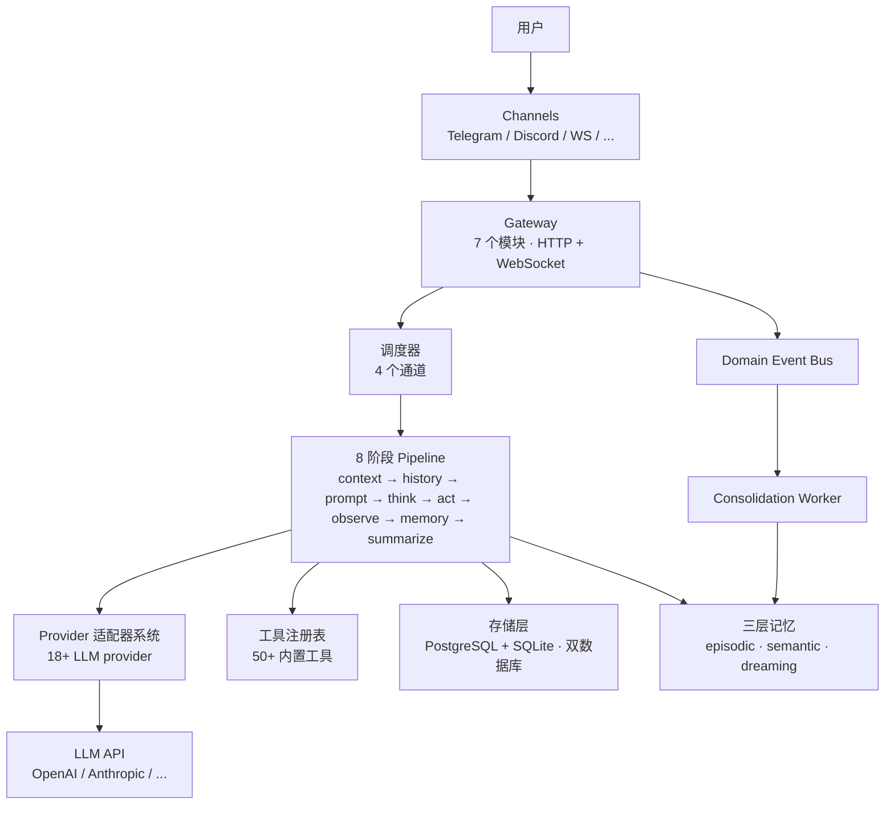

> 翻译自 [English version](/how-goclaw-works)

# GoClaw 工作原理

> GoClaw AI agent gateway 背后的架构。

## 概述

GoClaw 是一个 gateway，位于你的用户和 LLM provider 之间。它管理 AI 对话的完整生命周期：接收消息、将其路由到 agent、调用 LLM、执行工具，并通过消息 channel 将响应返回给用户。

## 架构图



## 8 阶段 Pipeline

在 v3 中，每次 agent 运行都经过**可插拔的 8 阶段 pipeline**。旧的双模式切换已被移除——所有 agent 始终使用此 pipeline。

```
Setup（运行一次）
└─ ContextStage — 注入 agent/用户/工作空间上下文

迭代循环（每轮最多 20 次）
├─ ThinkStage   — 构建系统提示词、过滤工具、调用 LLM
├─ PruneStage   — 裁剪上下文（需要时触发记忆刷新）
├─ ToolStage    — 执行工具调用（尽可能并行）
├─ ObserveStage — 处理工具结果，追加到消息缓冲区
└─ CheckpointStage — 跟踪迭代次数，检查退出条件

Finalize（运行一次，即使被取消也会执行）
└─ FinalizeStage — 净化输出、原子刷新消息、更新 session 元数据
```

### 阶段详情

| 阶段 | 运行时机 | 功能 |
|------|---------|------|
| **ContextStage** | Setup | 注入 agent/用户/工作空间上下文；解析每用户文件 |
| **ThinkStage** | 迭代 | 构建系统提示词（15+ 个部分），调用 LLM，发送流式 chunk |
| **PruneStage** | 迭代 | 上下文 ≥ 30% 时软裁剪，≥ 50% 时硬裁剪；触发记忆刷新 |
| **ToolStage** | 迭代 | 执行工具调用——多个调用使用并行 goroutine |
| **ObserveStage** | 迭代 | 处理工具结果；处理 `NO_REPLY` 静默完成 |
| **CheckpointStage** | 迭代 | 递增计数器；达到最大迭代次数或上下文取消时退出 |
| **FinalizeStage** | Finalize | 运行 7 步输出净化；原子刷新消息；更新 session 元数据 |

## 消息流

用户发送消息时的处理流程：

1. **接收** — 消息通过 channel 到达（Telegram、WebSocket 等）
2. **验证** — 输入守卫检查注入模式；消息在 32 KB 处截断
3. **路由** — 调度器根据 channel 绑定将消息分配给 agent
4. **排队** — 每 session 队列管理并发（DM 默认每 session 1 个；group 最多 3 个）
5. **构建上下文** — ContextStage 注入身份、工作空间、每用户文件
6. **Pipeline 循环** — 8 阶段 pipeline 每轮最多运行 20 次
7. **净化** — FinalizeStage 清理响应（移除 thinking 标签、乱码 XML、重复内容）
8. **投递** — 响应通过原始 channel 发回给用户

## 调度器通道

GoClaw 使用基于通道的调度器管理并发：

| 通道 | 并发数 | 用途 |
|------|:------:|------|
| `main` | 30 | Channel 消息和 WebSocket 请求 |
| `subagent` | 50 | 生成的子 agent 任务 |
| `team` | 100 | Agent 间委托 |
| `cron` | 30 | 定时任务 |

每个通道有独立的信号量。这防止 cron 任务抢占用户消息，也防止委托使系统过载。

> 并发限制可通过环境变量配置：`GOCLAW_LANE_MAIN`、`GOCLAW_LANE_SUBAGENT`、`GOCLAW_LANE_TEAM`、`GOCLAW_LANE_CRON`。

## 组件

| 组件 | 功能 |
|------|------|
| **Gateway** | HTTP + WebSocket 服务器；分解为 7 个模块（deps、http_wiring、events、lifecycle、tools_wiring、methods、router） |
| **Domain Event Bus** | 带 worker pool、去重和重试的类型化事件发布——驱动 consolidation worker |
| **Provider 适配器系统** | 管理 18+ LLM provider；Anthropic 原生、OpenAI 兼容、ACP（stdio JSON-RPC） |
| **工具注册表** | 50+ 内置工具，基于策略的访问控制（可通过 MCP 和自定义工具扩展） |
| **存储层** | 双数据库：PostgreSQL（`pgx/v5`）用于生产 + SQLite（`modernc.org/sqlite`）用于桌面版；共享 base/ dialect |
| **三层记忆** | Episodic（近期事实）→ Semantic（抽象摘要）→ Dreaming（新颖合成）；由 consolidation worker 驱动 |
| **编排模块** | 泛型 `BatchQueue[T]` 用于结果聚合；ChildResult 捕获；媒体转换辅助工具 |
| **Consolidation Worker** | Episodic、semantic、dreaming、dedup worker 消费 DomainEventBus 的事件 |
| **Channel 管理器** | Telegram、Discord、WhatsApp（通过 Baileys bridge 原生支持）、Zalo、Feishu 适配器 |
| **调度器** | 4 通道并发，每 session 队列 |

## v3 系统概览

GoClaw v3 新增五个系统——每个系统都有专属页面：

| 系统 | 新增功能 |
|------|---------|
| [Knowledge Vault](/knowledge-vault) | Wikilink 语义网格、BM25 + 向量混合搜索、L0 自动注入到提示词 |
| [三层记忆](/memory-system) | 由 DomainEventBus 驱动的 episodic → semantic → dreaming 整合 pipeline |
| [Agent 进化](/agent-evolution) | 追踪工具/检索使用模式；自动建议并应用提示词/工具适配 |
| [模式提示词系统](/model-steering) | 可切换的提示词模式（PromptFull 与 PromptMinimal），支持每 agent 覆盖 |
| [多租户 v3](/multi-tenancy) | 跨所有 22+ 存储接口的复合用户 ID 作用域；vault grant；skill grant |

## 常见问题

| 问题 | 解决方案 |
|------|----------|
| Agent 不响应 | 检查调度器通道并发；验证 provider API key |
| 响应缓慢 | 大上下文窗口 + 大量工具 = LLM 调用更慢；减少工具数量或上下文 |
| 工具调用失败 | 检查 `tools.exec_approval` 级别；查看 shell 命令的拒绝模式 |

## 下一步

- [Agent 详解](/agents-explained) — 深入了解 agent 类型和上下文文件
- [工具概览](/tools-overview) — 完整工具目录
- [Sessions 和历史](/sessions-and-history) — 对话如何持久化

<!-- goclaw-source: 050aafc9 | 更新: 2026-04-09 -->
