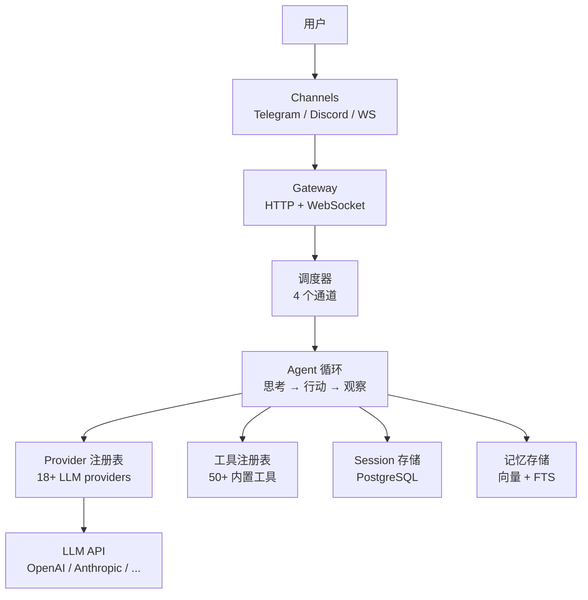
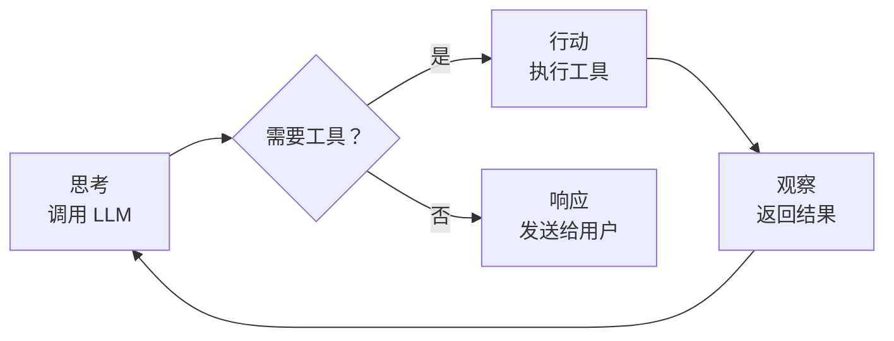

> 翻译自 [English version](/how-goclaw-works)

# GoClaw 工作原理

> GoClaw AI agent gateway 背后的架构。

## 概述

GoClaw 是一个 gateway，位于你的用户和 LLM provider 之间。它管理 AI 对话的完整生命周期：接收消息、将其路由到 agent、调用 LLM、执行工具，并通过消息 channel 将响应返回给用户。

## 架构图

## Agent 循环

每次对话轮次都经过**思考 → 行动 → 观察**循环：

### 1. 思考（Think）

Agent 组装系统提示词（20+ 个部分，包括身份、工具、记忆、上下文文件），并将对话发送给 LLM provider。LLM 决定下一步做什么。

### 2. 行动（Act）

如果 LLM 想使用工具（搜索网页、读取文件、运行代码），GoClaw 执行它。多个工具调用尽可能并行运行。

### 3. 观察（Observe）

工具结果返回给 LLM。它可以继续调用工具或生成最终响应。此循环每轮最多重复 20 次。

GoClaw 检测工具循环模式：连续 3 次相同调用后发出**警告**，连续 5 次无进展的相同调用后**强制停止**循环。注意：`exec`/`bash` 工具和 MCP bridge 工具（`mcp_*` 前缀）被视为**中性**——它们既不重置也不增加只读连续计数，因为其副作用难以判断。

## 消息流

用户发送消息时的处理流程：

1. **接收** — 消息通过 channel 到达（Telegram、WebSocket 等）
2. **验证** — 输入守卫检查注入模式；消息在 32KB 处截断
3. **路由** — 调度器根据 channel 绑定将消息分配给 agent
4. **排队** — 每 session 队列管理并发（默认每 session 1 个，串行处理）
5. **构建上下文** — 组装系统提示词：身份 + 工具 + 记忆 + 历史
6. **LLM 循环** — 思考 → 行动 → 观察循环（最多 20 次）
7. **净化** — 清理响应（移除 thinking 标签、乱码 XML、重复内容）
8. **投递** — 响应通过原始 channel 发回给用户

## 调度器通道

GoClaw 使用基于通道的调度器管理并发：

| 通道 | 并发数 | 用途 |
|------|:------:|------|
| `main` | 30 | Channel 消息和 WebSocket 请求 |
| `subagent` | 50 | 生成的子 agent 任务 |
| `team` | 100 | Agent 间委托 |
| `cron` | 30 | 定时任务 |

每个通道有独立的信号量。这防止 cron 任务抢占用户消息，也防止委托使系统过载。

> 并发限制可通过环境变量配置：`GOCLAW_LANE_MAIN`、`GOCLAW_LANE_SUBAGENT`、`GOCLAW_LANE_TEAM`、`GOCLAW_LANE_CRON`。

## 组件

| 组件 | 功能 |
|------|------|
| **Gateway** | 端口 18790 上的 HTTP + WebSocket 服务器 |
| **Provider 注册表** | 管理 18+ LLM provider 连接和凭证 |
| **工具注册表** | 50+ 内置工具，基于策略的访问控制（可通过 MCP 和自定义工具扩展） |
| **Session 存储** | 写后缓存 + PostgreSQL 持久化 |
| **记忆存储** | pgvector + tsvector 混合搜索 |
| **Channel 管理器** | Telegram、Discord、WhatsApp、Zalo、Feishu 适配器 |
| **调度器** | 4 通道并发，每 session 队列 |
| **Bootstrap** | 上下文文件模板系统（SOUL、IDENTITY、TOOLS 等） |

## 常见问题

| 问题 | 解决方案 |
|------|----------|
| Agent 不响应 | 检查调度器通道并发；验证 provider API key |
| 响应缓慢 | 大上下文窗口 + 大量工具 = LLM 调用更慢；减少工具数量或上下文 |
| 工具调用失败 | 检查 `tools.exec_approval` 级别；查看 shell 命令的拒绝模式 |

## 下一步

- [Agent 详解](/agents-explained) — 深入了解 agent 类型和上下文文件
- [工具概览](/tools-overview) — 完整工具目录
- [Sessions 和历史](/sessions-and-history) — 对话如何持久化

<!-- goclaw-source: 9168e4b4 | 更新: 2026-03-26 -->
