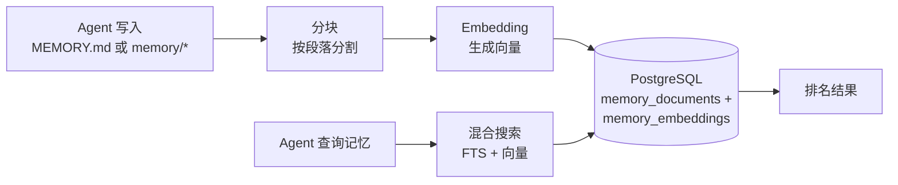

> 翻译自 [English version](/memory-system)

# 记忆系统

> Agent 如何通过混合搜索跨对话记住事实。

## 概述

GoClaw 为 agent 提供跨 session 持久化的长期记忆。当 agent 学到重要信息——你的名字、偏好、项目细节——时，会将其存储为记忆文档。之后，agent 使用全文搜索和向量相似度相结合的方式检索相关记忆。

## 工作原理

### 写入记忆

当 agent 写入 `MEMORY.md` 或 `memory/*` 中的文件时，GoClaw：

1. **拦截**文件写入（路由到数据库，而非文件系统）
2. **分块**：按段落边界分割文本（每块最多 1,000 字符）
3. **Embedding**：使用配置的 embedding provider 为每块生成向量
4. **存储**：同时保存文本（含 tsvector 用于 FTS）和 embedding 向量

> 只有 `.md` 文件会被分块和 embedding。非 Markdown 文件（如 `.json`、`.txt`）存储在数据库中，但**不会被索引，也无法通过 `memory_search` 搜索**。

### 搜索记忆

当 agent 调用 `memory_search` 时，GoClaw 运行结合 FTS 和向量相似度的混合搜索：

| 方法 | 权重 | 工作原理 |
|------|:----:|----------|
| 全文搜索（FTS） | 0.3 | PostgreSQL `tsvector` + `plainto_tsquery('simple')` — 适合精确词汇 |
| 向量相似度 | 0.7 | `pgvector` 余弦距离 — 适合语义含义 |

**加权合并算法**：FTS 分数归一化到 0..1 范围（向量分数已在 0..1），然后合并为 `(FTS × 0.3) + (向量 × 0.7)`。当只有一个渠道返回结果时，直接使用其分数（有效权重归一化为 1.0）。

结果然后按以下方式排名：

1. 每用户加成：当前用户范围内的结果获得 1.2× 乘数
2. 去重：如果用户范围和全局结果都匹配，用户副本优先
3. 按加权分数最终排序

**Embedding 缓存**：`embedding_cache` 表接入 `IndexDocument` 热路径。对未更改内容的重复重新索引会复用缓存的 embedding，而不调用 embedding provider，降低延迟和 API 成本。

**回退行为**：如果每用户搜索无结果，GoClaw 回退到全局记忆池。适用于 `MEMORY.md` 和 `memory/*.md` 文件。

### 知识图谱搜索

`knowledge_graph_search` 补充 `memory_search` 用于关系和实体查询。`memory_search` 检索事实文本块，而 `knowledge_graph_search` 遍历实体关系——适合"Alice 在做哪些项目？"或"此 agent 使用哪些工具？"等问题。

## 记忆 vs Session

| 方面 | 记忆 | Session |
|------|------|---------|
| 生命周期 | 永久（直到删除） | 每次对话 |
| 内容 | 事实、偏好、知识 | 消息历史 |
| 搜索 | 混合（FTS + 向量） | 顺序访问 |
| 范围 | 每用户每 agent | 每 session 键 |

记忆用于值得永久记住的事情。Session 用于对话流。

## 自动记忆刷新

在[自动压缩](/sessions-and-history)期间，GoClaw 在摘要历史之前从对话中提取重要事实并保存到记忆。

- **触发条件**：>50 条消息，或 >85% 上下文窗口（任一条件触发压缩）
- **过程**：同步刷新，最多 5 次迭代，90 秒超时
- **保存内容**：关键事实、用户偏好、决策、行动项
- **顺序**：记忆刷新在历史压缩**之前**运行——事实先持久化，然后历史被摘要和截断

记忆刷新只作为自动压缩的一部分触发——不独立运行。刷新在压缩锁内同步运行，并将提取的事实追加到 `memory/YYYY-MM-DD.md`。这意味着 agent 逐渐积累对每个用户的了解，无需明确的"记住这个"命令。

### 提取式记忆回退

如果基于 LLM 的刷新失败（超时、provider 错误、错误输出），GoClaw 回退到**提取式记忆**：对对话进行基于关键词的扫描，无需 LLM 调用即可提取关键事实。这确保即使 LLM 不可用时也能保存记忆，代价是提取质量较低。

## 记忆文件变体

GoClaw 识别四种记忆文件类型：

| 文件 | 角色 | 说明 |
|------|------|------|
| `MEMORY.md` | 精选记忆（Markdown） | 主文件；自动包含在系统提示词中 |
| `memory.md` | `MEMORY.md` 的回退 | 当 `MEMORY.md` 不存在时检查 |
| `MEMORY.json` | 机器可读索引 | 已弃用——不再推荐 |
| 内联（`memory/*.md`） | 来自自动刷新的日期戳文件 | 已索引且可搜索；如 `memory/2026-03-23.md` |

所有 `.md` 变体均被分块、embedding 并可通过 `memory_search` 搜索。`MEMORY.json` 存储但不被索引。

## 需求

记忆需要：

- **PostgreSQL 15+** 含 `pgvector` 扩展
- 已配置的 **embedding provider**（OpenAI、Anthropic 或兼容的）
- Agent 配置中 `memory: true`（默认启用）

在 agent 配置中设置 `memory: false` 可完全禁用该 agent 的记忆——不读取、不写入、不自动刷新。

## 团队记忆共享

当 agent 作为[团队](#agent-teams)工作时，团队成员可以**只读访问 leader 的记忆**：

- **`memory_search`**：先搜索成员自身记忆。无结果时，自动回退到 leader 的记忆并合并结果。
- **`memory_get`**：先读取成员自身记忆。未找到文件时，回退到 leader 的记忆。
- **写入被阻止**：团队成员不能保存或修改记忆文件——只有 leader 可以写入。成员尝试写入会收到：*"memory is read-only for team members"*。

这允许团队内知识共享而无需复制。Leader 积累共享知识，所有成员自动受益。

## 常见问题

| 问题 | 解决方案 |
|------|----------|
| 记忆搜索无结果 | 检查 pgvector 扩展是否已安装；验证 embedding provider 已配置 |
| Agent 忘记事情 | 确认配置中 `memory: true`；检查自动压缩是否在运行 |
| 出现不相关的记忆 | 记忆随时间积累；考虑通过 API 清除旧记忆 |

## 下一步

- [多租户](/multi-tenancy) — 每用户记忆隔离
- [Sessions 和历史](/sessions-and-history) — 对话历史的工作原理
- [Agent 详解](/agents-explained) — Agent 类型和上下文文件

<!-- goclaw-source: 6551c2d1 | 更新: 2026-03-27 -->
