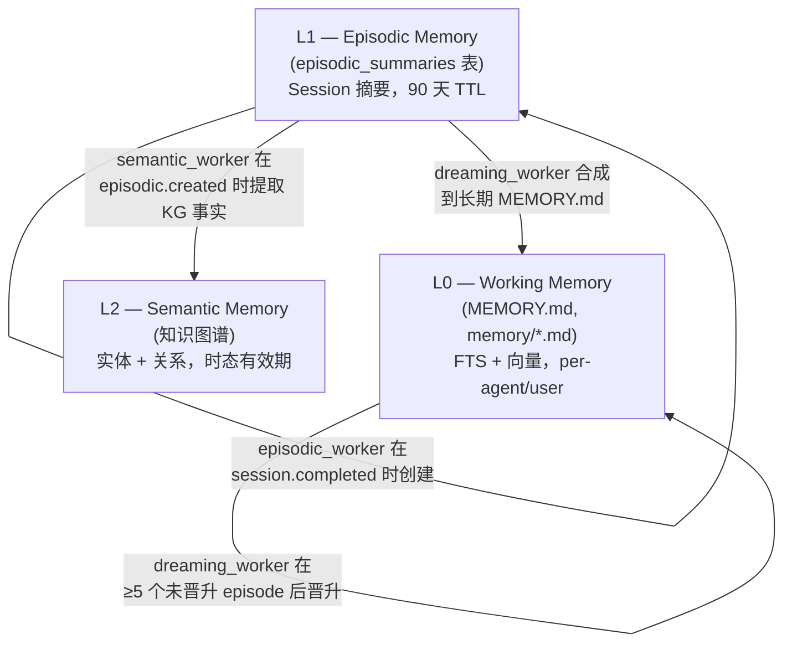
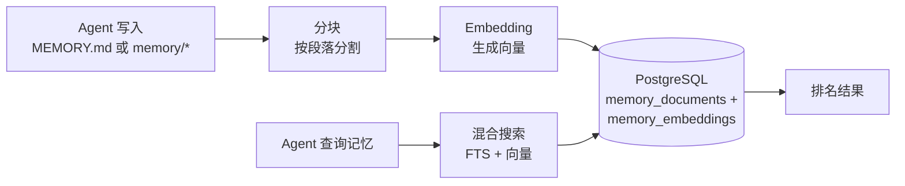
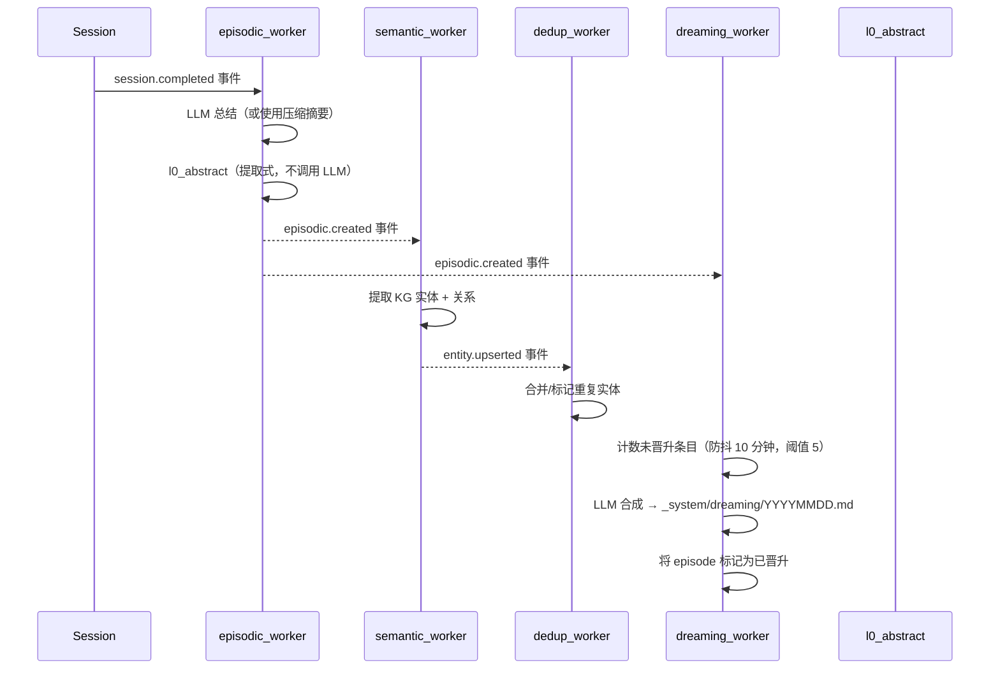

> 翻译自 [English version](/memory-system)

# 记忆系统

> Agent 如何通过三层架构与自动整合跨对话记住事实。

## 概述

GoClaw v3 为 agent 提供跨 session 持久化的长期记忆。记忆组织为三个层级 — working memory、episodic memory 和 semantic memory — 每层在记忆生命周期中承担不同职责。后台整合 pipeline 自动跨层晋升记忆，无需 agent 干预。

## 三层记忆架构

| 层级 | 存储 | 内容 | 生命周期 | 搜索 |
|------|------|------|---------|------|
| **L0 Working** | `memory_documents` + `memory_embeddings` | Agent 整理的事实、auto-flush 笔记、dreaming 输出 | 永久（直到删除） | FTS + 向量混合 |
| **L1 Episodic** | `episodic_summaries` | Session 摘要、关键主题、L0 摘要 | 90 天（可配置） | FTS + HNSW 向量 |
| **L2 Semantic** | 知识图谱表 | 实体、关系、时态有效期窗口 | 永久 | 图遍历 |

### 层级边界与晋升规则

- **Session → L1**：Session 完成时，`episodic_worker` 将其总结为 `episodic_summaries` 中的一行。如有压缩摘要则使用；否则读取 session 消息并调用 LLM（30 秒超时，最多 1,024 token）。
- **L1 → L2**：每次创建 episodic 摘要后，`semantic_worker` 从摘要文本中提取 KG 实体和关系，并以时态有效期（`valid_from` = now）写入知识图谱。
- **L1 → L0**：当某 agent/user 对积累 ≥5 个未晋升的 episodic 条目时，`dreaming_worker` 将其合成为长期 Markdown 文档写入 `_system/dreaming/YYYYMMDD-consolidated.md`，并将这些 episode 标记为已晋升。

## 工作原理

### 写入记忆（L0）

当 agent 写入 `MEMORY.md` 或 `memory/*` 中的文件时，GoClaw：

1. **拦截**文件写入（路由到数据库，而非文件系统）
2. **分块**：按段落边界分割文本（每块最多 1,000 字符）
3. **Embedding**：使用配置的 embedding provider 为每块生成向量
4. **存储**：同时保存文本（含 tsvector 用于 FTS）和 embedding 向量

> 只有 `.md` 文件会被分块和 embedding。非 Markdown 文件（如 `.json`、`.txt`）存储在数据库中，但**不会被索引，也无法通过 `memory_search` 搜索**。

### 搜索记忆

当 agent 调用 `memory_search` 时，GoClaw 运行结合 FTS 和向量相似度的混合搜索：

| 方法 | 权重 | 工作原理 |
|------|:----:|----------|
| 全文搜索（FTS） | 0.3 | PostgreSQL `tsvector` + `plainto_tsquery('simple')` — 适合精确词汇 |
| 向量相似度 | 0.7 | `pgvector` 余弦距离 — 适合语义含义 |

**加权合并算法**：FTS 分数归一化到 0..1 范围（向量分数已在 0..1），然后合并为 `(FTS × 0.3) + (向量 × 0.7)`。当只有一个渠道返回结果时，直接使用其分数（有效权重归一化为 1.0）。

结果然后按以下方式排名：

1. 每用户加成：当前用户范围内的结果获得 1.2× 乘数
2. 去重：如果用户范围和全局结果都匹配，用户副本优先
3. 按加权分数最终排序

**Embedding 缓存**：`embedding_cache` 表接入 `IndexDocument` 热路径。对未更改内容的重复重新索引会复用缓存的 embedding，而不调用 embedding provider，降低延迟和 API 成本。

**回退行为**：如果每用户搜索无结果，GoClaw 回退到全局记忆池。适用于 `MEMORY.md` 和 `memory/*.md` 文件。

### 知识图谱搜索

`knowledge_graph_search` 补充 `memory_search` 用于关系和实体查询。`memory_search` 检索事实文本块，而 `knowledge_graph_search` 遍历实体关系——适合"Alice 在做哪些项目？"或"此 agent 使用哪些工具？"等问题。

## 整合 Worker

整合 pipeline 完全在后台运行，通过内部 event bus 以事件驱动方式工作。Worker 在启动时通过 `consolidation.Register()` 注册一次，并订阅领域事件。

### `episodic_worker`

**触发**：`session.completed` 事件
**操作**：为每个完成的 session 创建一行 `episodic_summaries`。

- 检查 `source_id`（`sessionKey:compactionCount`）防止重复摘要。
- 如有压缩摘要则使用；否则读取 session 消息并调用 LLM（30 秒超时）。
- 生成 **L0 摘要** — 提取式单句摘要（~200 个 rune），用于快速上下文注入，不调用 LLM。
- 将大写专有名词短语提取为 `key_topics`，用于 FTS 增强。
- 将 `expires_at` 设为创建后 90 天（可通过 `episodic_ttl_days` 配置）。
- 发布 `episodic.created` 供下游 worker 使用。

### `semantic_worker`

**触发**：`episodic.created` 事件
**操作**：从 episodic 摘要文本中提取知识图谱实体和关系。

- 调用 `EntityExtractor`（KG 提取，非原始 LLM 调用）。
- 为提取的实体标记 `valid_from = now()`，并按 `agent_id` + `user_id` 限定范围。
- 通过 `IngestExtraction` 写入 KG store。
- 发布 `entity.upserted` 供 dedup worker 使用。
- 失败为非致命 — 提取错误记录为警告，不阻塞 pipeline。

### `dedup_worker`

**触发**：`entity.upserted` 事件
**操作**：每次提取批次后检测并合并重复 KG 实体。

- 以新 upsert 的实体 ID 调用 `kgStore.DedupAfterExtraction`。
- 合并语义等价实体，标记模糊实体。
- 终端 worker — 无下游事件。
- 失败为非致命。

### `dreaming_worker`

**触发**：`episodic.created` 事件
**操作**：将未晋升的 episodic 摘要整合为长期 L0 记忆。

- **防抖**：同一 agent/user 对在 10 分钟内已运行则跳过。
- **阈值**：运行前需要 ≥5 个未晋升的 episodic 条目（可配置）。
- 获取最多 10 个未晋升条目，调用 LLM 合成长期事实（最多 4,096 token）。
- 合成提示提取：用户偏好、项目事实、重复模式、关键决策。
- 将输出写入 L0 记忆中的 `_system/dreaming/YYYYMMDD-consolidated.md` 并建立搜索索引。
- 将所有已处理条目标记为 `promoted_at = now()`。

### `l0_abstract`

非独立 worker — 由 `episodic_worker` 调用的工具函数，从完整摘要生成简短 L0 摘要。使用提取式句子分割方法（不调用 LLM，无额外延迟）。摘要存储在 `episodic_summaries` 的 `l0_abstract` 列中，供 auto-injector 使用。

**定期清理**：一个 goroutine 每 6 小时运行一次，删除超过 `expires_at` 的 episodic 摘要。

## Auto-Injector

**Auto-injector** 在每个 turn 开始时、LLM 调用之前，自动将相关记忆注入 agent 的 system prompt。

- **接口**：`AutoInjector.Inject(ctx, InjectParams)` — 在上下文构建阶段每个 turn 调用一次。
- **工作原理**：对照记忆索引检查用户消息。返回 system prompt 的格式化部分（若无相关内容则返回空字符串）。预算：最多约 200 token 的 L0 摘要。
- **默认参数**（可在 `agents.settings` JSONB 中按 agent 覆盖）：

| 参数 | 默认值 | 描述 |
|------|--------|------|
| `auto_inject_enabled` | `true` | 启用/禁用自动注入 |
| `auto_inject_threshold` | `0.3` | 记忆被注入的最低相关度分数（0–1） |
| `auto_inject_max_tokens` | `200` | 注入记忆部分的 token 预算 |
| `episodic_ttl_days` | `90` | episodic 摘要过期前的天数 |
| `consolidation_enabled` | `true` | 启用/禁用整合 pipeline |

Injector 返回包含可观测字段的 `InjectResult`：`MatchCount`、`Injected` 和 `TopScore`。

## Trivial Filter

**Trivial filter** 阻止低价值消息触发记忆注入，减少不必要的数据库查询。

`isTrivialMessage(msg)` 在消息去除停用词后包含少于 3 个有意义词时返回 `true`（问候语如"hi"、"ok"、"thanks"，确认语，单词回复）。Trivial 消息完全跳过 auto-injector。

## 记忆 vs Session

| 方面 | 记忆 | Session |
|------|------|---------|
| 生命周期 | 永久（直到删除） | 每次对话 |
| 内容 | 事实、偏好、知识 | 消息历史 |
| 搜索 | 混合（FTS + 向量） | 顺序访问 |
| 范围 | 每用户每 agent | 每 session 键 |

记忆用于值得永久记住的事情。Session 用于对话流。

## 自动记忆刷新

在[自动压缩](/sessions-and-history)期间，GoClaw 在摘要历史之前从对话中提取重要事实并保存到记忆。

- **触发条件**：>50 条消息，或 >85% 上下文窗口（任一条件触发压缩）
- **过程**：同步刷新，最多 5 次迭代，90 秒超时
- **保存内容**：关键事实、用户偏好、决策、行动项
- **顺序**：记忆刷新在历史压缩**之前**运行——事实先持久化，然后历史被摘要和截断

记忆刷新只作为自动压缩的一部分触发——不独立运行。刷新在压缩锁内同步运行，并将提取的事实追加到 `memory/YYYY-MM-DD.md`。这意味着 agent 逐渐积累对每个用户的了解，无需明确的"记住这个"命令。

### 提取式记忆回退

如果基于 LLM 的刷新失败（超时、provider 错误、错误输出），GoClaw 回退到**提取式记忆**：对对话进行基于关键词的扫描，无需 LLM 调用即可提取关键事实。这确保即使 LLM 不可用时也能保存记忆，代价是提取质量较低。

## 记忆文件变体

GoClaw 识别四种记忆文件类型：

| 文件 | 角色 | 说明 |
|------|------|------|
| `MEMORY.md` | 精选记忆（Markdown） | 主文件；自动包含在系统提示词中 |
| `memory.md` | `MEMORY.md` 的回退 | 当 `MEMORY.md` 不存在时检查 |
| `MEMORY.json` | 机器可读索引 | 已弃用——不再推荐 |
| 内联（`memory/*.md`） | 来自自动刷新的日期戳文件 | 已索引且可搜索；如 `memory/2026-03-23.md` |

所有 `.md` 变体均被分块、embedding 并可通过 `memory_search` 搜索。`MEMORY.json` 存储但不被索引。

## 需求

记忆需要：

- **PostgreSQL 15+** 含 `pgvector` 扩展
- 已配置的 **embedding provider**（OpenAI、Anthropic 或兼容的）
- Agent 配置中 `memory: true`（默认启用）

在 agent 配置中设置 `memory: false` 可完全禁用该 agent 的记忆——不读取、不写入、不自动刷新。

## 团队记忆共享

当 agent 作为[团队](#agent-teams)工作时，团队成员可以**只读访问 leader 的记忆**：

- **`memory_search`**：先搜索成员自身记忆。无结果时，自动回退到 leader 的记忆并合并结果。
- **`memory_get`**：先读取成员自身记忆。未找到文件时，回退到 leader 的记忆。
- **写入被阻止**：团队成员不能保存或修改记忆文件——只有 leader 可以写入。成员尝试写入会收到：*"memory is read-only for team members"*。

这允许团队内知识共享而无需复制。Leader 积累共享知识，所有成员自动受益。

## 常见问题

| 问题 | 解决方案 |
|------|----------|
| 记忆搜索无结果 | 检查 pgvector 扩展是否已安装；验证 embedding provider 已配置 |
| Agent 忘记事情 | 确认配置中 `memory: true`；检查自动压缩是否在运行 |
| 出现不相关的记忆 | 记忆随时间积累；考虑通过 API 清除旧记忆 |
| Episodic 摘要未创建 | 验证整合 worker 在启动时已注册；检查 event bus 是否在运行 |
| dreaming_worker 从不晋升 | 检查该 agent/user 对是否已完成 ≥5 个 session；查看防抖日志 |

## 下一步

- [多租户](/multi-tenancy) — 每用户记忆隔离
- [Sessions 和历史](/sessions-and-history) — 对话历史的工作原理
- [上下文裁剪](/context-pruning) — 裁剪如何与整合 pipeline 配合
- [Agent 详解](/agents-explained) — Agent 类型和上下文文件

<!-- goclaw-source: 050aafc9 | 更新: 2026-04-09 -->
