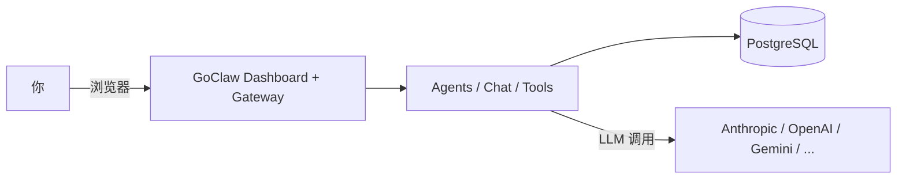
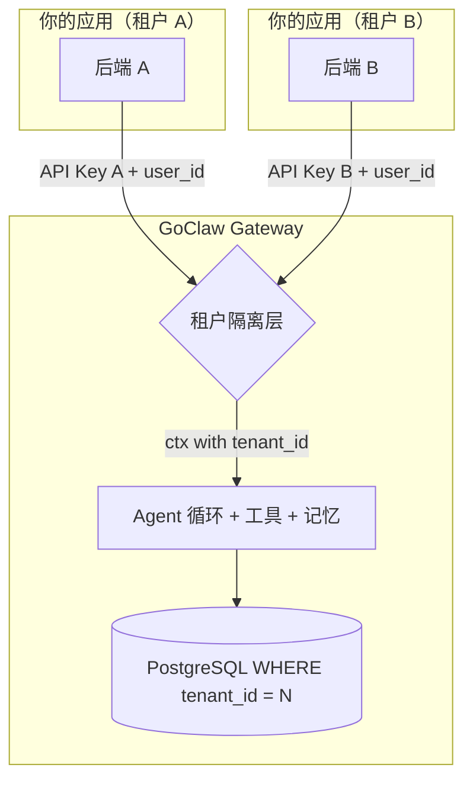
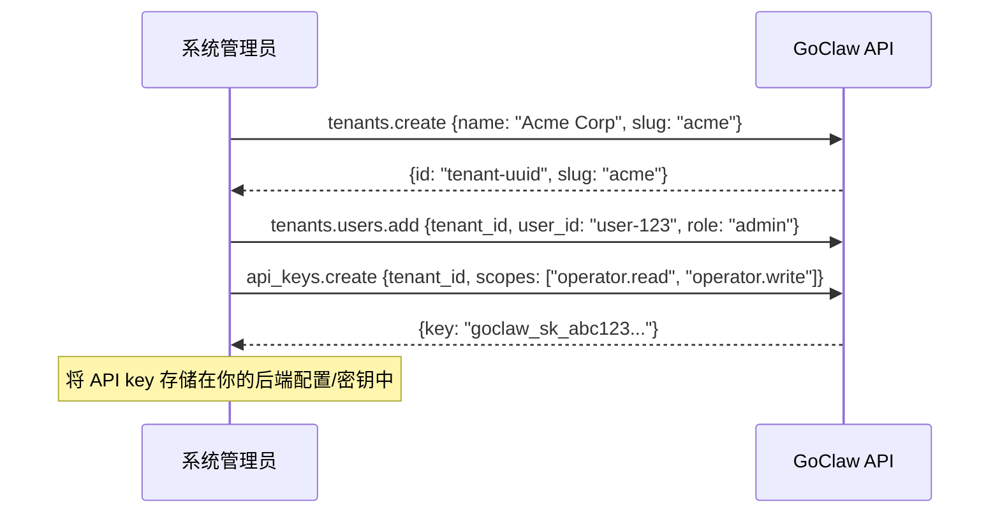

> 翻译自 [English version](/multi-tenancy)

# 多租户

> GoClaw 如何隔离数据——从单用户到拥有众多客户的完整 SaaS 平台。

## 概述

GoClaw 支持两种部署模式：**个人模式**（单租户，单用户或小团队）和 **SaaS 模式**（多租户，众多隔离客户）。两种模式使用相同的二进制文件——通过配置和连接方式选择模式。无论哪种模式，每条数据都有范围限制，用户之间永远无法看到彼此的 agent、session 或记忆。

---

## 部署模式

### 个人模式（单租户）

将 GoClaw 作为独立 AI 后端使用，搭配内置 Web dashboard。无需独立前端或后端。



**工作原理：**
- 通过内置 Web dashboard 用 gateway token 登录
- 创建 agent、配置 LLM provider、聊天——全部在 dashboard 中完成
- 连接聊天 channel（Telegram、Discord 等）进行消息传递
- 所有数据存储在默认的"master"租户下——无需租户配置

**设置：**

```bash
# 构建并初始化
go build -o goclaw . && ./goclaw onboard

# 启动 gateway
source .env.local && ./goclaw

# 在 http://localhost:3777 打开 dashboard
# 用你的 gateway token + 用户 ID "system" 登录
```

**身份传播：** GoClaw 不自行认证用户。你的应用在 `X-GoClaw-User-Id` 请求头中传入用户 ID——GoClaw 将所有数据范围限定到该 ID。每个用户拥有隔离的 session、记忆、上下文文件和工作空间：

```bash
curl -X POST http://localhost:3777/v1/chat/completions \
  -H "Authorization: Bearer YOUR_GATEWAY_TOKEN" \
  -H "X-GoClaw-User-Id: user-123" \
  -H "Content-Type: application/json" \
  -d '{"model": "agent:my-agent", "messages": [{"role": "user", "content": "Hello"}]}'
```

**适用场景：** 个人 AI 助手、小团队、自托管工具、开发和测试。

---

### SaaS 模式（多租户）

将 GoClaw 作为 SaaS 应用背后的 AI 引擎集成。你的应用处理认证、计费和 UI，GoClaw 处理 AI。每个租户完全隔离——agent、session、记忆、团队、LLM provider、MCP 服务器和文件。



**工作原理：**
- 每个租户的后端使用**租户绑定 API key** 连接——GoClaw 自动限定所有数据范围
- **租户隔离层**从凭证解析 `tenant_id` 并注入到 Go context
- 每个 SQL 查询强制执行 `WHERE tenant_id = $N`——失败时关闭，无跨租户泄露

**适用场景：** 具有 AI 功能的 SaaS 产品、多客户平台、白标 AI 解决方案。

---

## 租户设置

设置新租户需要三步：创建租户、添加用户，然后为你的后端创建 API key。



每个租户拥有隔离的：agent、session、团队、记忆、LLM provider、MCP 服务器和 skills。租户绑定 API key 自动限定每个请求的范围——除 `X-GoClaw-User-Id` 外无需额外请求头。

**从个人模式扩展：** 当你需要多个隔离环境（客户、部门、项目）时，创建额外的租户。多租户功能自动激活——无需迁移。

---

## 租户解析

GoClaw 从连接使用的凭证确定租户：

| 凭证 | 租户解析 | 使用场景 |
|------|----------|----------|
| **Gateway token** + 所有者用户 ID | 所有租户（跨租户） | 系统管理 |
| **Gateway token** + 非所有者用户 ID | 用户的租户成员关系 | Dashboard 用户 |
| **API key**（租户绑定） | 从 key 的 `tenant_id` 自动解析 | 普通 SaaS 集成 |
| **API key**（系统级）+ `X-GoClaw-Tenant-Id` | 请求头值（UUID 或 slug） | 跨租户管理工具 |
| **浏览器配对** | 配对的租户 | Dashboard 操作员 |
| **无凭证** | Master 租户 | 开发/单用户模式 |

**所有者 ID：** 通过 `GOCLAW_OWNER_IDS`（逗号分隔）配置。只有所有者才能用 gateway token 获得跨租户访问。默认：`system`。

**SaaS 推荐：** 使用租户绑定 API key。租户自动解析——你的后端无需发送租户请求头。

---

## HTTP API 请求头

所有 HTTP 端点接受这些标准请求头：

| 请求头 | 必需 | 说明 |
|--------|:----:|------|
| `Authorization` | 是 | `Bearer <api-key-or-gateway-token>` |
| `X-GoClaw-User-Id` | 是 | 你的应用用户 ID（最多 255 字符）。限定 session 和每用户数据的范围 |
| `X-GoClaw-Tenant-Id` | 否 | 租户 UUID 或 slug。仅系统级 key 需要 |
| `X-GoClaw-Agent-Id` | 否 | 目标 agent ID（`model` 字段的替代） |
| `Accept-Language` | 否 | 错误消息的语言：`en`、`vi`、`zh` |

### 聊天（OpenAI 兼容）

```bash
curl -X POST https://goclaw.example.com/v1/chat/completions \
  -H "Authorization: Bearer goclaw_sk_abc123..." \
  -H "X-GoClaw-User-Id: user-456" \
  -H "Content-Type: application/json" \
  -d '{
    "model": "agent:my-agent",
    "messages": [{"role": "user", "content": "Hello"}]
  }'
```

API key 绑定到"Acme Corp"租户——响应只包含该租户的数据。

### 系统管理（跨租户）

```bash
# 列出特定租户的 agent（需要 gateway token + 所有者用户 ID）
curl https://goclaw.example.com/v1/agents \
  -H "Authorization: Bearer $GATEWAY_TOKEN" \
  -H "X-GoClaw-Tenant-Id: acme" \
  -H "X-GoClaw-User-Id: system"
```

---

## 连接类型

所有连接在到达 agent 引擎之前都经过租户隔离层：

| 连接 | 认证方式 | 租户解析 | 隔离 |
|------|----------|----------|------|
| **HTTP API** | `Bearer` token | 从 API key 的 `tenant_id` 自动解析 | 每请求 |
| **WebSocket** | `connect` 时的 token | 从 API key 的 `tenant_id` 自动解析 | 每 session |
| **聊天 Channel** | 无（webhook/WS） | 内置在数据库中的 channel 实例配置中 | 每实例 |
| **Dashboard** | Gateway token 或浏览器配对 | 用户的租户成员关系 | 每 session |

**聊天 channel**（Telegram、Discord、Zalo、Slack、WhatsApp、Feishu）直接连接到 GoClaw。租户隔离在注册时内置到 channel 实例中——每条消息无需 API key。

---

## API Key 权限范围

API key 使用 scope 控制访问级别：

| Scope | 角色 | 权限 |
|-------|------|------|
| `operator.admin` | admin | 完全访问——agent、配置、API key、租户 |
| `operator.read` | viewer | 只读——列出 agent、session、配置 |
| `operator.write` | operator | 读写——聊天、创建 session、管理 agent |
| `operator.approvals` | operator | 批准/拒绝执行请求 |
| `operator.provision` | operator | 创建租户和管理租户用户 |
| `operator.pairing` | operator | 管理设备配对 |

带 `["operator.read", "operator.write"]` 的 key 获得 `operator` 角色。带 `["operator.admin"]` 的 key 获得 `admin` 角色。

---

## 每租户覆盖

租户可以自定义其环境而不影响其他租户：

| 功能 | 范围 | 方式 |
|------|------|------|
| **LLM Providers** | 每租户 | 每个租户注册自己的 API key 和模型 |
| **内置工具** | 每租户 | 通过 `builtin_tool_tenant_configs` 启用/禁用 |
| **Skills** | 每租户 | 通过 `skill_tenant_configs` 启用/禁用 |
| **MCP 服务器** | 每租户 + 每用户 | 服务器级共享，用户级凭证覆盖 |

**MCP 凭证层级：**
- **服务器级**（共享）：在 MCP 服务器表单中配置，供租户所有用户使用
- **用户级**（覆盖）：通过"我的凭证"配置——每用户 API key 在运行时合并（键冲突时用户优先）

当 MCP 服务器启用 `require_user_credentials` 时，没有个人凭证的用户无法使用该服务器。

---

## 安全模型

| 关注点 | GoClaw 的处理方式 |
|--------|------------------|
| API key 暴露 | Key 存储在你的后端——永远不发送到浏览器 |
| 跨租户数据访问 | 所有 SQL 查询包含 `WHERE tenant_id = $N`（失败时关闭） |
| 事件泄露 | 服务器端 3 模式过滤：非范围管理员、范围管理员、普通用户 |
| 缺少租户上下文 | 失败时关闭：返回错误，永远不返回未过滤数据 |
| API key 存储 | Key 静态以 SHA-256 哈希存储；UI 中只显示前缀 |
| 租户模拟 | 租户从 API key 绑定解析，而非客户端请求头 |
| 权限提升 | 角色从 key scope 派生，而非客户端声明 |
| Gateway token 滥用 | 只有配置的所有者 ID 获得跨租户访问；其他人受租户范围限制 |
| 租户访问撤销 | 主动 WS 事件 + `TENANT_ACCESS_REVOKED` 错误强制立即 UI 注销 |
| 文件 URL 安全 | HMAC 签名文件 token（`?ft=`）——gateway token 不出现在 URL 中 |

---

## 隔离的数据

在个人模式中，每条数据按 `user_id` 限定范围：

| 数据 | 表 | 隔离 |
|------|-----|------|
| 上下文文件 | `user_context_files` | 每用户每 agent |
| Agent 档案 | `user_agent_profiles` | 每用户每 agent |
| Agent 覆盖 | `user_agent_overrides` | 每用户 provider/模型 |
| Sessions | `sessions` | 每用户每 agent 每 channel |
| 记忆 | `memory_documents` | 每用户每 agent |
| Traces | `traces` | 每用户可过滤 |
| MCP 授权 | `mcp_user_grants` | 每用户 MCP 服务器访问 |

在 SaaS 模式中，以上用户级隔离在每个租户内适用，**40+ 个表**带有 NOT NULL 约束的 `tenant_id` 以强制租户边界。`api_keys.tenant_id` 可为 null——NULL 表示系统级跨租户 key。

**Master 租户**（UUID `0193a5b0-7000-7000-8000-000000000001`）：所有遗留和默认数据。单租户部署只使用这个。

---

## 环境变量

| 变量 | 默认值 | 说明 |
|------|--------|------|
| `GOCLAW_OWNER_IDS` | `system` | 具有跨租户访问权限的逗号分隔用户 ID |
| `GOCLAW_LOG_LEVEL` | `info` | 日志级别：`debug`、`info`、`warn`、`error` |
| `GOCLAW_CONFIG` | `config.json5` | Gateway 配置文件路径 |

---

## 常见问题

| 问题 | 解决方案 |
|------|----------|
| 用户看到彼此的数据 | 确认每个请求的 `X-GoClaw-User-Id` 设置正确 |
| 无用户隔离 | 确保发送用户 ID 请求头；不发送时所有请求共享一个 session |
| Agent 不可访问 | 检查 `agent_shares` 表；非默认 agent 用户需要明确的共享 |
| 返回了错误租户的数据 | 使用租户绑定 API key——不要依赖 `X-GoClaw-Tenant-Id` 请求头，除非使用系统级 key |
| 跨租户访问被拒绝 | 确认用户 ID 在 `GOCLAW_OWNER_IDS` 中用于管理操作 |

---

## 下一步

- [GoClaw 工作原理](how-goclaw-works.md) — 架构概览
- [Sessions 和历史](sessions-and-history.md) — 每用户 session 管理
- [Agent 详解](agents-explained.md) — Agent 类型和访问控制
- [API Keys](../getting-started/api-keys.md) — 创建和管理 API key

<!-- goclaw-source: b9d8754 | 更新: 2026-03-23 -->
