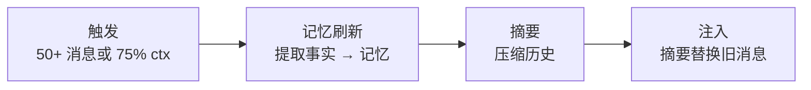

> 翻译自 [English version](/sessions-and-history)

# Sessions 和历史

> GoClaw 如何追踪对话并管理消息历史。

## 概述

Session 是用户与 agent 在特定 channel 上的对话线程。GoClaw 将消息历史存储在 PostgreSQL 中，自动压缩长对话，并管理并发以避免 agent 相互干扰。

## Session 键

每个 session 都有唯一的键，标识用户、agent、channel 和聊天类型：

```
agent:{agentId}:{channel}:{kind}:{chatId}
```

| 类型 | 键格式 | 示例 |
|------|--------|------|
| 私聊 | `agent:default:telegram:direct:386246614` | 私人聊天 |
| 群组 | `agent:default:telegram:group:-100123456` | 群组聊天 |
| 话题 | `agent:default:telegram:group:-100123456:topic:99` | 论坛话题 |
| Thread | `agent:default:telegram:direct:386246614:thread:5` | 回复线程 |
| 子 Agent | `agent:default:subagent:my-task` | 生成的子任务 |
| Cron | `agent:default:cron:reminder-job` | 定时任务 |

此键格式意味着同一用户在 Telegram 和 Discord 上与同一 agent 的对话有两个独立 session，各自的历史互不干扰。

> **Session 元数据：** 每个 session 除了键之外还追踪额外字段：`label`（显示名称）、`channel`、`model`、`provider`、`spawned_by`（子 agent 的父 session ID）、`spawn_depth`、`input_tokens`、`output_tokens`、`compaction_count` 和 `context_window`。这些字段可用于分析和调试。

## 消息存储

消息以 JSONB 形式存储在 PostgreSQL 中，带写后缓存：

1. **读取** — 首次访问时从数据库加载到内存缓存
2. **写入** — 消息在一轮对话中累积在内存中
3. **刷新** — 轮次结束时，所有消息原子性写入数据库
4. **列表** — Session 列表始终从数据库读取（不用缓存）

此方式在确保持久性的同时最小化数据库写入。

## 历史处理管道

在将历史发送给 LLM 之前，GoClaw 运行 3 阶段管道：

### 1. 限制轮次

只保留最近 N 轮用户对话（及其关联的 assistant/tool 消息）。较旧的轮次被丢弃以保持在上下文窗口内。

### 2. 裁剪上下文

工具结果可能很大。GoClaw 分两步裁剪：

| 条件 | 操作 |
|------|------|
| Token 比例 ≥ 0.3 | **软裁剪**：超过 4,000 字符的工具结果 → 保留前 1,500 + 后 1,500 字符 |
| Token 比例 ≥ 0.5 | **硬清除**：将整个工具结果替换为 `[Old tool result content cleared]` |

受保护的消息（永不裁剪）：最近 3 条 assistant 消息。系统消息和第一条用户消息构成永不裁剪的稳定前缀。

### 3. 净化

修复被截断拆分的 tool_use/tool_result 对。LLM 期望匹配的对——孤立的工具调用会导致错误。

## V3 管道架构

在 v3（通过 `pipeline_enabled` 特性标志启用）中，agent loop 重构为 **8 阶段管道**，取代 v2 的单体 `runLoop()`。Session 流程对应以下阶段：

| 阶段 | 内容 |
|------|------|
| **ContextStage**（一次） | 注入 context，解析 per-user workspace，确保 per-user 文件存在 |
| **ThinkStage** | 构建 system prompt，运行历史管道，过滤工具（PolicyEngine），调用 LLM |
| **PruneStage** | 估算 token 比例；≥30% 软裁剪，≥50% 硬清除；若达到压缩阈值则触发 memory flush |
| **ToolStage** | 执行工具调用——单工具顺序执行，多工具并行并按索引排序结果 |
| **ObserveStage** | 处理工具结果，处理 `NO_REPLY`，追加 assistant 消息 |
| **CheckpointStage** | 递增 iteration 计数器；达到最大次数或取消时中断 |
| **FinalizeStage**（一次） | 净化输出，原子刷新消息，更新 session 元数据，emit run event |

**v3 中的记忆整合**：PruneStage 在**迭代循环中同步**触发 memory flush（而非仅在 session 结束时）。这意味着长轮次在历史被裁剪前提取 episodic 事实，无需等待轮次后的压缩阶段。同样的 75% 上下文窗口阈值适用。

v2 和 v3 的外部行为完全相同；管道差异属于内部架构。

## 自动压缩

长对话触发自动压缩：

**触发条件：**
- Session 中超过 50 条消息，或
- 历史超过 agent 上下文窗口的 75%

**处理过程：**



1. **记忆刷新**（同步，90s 超时）— 重要事实被提取并保存到记忆系统
2. **摘要**（后台，120s 超时）— 旧消息被压缩成摘要
3. **注入** — 摘要替换旧消息；至少保留 4 条消息（或总数的 30%，取较大值）完整保留

每 session 锁防止并发压缩。如果第二次压缩在一次运行时触发，则跳过。

### 循环中压缩

如果上下文在循环过程中超过阈值，GoClaw 也可能在**长时间 agent 轮次期间**压缩历史。同样的 75% 摘要逻辑适用。这对 agent 透明——它以注入的压缩历史继续运行。

## 并发

| 聊天类型 | 最大并发数 | 说明 |
|----------|:----------:|------|
| 私聊 | 1 | 单线程——消息排队 |
| 群组 | 1（可配置） | 默认串行；可通过 `ScheduleOpts.MaxConcurrent` 增加 |

当上下文使用率较高时，群组 session 可能降低并发。

> **配置并发：** 私聊和群组默认串行处理（`MaxConcurrent: 1`）。可通过 `ScheduleOpts.MaxConcurrent` 为团队成员或 agent 链接设置更高值（如 3）。

### 队列模式

| 模式 | 行为 |
|------|------|
| `queue` | FIFO——按顺序处理消息 |
| `followup` | 新消息与已排队的消息合并 |
| `interrupt` | 取消当前任务，处理新消息 |

队列容量默认为 10。满时丢弃最旧的消息（丢弃策略：`old`）。默认防抖窗口为 800ms——此窗口内的快速消息在处理前合并。

### 用户控制

- `/stop` — 取消最旧的运行任务
- `/stopall` — 取消所有任务并清空队列

## 常见问题

| 问题 | 解决方案 |
|------|----------|
| Agent "忘记"了早期消息 | 历史已被压缩；检查记忆中提取的事实 |
| 群组中响应缓慢 | 降低群组并发或上下文窗口大小 |
| 重复响应 | 检查队列模式；`queue` 模式防止重复 |

## 下一步

- [记忆系统](/memory-system) — 长期记忆的工作原理
- [工具概览](/tools-overview) — Agent 可用的工具
- [多租户](/multi-tenancy) — 每用户 session 隔离

<!-- goclaw-source: 050aafc9 | 更新: 2026-04-09 -->
