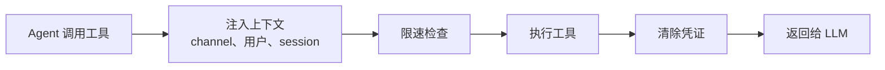

> 翻译自 [English version](/tools-overview)

# 工具概览

> Agent 可以使用的 50+ 内置工具，按类别组织。

## 概述

工具是 agent 在生成文本之外与世界交互的方式。Agent 可以搜索网页、读取文件、运行代码、查询记忆、通过 agent 团队协作等。GoClaw 包含 50+ 内置工具（可通过 MCP 和每 agent 的自定义工具扩展），分为 14 个类别。

## 工具类别

| 类别 | 工具 | 功能 |
|------|------|------|
| **文件系统** (`group:fs`) | read_file, write_file, edit, list_files, search, glob | 在 agent 工作空间中读、写、编辑和搜索文件 |
| **运行时** (`group:runtime`) | exec, credentialed_exec | 运行 shell 命令；以注入凭证执行 CLI 工具 |
| **Web** (`group:web`) | web_search, web_fetch | 搜索网页（Brave/DuckDuckGo）并抓取页面 |
| **记忆** (`group:memory`) | memory_search, memory_get | 查询长期记忆（混合向量 + FTS 搜索） |
| **知识** (`group:knowledge`) | knowledge_graph_search, skill_search | 搜索知识图谱实体和关系；发现 skills |
| **Sessions** (`group:sessions`) | sessions_list, sessions_history, sessions_send, session_status, spawn | 管理对话 session；生成子 agent |
| **团队** (`group:teams`) | team_tasks, team_message | 通过共享任务板和邮箱与 agent 团队协作 |
| **自动化** (`group:automation`) | cron, datetime | 调度定期任务；获取当前日期/时间 |
| **消息传递** (`group:messaging`) | message, create_forum_topic | 发送消息；创建 Telegram 论坛话题 |
| **媒体生成** (`group:media_gen`) | create_image, create_audio, create_video, tts | 生成图片、音频、视频和文字转语音 |
| **浏览器** | browser | 导航网页、截图、与元素交互 |
| **媒体读取** (`group:media_read`) | read_image, read_audio, read_document, read_video | 分析图片、转录音频、提取文档、分析视频 |
| **Skills** (`group:skills`) | use_skill, publish_skill | 调用和发布 skills |
| **工作空间** | workspace_dir | 解析团队/用户上下文的工作空间目录 |
| **AI** | openai_compat_call | 以自定义请求格式调用 OpenAI 兼容端点 |

> 额外工具如 `mcp_tool_search` 和特定 channel 工具是动态注册的。工具组可在允许/拒绝列表中用 `group:` 前缀引用（如 `group:fs`）。

> **委托说明**：`delegate` 工具已移除。委托现在完全通过 agent 团队处理：负责人通过共享任务板（`team_tasks`）创建任务，并通过 `spawn` 委托给成员 agent。

## 工具执行流程

当 agent 调用工具时：



1. **上下文注入** — 注入 channel、聊天 ID、用户 ID 和沙箱 key
2. **限速** — 每 session 限速器防止滥用
3. **执行** — 工具运行并产生输出
4. **清除** — 从输出中移除凭证和敏感数据
5. **返回** — 干净的结果返回给 LLM 进行下一次迭代

## 工具 Profile

Profile 控制 agent 可以访问哪些工具：

| Profile | 可用工具 |
|---------|----------|
| `full` | 所有已注册工具（无限制） |
| `coding` | `group:fs`、`group:runtime`、`group:sessions`、`group:memory`、`group:web`、`group:knowledge`、`group:media_gen`、`group:media_read`、`group:skills` |
| `messaging` | `group:messaging`、`group:web`、`group:sessions`、`group:media_read`、`skill_search` |
| `minimal` | 仅 `session_status` |

在 agent 配置中设置 profile：

```jsonc
{
  "agents": {
    "defaults": {
      "tools_profile": "full"
    },
    "list": {
      "readonly-bot": {
        "tools_profile": "messaging"
      }
    }
  }
}
```

## 工具别名

GoClaw 注册别名，让 agent 可以用替代名称引用工具。这实现了与 Claude Code skills 和旧版工具名称的兼容：

| 别名 | 映射到 |
|------|--------|
| `Read` | `read_file` |
| `Write` | `write_file` |
| `Edit` | `edit` |
| `Bash` | `exec` |
| `WebFetch` | `web_fetch` |
| `WebSearch` | `web_search` |
| `edit_file` | `edit` |

别名在系统提示词中显示为单行描述。它们不是独立工具——调用别名会调用底层工具。

## 策略引擎

除了 profile，7 步策略引擎提供精细控制：

1. 全局 profile（基础集）
2. 特定 provider 的 profile 覆盖
3. 全局允许列表（取交集）
4. 特定 provider 的允许覆盖
5. 每 agent 允许列表
6. 每 agent 每 provider 的允许
7. 组级允许

允许列表之后，**拒绝列表**移除工具，然后 **alsoAllow** 追加工具（取并集）。工具组（`group:fs`、`group:runtime` 等）可用于任何允许/拒绝列表。

### 示例：限制 Agent

```jsonc
{
  "agents": {
    "list": {
      "safe-bot": {
        "tools_profile": "full",
        "tools_deny": ["exec", "write_file"],
        "tools_also_allow": ["read_file"]
      }
    }
  }
}
```

## 文件系统拦截器

两个特殊拦截器将文件操作路由到数据库：

### 上下文文件拦截器

当 agent 读/写上下文文件（SOUL.md、IDENTITY.md、AGENTS.md、USER.md、USER_PREDEFINED.md、BOOTSTRAP.md、HEARTBEAT.md）时，操作被路由到 `user_context_files` 表而非文件系统。TOOLS.md 明确排除在路由之外。这实现了每用户自定义和多租户隔离。

### 记忆拦截器

对 `MEMORY.md`、`memory.md` 或 `memory/*` 的写操作被路由到 `memory_documents` 表，自动分块并生成 embedding 用于搜索。

## Shell 安全

### `credentialed_exec` — 安全的 CLI 凭证注入

`credentialed_exec` 工具以凭证直接注入到子进程环境变量的方式运行 CLI 工具（gh、gcloud、aws、kubectl、terraform）——无 shell、无凭证泄露。安全层包括：路径验证（阻止 `./gh` 欺骗）、shell 操作符阻断（`;`、`|`、`&&`）、每二进制拒绝模式（如阻断 `auth\s+`）和输出清除。

### `exec` — Shell 安全

`exec` 工具强制执行 15 个拒绝组——默认全部启用：

| 组 | 阻断模式 |
|----|----------|
| `destructive_ops` | `rm -rf`、`del /f`、`mkfs`、`dd`、`shutdown`、fork 炸弹 |
| `data_exfiltration` | `curl\|sh`、`wget\|sh`、DNS 外泄、`/dev/tcp/`、curl POST/PUT、localhost 访问 |
| `reverse_shell` | `nc`/`ncat`/`netcat`、`socat`、`openssl s_client`、`telnet`、python/perl/ruby/node socket、`mkfifo` |
| `code_injection` | `eval $`、`base64 -d\|sh` |
| `privilege_escalation` | `sudo`、`su -`、`nsenter`、`unshare`、`mount`、`capsh`/`setcap` |
| `dangerous_paths` | `chmod` on `/`、`chown` on `/`、`chmod +x` on `/tmp` `/var/tmp` `/dev/shm` |
| `env_injection` | `LD_PRELOAD`、`DYLD_INSERT_LIBRARIES`、`LD_LIBRARY_PATH`、`GIT_EXTERNAL_DIFF`、`BASH_ENV` |
| `container_escape` | `docker.sock`、`/proc/sys/`、`/sys/` |
| `crypto_mining` | `xmrig`、`cpuminer`、`stratum+tcp://` |
| `filter_bypass` | `sed /e`、`sort --compress-program`、`git --upload-pack`、`rg --pre=`、`man --html=` |
| `network_recon` | `nmap`/`masscan`/`zmap`、`ssh/scp@`、`chisel`/`ngrok`/`cloudflared` 隧道 |
| `package_install` | `pip install`、`npm install`、`apk add`、`yarn add`、`pnpm add` |
| `persistence` | `crontab`、写入 `.bashrc`/`.profile`/`.zshrc` |
| `process_control` | `kill -9`、`killall`、`pkill` |
| `env_dump` | `env`、`printenv`、`/proc/*/environ`、`echo $GOCLAW_*` 密钥 |

### 每 Agent 覆盖

管理员可按 agent 禁用特定组：

```jsonc
{
  "agents": {
    "list": {
      "dev-bot": {
        "shell_deny_groups": {
          "package_install": false,
          "process_control": false
        }
      }
    }
  }
}
```

`tools.exec_approval` 设置添加额外的审批层（`full`、`light` 或 `none`）。

## Session 工具安全

Session 工具（`sessions_list`、`sessions_history`、`sessions_send`）通过 fail-closed 验证进行加固：

- **防止幻影 session**：session 查询使用只读 Get，从不使用 GetOrCreate，防止意外创建 session
- **所有权验证**：session key 必须匹配调用 agent 的前缀（`agent:{agentID}:*`）
- **Fail-closed 设计**：缺少 agentID 或所有权无效时立即返回错误——绝不放行
- **自发送阻断**：`message` 工具阻止 agent 向自己当前的 channel/chat 发送消息，防止重复媒体投递

## 自适应工具计时

GoClaw 追踪每个 session 中每个工具的执行时间。如果工具调用耗时超过其历史最大值的 2 倍（至少有 3 个先前样本），则发出慢工具通知。没有历史记录的工具默认阈值为 120 秒。

## 自定义工具和 MCP

除内置工具外，你还可以通过以下方式扩展 agent：

- **自定义工具** — 通过 dashboard 或 API 定义工具，包含输入 schema 和处理器
- **MCP 服务器** — 连接 Model Context Protocol 服务器进行动态工具注册

### 浏览器自动化

`browser` 工具让 agent 控制无头浏览器（Chrome/Chromium）。必须在配置中启用（`tools.browser.enabled: true`）。

**安全机制：**

| 参数 | 默认值 | 配置键 | 说明 |
|------|--------|--------|------|
| 操作超时 | 30s | `tools.browser.action_timeout_ms` | 每次浏览器操作的最大时间 |
| 空闲超时 | 10min | `tools.browser.idle_timeout_ms` | 空闲后自动关闭页面（0 = 禁用，负数 = 禁用） |
| 最大页面数 | 5 | `tools.browser.max_pages` | 每租户最大打开页面数 |

## 常见问题

| 问题 | 解决方案 |
|------|----------|
| Agent 无法使用工具 | 检查 tools_profile 和拒绝列表；验证工具是否存在于该 profile |
| Shell 命令被阻断 | 查看拒绝模式；调整 `exec_approval` 级别 |
| 工具结果太大 | GoClaw 自动裁剪超过 4,000 字符的结果；考虑使用更具体的查询 |

## 下一步

- [记忆系统](/memory-system) — 长期记忆和搜索的工作原理
- [多租户](/multi-tenancy) — 每用户工具访问和隔离
- [自定义工具](/custom-tools) — 构建你自己的工具

<!-- goclaw-source: 4d31fe0 | 更新: 2026-03-28 -->
