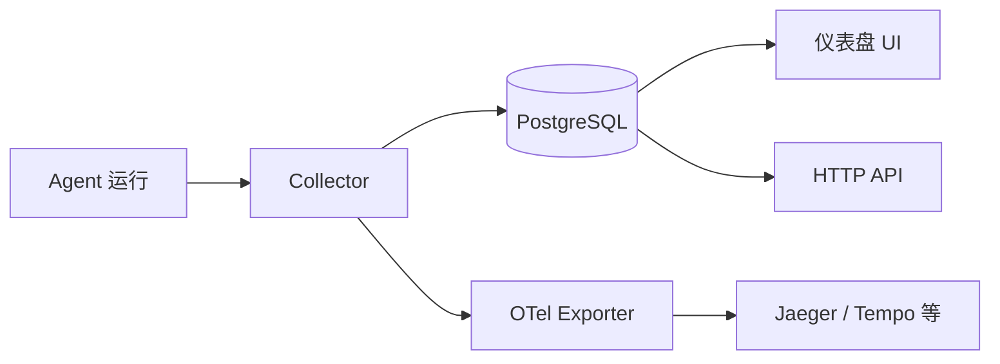

> 翻译自 [English version](/deploy-observability)

# 可观测性

> 监控每一次 LLM 调用、工具使用和 agent 运行——从内置仪表盘到 Jaeger 及更多。

## 概览

GoClaw 内置链路追踪，将每次 agent 运行记录为 **trace**，每次 LLM 调用或工具使用记录为 **span**。Trace 存储在 PostgreSQL 中，可在仪表盘中立即查看。如需集成现有可观测性平台（Grafana Tempo、Datadog、Honeycomb、Jaeger），可通过构建时加入 `-tags otel` 通过 OTLP 导出 span。



## 链路追踪工作原理

`tracing.Collector` 运行一个后台刷新循环（每 5 秒）：

1. 排空 1000 个 span 的内存缓冲
2. 批量将 span 插入 PostgreSQL
3. 将 span 转发给所有附加的 `SpanExporter`（OTel 等）
4. 更新每个 trace 的聚合计数器（总 token、持续时间、状态）

Trace 和 span 通过 `trace_id` 关联。每次 agent 运行创建一个 trace；该运行内的 LLM 调用和工具调用成为子 span。

**记录的 span 类型：**

| Span 类型 | 捕获内容 |
|-----------|---------|
| `llm_call` | 模型、输入/输出 token、结束原因、延迟 |
| `tool_call` | 工具名、调用 ID、持续时间、状态 |
| `agent` | 完整运行生命周期、输出预览 |
| `embedding` | 向量存储的嵌入生成 |
| `event` | 离散事件标记（无持续时间） |

## 查看 Trace

### 仪表盘

打开 Web UI 中的 **Traces** 部分（默认：`http://localhost:18790`）。可按 agent、日期范围和状态过滤。

Traces UI 包含：
- 每个 span 上的**时间戳**，用于精确计时
- span 详情中的**复制按钮**，便于导出 trace 数据
- span 预览中 JSON 负载的**语法高亮**

### 详细模式

默认情况下，span 预览中的输入消息被截断为 500 个字符。要存储完整的 LLM 输入（调试时有用）：

```bash
export GOCLAW_TRACE_VERBOSE=1
./goclaw
```

详细模式下，LLM span 存储最多 200 KB 的完整输入/输出；工具 span 存储最多 200 KB 的完整输入和输出。

> 详细模式仅用于开发——完整消息可能很大。

## Trace 导出

单个 trace（包含所有 span 和子 trace）可通过 HTTP 导出：

```
GET /v1/traces/{traceID}/export
```

响应为 **gzip 压缩的 JSON**，包含 trace、其 span，以及递归收集的子 trace（`sub_traces`）。适用于离线分析、问题报告或归档长时间 agent 运行。

```bash
curl -H "Authorization: Bearer $TOKEN" \
  http://localhost:18790/v1/traces/{traceID}/export \
  --output trace.json.gz

gunzip trace.json.gz
```

## Trace HTTP API

| 方法 | 路径 | 说明 |
|------|------|------|
| GET | `/v1/traces` | 列出 trace，支持分页和过滤 |
| GET | `/v1/traces/{id}` | 获取 trace 详情及所有 span |
| GET | `/v1/traces/{id}/export` | 将 trace + 子 trace 导出为 gzip JSON |

### 查询过滤参数（GET /v1/traces）

| 参数 | 类型 | 说明 |
|------|------|------|
| `agent_id` | UUID | 按 agent 过滤 |
| `user_id` | string | 按用户过滤 |
| `status` | string | `running`、`success`、`error`、`cancelled` |
| `from` / `to` | timestamp | 日期范围过滤 |
| `limit` | int | 每页数量（默认 50） |
| `offset` | int | 分页偏移 |

## OpenTelemetry 导出

OTel exporter 只有在添加 `-tags otel` 时才会编译进来。默认构建没有任何 OTel 依赖，可节省约 15–20 MB 的二进制体积。

### 构建时启用 OTel 支持

```bash
go build -tags otel -o goclaw .
```

### 通过环境变量配置

```bash
export GOCLAW_TELEMETRY_ENABLED=true
export GOCLAW_TELEMETRY_ENDPOINT=localhost:4317   # OTLP gRPC 端点
export GOCLAW_TELEMETRY_PROTOCOL=grpc             # "grpc"（默认）或 "http"
export GOCLAW_TELEMETRY_INSECURE=true             # 本地开发时跳过 TLS
export GOCLAW_TELEMETRY_SERVICE_NAME=goclaw-gateway
```

或通过 `config.json`：

```json
{
  "telemetry": {
    "enabled": true,
    "endpoint": "tempo:4317",
    "protocol": "grpc",
    "insecure": false,
    "service_name": "goclaw-gateway"
  }
}
```

Span 使用 `gen_ai.*` 语义约定（OpenTelemetry GenAI SIG）导出，加上用于与 PostgreSQL trace 存储关联的 `goclaw.*` 自定义属性。

OTel exporter 批量处理 span，最大批次大小为 100，超时为 5 秒。

## Jaeger 集成

提供的 `docker-compose.otel.yml` overlay 自动启动 Jaeger all-in-one 并连接到 GoClaw：

```bash
docker compose \
  -f docker-compose.yml \
  -f docker-compose.postgres.yml \
  -f docker-compose.otel.yml \
  up
```

Jaeger UI 地址：**http://localhost:16686**。

Overlay 设置：

```yaml
# docker-compose.otel.yml（节选）
services:
  jaeger:
    image: jaegertracing/all-in-one:1.68.0
    ports:
      - "16686:16686"  # Jaeger UI
      - "4317:4317"    # OTLP gRPC
      - "4318:4318"    # OTLP HTTP
    environment:
      - COLLECTOR_OTLP_ENABLED=true

  goclaw:
    build:
      args:
        ENABLE_OTEL: "true"   # 编译时加入 -tags otel
    environment:
      - GOCLAW_TELEMETRY_ENABLED=true
      - GOCLAW_TELEMETRY_ENDPOINT=jaeger:4317
      - GOCLAW_TELEMETRY_PROTOCOL=grpc
      - GOCLAW_TELEMETRY_INSECURE=true
```

## 导出 Span 的关键属性

| 属性 | 说明 |
|------|------|
| `gen_ai.request.model` | LLM 模型名称 |
| `gen_ai.system` | Provider（anthropic、openai 等） |
| `gen_ai.usage.input_tokens` | 输入消耗的 token |
| `gen_ai.usage.output_tokens` | 输出产生的 token |
| `gen_ai.response.finish_reason` | 模型停止原因 |
| `goclaw.span_type` | `llm_call`、`tool_call`、`agent`、`embedding`、`event` |
| `goclaw.tool.name` | 工具 span 的工具名称 |
| `goclaw.trace_id` | 链接回 PostgreSQL 的 UUID |
| `goclaw.duration_ms` | 实际时钟持续时间 |

## 用量分析

GoClaw 通过后台 worker（每小时 HH:05:00 UTC 运行）将 token 计数和费用聚合为每小时快照。这些数据驱动仪表盘的用量图表和 `/v1/usage` API 端点。

`usage_snapshots` 表存储按 agent、用户和 provider 预计算的聚合数据——即使有数百万 span，仪表盘查询也能保持快速。启动时，worker 自动补全遗漏的小时数据。

`activity_logs` 表记录管理员操作、配置变更和安全事件作为审计记录。

## 实时日志流

已连接的 WebSocket 客户端可订阅实时日志事件。`LogTee` 层拦截所有 `slog` 记录并：

1. 在环形缓冲区中缓存最近 100 条（新订阅者可获取近期历史）
2. 以订阅者选择的日志级别广播给订阅客户端
3. 自动脱敏敏感字段：`key`、`token`、`secret`、`password`、`dsn`、`credential`、`authorization`、`cookie`

仪表盘用户无需 SSH 访问即可查看实时日志，且密钥不会通过日志流泄露。

## 常见问题

| 问题 | 可能原因 | 解决方案 |
|------|---------|---------|
| Jaeger 中无 span | 二进制构建时未加 `-tags otel` | 使用 `go build -tags otel` 重新构建 |
| `GOCLAW_TELEMETRY_ENABLED` 被忽略 | 缺少 OTel 构建标签 | 检查 docker 构建参数中的 `ENABLE_OTEL: "true"` |
| Span 缓冲区已满（日志警告） | Agent 吞吐量高 | 在代码中增大缓冲区或减小刷新间隔 |
| 输入预览被截断 | 正常行为 | 设置 `GOCLAW_TRACE_VERBOSE=1` 获取完整输入 |
| Span 在 DB 中但不在 Jaeger | 端点配置错误 | 检查 `GOCLAW_TELEMETRY_ENDPOINT` 和端口可达性 |

## 下一步

- [生产检查清单](/deploy-checklist) — 监控和告警建议
- [Docker Compose 设置](/deploy-docker-compose) — 完整 compose 文件参考
- [安全加固](/deploy-security) — 保护你的部署

<!-- goclaw-source: 050aafc9 | 更新: 2026-04-09 -->
