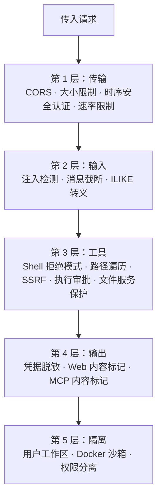
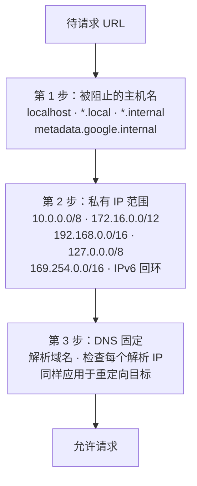

> 翻译自 [English version](/deploy-security)

# 安全加固

> GoClaw 采用五层独立防御——传输、输入、工具、输出和隔离——一层被突破不会危及其余层。

## 概述

每层独立运行。合在一起，它们构成纵深防御架构，覆盖从传入 WebSocket 连接到 agent 工具执行输出的完整请求生命周期。



---

## 第 1 层：传输安全

控制在网络和 HTTP 层面能到达网关的内容。

| 机制 | 详情 |
|------|------|
| CORS | `checkOrigin()` 验证 `gateway.allowed_origins`；空列表允许所有（向后兼容） |
| WebSocket 消息限制 | 512 KB——gorilla/websocket 超出时自动关闭 |
| HTTP body 限制 | 1 MB——在 JSON 解码前强制执行 |
| Token 认证 | `crypto/subtle.ConstantTimeCompare`——时序安全的 bearer token 检查 |
| 速率限制 | 每用户/IP 令牌桶；通过 `gateway.rate_limit_rpm` 配置（0 = 禁用） |
| 开发模式 | 空网关 token → 授予 admin 角色（仅限单用户/本地开发——生产环境禁用） |

**加固操作：**

```json
{
  "gateway": {
    "allowed_origins": ["https://your-dashboard.example.com"],
    "rate_limit_rpm": 20
  }
}
```

生产环境将 `allowed_origins` 设为仪表盘域名。仅在控制所有 WebSocket 客户端时才留空。

---

## 第 2 层：输入——注入检测

输入守卫在消息到达 LLM 前扫描每条用户消息，检测 6 种提示注入模式。

| 模式 ID | 检测目标 |
|---------|---------|
| `ignore_instructions` | "ignore all previous instructions" |
| `role_override` | "you are now…"、"pretend you are…" |
| `system_tags` | `<system>`、`[SYSTEM]`、`[INST]`、`<<SYS>>` |
| `instruction_injection` | "new instructions:"、"override:"、"system prompt:" |
| `null_bytes` | 空字符 `\x00`（混淆尝试） |
| `delimiter_escape` | "end of system"、`</instructions>`、`</prompt>` |

**可配置操作**（`gateway.injection_action`）：

| 值 | 行为 |
|----|------|
| `"off"` | 完全禁用检测 |
| `"log"` | info 级别日志，继续处理 |
| `"warn"`（默认） | warning 级别日志，继续处理 |
| `"block"` | 记录警告，返回错误，停止处理 |

面向公众或多用户共享的 agent 部署，建议设置 `"block"`。

**消息截断：** 超过 `gateway.max_message_chars`（默认 32,000）的消息会被截断而非拒绝，LLM 会收到截断通知。

**ILIKE 转义：** 所有数据库 ILIKE 查询（搜索/过滤操作）在执行前转义 `%`、`_` 和 `\` 字符，防止 SQL 通配符注入攻击。

---

## 第 3 层：工具安全

防止危险命令执行、未授权文件访问和服务器端请求伪造。

### Shell 拒绝分组

默认阻止 15 类命令，所有分组开箱即**启用（拒绝）**。可通过 agent config 中的 `shell_deny_groups` 进行 per-agent 覆盖。

| # | 分组 | 示例 |
|---|------|------|
| 1 | `destructive_ops` | `rm -rf /`、`dd if=`、`mkfs`、`reboot`、`shutdown` |
| 2 | `data_exfiltration` | `curl \| sh`、访问 localhost、DNS 查询 |
| 3 | `reverse_shell` | `nc -e`、`socat`、Python/Node socket |
| 4 | `code_injection` | `eval $()`、`base64 -d \| sh` |
| 5 | `privilege_escalation` | `sudo`、`su -`、`nsenter`、`mount`、`setcap`、`halt`、`doas`、`pkexec`、`runuser` |
| 6 | `dangerous_paths` | 在 `/` 路径上使用 `chmod`/`chown` |
| 7 | `env_injection` | `LD_PRELOAD=`、`DYLD_INSERT_LIBRARIES=` |
| 8 | `container_escape` | `docker.sock`、`/proc/sys/`、`/sys/kernel/` |
| 9 | `crypto_mining` | `xmrig`、`cpuminer`、stratum URL |
| 10 | `filter_bypass` | `sed /e`、`git --upload-pack=`、CVE 缓解 |
| 11 | `network_recon` | `nmap`、`ssh@`、`ngrok`、`chisel` |
| 12 | `package_install` | `pip install`、`npm i`、`apk add`、`yarn` |
| 13 | `persistence` | `crontab`、`.bashrc`、tee shell init |
| 14 | `process_control` | `kill -9`、`killall`、`pkill` |
| 15 | `env_dump` | `env`、`printenv`、`GOCLAW_*` 变量、`/proc/*/environ` |

为特定 agent 允许某个分组，在 agent config 中将其设为 `false`：

```json
{
  "agents": {
    "list": {
      "devops-bot": {
        "shell_deny_groups": {
          "package_install": false,
          "process_control": false
        }
      }
    }
  }
}
```

### 全局 shell deny-groups — 运行时切换

`config.tools.shellDenyGroups` 是一个 `map[string]bool`，允许在不重启 gateway 的情况下全局启用或禁用 deny-group。更改通过 `bus.TopicConfigChanged` 实时生效（runtime-reloadable）。

```json
{
  "tools": {
    "shellDenyGroups": {
      "package_install": false,
      "env_dump": false
    }
  }
}
```

**优先级：** per-agent 的 `shell_deny_groups` 始终优先于全局设置。全局值仅在 agent 自身 config 中未明确设置某个 deny-group 时生效。这样可以在全 gateway 范围内放开某个分组，同时仍对特定 agent 保持锁定。

完整的 `tools.shellDenyGroups` 字段参考请见 [`reference/config-reference.md`](../reference/config-reference.md)。

### 路径遍历防护

`resolvePath()` 依次应用 `filepath.Clean()` 和 `HasPrefix()`，确保所有文件路径保持在 agent 工作区内。启用 `restrict_to_workspace: true`（agent 默认值）时，工作区外的任何路径均被阻止。

四个文件系统工具（`read_file`、`write_file`、`list_files`、`edit`）均实现 `PathDenyable` 接口。Agent loop 启动时调用 `DenyPaths(".goclaw")`——agent 无法读取 GoClaw 内部数据目录。`list_files` 工具从目录列表中完全过滤掉被拒绝的路径，agent 看不到它们。

### 文件服务路径遍历保护

文件服务端点（`/v1/files/...`）验证所有请求路径，防止目录遍历攻击。包含 `../` 序列或解析到许可基目录之外的任何路径均以 400 错误拒绝。

### SSRF 防护（3 步验证）

适用于 `web_fetch` 工具的所有出站 URL 请求：



### 凭据执行（直接执行模式）

对于需要凭据的工具（如 `gh`、`aws`），GoClaw 使用直接进程执行而非 shell——彻底消除 shell 注入风险。

4 层防御：
1. **不使用 shell** — `exec.CommandContext(binary, args...)`，从不用 `sh -c`
2. **路径验证** — 通过 `exec.LookPath()` 将二进制解析为绝对路径，与 config 匹配
3. **拒绝模式** — 按 binary 配置参数正则拒绝列表（`deny_args`）和 verbose flag（`deny_verbose`）
4. **输出脱敏** — 运行时注册的凭据从 stdout/stderr 中脱敏

Shell 元字符（`;`、`|`、`&`、`$()`、反引号）在执行前被检测并拒绝。

### 执行授权强制（Exec grant enforcement）

Agent 级别的授权检查在任何进程 spawn **之前**运行，阻止未授权的 agent 执行已注册的二进制文件：

| 控制 | 详情 |
|------|------|
| **授权查找** | `store.SecureCLIStore.IsRegisteredBinary()` 检查 `secure_cli_agent_grants` 表。非全局二进制文件要求调用 agent 有对应记录。 |
| **失败关闭** | 如果授权查找出错（DB 故障、超时），exec 被拒绝并返回重试消息。每次查找超时：2 秒。 |
| **环境变量清除** | 当命令绕过凭据路径（如通过恶意使用 `exec` 工具）时，子进程环境在 spawn 前被清除所有凭据键——包括静态拒绝列表和租户中所有已注册二进制文件的动态键。 |
| **包装器解包** | 试图规避二进制路径匹配的 shell 包装器（`sh -c`、`bash -c` 等）会被阻止。GoClaw 最多检查 3 层嵌套；更深的链被视为恶意攻击而拒绝。 |
| **子 agent 接线** | 子 agent 的 `ExecTool` 通过 `buildSubagentToolsRegistry` 使用相同的 `SecureCLIStore`。父 agent 无法通过将 exec 委托给生成的子 agent 来绕过检查门。 |

授权门发出的安全日志事件：

| 事件 | 含义 |
|------|------|
| `security.credentialed_binary_denied` | Agent 尝试在无授权情况下执行二进制文件 |
| `security.credentialed_binary_gate_error` | 授权查找失败（DB 错误）；exec 被拒绝 |
| `security.credentialed_binary_wrapper_too_deep` | Shell 包装器嵌套超过 3 层，被拒绝为恶意攻击 |

三个事件均包含字段：`binary`、`wrapper`、`agent_id`、`tenant_id` 和 `command` 前缀。

### Shell 输出限制

主机执行的命令 stdout 和 stderr 各限制 **1 MB**。超出限制时，输出被截断并标记以防止继续写入。沙箱执行使用 Docker 容器限制。

### XML 解析（XXE 防护）

GoClaw 在所有 XML 处理路径中将标准库 `xml.etree.ElementTree` 替换为 `defusedxml`，阻止 XML 外部实体（XXE）攻击。适用于任何解析 XML 输入的 agent 工具或技能。

### 执行审批

完整交互审批流程见 [Exec Approval](/exec-approval)。至少启用 `ask: "on-miss"` 以在运行网络和基础设施工具前进行提示：

```json
{
  "tools": {
    "execApproval": {
      "security": "full",
      "ask": "on-miss"
    }
  }
}
```

---

## 第 4 层：输出安全

防止密钥通过工具输出或 LLM 响应泄露。

### 凭据脱敏（自动）

所有工具输出经过正则脱敏器处理，替换已知密钥格式。替换为 `[REDACTED]`：

| 模式 | 示例 |
|------|------|
| OpenAI keys | `sk-...` |
| Anthropic keys | `sk-ant-...` |
| GitHub tokens | `ghp_`、`gho_`、`ghu_`、`ghs_`、`ghr_` |
| AWS access keys | `AKIA...` |
| 连接字符串 | `postgres://...`、`mysql://...` |
| 环境变量模式 | `KEY=...`、`SECRET=...`、`DSN=...` |
| 长十六进制字符串 | 64+ 字符的十六进制序列 |
| DSN / 数据库 URL | `DSN=...`、`DATABASE_URL=...`、`REDIS_URL=...`、`MONGO_URI=...` |
| 通用键值对 | `api_key=...`、`token=...`、`secret=...`、`bearer=...`（大小写不敏感） |
| 运行时环境变量 | `VIRTUAL_*=...` 模式 |

共 13 个正则模式，覆盖所有主要密钥格式。

脱敏默认启用。如需禁用（不推荐）：

```json
{ "tools": { "scrub_credentials": false } }
```

也可通过自定义工具集成中的 `AddDynamicScrubValues()` 注册运行时值进行动态脱敏（如运行时发现的服务器 IP）。

### Web 内容标记

从外部 URL 获取的内容会被包裹：

```
<<<EXTERNAL_UNTRUSTED_CONTENT>>>
[获取的内容]
<<<END_EXTERNAL_UNTRUSTED_CONTENT>>>
```

这向 LLM 表明内容不可信，不应作为指令处理。

内容标记受 Unicode 同形字符欺骗保护——GoClaw 对相似字符（如西里尔文 `а` 与拉丁文 `a`）进行净化，防止外部内容伪造边界标记。

### MCP 内容标记

来自 MCP 服务器的工具结果使用相同的不可信内容标记包裹：

```
<<<EXTERNAL_UNTRUSTED_CONTENT>>> (MCP server: my-server, tool: search)
[工具结果]
<<<END_EXTERNAL_UNTRUSTED_CONTENT>>>
```

头部标识服务器和工具名称，尾部警告 LLM 不要遵循内容中的指令。标记突破尝试会被净化。

---

## 第 5 层：隔离

### 用户工作区隔离

每个用户拥有独立的沙箱目录，分两级：

| 级别 | 目录模式 |
|------|---------|
| 每 agent | `~/.goclaw/{agent-key}-workspace/` |
| 每用户 | `{agent-workspace}/user_{sanitized_user_id}/` |

用户 ID 经过净化——`[a-zA-Z0-9_-]` 之外的字符变为下划线。示例：`group:telegram:-1001234` → `group_telegram_-1001234`。

### Docker 入口点——权限分离

GoClaw 的 Docker 容器使用三阶段权限模型：

**阶段 1：root（`docker-entrypoint.sh`）**
- 从 `/app/data/.runtime/apk-packages` 重新安装持久化的系统包
- 启动 `pkg-helper`（root 权限服务，监听 Unix socket `/tmp/pkg.sock`，权限 0660，组 `goclaw`）
- 设置 Python 和 Node.js 运行时目录

**阶段 2：切换到 `goclaw` 用户（`su-exec`）**
- 主应用以 `goclaw`（UID 1000）身份运行：`su-exec goclaw /app/goclaw`
- 所有 agent 操作在此上下文中执行
- 系统包请求通过 Unix socket 委托给 `pkg-helper`

**阶段 3：可选沙箱（per-agent）**
- Shell 执行可在 Docker 容器中沙箱化（可配置）

### pkg-helper——root 服务

`pkg-helper` 以 root 身份运行在 Unix socket（`/tmp/pkg.sock`，0660 `root:goclaw`）上，仅接受来自 `goclaw` 用户的 `apk add` / `apk del` 请求。所需 Docker Compose capabilities：

| Capability | 用途 |
|-----------|------|
| `SETUID` | `su-exec` 权限切换 |
| `SETGID` | socket 组成员资格 |
| `CHOWN` | 运行时目录所有权设置 |
| `DAC_OVERRIDE` | pkg-helper socket 访问 |

其余 capabilities 全部 drop（`cap_drop: ALL`）。完整 compose 安全配置：

```yaml
cap_drop:
  - ALL
cap_add:
  - SETUID
  - SETGID
  - CHOWN
  - DAC_OVERRIDE
security_opt:
  - no-new-privileges:true
tmpfs:
  - /tmp:size=256m,noexec,nosuid
```

### 运行时目录

包和运行时数据存储在 `/app/data/.runtime` 下，容器重建后仍然存在：

| 路径 | 所有者 | 用途 |
|------|-------|------|
| `/app/data/.runtime/apk-packages` | 0666 | 持久化 apk 包列表 |
| `/app/data/.runtime/pip` | goclaw | Python 包（`$PIP_TARGET`） |
| `/app/data/.runtime/npm-global` | goclaw | npm 包（`$NPM_CONFIG_PREFIX`） |
| `/tmp/pkg.sock` | root:goclaw 0660 | pkg-helper Unix socket |

### Docker 沙箱

为 agent shell 执行启用 Docker 沙箱以在隔离容器中运行命令：

```bash
# 构建沙箱镜像
docker build -t goclaw-sandbox:bookworm-slim -f Dockerfile.sandbox .
```

```json
{
  "sandbox": {
    "mode": "all",
    "image": "goclaw-sandbox:bookworm-slim",
    "workspace_access": "rw",
    "scope": "session"
  }
}
```

自动应用的容器加固：

| 设置 | 值 |
|------|---|
| 根文件系统 | 只读（`--read-only`） |
| Capabilities | 全部 drop（`--cap-drop ALL`） |
| 新权限 | 禁用（`--security-opt no-new-privileges`） |
| 内存限制 | 512 MB |
| CPU 限制 | 1.0 |
| 网络 | 禁用（`--network none`） |
| 最大输出 | 1 MB |
| 超时 | 300 秒 |

沙箱模式：`off`（直接主机执行）、`non-main`（除主 agent 外全部沙箱化）、`all`（所有 agent 沙箱化）。

---

## Session IDOR 修复

所有五个 `chat.*` WebSocket 方法（`chat.send`、`chat.abort`、`chat.stop`、`chat.stopall`、`chat.reset`）在操作前均验证调用者拥有该 session。`internal/gateway/methods/access.go` 中的 `requireSessionOwner` 辅助函数执行此检查。非管理员用户提供属于其他用户的 `sessionKey` 时收到授权错误——操作永远不会执行。

---

## Pairing 认证加固

浏览器设备配对采用失败关闭（fail-closed）原则：

| 控制 | 详情 |
|------|------|
| 失败关闭 | `IsPaired()` 检查阻止未配对 session——不回退到开放访问 |
| 速率限制 | 每账户最多 3 个待处理配对请求；防止枚举攻击 |
| TTL 强制执行 | 配对码 60 分钟后过期；配对设备 token 30 天后过期 |
| 审批流程 | 需要来自已认证管理员 session 的 WebSocket `device.pair.approve` |

---

## 加密

存储在 PostgreSQL 中的密钥使用 AES-256-GCM 加密：

| 内容 | 表 | 列 |
|------|---|---|
| LLM provider API keys | `llm_providers` | `api_key` |
| MCP server API keys | `mcp_servers` | `api_key` |
| 自定义工具环境变量 | `custom_tools` | `env` |
| Channel 凭据 | `channel_instances` | `credentials` |

首次运行前设置加密密钥：

```bash
# 生成强密钥
openssl rand -hex 32

# 添加到 .env
GOCLAW_ENCRYPTION_KEY=your-64-char-hex-key
```

存储格式：`"aes-gcm:" + base64(12 字节 nonce + 密文 + GCM tag)`。无前缀的值以明文返回（迁移兼容性）。

---

## RBAC——3 种角色

WebSocket RPC 方法和 HTTP 端点按角色控制，角色具有层级结构。

| 角色 | 关键权限 |
|------|---------|
| **Viewer** | `agents.list`、`config.get`、`sessions.list`、`health`、`status`、`skills.list` |
| **Operator** | + `chat.send`、`chat.abort`、`sessions.delete/reset`、`cron.*`、`skills.update` |
| **Admin** | + `config.apply/patch`、`agents.create/update/delete`、`channels.toggle`、`device.pair.approve/revoke` |

### API Keys

为精细访问控制创建有范围的 API key，而非共享网关 token。Key 存储前使用 SHA-256 哈希，缓存 5 分钟。

认证优先级：
1. **网关 token** → Admin 角色（完全访问）
2. **API key** → 从 scope 推导角色
3. **无 token** → Operator（向后兼容）；如未配置网关 token → Admin（开发模式）

可用 scope：

| Scope | 访问级别 |
|-------|---------|
| `operator.admin` | 完全管理员访问 |
| `operator.read` | 只读（相当于 viewer） |
| `operator.write` | 读 + 写操作 |
| `operator.approvals` | 执行审批管理 |
| `operator.pairing` | 设备配对管理 |

API key 通过 `Authorization: Bearer {key}` 头传递，与网关 token 相同。

---

## 内存文件覆写保护

内存拦截器防止 agent 尝试用不同内容覆写现有内存文件时的静默数据丢失。以替换模式（非追加）写入且目标已有不同内容时，旧值被捕获并返回给调用者，在数据丢失前可向 agent 发出警告。

---

## Config 权限系统

GoClaw 提供三个 RPC 方法控制哪些用户可修改 agent 配置：

| 方法 | 说明 |
|------|------|
| `config.permissions.list` | 列出 agent 的所有已授权限 |
| `config.permissions.grant` | 向特定用户授予修改某配置类型的权限 |
| `config.permissions.revoke` | 撤销之前授予的权限 |

默认情况下，配置修改需要管理员访问。向 `userId` 授予特定 `scope` 和 `configType` 的权限，允许该用户在无完整管理员权限的情况下进行特定更改。

---

## Goroutine Panic 恢复

GoClaw 通过 `safego` 包将所有后台 goroutine（工具执行、cron 任务、摘要生成）包裹在 panic 恢复处理器中。goroutine panic 时，错误被捕获并记录，而不是让整个服务崩溃。无需配置——panic 恢复始终有效。

---

## 加固检查清单

在向互联网或共享用户暴露 GoClaw 前使用：

- [ ] 将 `GOCLAW_GATEWAY_TOKEN` 设为强随机 token
- [ ] 将 `GOCLAW_ENCRYPTION_KEY` 设为 32 字节（64 字符十六进制）随机密钥
- [ ] 将 `gateway.allowed_origins` 设为仪表盘域名
- [ ] 设置 `gateway.rate_limit_rpm`（如 `20`）限制每用户请求速率
- [ ] 面向公众的部署将 `gateway.injection_action` 设为 `"block"`
- [ ] 启用执行审批：`tools.execApproval.ask: "on-miss"`（或 `"always"`）
- [ ] 不受信任 agent 工作负载启用 Docker 沙箱：`sandbox.mode: "all"`
- [ ] 将 `POSTGRES_PASSWORD` 设为强密码（不用默认的 `"goclaw"`）
- [ ] 在 PostgreSQL 上启用 TLS（DSN 中 `sslmode=require`）
- [ ] 审查 `gateway.owner_ids`——只有受信任的用户 ID 才应有 owner 级访问
- [ ] 设置 `agents.restrict_to_workspace: true`（默认值——不要禁用）
- [ ] 为集成创建有范围的 API key，而非共享网关 token
- [ ] 为安全 CLI 工具集成配置 `tools.credentialed_exec`（gh、aws 等）
- [ ] 审查 shell 拒绝分组——所有 15 个默认启用；仅为有需要的特定 agent 放开
- [ ] 验证沙箱模式不回退到主机执行（失败关闭）
- [ ] 确认已设置 `GOCLAW_GATEWAY_TOKEN`——空 token 启用开发模式（所有人均为管理员）

---

## 安全日志

所有安全事件以 `slog.Warn` 级别记录，使用 `security.*` 前缀：

| 事件 | 含义 |
|------|------|
| `security.injection_detected` | 检测到提示注入模式 |
| `security.injection_blocked` | 消息被拒绝（action = block） |
| `security.rate_limited` | 请求被速率限制器拒绝 |
| `security.cors_rejected` | WebSocket 连接被 CORS 策略拒绝 |
| `security.message_truncated` | 消息在 `max_message_chars` 处被截断 |
| `security.credentialed_binary_denied` | Agent 尝试执行无授权二进制文件 |
| `security.credentialed_binary_gate_error` | 授权查找失败；exec 被失败关闭拒绝 |
| `security.credentialed_binary_wrapper_too_deep` | Shell 包装器嵌套 > 3 层被拒绝 |

过滤所有安全事件：

```bash
./goclaw 2>&1 | grep '"security\.'
# 或使用结构化日志：
journalctl -u goclaw | grep 'security\.'
```

---

## 常见问题

| 问题 | 原因 | 解决方案 |
|------|------|---------|
| 合法消息被阻止 | `injection_action: "block"` 过于严格 | 切换到 `"warn"` 并审查日志后再重新启用 block |
| Agent 可读取工作区外的文件 | agent 上 `restrict_to_workspace: false` | 重新启用（默认为 `true`） |
| 凭据出现在工具输出中 | `scrub_credentials: false` | 移除该覆盖——脱敏默认开启 |
| 沙箱未隔离 | 沙箱模式为 `"off"` | 将 `sandbox.mode` 设为 `"non-main"` 或 `"all"` |
| 未设置加密密钥 | `GOCLAW_ENCRYPTION_KEY` 为空 | 首次运行前设置；轮换需重新加密存储的密钥 |
| 所有用户均有管理员访问 | 未设置 `GOCLAW_GATEWAY_TOKEN` | 设置强 token；空值 = 开发模式 |

---

## 下一步

- [执行审批](../advanced/exec-approval.md) — shell 命令的人工介入循环
- [沙箱](../advanced/sandbox.md) — Docker 沙箱配置详情
- [Docker Compose](./docker-compose.md) — 通过 compose overlay 部署安全设置
- [数据库设置](./database-setup.md) — PostgreSQL TLS 和加密密钥存储

<!-- goclaw-source: 29457bb3 | 更新: 2026-04-25 -->
