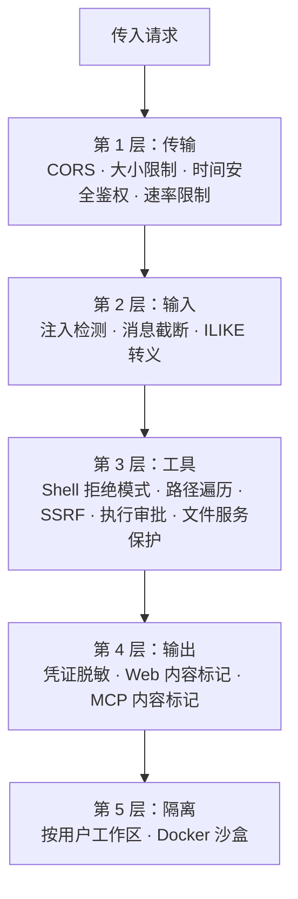
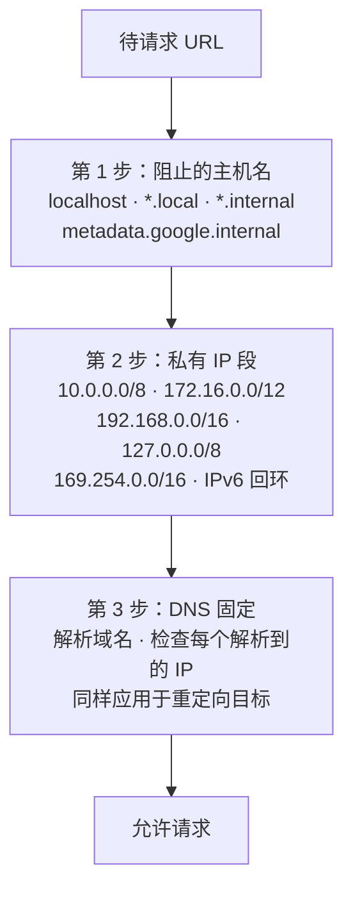

> 翻译自 [English version](/deploy-security)

# 安全加固

> GoClaw 采用五层独立防御——传输、输入、工具、输出和隔离——一层被突破不会危及其余层。

## 概览

每一层独立运作。组合在一起，形成覆盖完整请求生命周期的纵深防御架构，从传入的 WebSocket 连接到 agent 工具执行输出。



---

## 第 1 层：传输安全

控制在网络和 HTTP 层到达 gateway 的内容。

| 机制 | 详情 |
|-----------|--------|
| CORS | `checkOrigin()` 对照 `gateway.allowed_origins` 验证；空列表允许所有（向后兼容） |
| WebSocket 消息限制 | 512 KB——gorilla/websocket 超出时自动关闭连接 |
| HTTP body 限制 | 1 MB——在 JSON 解码前强制执行 |
| Token 鉴权 | `crypto/subtle.ConstantTimeCompare`——时间安全的 Bearer token 检查 |
| 速率限制 | 按用户/IP 的令牌桶；通过 `gateway.rate_limit_rpm` 配置（0 = 禁用） |

**加固操作：**

```json
{
  "gateway": {
    "allowed_origins": ["https://your-dashboard.example.com"],
    "rate_limit_rpm": 20
  }
}
```

生产环境将 `allowed_origins` 设为仪表盘域名。仅当你控制所有 WebSocket 客户端时才留空。

---

## 第 2 层：输入——注入检测

输入守卫在每条用户消息到达 LLM 前扫描 6 种提示注入模式。

| 模式 ID | 检测内容 |
|-----------|---------|
| `ignore_instructions` | "ignore all previous instructions" |
| `role_override` | "you are now…"、"pretend you are…" |
| `system_tags` | `<system>`、`[SYSTEM]`、`[INST]`、`<<SYS>>` |
| `instruction_injection` | "new instructions:"、"override:"、"system prompt:" |
| `null_bytes` | 空字符 `\x00`（混淆尝试） |
| `delimiter_escape` | "end of system"、`</instructions>`、`</prompt>` |

**通过 `gateway.injection_action` 配置响应行为：**

| 值 | 行为 |
|-------|----------|
| `"off"` | 完全禁用检测 |
| `"log"` | 以 info 级别记录日志，继续处理 |
| `"warn"`（默认） | 以 warning 级别记录日志，继续处理 |
| `"block"` | 记录警告，返回错误，停止处理 |

对于面向公众的部署或多用户共享 agent，设置为 `"block"`。

**消息截断：** 超过 `gateway.max_message_chars`（默认 32,000）的消息会被截断（而非拒绝），并通知 LLM已截断。

**ILIKE 转义：** 所有数据库 ILIKE 查询（搜索/过滤操作）在执行前会转义 `%`、`_` 和 `\` 字符，防止 SQL 通配符注入攻击。

---

## 第 3 层：工具安全

防范危险命令执行、未授权文件访问和服务器端请求伪造。

### Shell 拒绝分组

默认阻止 15 类命令。所有分组**默认开启（拒绝）**。可通过 agent 配置中的 `shell_deny_groups` 进行按 agent 覆盖。

| # | 分组 | 示例 |
|---|-------|----------|
| 1 | `destructive_ops` | `rm -rf /`、`dd if=`、`mkfs`、`reboot`、`shutdown` |
| 2 | `data_exfiltration` | `curl \| sh`、localhost 访问、DNS 查询 |
| 3 | `reverse_shell` | `nc -e`、`socat`、Python/Node socket |
| 4 | `code_injection` | `eval $()`、`base64 -d \| sh` |
| 5 | `privilege_escalation` | `sudo`、`su -`、`nsenter`、`mount`、`setcap`、`halt`、`doas`、`pkexec`、`runuser` |
| 6 | `dangerous_paths` | `chmod`/`chown` 在 `/` 路径上 |
| 7 | `env_injection` | `LD_PRELOAD=`、`DYLD_INSERT_LIBRARIES=` |
| 8 | `container_escape` | `docker.sock`、`/proc/sys/`、`/sys/kernel/` |
| 9 | `crypto_mining` | `xmrig`、`cpuminer`、stratum URL |
| 10 | `filter_bypass` | `sed /e`、`git --upload-pack=`、CVE 缓解措施 |
| 11 | `network_recon` | `nmap`、`ssh@`、`ngrok`、`chisel` |
| 12 | `package_install` | `pip install`、`npm i`、`apk add`、`yarn` |
| 13 | `persistence` | `crontab`、`.bashrc`、tee shell init |
| 14 | `process_control` | `kill -9`、`killall`、`pkill` |
| 15 | `env_dump` | `env`、`printenv`、`GOCLAW_*` 变量、`/proc/*/environ` |

为某个 agent 允许特定分组，在 agent 配置中将其设为 `false`：

```json
{
  "agents": {
    "list": {
      "devops-bot": {
        "shell_deny_groups": {
          "package_install": false,
          "process_control": false
        }
      }
    }
  }
}
```

### 路径遍历防护

`resolvePath()` 先调用 `filepath.Clean()`，再用 `HasPrefix()` 确保所有文件路径限制在 agent 工作区内。当 `restrict_to_workspace: true`（agent 默认值）时，工作区外的任何路径都会被阻止。

四个文件系统工具（`read_file`、`write_file`、`list_files`、`edit`）均实现了 `PathDenyable` 接口。Agent 循环在启动时调用 `DenyPaths(".goclaw")`——agent 无法读取 GoClaw 内部数据目录。`list_files` 工具会从目录列表中完全过滤掉被拒绝的路径，agent 永远看不到它们。

### 文件服务路径遍历保护

文件服务端点（`/v1/files/...`）验证所有请求路径，防止目录遍历攻击。任何包含 `../` 序列或解析到允许的基础目录之外的路径都会返回 400 错误。

### SSRF 防护（三步验证）

应用于 `web_fetch` 工具的所有出站 URL 请求：



### 凭证执行（直接执行模式）

对于需要凭证的工具（如 `gh`、`aws`），GoClaw 使用直接进程执行而非 shell——完全消除 shell 注入风险。

四层防御：
1. **无 shell** — `exec.CommandContext(binary, args...)`，从不使用 `sh -c`
2. **路径验证** — 二进制通过 `exec.LookPath()` 解析为绝对路径，与配置匹配
3. **拒绝模式** — 按二进制的参数正则拒绝列表（`deny_args`）和详细标志（`deny_verbose`）
4. **输出脱敏** — 运行时注册的凭证从 stdout/stderr 中脱敏

Shell 元字符（`;`、`|`、`&`、`$()`、反引号）在执行前被检测并拒绝。

### Shell 输出限制

宿主机执行的命令的 stdout 和 stderr 各限制为 **1 MB**。超出此限制时，输出被截断并标记以防止进一步写入。沙盒执行使用 Docker 容器限制。

### XML 解析（XXE 防护）

GoClaw 在所有 XML 处理路径中将标准库 `xml.etree.ElementTree` XML 解析器替换为 `defusedxml`。`defusedxml` 阻止 XML 外部实体（XXE）攻击——精心构造的 XML 负载引用外部实体读取本地文件或触发 SSRF。适用于解析 XML 输入的任何 agent 工具或 skill。

### 执行审批

完整的交互式审批流程参见[执行审批](/exec-approval)。至少启用 `ask: "on-miss"` 以在网络和基础设施工具运行前提示：

```json
{
  "tools": {
    "execApproval": {
      "security": "full",
      "ask": "on-miss"
    }
  }
}
```

---

## 第 4 层：输出安全

防止密钥通过工具输出或 LLM 响应泄露。

### 凭证脱敏（自动）

所有工具输出通过正则脱敏器，自动隐去已知密钥格式。替换为 `[REDACTED]`：

| 模式 | 示例 |
|---------|----------|
| OpenAI key | `sk-...` |
| Anthropic key | `sk-ant-...` |
| GitHub token | `ghp_`、`gho_`、`ghu_`、`ghs_`、`ghr_` |
| AWS access key | `AKIA...` |
| 连接字符串 | `postgres://...`、`mysql://...` |
| 环境变量模式 | `KEY=...`、`SECRET=...`、`DSN=...` |
| 长十六进制字符串 | 64+ 字符的十六进制序列 |
| DSN / 数据库 URL | `DSN=...`、`DATABASE_URL=...`、`REDIS_URL=...`、`MONGO_URI=...` |
| 通用键值 | `api_key=...`、`token=...`、`secret=...`、`bearer=...`（不区分大小写） |
| 运行时环境变量 | `VIRTUAL_*=...` 模式 |

共 13 个正则模式，覆盖所有主要密钥格式。

默认启用脱敏。要禁用（不推荐）：

```json
{ "tools": { "scrub_credentials": false } }
```

也可通过自定义工具集成中的 `AddDynamicScrubValues()` 注册运行时值进行动态脱敏（如运行时发现的服务器 IP）。

### MCP 内容标记

MCP 工具调用返回的结果与 web 请求一样，用不可信内容标记包裹：

```
<<<EXTERNAL_UNTRUSTED_CONTENT>>>
[MCP 工具结果]
<<<END_EXTERNAL_UNTRUSTED_CONTENT>>>
```

这可防止来自恶意 MCP 服务器的提示注入——LLM 被指示不将标记内容视为指令。

### Web 内容标记

从外部 URL 获取的内容被包裹：

```
<<<EXTERNAL_UNTRUSTED_CONTENT>>>
[获取的内容]
<<<END_EXTERNAL_UNTRUSTED_CONTENT>>>
```

这向 LLM 表明内容不可信，不应被视为指令。

内容标记受到 Unicode 同形字欺骗攻击的保护——GoClaw 对相似字符（如西里尔字母 `а` vs 拉丁字母 `a`）进行清洁，防止外部内容伪造边界标记。

---

## 第 5 层：隔离

### 按用户工作区隔离

每个用户拥有沙盒目录。两个级别：

| 级别 | 目录模式 |
|-------|-----------------|
| 按 agent | `~/.goclaw/{agent-key}-workspace/` |
| 按用户 | `{agent-workspace}/user_{sanitized_user_id}/` |

用户 ID 经过清洁——`[a-zA-Z0-9_-]` 之外的字符变为下划线。示例：`group:telegram:-1001234` → `group_telegram_-1001234`。

### Docker 沙盒

对于 agent shell 执行，启用 Docker 沙盒以在隔离容器中运行命令：

```bash
# 构建沙盒镜像
docker build -t goclaw-sandbox:bookworm-slim -f Dockerfile.sandbox .
```

```json
{
  "sandbox": {
    "mode": "all",
    "image": "goclaw-sandbox:bookworm-slim",
    "workspace_access": "rw",
    "scope": "session"
  }
}
```

自动应用的容器安全加固：

| 设置 | 值 |
|---------|-------|
| 根文件系统 | 只读（`--read-only`） |
| 能力 | 全部丢弃（`--cap-drop ALL`） |
| 新权限 | 禁用（`--security-opt no-new-privileges`） |
| 内存限制 | 512 MB |
| CPU 限制 | 1.0 |
| 网络 | 禁用（`--network none`） |
| 最大输出 | 1 MB |
| 超时 | 300 秒 |

沙盒模式：`off`（直接宿主机执行）、`non-main`（沙盒除主 agent 外的所有 agent）、`all`（沙盒所有 agent）。

---

## 加密

存储在 PostgreSQL 中的密钥使用 AES-256-GCM 加密：

| 内容 | 表 | 列 |
|------|-------|--------|
| LLM provider API key | `llm_providers` | `api_key` |
| MCP 服务器 API key | `mcp_servers` | `api_key` |
| 自定义工具环境变量 | `custom_tools` | `env` |
| Channel 凭证 | `channel_instances` | `credentials` |

首次运行前设置加密 key：

```bash
# 生成强 key
openssl rand -hex 32

# 添加到 .env
GOCLAW_ENCRYPTION_KEY=your-64-char-hex-key
```

存储格式：`"aes-gcm:" + base64(12字节 nonce + 密文 + GCM tag)`。没有前缀的值以明文返回，用于迁移兼容性。

---

## RBAC——3 种角色

WebSocket RPC 方法和 HTTP 端点按角色控制访问。角色具有层级关系。

| 角色 | 主要权限 |
|------|----------------|
| **Viewer** | `agents.list`、`config.get`、`sessions.list`、`health`、`status`、`skills.list` |
| **Operator** | + `chat.send`、`chat.abort`、`sessions.delete/reset`、`cron.*`、`skills.update` |
| **Admin** | + `config.apply/patch`、`agents.create/update/delete`、`channels.toggle`、`device.pair.approve/revoke` |

### API Key

对于细粒度访问控制，创建作用域 API key 而非共享 gateway token。Key 在存储前使用 SHA-256 哈希，缓存 5 分钟。

鉴权优先级：
1. **Gateway token** → Admin 角色（完全访问）
2. **API key** → 由作用域派生的角色
3. **无 token** → Operator（向后兼容）

可用作用域：

| 作用域 | 访问级别 |
|-------|-------------|
| `operator.admin` | 完全管理员访问 |
| `operator.read` | 只读（相当于 viewer） |
| `operator.write` | 读写操作 |
| `operator.approvals` | 执行审批管理 |
| `operator.pairing` | 设备配对管理 |

API key 通过 `Authorization: Bearer {key}` 头传递，与 gateway token 相同。

---

## 记忆文件覆写保护

记忆拦截器防止 agent 用不同内容静默覆盖已有记忆文件。当写入以替换模式（非追加）发出且目标已包含不同内容时，前一个值被捕获并返回给调用方，以便在数据丢失前警告 agent。

**工作原理：**

- `appendMode = true` — 新内容通过 `---` 分隔符合并到现有内容。无覆写警告。
- `appendMode = false` — 如果目标文件已包含不同内容，`PreviousContent` 在写入结果中被填充。调用方决定是否向 agent 显示警告。

这确保 agent 在并发或顺序写入期间无法静默覆盖记忆文件。写入仍通过 `PutDocument` 原子执行，但警告提供了冲突检测钩子。

---

## 配置权限系统

GoClaw 提供三个 RPC 方法来控制哪些用户可以修改 agent 的配置（心跳间隔、定时任务计划等）：

| 方法 | 说明 |
|--------|-------------|
| `config.permissions.list` | 列出 agent 的所有已授权限，可按 `configType` 过滤 |
| `config.permissions.grant` | 授予特定用户修改某配置类型的权限 |
| `config.permissions.revoke` | 撤销之前授予的权限 |

**权限模型——拒绝 → 允许回退：**

默认情况下，配置修改需要管理员访问。为 `userId` 授予特定 `scope` 和 `configType` 的权限后，该用户可在无完整管理员权限的情况下进行特定更改。

**授权参数：**

| 参数 | 必填 | 说明 |
|-----------|----------|-------------|
| `agentId` | 是 | agent 的 UUID |
| `scope` | 是 | 作用域标识符（如 `"heartbeat"`、`"cron"`） |
| `configType` | 是 | 被控制的配置类型 |
| `userId` | 是 | 被授权的用户 |
| `permission` | 是 | 权限级别（如 `"write"`） |
| `grantedBy` | 否 | 省略时自动从调用方身份填充 |

**示例——允许用户修改心跳配置：**

```json
{
  "method": "config.permissions.grant",
  "params": {
    "agentId": "3f2a1b4c-0000-0000-0000-000000000000",
    "scope": "heartbeat",
    "configType": "interval",
    "userId": "user:telegram:123456789",
    "permission": "write"
  }
}
```

配置权限检查在 Telegram channel 和其他 channel 处理器中强制执行，在应用用户消息中的心跳或 agent 配置更新之前生效。

---

## Goroutine Panic 恢复

GoClaw 通过 `safego` 包将所有后台 goroutine（工具执行、定时任务、摘要生成）包裹在 panic 恢复处理器中。如果 goroutine 发生 panic，错误会被捕获并记录，而不会导致整个服务器进程崩溃。

自动应用于：
- 工具执行 goroutine
- 定时任务执行
- 后台摘要任务

无需配置——panic 恢复始终处于活动状态。

---

## 加固检查清单

在将 GoClaw 暴露到互联网或共享给多用户之前使用：

- [ ] 将 `GOCLAW_GATEWAY_TOKEN` 设为强随机 token
- [ ] 将 `GOCLAW_ENCRYPTION_KEY` 设为 32 字节（64 个十六进制字符）随机 key
- [ ] 将 `gateway.allowed_origins` 设为仪表盘域名
- [ ] 设置 `gateway.rate_limit_rpm`（如 `20`）以限制按用户的请求速率
- [ ] 对面向公众的部署将 `gateway.injection_action` 设为 `"block"`
- [ ] 启用执行审批，`tools.execApproval.ask: "on-miss"`（或 `"always"`）
- [ ] 对不受信任的 agent 工作负载使用 `sandbox.mode: "all"` 启用 Docker 沙盒
- [ ] 将 `POSTGRES_PASSWORD` 设为强密码（不使用默认的 `"goclaw"`）
- [ ] 在 PostgreSQL 上启用 TLS（DSN 中 `sslmode=require`）
- [ ] 审查 `gateway.owner_ids`——只有受信任的用户 ID 才应有 owner 级访问权限
- [ ] 保持 `agents.restrict_to_workspace: true`（这是默认值——不要禁用）
- [ ] 为集成创建作用域 API key，而非共享 gateway token
- [ ] 为安全 CLI 工具集成配置 `tools.credentialed_exec`（gh、aws 等）
- [ ] 审查 shell 拒绝分组——默认全部 15 个开启；仅对确实需要的特定 agent 放宽
- [ ] 验证沙盒模式不会回退到宿主机执行（v0.x 起为失败关闭）

---

## 安全日志

所有安全事件以 `slog.Warn` 级别记录，前缀为 `security.*`：

| 事件 | 含义 |
|-------|---------|
| `security.injection_detected` | 检测到提示注入模式 |
| `security.injection_blocked` | 消息被拒绝（action = block） |
| `security.rate_limited` | 请求被速率限制器拒绝 |
| `security.cors_rejected` | WebSocket 连接被 CORS 策略拒绝 |
| `security.message_truncated` | 消息在 `max_message_chars` 处被截断 |

过滤所有安全事件：

```bash
./goclaw 2>&1 | grep '"security\.'
# 或使用结构化日志：
journalctl -u goclaw | grep 'security\.'
```

---

## 常见问题

| 问题 | 原因 | 解决方案 |
|---------|-------|-----|
| 合法消息被阻止 | `injection_action: "block"` 过于激进 | 切换到 `"warn"` 并在重新启用 block 前审查日志 |
| Agent 可以读取工作区外的文件 | agent 上 `restrict_to_workspace: false` | 重新启用（默认为 `true`） |
| 凭证出现在工具输出中 | `scrub_credentials: false` | 删除该覆盖——脱敏默认开启 |
| 沙盒未隔离 | 沙盒模式为 `"off"` | 将 `sandbox.mode` 设为 `"non-main"` 或 `"all"` |
| 加密 key 未设置 | `GOCLAW_ENCRYPTION_KEY` 为空 | 首次运行前设置；轮换需要重新加密已存储的密钥 |

---

## 下一步

- [执行审批](../advanced/exec-approval.md) — Shell 命令的交互式人工审批
- [沙盒](../advanced/sandbox.md) — Docker 沙盒详细配置
- [Docker Compose](./docker-compose.md) — 通过 compose overlay 部署安全设置
- [数据库设置](./database-setup.md) — PostgreSQL TLS 和加密密钥存储

<!-- goclaw-source: 19eef35 | 更新: 2026-03-25 -->
