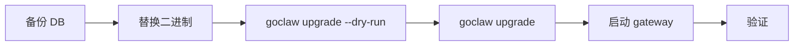

> 翻译自 [English version](/deploy-upgrading)

# 升级

> 如何安全升级 GoClaw——二进制、数据库 schema 和数据迁移，不出意外。

## 概览

GoClaw 升级分两个部分：

1. **SQL 迁移** — 由 `golang-migrate` 应用的 schema 变更（幂等、带版本号）
2. **数据钩子** — 在 schema 迁移后运行的可选 Go 数据变换（如回填新列）

`./goclaw upgrade` 命令按正确顺序处理两者。可多次安全运行——完全幂等。当前所需 schema 版本为 **44**。



## 升级命令

```bash
# 预览将要发生的变更（不应用任何变更）
./goclaw upgrade --dry-run

# 显示当前 schema 版本和待执行的项目
./goclaw upgrade --status

# 应用所有待执行的 SQL 迁移和数据钩子
./goclaw upgrade
```

### 状态输出说明

```
  App version:     v1.2.0 (protocol 3)
  Schema current:  12
  Schema required: 14
  Status:          UPGRADE NEEDED (12 -> 14)

  Pending data hooks: 1
    - 013_backfill_agent_slugs

  Run 'goclaw upgrade' to apply all pending changes.
```

| 状态 | 含义 |
|--------|---------|
| `UP TO DATE` | Schema 与二进制匹配——无需操作 |
| `UPGRADE NEEDED` | 运行 `./goclaw upgrade` |
| `BINARY TOO OLD` | 你的二进制比 DB schema 旧——升级二进制 |
| `DIRTY` | 迁移中途失败——参见下方恢复步骤 |

## 标准升级流程

### 第 1 步——备份数据库

```bash
pg_dump -Fc "$GOCLAW_POSTGRES_DSN" > goclaw-backup-$(date +%Y%m%d).dump
```

永远不要跳过此步骤。Schema 迁移不可自动回滚。

### 第 2 步——替换二进制

```bash
# 下载新二进制或从源码构建
go build -o goclaw-new .

# 验证版本
./goclaw-new upgrade --status
```

### 第 3 步——预演

```bash
./goclaw-new upgrade --dry-run
```

查看将要应用的 SQL 迁移和数据钩子。

### 第 4 步——应用

```bash
./goclaw-new upgrade
```

预期输出：

```
  App version:     v1.2.0 (protocol 3)
  Schema current:  12
  Schema required: 14

  Applying SQL migrations... OK (v12 -> v14)
  Running data hooks... 1 applied

  Upgrade complete.
```

### 第 5 步——启动 gateway

```bash
mv goclaw-new goclaw
./goclaw
```

### 第 6 步——验证

- 打开仪表盘确认 agent 正确加载
- 检查启动日志中是否有 `ERROR` 或 `WARN` 行
- 端到端运行一次 agent 消息测试

## Docker Compose 升级

使用 `docker-compose.upgrade.yml` overlay 以一次性容器的方式运行升级：

```bash
# 预演
docker compose \
  -f docker-compose.yml \
  -f docker-compose.postgres.yml \
  -f docker-compose.upgrade.yml \
  run --rm upgrade --dry-run

# 应用
docker compose \
  -f docker-compose.yml \
  -f docker-compose.postgres.yml \
  -f docker-compose.upgrade.yml \
  run --rm upgrade

# 检查状态
docker compose \
  -f docker-compose.yml \
  -f docker-compose.postgres.yml \
  -f docker-compose.upgrade.yml \
  run --rm upgrade --status
```

`upgrade` 服务启动后运行 `goclaw upgrade` 然后退出。`--rm` 标志自动删除容器。

> 确保 `GOCLAW_ENCRYPTION_KEY` 在 `.env` 中已设置——upgrade 服务需要它来访问加密配置。

## 启动时自动升级

对于手动升级步骤不切实际的 CI 或临时环境：

```bash
export GOCLAW_AUTO_UPGRADE=true
./goclaw
```

设置后，gateway 在启动时检查 schema，并在开始服务流量前自动应用所有待执行的 SQL 迁移和数据钩子。

**生产环境请谨慎使用**——推荐使用显式的 `./goclaw upgrade`，以便你控制时机并提前备份。

## 回滚流程

GoClaw 不提供自动回滚。如果出现问题：

### 方案 A——从备份恢复（最安全）

```bash
# 停止 gateway
# 从升级前备份恢复 DB
pg_restore -d "$GOCLAW_POSTGRES_DSN" goclaw-backup-20250308.dump

# 恢复之前的二进制
./goclaw-old
```

### 方案 B——修复脏 schema

如果迁移中途失败，schema 被标记为脏：

```
  Status: DIRTY (failed migration)
  Fix:  ./goclaw migrate force 13
  Then: ./goclaw upgrade
```

将迁移版本强制回退到上一个已知正确的状态，然后重新运行升级：

```bash
./goclaw migrate force 13
./goclaw upgrade
```

仅在你理解失败迁移的内容时才执行此操作。不确定时，从备份恢复。

### 所有 migrate 子命令

```bash
./goclaw migrate up              # 应用待执行的迁移
./goclaw migrate down            # 回滚一步
./goclaw migrate down 3          # 回滚 3 步
./goclaw migrate version         # 显示当前版本 + 脏状态
./goclaw migrate force <version> # 强制设置版本（仅用于恢复）
./goclaw migrate goto <version>  # 迁移到指定版本
./goclaw migrate drop            # 删除所有表（危险——仅在开发环境使用）
```

> **数据钩子追踪：** GoClaw 在独立的 `data_migrations` 表（与 `schema_migrations` 不同）中追踪迁移后的 Go 变换。运行 `./goclaw upgrade --status` 查看 SQL 迁移版本和待执行的数据钩子。

## 近期迁移

### v3 迁移（037–044）— v2→v3 升级指南

这些迁移通过 `./goclaw upgrade` 自动应用，构成 **v3 主版本**。从 v2 升级前请仔细阅读以下重大变更。

| 版本 | 变更内容 |
|------|---------|
| 037 | **V3 内存进化** — 创建 `episodic_summaries`、`agent_evolution_metrics`、`agent_evolution_suggestions`；为 KG 表添加 temporal 列；将 12 个 agent 配置字段从 `other_config` JSONB 提升为独立列 |
| 038 | **Knowledge Vault** — 创建 `vault_documents`、`vault_links`、`vault_versions` |
| 039 | 清除过期的 `agent_links` 数据 |
| 040 | 为 `episodic_summaries` 添加 `search_vector` 生成 FTS 列 + HNSW 索引 |
| 041 | 为 `episodic_summaries` 添加 `promoted_at` 列（用于 dreaming pipeline） |
| 042 | 为 `vault_documents` 添加 `summary` 列；重建 FTS |
| 043 | 为 `vault_documents` 和其他 9 张表添加 `team_id`、`custom_scope`；支持团队的唯一约束；scope 修复触发器 |
| 044 | 为所有 agent 播种 `AGENTS_CORE.md` 和 `AGENTS_TASK.md` 上下文文件；删除 `AGENTS_MINIMAL.md` |

#### v3 重大变更

| 变更 | 影响 | 所需操作 |
|------|------|---------|
| 删除旧版 `runLoop()`（约 745 行） | 所有 agent 现在运行统一的 v3 8 阶段 pipeline | 无——自动处理 |
| 移除 `v3PipelineEnabled` flag | 该 flag 不再被接受；v3 pipeline 始终激活 | 如有设置，从 `config.json` 中删除 `v3PipelineEnabled` |
| 移除 Web UI v2/v3 切换开关 | 设置页面不再显示 pipeline 切换 | 无 |
| 删除 `workspace_read`/`workspace_write` 工具 | 文件访问改用标准文件工具（`read_file`、`write_file`、`edit`） | 更新引用这些工具名称的 agent prompt |
| 移除 WhatsApp `bridge_url` | 直接进程内 WhatsApp 协议取代 Baileys bridge sidecar | 从 channel 配置中删除 `bridge_url`；参见 [WhatsApp 设置](/channels/whatsapp) |
| 删除 `docker-compose.whatsapp.yml` | bridge sidecar Docker Compose overlay 不再存在 | 从部署脚本中删除 |
| 文件工具自动解析团队工作区 | 指向团队工作区路径的 `read_file`/`write_file` 直接工作 | 无——透明处理 |
| Store 统一（`internal/store/base/`） | 仅内部重构 | 无——无 schema 或配置变更 |

### v2.x 迁移（024–032）

升级到 v2.x 时，这五个迁移在启动时自动应用。标准升级无需手动步骤——像往常一样运行 `./goclaw upgrade`。只有在主要版本跨越的情况下才需要手动迁移，此时推荐使用备份恢复方案。

| 版本 | 变更内容 |
|---------|-------------|
| 022 | 创建 `agent_heartbeats` 和 `heartbeat_run_logs` 表用于心跳监控；添加通用权限表 `agent_config_permissions`（替代 `group_file_writers`） |
| 023 | 添加 agent 硬删除支持（sessions、cron_jobs、delegation_history、team 表上的级联 FK 约束；仅活跃 agent 的唯一索引）；将 `group_file_writers` 合并到 `agent_config_permissions` 并删除旧表 |
| 024 | 团队附件重构——删除旧的工作区文件表和 `team_messages`；新的基于路径的 `team_task_attachments` 表；在 `team_tasks` 上添加去规范化计数列和语义 embedding |
| 025 | 为 `kg_entities` 添加 `embedding vector(1536)` 以支持语义知识图谱实体搜索 |
| 026 | 通过 `owner_id` 列将 API key 绑定到特定用户；添加 `team_user_grants` 访问控制表；删除旧的 `handoff_routes` 和 `delegation_history` 表 |
| 027 | 租户基础——添加 `tenants`、`tenant_users` 和按租户配置表；在 40+ 张表上用主租户 UUID 回填 `tenant_id`；将唯一约束更新为租户范围 |
| 028 | 为 `team_task_comments` 添加 `comment_type` 以支持阻塞升级 |
| 029 | 添加 `system_configs` 表——按租户的键值存储系统设置（明文；机密请使用 `config_secrets`） |
| 030 | 在 `spans.metadata`（局部，`span_type = 'llm_call'`）和 `sessions.metadata` JSONB 列上添加 GIN 索引以提升查询性能 |
| 031 | 为 `kg_entities` 添加 `tsv tsvector` 生成列和 GIN 索引以支持全文搜索；创建 `kg_dedup_candidates` 表用于实体去重审查 |
| 032 | 创建 `secure_cli_user_credentials` 表实现按用户 CLI 凭证注入；为 `channel_contacts` 添加 `contact_type` 列 |
| 033 | Cron payload columns | 将 `stateless`、`deliver`、`deliver_channel`、`deliver_to`、`wake_heartbeat` 从 `payload` JSONB 提升为 `cron_jobs` 独立列 |
| 034 | `subagent_tasks` | Subagent 任务持久化，支持基于 DB 的任务追踪 |
| 035 | contact_thread_id | 在 channel_contacts 中添加 thread_id VARCHAR(100) 和 thread_type VARCHAR(20)；清理 sender_id 去除 \|username 后缀；重建唯一索引为 (tenant_id, channel_type, sender_id, COALESCE(thread_id, '')) |
| 036 | secure_cli_agent_grants | 将 CLI 凭证从 per-binary agent 分配重构为 grants 模型；创建 `secure_cli_agent_grants` 表实现带可选设置覆盖的 per-agent 访问；为 `secure_cli_binaries` 添加 `is_global BOOLEAN`；从 `secure_cli_binaries` 移除 `agent_id` 列 |

### v2.x 重大变更

- **`delegation_history` 表已删除**（迁移 026）：委托历史不再存储在 DB 中。查询此表的任何代码或工具将失败。委托结果现在在 agent 工具响应中提供。
- **`team_messages` 表已删除**（迁移 024）：点对点团队邮箱已移除。团队通信现在使用任务评论。
- **`custom_tools` 表已删除**（迁移 027）：通过 DB 的自定义工具是死代码——agent 循环从未连接过它们。请改用 `config.json` 中的 `tools.mcp_servers`。
- **租户范围的唯一约束**：`agents.agent_key`、`sessions.session_key`、`mcp_servers.name` 等的唯一索引现在包含 `tenant_id`。对于单租户部署这是透明的（所有行默认为主租户）。
- **API key 用户绑定**：设置了 `owner_id` 的 API key 在鉴权期间强制 `user_id = owner_id`。没有 `owner_id` 的现有 key 不受影响。

### 自动版本检查器

GoClaw v2.x 包含自动版本检查器。启动后，gateway 在后台轮询 GitHub 发布，并在有新版本可用时在仪表盘中显示通知横幅。无需配置——检查自动运行，需要到 `api.github.com` 的出站 HTTPS。检查在 gateway 运行时定期执行；结果被缓存并提供给仪表盘客户端。

完整 schema 历史参见[数据库 Schema → 迁移历史](/database-schema)。

## 近期移除的环境变量

以下环境变量已移除，设置后将被静默忽略：

| 已移除变量 | 原因 | 迁移路径 |
|-----------------|--------|----------------|
| `GOCLAW_SESSIONS_STORAGE` | 会话现在仅使用 PostgreSQL | 从 `.env` 中删除——无需替换 |
| `GOCLAW_MODE` | 托管模式现在是默认值 | 从 `.env` 中删除——无需替换 |

如果你的 `.env` 或部署脚本引用了这些变量，请清理以避免混淆。

## 重大变更检查清单

每次升级前，检查发布说明中的：

- [ ] 协议版本升级——客户端（仪表盘、CLI）可能也需要更新
- [ ] 配置字段重命名或删除——相应更新 `config.json`
- [ ] 已移除的环境变量——对照 `.env.example` 检查你的 `.env`
- [ ] 新增的必填环境变量——如新的加密设置
- [ ] 工具或 provider 移除——验证你的 agent 仍然有其配置的工具

## 常见问题

| 问题 | 可能原因 | 解决方案 |
|-------|-------------|-----|
| `Database not configured` | `GOCLAW_POSTGRES_DSN` 未设置 | 运行升级前设置环境变量 |
| `DIRTY` 状态 | 之前的迁移中途失败 | `./goclaw migrate force <version-1>` 然后重试 |
| `BINARY TOO OLD` | 在较新 schema 上运行旧二进制 | 下载或构建最新二进制 |
| 升级挂起 | DB 不可达或被锁定 | 检查 DB 连接；查找长时间运行的事务 |
| 数据钩子未运行 | Schema 已在所需版本 | 数据钩子只在 schema 刚被迁移或待执行时运行 |

## 下一步

- [生产检查清单](/deploy-checklist) — 完整的上线前验证
- [数据库设置](/deploy-database) — PostgreSQL 和 pgvector 设置
- [可观测性](/deploy-observability) — 升级后监控你的 gateway

<!-- goclaw-source: 050aafc9 | 更新: 2026-04-09 -->
