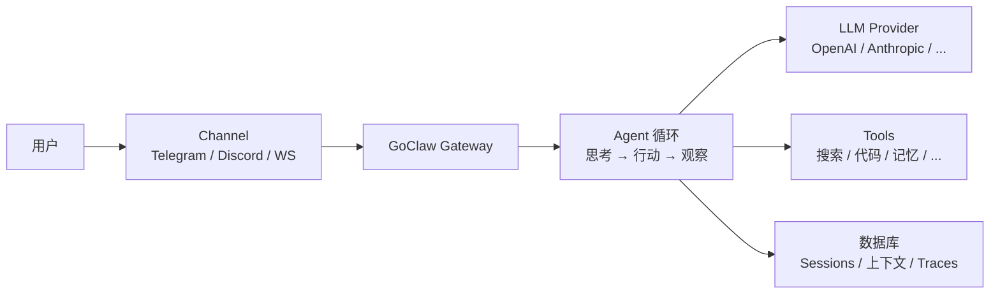

> 翻译自 [English version](/what-is-goclaw)

# GoClaw 是什么

> 一个多租户 AI agent gateway，将 LLM 连接到消息渠道、工具和团队。

## 概述

GoClaw 是一个用 Go 编写的开源 AI agent gateway。它让你能在 Telegram、Discord、WhatsApp 等渠道运行 AI agent，同时在团队内共享工具、记忆和上下文。可以将它理解为 LLM provider 与现实世界之间的桥梁。

## 核心功能

| 类别 | 功能 |
|------|------|
| **多租户** | 每用户独立的上下文、session、记忆和 trace |
| **22 种 Provider 类型** | OpenAI、Anthropic、Google、Groq、DeepSeek、Mistral、xAI 等（15 种 LLM API + 本地模型 + CLI agent + 媒体） |
| **7 个 Channel** | Telegram、Discord、WhatsApp、Zalo、Zalo Personal、Larksuite、Slack |
| **32 个内置工具** | 文件系统、网页搜索、浏览器、代码执行、记忆等 |
| **64+ WebSocket RPC 方法** | 实时控制——聊天、agent 管理、trace 等，通过 `/ws` 访问 |
| **Agent 编排** | 4 种模式——委托（同步/异步）、团队协作、交接、评估循环 |
| **知识图谱** | 基于 LLM 的实体/关系提取，支持图遍历 |
| **MCP 支持** | 连接 Model Context Protocol 服务器（stdio/SSE/HTTP） |
| **Skills 系统** | 基于 SKILL.md 的知识库，支持混合搜索（BM25 + 向量） |
| **Quality Gate** | 基于 hook 的输出验证，可配置反馈循环 |
| **扩展思考** | 每个 provider 的推理模式（Anthropic、OpenAI、DashScope） |
| **Prompt 缓存** | 在重复前缀上最高降低约 90% 成本 |
| **Web Dashboard** | Agent、provider、channel 和 trace 的可视化管理界面 |
| **记忆** | 支持混合搜索（向量 + 全文）的长期记忆 |
| **安全** | 限速、SSRF 防护、凭证清除、RBAC |
| **单二进制** | ~25 MB，<1s 启动，可运行于 $5 VPS |

## 适合谁使用

- **开发者**：构建 AI 驱动的聊天机器人和助手
- **团队**：需要基于角色访问的共享 AI agent
- **企业**：需要多租户隔离和审计记录

## 运行模式

GoClaw 需要 PostgreSQL 后端，支持加密凭证、多用户（每个用户拥有独立的隔离工作空间）和持久化记忆。这提供了完整的用户隔离、完整的活动日志和跨所有对话的智能搜索。

## 工作原理

1. 用户通过 **channel**（Telegram、WebSocket 等）发送消息
2. **gateway** 根据 channel 绑定将消息路由到对应 agent
3. **agent 循环**将对话发送给 LLM provider
4. LLM 可能调用 **tools**（网页搜索、运行代码、查询记忆、搜索知识图谱）
5. Agent 可以将任务**委托**给其他 agent、**交接**对话，或运行**评估循环**以输出高质量结果
6. 响应通过 channel 返回给用户

## 下一步

- [安装](/installation) — 在你的机器上运行 GoClaw
- [快速开始](/quick-start) — 5 分钟创建你的第一个 agent
- [GoClaw 工作原理](/how-goclaw-works) — 深入了解架构

<!-- goclaw-source: 57754a5 | 更新: 2026-03-18 -->
