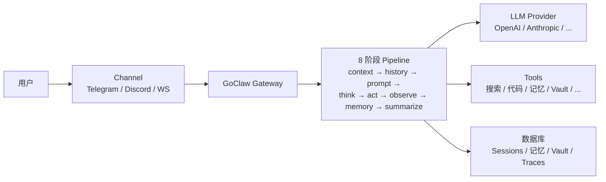

> 翻译自 [English version](/what-is-goclaw)

# GoClaw 是什么

> 一个多租户 AI agent gateway，将 LLM 连接到消息渠道、工具和团队。

## 概述

GoClaw 是一个用 Go 编写的开源 AI agent gateway。它让你能在 Telegram、Discord、WhatsApp 等渠道运行 AI agent，同时在团队内共享工具、记忆和上下文。可以将它理解为 LLM provider 与现实世界之间的桥梁。

## 核心功能

| 类别 | 功能 |
|------|------|
| **多租户 v3** | 每用户独立的上下文、session、记忆和 trace；按 edition 的速率限制 |
| **8 阶段 Agent Pipeline** | context → history → prompt → think → act → observe → memory → summarize（v3，始终启用） |
| **22 种 Provider 类型** | OpenAI、Anthropic、Google、Groq、DeepSeek、Mistral、xAI 等（15 种 LLM API + 本地模型 + CLI agent + 媒体） |
| **消息渠道** | Telegram、Discord、WhatsApp（原生）、Zalo、Zalo Personal、Larksuite、Slack、WebSocket |
| **32 个内置工具** | 文件系统、网页搜索、浏览器、代码执行、记忆等 |
| **64+ WebSocket RPC 方法** | 实时控制——聊天、agent 管理、trace 等，通过 `/ws` 访问 |
| **Agent 编排** | 委托（同步/异步）、团队、交接、评估循环，基于 `BatchQueue[T]` 的 WaitAll |
| **三层记忆** | L0/L1/L2 配合 consolidation worker（episodic、semantic、dreaming、dedup） |
| **知识库 Knowledge Vault** | Wikilink 文档网格、LLM 自动摘要 + 语义自动链接、BM25 + 向量混合搜索 |
| **知识图谱** | 基于 LLM 的实体/关系提取，支持图遍历 |
| **Agent 进化** | Guardrail + suggestion engine；预定义 agent 自我优化 SOUL.md / CAPABILITIES.md 并构建新 skill |
| **Mode Prompt 系统** | 可切换的 prompt 模式（full / task / minimal / none），支持 per-agent 覆盖 |
| **MCP 支持** | 连接 Model Context Protocol 服务器（stdio/SSE/HTTP） |
| **Skills 系统** | 基于 SKILL.md 的知识库，支持混合搜索；支持发布、授权，以及 evolution 驱动的 skill draft |
| **Quality Gate** | 基于 hook 的输出验证，可配置反馈循环 |
| **扩展思考** | 每个 provider 的推理模式（Anthropic、OpenAI、DashScope） |
| **Prompt 缓存** | 在重复前缀上最高降低约 90% 成本；v3 cache-boundary marker |
| **Web Dashboard** | Agent、provider、channel、vault、trace 的可视化管理界面 |
| **安全** | 限速、SSRF 防护、凭证清除、RBAC、session IDOR 加固 |
| **双数据库** | PostgreSQL（完整）或 SQLite 桌面版，通过统一的 store Dialect |
| **单二进制** | ~25 MB，<1s 启动，可运行于 $5 VPS |

## 适合谁使用

- **开发者**：构建 AI 驱动的聊天机器人和助手
- **团队**：需要基于角色访问的共享 AI agent
- **企业**：需要多租户隔离和审计记录

## 运行模式

GoClaw 可运行于 **PostgreSQL**（完整的多租户生产）或 **SQLite**（单用户桌面版）。两种模式都支持加密凭证、每用户独立的工作空间和持久化记忆——提供完整的用户隔离、完整的活动日志和跨所有对话的智能搜索。SQLite 不包含仅支持 pgvector 的功能（vault 语义自动链接会回退到词法搜索）。

## 工作原理

1. 用户通过 **channel**（Telegram、WebSocket 等）发送消息
2. **gateway** 根据 channel 绑定将消息路由到对应 agent
3. **8 阶段 pipeline** 运行：组装 context、提取 history、构建 prompt、think（LLM 调用）、act（工具调用）、observe 结果、更新 memory、summarize
4. 工具可以**搜索网页、运行代码、查询记忆、知识图谱或知识库**
5. Agent 可以将任务**委托**给 subagent（使用 `BatchQueue[T]` 进行并行等待）、**交接**对话，或运行**评估循环**以输出高质量结果
6. 后台 **consolidation worker** 将 episodic 事实提升为 semantic 记忆；**vault enrich worker** 自动摘要并语义链接新文档
7. 响应通过 channel 返回给用户

## 下一步

- [安装](/installation) — 在你的机器上运行 GoClaw
- [快速开始](/quick-start) — 5 分钟创建你的第一个 agent
- [GoClaw 工作原理](/how-goclaw-works) — 深入了解架构

<!-- goclaw-source: 050aafc9 | 更新: 2026-04-09 -->
