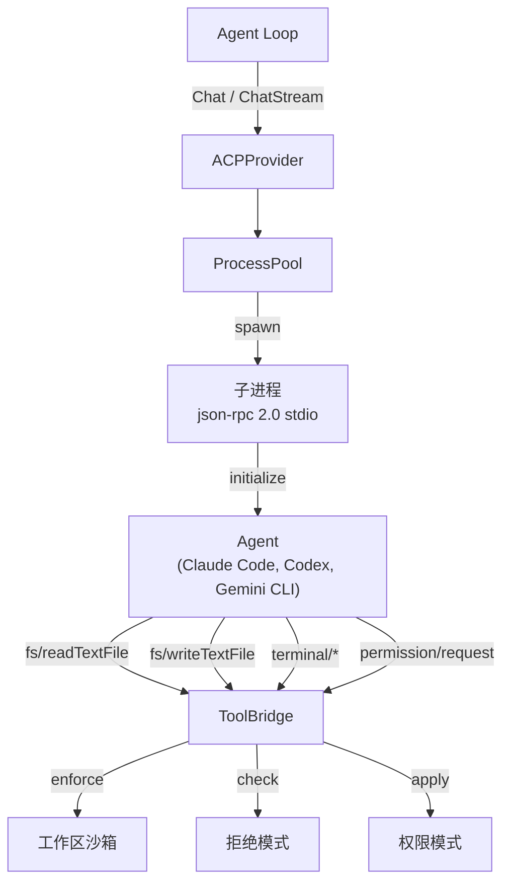
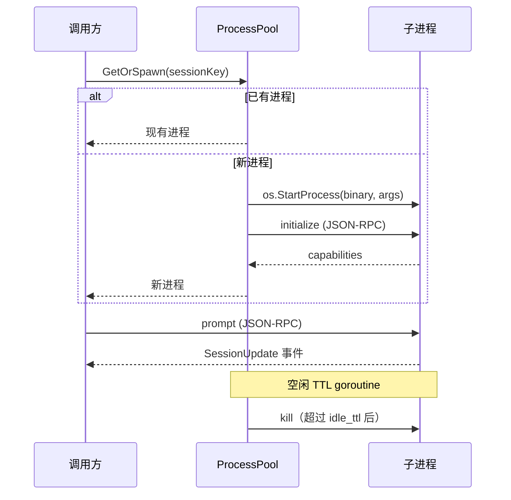

> 翻译自 [English version](/provider-acp)

# ACP（Agent Client Protocol）

> 通过 Agent Client Protocol 将 Claude Code、Codex CLI 或 Gemini CLI 作为 LLM provider 使用——以 JSON-RPC 子进程方式编排。

## 什么是 ACP？

ACP（Agent Client Protocol）使 GoClaw 能够通过 **JSON-RPC 2.0 over stdio** 将外部编码 agent——Claude Code、OpenAI Codex CLI、Gemini CLI 或任何 ACP 兼容 agent——作为子进程编排。GoClaw 不再调用 HTTP API，而是将 agent 二进制文件作为子进程启动，通过 stdin/stdout 管道交换结构化消息。

这允许将复杂的代码生成和推理任务委托给专门的 CLI agent，同时保持 GoClaw 统一的 `Provider` 接口：系统其余部分将 ACP 视为与其他 provider 完全相同。



---

## 配置

在 `config.json` 的 `providers` 下添加 `acp` 条目：

```json
{
  "providers": {
    "acp": {
      "binary": "claude",
      "args": ["--profile", "goclaw"],
      "model": "claude",
      "work_dir": "/tmp/workspace",
      "idle_ttl": "5m",
      "perm_mode": "approve-all"
    }
  }
}
```

### ACPConfig 字段

| 字段 | 类型 | 默认值 | 说明 |
|-------|------|---------|-------------|
| `binary` | string | `"claude"` | agent 二进制名称或绝对路径（如 `"claude"`、`"codex"`、`"gemini"`） |
| `args` | `[]string` | `[]` | 追加到每次子进程启动的额外参数 |
| `model` | string | `"claude"` | 向调用方报告的默认模型/agent 名称 |
| `work_dir` | string | 必填 | 基础工作区目录——所有文件操作限定在此 |
| `idle_ttl` | string | `"5m"` | 空闲子进程被回收的时长（Go duration 字符串） |
| `perm_mode` | string | `"approve-all"` | 权限策略：`approve-all`、`approve-reads` 或 `deny-all` |

### 数据库注册

Provider 也可通过 `llm_providers` 表动态注册：

| 列 | 值 |
|--------|-------|
| `provider_type` | `"acp"` |
| `api_base` | 二进制名称（如 `"claude"`） |
| `settings` | `{"args": [...], "idle_ttl": "5m", "perm_mode": "approve-all", "work_dir": "..."}` |

---

## ProcessPool

`ProcessPool` 管理子进程生命周期。每个会话（由 `session_key` 标识）对应一个长期运行的子进程：

1. **GetOrSpawn** — 每次请求时，获取该会话的现有子进程或启动新进程。
2. **Initialize** — 新启动的进程接收 JSON-RPC `initialize` 调用以协商协议能力。
3. **空闲 TTL 回收** — 后台 goroutine 定期检查最后使用时间；空闲超过 `idle_ttl` 的进程被终止并移除。
4. **崩溃恢复** — 若子进程意外退出，池在下次请求时检测到损坏的管道，移除旧条目，并透明地启动新进程。



---

## ToolBridge

当 agent 子进程需要读取文件、运行命令或请求权限时，它通过 stdio 向 GoClaw 发送 JSON-RPC 请求。`ToolBridge` 处理这些 agent→client 回调：

| 方法 | 说明 |
|--------|-------------|
| `fs/readTextFile` | 在工作区沙箱内读取文件 |
| `fs/writeTextFile` | 在工作区沙箱内写入文件 |
| `terminal/createTerminal` | 启动终端子进程 |
| `terminal/terminalOutput` | 获取终端输出和退出状态 |
| `terminal/waitForTerminalExit` | 阻塞直到终端退出 |
| `terminal/releaseTerminal` | 释放终端资源 |
| `terminal/killTerminal` | 强制终止终端 |
| `permission/request` | 请求用户批准某项操作 |

每次 ToolBridge 调用都经过验证：
1. **工作区隔离** — 路径必须在 `work_dir` 内
2. **拒绝模式匹配** — 执行前检查路径正则模式
3. **权限模式** — 基于 `perm_mode` 的最终关卡

---

## 会话串行化

同一会话的并发请求可能损坏文件状态。ACP 通过 `sessionMu` mutex 串行化每个会话的请求：

```go
unlock := p.lockSession(sessionKey)
defer unlock()
// Chat 或 ChatStream 以保证串行访问的方式执行
```

不同会话的请求并行运行，但同一会话的请求排队执行。

---

## 流式 vs 非流式

### Chat（非流式）

等待 agent 子进程完成提示执行，然后收集所有累积的 `SessionUpdate` 文本块并返回单一 `ChatResponse`。在需要完整答案后再处理时使用。

### ChatStream

为 agent 产生输出的每个文本 delta 触发 `StreamChunk` 回调。支持上下文取消：若调用方取消，GoClaw 向子进程发送 `session/cancel` JSON-RPC 通知。完成时返回合并的 `ChatResponse`。

---

## 工作区沙箱

所有文件操作限定在 `work_dir` 内。路径穿越尝试（如 `../../etc/passwd`）在到达文件系统前被检测并拒绝。

### 拒绝模式

正则模式阻止访问敏感路径，无论工作区范围如何：

```json
[
  "^/etc/",
  "^\\.env",
  "^secret",
  "^[Cc]redentials"
]
```

模式针对解析后的绝对路径求值。任何匹配都会导致请求被错误拒绝。

---

## 权限模式

| 模式 | 行为 |
|------|----------|
| `approve-all` | 所有 `permission/request` 调用自动批准（默认） |
| `approve-reads` | 读操作批准；文件系统写操作拒绝 |
| `deny-all` | 所有 `permission/request` 调用拒绝 |

---

## 内容处理

ACP 使用 `ContentBlock` 处理消息，支持文本、图像和音频：

```go
type ContentBlock struct {
    Type     string // "text"、"image"、"audio"
    Text     string // 文本内容
    Data     string // 图像/音频的 base64 编码
    MimeType string // 如 "image/png"、"audio/wav"
}
```

每次请求时，GoClaw：
1. 从 `ChatRequest.Messages` 提取系统提示和用户消息
2. 将系统提示前置到第一条用户消息（ACP agent 没有单独的系统 API）
3. 将图像内容块作为额外消息块附加

响应时，GoClaw：
1. 累积执行期间发出的 `SessionUpdate` 通知
2. 将所有文本块收集到响应内容中
3. 映射 `stopReason`：`"maxContextLength"` → `"length"`，其他均 → `"stop"`

---

## 安全注意事项

- **子进程隔离**：每个 agent 进程以与 GoClaw 相同的 OS 用户运行。使用 OS 级沙箱（如容器、seccomp）获得更强隔离。
- **工作区限制**：`work_dir` 是 agent 通过 ToolBridge 唯一可读写的目录，将其设为专用的非敏感目录。
- **拒绝模式**：配置匹配你的密钥布局的模式（`.env`、`credentials`、`*.pem` 等）。
- **权限模式**：在生产环境中使用 `approve-reads` 或 `deny-all` 以限制写访问。
- **二进制路径**：为 `binary` 指定绝对路径以防止 PATH 注入攻击。
- **idle_ttl**：保持较短（≤10m）以限制受攻击子进程的攻击面。

---

## 下一步

- [Provider 概览](/providers-overview)
- [Claude CLI](/provider-claude-cli)
- [自定义 / OpenAI 兼容](/provider-custom)

<!-- goclaw-source: 120fc2d | 更新: 2026-03-23 -->
