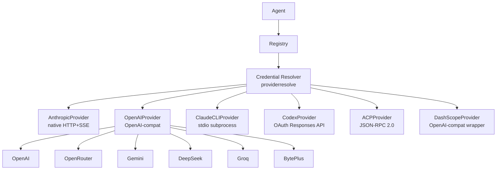

> 翻译自 [English version](/providers-overview)

# Provider 概览

> Provider 是 GoClaw 与 LLM API 之间的接口——配置一个（或多个），所有 agent 即可使用。

## 概述

Provider 封装了一个 LLM API，并暴露统一接口：`Chat()`、`ChatStream()`、`DefaultModel()` 和 `Name()`。GoClaw 有六种 provider 实现：原生 Anthropic 客户端（自定义 HTTP+SSE）、通用 OpenAI 兼容客户端（覆盖 15+ API 端点）、Claude CLI（通过 stdio 的本地二进制）、Codex（基于 OAuth 的 ChatGPT Responses API）、ACP（通过 JSON-RPC 2.0 编排子 agent），以及 DashScope（阿里 Qwen）。通过 agent 配置选择使用哪个 provider，系统其余部分与 provider 无关。

## Provider Adapter 系统

GoClaw v3 引入了可插拔的 **provider adapter** 层。每种 provider 类型通过 `adapter_register.go` 注册 adapter。所有 adapter 共用 `SSEScanner`（`internal/providers/sse_reader.go`）逐行读取 Server-Sent Events，消除了此前各 provider 独立实现流式传输的重复代码。

```
SSEScanner
└── 共用于：Anthropic、OpenAI-compat、Codex adapter
    └── 读取 SSE 数据负载，追踪事件类型，在 [DONE] 处停止
```

## Credential Resolver

`internal/providerresolve/` 包提供统一的 **credential resolver**（`ResolveConfiguredProvider`），被所有 adapter 共用。该 resolver：

1. 从租户注册表中查找 provider
2. 对于 `chatgpt_oauth`（Codex）provider，从 provider 级别默认值和 agent 级别覆盖中解析 pool 路由配置
3. 返回正确的 `Provider`（或用于 pool 策略的 `ChatGPTOAuthRouter`）

凭据以加密方式（AES-256-GCM）存储在 `llm_providers` PostgreSQL 表中，加载时解密——初始加载后不以明文形式存储在内存中。

## Provider 接口

每个 provider 实现相同的 Go 接口：

```
Chat()        — 阻塞调用，返回完整响应
ChatStream()  — 流式调用，每个 token 触发 onChunk 回调
DefaultModel() — 返回配置的默认模型名称
Name()        — 返回 provider 标识符（如 "anthropic"、"openai"）
```

支持扩展思考的 provider 还实现 `SupportsThinking() bool`。

## 支持的 Provider 类型

| Provider | 类型 | 默认模型 |
|----------|------|---------|
| **anthropic** | 原生 HTTP + SSE | `claude-sonnet-4-5-20250929` |
| **claude_cli** | stdio 子进程 + MCP | `sonnet` |
| **codex** / **chatgpt_oauth** | OAuth Responses API | `gpt-5.3-codex` |
| **acp** | JSON-RPC 2.0 子 agent | `claude` |
| **dashscope** | OpenAI 兼容封装 | `qwen3-max` |
| **openai**（+ 15+ 变体） | OpenAI 兼容 | 视模型而定 |

### OpenAI 兼容 Provider

| Provider | API Base | 默认模型 |
|----------|----------|---------|
| openai | `https://api.openai.com/v1` | `gpt-4o` |
| openrouter | `https://openrouter.ai/api/v1` | `anthropic/claude-sonnet-4-5-20250929` |
| groq | `https://api.groq.com/openai/v1` | `llama-3.3-70b-versatile` |
| deepseek | `https://api.deepseek.com/v1` | `deepseek-chat` |
| gemini | `https://generativelanguage.googleapis.com/v1beta/openai` | `gemini-2.0-flash` |
| mistral | `https://api.mistral.ai/v1` | `mistral-large-latest` |
| xai | `https://api.x.ai/v1` | `grok-3-mini` |
| minimax | `https://api.minimax.io/v1` | `MiniMax-M2.5` |
| cohere | `https://api.cohere.ai/compatibility/v1` | `command-a` |
| perplexity | `https://api.perplexity.ai` | `sonar-pro` |
| ollama | `http://localhost:11434/v1` | `llama3.3` |
| byteplus | `https://ark.ap-southeast.bytepluses.com/api/v3` | `seed-2-0-lite-260228` |

## 添加 Provider

### 静态配置（config.json）

在 `providers.<name>` 下添加 API key：

```json
{
  "providers": {
    "anthropic": {
      "api_key": "sk-ant-..."
    },
    "openai": {
      "api_key": "sk-...",
      "api_base": "https://api.openai.com/v1"
    },
    "openrouter": {
      "api_key": "sk-or-..."
    }
  }
}
```

`api_base` 字段可选——每个 provider 都有内置的默认端点。

### 控制台（llm_providers 表）

Provider 也可存储在 `llm_providers` PostgreSQL 表中。API key 使用 AES-256-GCM 加密存储。可以在控制台中添加、编辑或删除 provider，无需重启 GoClaw，修改在下一次请求时生效。

> **注意：** `provider_type` 创建后不可更改——无法通过 API 或控制台修改。如需切换 provider 类型，请删除后重新创建。

## Provider 架构



## 重试逻辑

所有 provider 通过 `RetryDo()` 共享相同的重试行为：

| 设置 | 值 |
|---|---|
| 最大尝试次数 | 3 |
| 初始延迟 | 300ms |
| 最大延迟 | 30s |
| 抖动 | ±10% |
| 可重试状态码 | 429, 500, 502, 503, 504 |
| 可重试网络错误 | 超时、连接重置、broken pipe、EOF |

当 API 返回 `Retry-After` 头（常见于 429 响应）时，GoClaw 使用该值而非计算指数退避。

## BytePlus 媒体生成（Seedream 和 Seedance）

`byteplus` provider 通过 BytePlus ModelArk 平台支持两种异步媒体生成能力：

| 工具 | 模型 | 功能 |
|------|------|------|
| `create_image_byteplus` | Seedream（如 `seedream-3-0`） | 异步图片生成——提交任务并轮询结果 |
| `create_video_byteplus` | Seedance（如 `seedance-1-0`） | 异步视频生成——提交任务并轮询 `/text-to-video-pro/status/{id}` |

配置 `byteplus` provider 后，两个工具均自动可用。它们与文本 provider 共享同一 API key 和 `api_base`；媒体端点自动推导（始终为 `/api/v3`，而非 `/api/coding/v3`）。

## ACP Provider（Claude Code、Codex CLI、Gemini CLI）

`acp` provider 通过 JSON-RPC 2.0 over stdio 将外部 coding agent（Claude Code、Codex CLI、Gemini CLI 或任何兼容 ACP 的 agent）作为子进程编排。通过 `provider_type: "acp"` 配置，设置 `binary`、`work_dir`、`idle_ttl` 和 `perm_mode`。完整详情见 [ACP Provider](/provider-acp)。

## Qwen 3.5 / DashScope 按模型思考控制

`dashscope` provider 支持 Qwen 模型的扩展思考，带有按模型思考守卫。有工具时，流式传输自动禁用，GoClaw 回退到单次非流式调用（DashScope 限制）。思考预算映射：low=4,096、medium=16,384、high=32,768 token。

## OpenAI GPT-5 / o 系列注意事项

对于 GPT-5 和 o 系列模型，使用 `max_completion_tokens` 而非 `max_tokens`。GoClaw 根据模型能力自动选择正确的参数名。对于不支持 temperature 的推理模型，该参数会被静默跳过。

## Anthropic 提示词缓存

Anthropic 提示词缓存通过请求中间件管道中的 `CacheMiddleware` 应用。模型别名在计算缓存键之前解析——例如 `sonnet` 在发送请求前解析为完整模型名称。

## Codex OAuth Pool 路由

当配置了多个 `chatgpt_oauth` provider 别名时，GoClaw 可通过 pool 策略将请求分发给它们。在 pool 所有者 provider 上通过 `settings.codex_pool` 配置：

```json
{
  "name": "openai-codex",
  "provider_type": "chatgpt_oauth",
  "settings": {
    "codex_pool": {
      "strategy": "round_robin",
      "extra_provider_names": ["codex-work", "codex-personal"]
    }
  }
}
```

| 策略 | 行为 |
|------|------|
| `round_robin` | 在首选账号和所有额外账号之间轮询请求 |
| `priority_order` | 优先尝试首选账号，然后按顺序依次使用额外账号 |
| `primary_first` | 固定使用首选账号（禁用该 agent 的 pool） |

可重试的上游失败会在同一请求中转移到下一个可用账号。每 agent 的 pool 活动可在 `GET /v1/agents/{id}/codex-pool-activity` 查看。

## Provider 级别的 `reasoning_defaults`

Provider（目前为 `chatgpt_oauth`）可在 `settings.reasoning_defaults` 中存储可复用的推理默认值。Agent 通过 `reasoning.override_mode: "inherit"` 继承，或通过 `"custom"` 覆盖。完整详情见 [OpenAI provider](/provider-openai)。

## 基于模型能力的 Reasoning Effort 控制

Reasoning effort 控制参数（`reasoning_effort`、`thinking_budget` 等）在每次请求前会根据目标模型的能力进行解析。如果目标模型不支持 reasoning effort，该参数会被静默丢弃——不会返回错误。这意味着你可以全局配置 reasoning effort，它只会应用于支持该功能的模型。

## Provider 上下文的 Datetime 工具

内置 `datetime` 工具允许 agent 和 provider 获取当前日期和时间，适用于时间敏感的推理和调度任务，无需依赖模型的知识截止日期。

## 自动限制 max_tokens

当模型因 `max_tokens` 过大而拒绝请求时，GoClaw 会自动使用限制后的值重试。根据 provider 不同，处理 `max_tokens` 和 `max_completion_tokens` 两种参数名。重试对 agent 透明——agent 不会看到错误。

## MCP Tools 的 Tool Schema 规范化

当 GoClaw 将 MCP（Model Context Protocol）tools 桥接到 provider 时，tool schema 会自动规范化以匹配 provider 所需的格式。字段类型、required 数组和不支持的属性会自动调整，确保 MCP tools 无需手动适配即可在所有 provider 后端上正常工作。

## 常见问题

| 问题 | 原因 | 解决方案 |
|---|---|---|
| `provider not found: X` | Provider 名称拼写错误或缺少配置 | 检查 config.json 中的拼写是否与 provider 名称一致 |
| `HTTP 401` | API key 无效或缺失 | 验证 API key 是否正确 |
| `HTTP 429` | 达到频率限制 | GoClaw 自动重试；降低请求并发 |
| Provider 未列出 | 未设置 key | 在 provider 配置块中添加 `api_key` |

## 下一步

- [Anthropic](/provider-anthropic) — 原生 Claude 集成，支持扩展思考
- [OpenAI](/provider-openai) — GPT-4o、o 系列、GPT-5 推理模型
- [OpenRouter](/provider-openrouter) — 通过一个 API 访问 100+ 模型
- [Gemini](/provider-gemini) — 通过 OpenAI 兼容端点使用 Google Gemini
- [DeepSeek](/provider-deepseek) — 支持 reasoning_content 的 DeepSeek
- [Groq](/provider-groq) — 超快推理
- [DashScope](/provider-dashscope) — 支持思考的阿里 Qwen 模型
- [ACP](/provider-acp) — Claude Code、Codex CLI、Gemini CLI 子 agent 编排

<!-- goclaw-source: 050aafc9 | 更新: 2026-04-09 -->
