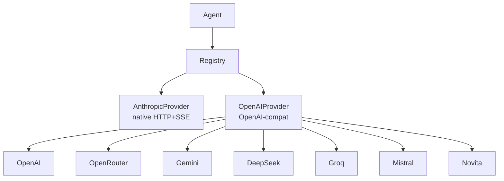

> 翻译自 [English version](/providers-overview)

# Provider 概览

> Provider 是 GoClaw 与 LLM API 之间的接口——配置一个（或多个），所有 agent 即可使用。

## 概述

Provider 封装了一个 LLM API，并暴露统一接口：`Chat()`、`ChatStream()`、`DefaultModel()` 和 `Name()`。GoClaw 有两种 provider 实现：一个原生 Anthropic 客户端（自定义 HTTP+SSE），以及一个通用 OpenAI 兼容客户端，涵盖 OpenAI、OpenRouter、Gemini、DeepSeek、Groq、Mistral 等。通过 agent 配置选择使用哪个 provider，系统其余部分与 provider 无关。

## Provider 接口

每个 provider 实现相同的 Go 接口：

```
Chat()        — 阻塞调用，返回完整响应
ChatStream()  — 流式调用，每个 token 触发 onChunk 回调
DefaultModel() — 返回配置的默认模型名称
Name()        — 返回 provider 标识符（如 "anthropic"、"openai"）
```

支持扩展思考的 provider 还实现 `SupportsThinking() bool`。

## 添加 Provider

### 静态配置（config.json）

在 `providers.<name>` 下添加 API key：

```json
{
  "providers": {
    "anthropic": {
      "api_key": "sk-ant-..."
    },
    "openai": {
      "api_key": "sk-...",
      "api_base": "https://api.openai.com/v1"
    },
    "openrouter": {
      "api_key": "sk-or-..."
    }
  }
}
```

`api_base` 字段可选——每个 provider 都有内置的默认端点。

### 控制台（llm_providers 表）

Provider 也可存储在 `llm_providers` PostgreSQL 表中。API key 使用 AES-256-GCM 加密存储。可以在控制台中添加、编辑或删除 provider，无需重启 GoClaw，修改在下一次请求时生效。

> **注意：** `provider_type` 创建后不可更改——无法通过 API 或控制台修改。如需切换 provider 类型，请删除后重新创建。

## 重试逻辑

所有 provider 通过 `RetryDo()` 共享相同的重试行为：

| 设置 | 值 |
|---|---|
| 最大尝试次数 | 3 |
| 初始延迟 | 300ms |
| 最大延迟 | 30s |
| 抖动 | ±10% |
| 可重试状态码 | 429, 500, 502, 503, 504 |
| 可重试网络错误 | 超时、连接重置、broken pipe、EOF |

当 API 返回 `Retry-After` 头（常见于 429 响应）时，GoClaw 使用该值而非计算指数退避。

## Provider 架构



## MCP Tools 的 Tool Schema 规范化

当 GoClaw 将 MCP（Model Context Protocol）tools 桥接到 provider 时，tool schema 会自动规范化以匹配 provider 所需的格式。字段类型、required 数组和不支持的属性会自动调整，确保 MCP tools 无需手动适配即可在所有 provider 后端上正常工作。

## BytePlus 媒体生成（Seedream 和 Seedance）

`byteplus` provider 通过 BytePlus ModelArk 平台支持两种异步媒体生成能力：

| 工具 | 模型 | 功能 |
|------|------|------|
| `create_image_byteplus` | Seedream（如 `seedream-3-0`） | 异步图片生成——提交任务并轮询结果 |
| `create_video_byteplus` | Seedance（如 `seedance-1-0`） | 异步视频生成——提交任务并轮询 `/text-to-video-pro/status/{id}` |

配置 `byteplus` provider 后，两个工具均自动可用。它们与文本 provider 共享同一 API key 和 `api_base`；媒体端点自动推导（始终为 `/api/v3`，而非 `/api/coding/v3`）。

## Codex OAuth Pool 路由

当配置了多个 `chatgpt_oauth` provider 别名时，GoClaw 可通过 pool 策略将请求分发给它们。在 pool 所有者 provider 上通过 `settings.codex_pool` 配置：

```json
{
  "name": "openai-codex",
  "provider_type": "chatgpt_oauth",
  "settings": {
    "codex_pool": {
      "strategy": "round_robin",
      "extra_provider_names": ["codex-work", "codex-personal"]
    }
  }
}
```

| 策略 | 行为 |
|------|------|
| `round_robin` | 在首选账号和所有额外账号之间轮询请求 |
| `priority_order` | 优先尝试首选账号，然后按顺序依次使用额外账号 |
| `primary_first` | 固定使用首选账号（禁用该 agent 的 pool） |

可重试的上游失败会在同一请求中转移到下一个可用账号。每 agent 的 pool 活动可在 `GET /v1/agents/{id}/codex-pool-activity` 查看。

## Provider 级别的 `reasoning_defaults`

Provider（目前为 `chatgpt_oauth`）可在 `settings.reasoning_defaults` 中存储可复用的推理默认值。Agent 通过 `reasoning.override_mode: "inherit"` 继承，或通过 `"custom"` 覆盖。完整详情见 [OpenAI provider](/provider-openai)。

## 基于模型能力的 Reasoning Effort 控制

Reasoning effort 控制参数（`reasoning_effort`、`thinking_budget` 等）在每次请求前会根据目标模型的能力进行解析。如果目标模型不支持 reasoning effort，该参数会被静默丢弃——不会返回错误。这意味着你可以全局配置 reasoning effort，它只会应用于支持该功能的模型。

## 自动限制 max_tokens

当模型因 `max_tokens` 过大而拒绝请求时，GoClaw 会自动使用限制后的值重试。根据 provider 不同，处理 `max_tokens` 和 `max_completion_tokens` 两种参数名。重试对 agent 透明——agent 不会看到错误。

## 常见问题

| 问题 | 原因 | 解决方案 |
|---|---|---|
| `provider not found: X` | Provider 名称拼写错误或缺少配置 | 检查 config.json 中的拼写是否与 provider 名称一致 |
| `HTTP 401` | API key 无效或缺失 | 验证 API key 是否正确 |
| `HTTP 429` | 达到频率限制 | GoClaw 自动重试；降低请求并发 |
| Provider 未列出 | 未设置 key | 在 provider 配置块中添加 `api_key` |

## 下一步

- [Anthropic](/provider-anthropic) — 原生 Claude 集成，支持扩展思考
- [OpenAI](/provider-openai) — GPT-4o、o 系列推理模型
- [OpenRouter](/provider-openrouter) — 通过一个 API 访问 100+ 模型
- [Gemini](/provider-gemini) — 通过 OpenAI 兼容端点使用 Google Gemini
- [DeepSeek](/provider-deepseek) — 支持 reasoning_content 的 DeepSeek
- [Groq](/provider-groq) — 超快推理
- [Mistral](/provider-mistral) — Mistral AI 模型
- [Novita AI](/provider-novita) — OpenAI 兼容，支持多种开源模型

<!-- goclaw-source: c083622f | 更新: 2026-04-05 -->
