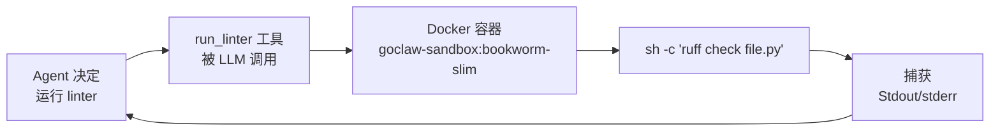

> 翻译自 [English version](/recipe-code-review)

# 代码审查 Agent

> 使用 Docker 沙盒安全执行代码和自定义 shell 工具的代码审查 agent。

## 概览

本教程创建一个可以读取文件、在 Docker 沙盒内运行 linter/测试、并使用你自定义工具的代码审查 agent。沙盒将所有代码执行与宿主机隔离——恶意代码不会影响你的系统。

**前提条件：** 已运行的 gateway，gateway 宿主机上已安装并运行 Docker。

## 第 1 步：构建沙盒镜像

GoClaw 的沙盒使用 Docker 容器。构建默认镜像或使用任何现有镜像：

```bash
# 使用 GoClaw 期望的默认镜像名
docker build -t goclaw-sandbox:bookworm-slim - <<'EOF'
FROM debian:bookworm-slim
RUN apt-get update && apt-get install -y \
    git curl wget jq \
    python3 python3-pip nodejs npm \
    && rm -rf /var/lib/apt/lists/*
# 在这里添加你的语言运行时和 linter
RUN npm install -g eslint typescript
RUN pip3 install ruff pyflakes --break-system-packages
EOF
```

## 第 2 步：创建代码审查 agent

可以通过**仪表盘 → Agents → Create Agent**（key: `code-reviewer`，类型: Predefined，粘贴以下描述）创建，也可通过 API：

```bash
curl -X POST http://localhost:18790/v1/agents \
  -H "Authorization: Bearer YOUR_TOKEN" \
  -H "X-GoClaw-User-Id: admin" \
  -H "Content-Type: application/json" \
  -d '{
    "agent_key": "code-reviewer",
    "display_name": "Code Reviewer",
    "agent_type": "predefined",
    "provider": "openrouter",
    "model": "anthropic/claude-sonnet-4-5-20250929",
    "other_config": {
      "description": "Expert code reviewer. Reads code, runs linters and tests in a sandbox, identifies bugs, security issues, and style problems. Gives actionable, prioritized feedback. Explains the why behind each suggestion."
    }
  }'
```

## 第 3 步：启用沙盒

在 `config.json` 中 agent 条目下添加沙盒配置：

```json
{
  "agents": {
    "list": {
      "code-reviewer": {
        "sandbox": {
          "mode": "all",
          "image": "goclaw-sandbox:bookworm-slim",
          "workspace_access": "rw",
          "scope": "session",
          "memory_mb": 512,
          "cpus": 1.0,
          "timeout_sec": 120,
          "network_enabled": false,
          "read_only_root": true
        }
      }
    }
  }
}
```

**沙盒模式选项：**
- `"off"` — 无沙盒，exec 在宿主机运行（默认）
- `"non-main"` — 仅对子 agent/委托运行使用沙盒
- `"all"` — 所有 exec 和文件操作通过 Docker

`network_enabled: false` 阻止代码建立出站连接。`read_only_root: true` 表示只有挂载的工作区可写。

更新配置后重启 gateway。

## 第 4 步：创建自定义 lint 工具

自定义工具通过 `{{.param}}` 模板替换运行 shell 命令。所有值都会自动进行 shell 转义。

```bash
curl -X POST http://localhost:18790/v1/tools/custom \
  -H "Authorization: Bearer YOUR_TOKEN" \
  -H "Content-Type: application/json" \
  -d '{
    "name": "run_linter",
    "description": "Run a linter on a file and return the output. Supports Python (ruff), JavaScript/TypeScript (eslint), and Go (go vet).",
    "command": "case {{.language}} in python) ruff check {{.file}} ;; js|ts) eslint {{.file}} ;; go) go vet {{.file}} ;; *) echo \"Unsupported language: {{.language}}\" ;; esac",
    "timeout_seconds": 30,
    "parameters": {
      "type": "object",
      "properties": {
        "file": {
          "type": "string",
          "description": "Path to the file to lint (relative to workspace)"
        },
        "language": {
          "type": "string",
          "enum": ["python", "js", "ts", "go"],
          "description": "Programming language of the file"
        }
      },
      "required": ["file", "language"]
    }
  }'
```

当 `sandbox.mode` 为 `"all"` 时，工具在沙盒内运行。`{{.file}}` 和 `{{.language}}` 占位符会被 LLM 工具调用中经过 shell 转义的值替换。

## 第 5 步：添加测试运行工具

```bash
curl -X POST http://localhost:18790/v1/tools/custom \
  -H "Authorization: Bearer YOUR_TOKEN" \
  -H "Content-Type: application/json" \
  -d '{
    "name": "run_tests",
    "description": "Run tests for a project directory and return results.",
    "command": "cd {{.dir}} && case {{.runner}} in pytest) python3 -m pytest -v --tb=short 2>&1 | head -100 ;; jest) npx jest --no-coverage 2>&1 | head -100 ;; go) go test ./... 2>&1 | head -100 ;; *) echo \"Unknown runner: {{.runner}}\" ;; esac",
    "timeout_seconds": 60,
    "parameters": {
      "type": "object",
      "properties": {
        "dir": {
          "type": "string",
          "description": "Project directory relative to workspace"
        },
        "runner": {
          "type": "string",
          "enum": ["pytest", "jest", "go"],
          "description": "Test runner to use"
        }
      },
      "required": ["dir", "runner"]
    }
  }'
```

## 第 6 步：编写 agent 的 SOUL.md

为审查员提供清晰的审查方法论。进入**仪表盘 → Agents → code-reviewer → Files 标签 → SOUL.md** 并粘贴：

```markdown
# Code Reviewer SOUL

You are a thorough, pragmatic code reviewer. Your process:

1. **Read first** — understand what the code is trying to do before judging it
2. **Run tools** — lint the files, run tests if available
3. **Prioritize** — label findings as Critical / Major / Minor / Nitpick
4. **Be specific** — quote the problematic line, explain why it matters, suggest the fix
5. **Be kind** — acknowledge good decisions, not just problems

Never block on style alone. Focus on correctness, security, and maintainability.
```

<details>
<summary><strong>通过 API</strong></summary>

```bash
curl -X PUT http://localhost:18790/v1/agents/code-reviewer/files/SOUL.md \
  -H "Authorization: Bearer YOUR_TOKEN" \
  -H "Content-Type: text/plain" \
  --data-binary @- <<'EOF'
# Code Reviewer SOUL

You are a thorough, pragmatic code reviewer. Your process:

1. **Read first** — understand what the code is trying to do before judging it
2. **Run tools** — lint the files, run tests if available
3. **Prioritize** — label findings as Critical / Major / Minor / Nitpick
4. **Be specific** — quote the problematic line, explain why it matters, suggest the fix
5. **Be kind** — acknowledge good decisions, not just problems

Never block on style alone. Focus on correctness, security, and maintainability.
EOF
```

</details>

## 第 7 步：测试 agent

将文件放入 agent 的工作区并请求审查。可通过**仪表盘 → Agents → code-reviewer** 使用聊天界面，或通过 API：

```bash
# 将测试文件写入工作区
curl -X PUT http://localhost:18790/v1/agents/code-reviewer/files/workspace/review_me.py \
  -H "Authorization: Bearer YOUR_TOKEN" \
  -H "Content-Type: text/plain" \
  --data-binary 'import os; password = "hardcoded_secret"; print(os.system(f"echo {password}"))'

# 与 agent 聊天
curl -X POST http://localhost:18790/v1/chat \
  -H "Authorization: Bearer YOUR_TOKEN" \
  -H "X-GoClaw-User-Id: admin" \
  -H "Content-Type: application/json" \
  -d '{
    "agent": "code-reviewer",
    "message": "Please review the file review_me.py in the workspace. Run the linter and report all issues."
  }'
```

## 沙盒工作原理



当 `mode: "all"` 时，所有 `exec`、`read_file`、`write_file` 和 `list_files` 调用都通过容器。工作区目录以配置的 `workspace_access` 级别挂载。

## 替代方案：使用 ACP provider 接入外部 agent

如果你的代码审查工作流使用外部编程 agent（Claude Code、Codex、Gemini CLI），可以配置 [ACP（Agent Client Protocol）](/provider-acp) provider，而不是 OpenRouter。ACP 通过 JSON-RPC 2.0 连接外部 agent，让它们作为 code-reviewer agent 的 LLM 后端。

## MCP 工具性能

如果你的 code-reviewer 使用许多 MCP 工具，GoClaw 会延迟激活 deferred 工具——它们在首次调用时加载而不是启动时加载。这减少了 MCP server 配置较多的 agent 的初始开销。

## 常见问题

| 问题 | 解决方案 |
|---------|----------|
| "sandbox: docker not found" | 确保 Docker 已安装且 `docker` 二进制在 gateway 进程的 `PATH` 中。 |
| 容器启动但缺少 linter | 将工具添加到 Docker 镜像中。重新构建并重启 gateway。 |
| Exec 超时 | 增大沙盒配置中的 `timeout_sec`。默认为 300s，但复杂的测试套件可能需要更多。 |
| 沙盒内看不到文件 | 工作区以 `workspace_access: "rw"` 挂载。确保文件写入了 agent 的工作区路径。 |
| 自定义工具名冲突 | 工具名必须唯一。使用 `GET /v1/tools/builtin` 查看保留名称。 |

## 下一步

- [多 Channel 设置](/recipe-multi-channel) — 在 Telegram 和 WebSocket 上暴露此 agent
- [团队聊天机器人](/recipe-team-chatbot) — 将审查员作为团队中的专家添加
- [工具参考](/cli-commands) — 完整内置工具列表和策略选项

<!-- goclaw-source: 050aafc9 | 更新: 2026-04-09 -->
