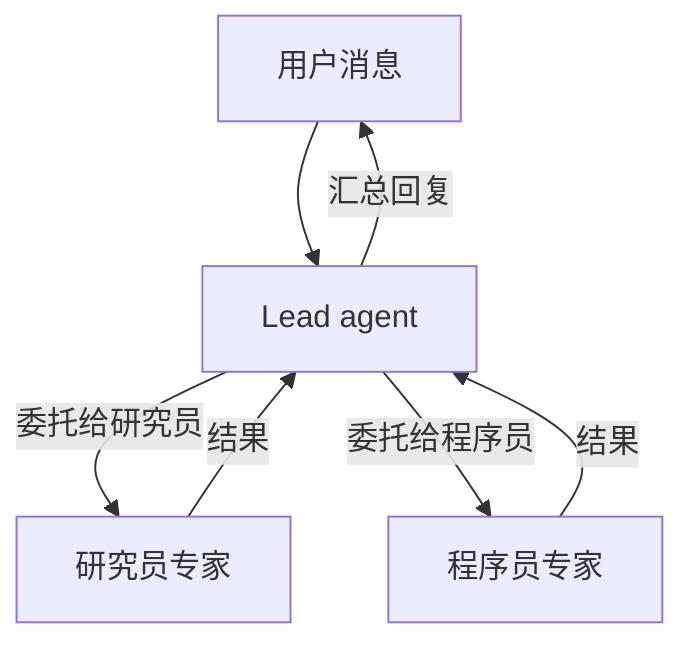

> 翻译自 [English version](/recipe-team-chatbot)

# 团队聊天机器人

> 由一个 lead 协调 agent 和多个专家子 agent 组成的多 agent 团队。

## 概览

本教程搭建一个三 agent 团队：一个负责对话和委托的 lead，以及两个专家（研究员和程序员）。用户只与 lead 对话，由 lead 决定何时调用专家。团队使用 GoClaw 内置的委托系统，lead 可以并行运行专家并汇总结果。

**所需条件：**
- 已运行的 gateway（先运行 `./goclaw onboard`）
- 访问 `http://localhost:18790` 的 Web 仪表盘
- 已配置至少一个 LLM provider

## 第 1 步：创建专家 agent

专家必须是**预定义** agent——只有预定义 agent 才能接收委托。

打开 Web 仪表盘，进入 **Agents → Create Agent**，创建两个专家：

**研究员 agent：**
- **Key：** `researcher`
- **显示名称：** Research Specialist
- **类型：** Predefined
- **Provider / 模型：** 选择你的 provider 和模型
- **描述：** "Deep research specialist. Searches the web, reads pages, synthesizes findings into concise reports with sources. Factual, thorough, cites everything."

点击**保存**。`description` 字段触发**召唤**——gateway 使用 LLM 自动生成 SOUL.md 和 IDENTITY.md。Agent 状态显示 `summoning`，然后转为 `active`。

**程序员 agent：**

重复相同步骤：
- **Key：** `coder`
- **显示名称：** Code Specialist
- **类型：** Predefined
- **描述：** "Senior software engineer. Writes clean, production-ready code. Explains implementation decisions. Prefers simple solutions. Tests edge cases."

等待两个 agent 都达到 `active` 状态后再继续。

<details>
<summary><strong>通过 API</strong></summary>

```bash
# 研究员
curl -X POST http://localhost:18790/v1/agents \
  -H "Authorization: Bearer YOUR_TOKEN" \
  -H "X-GoClaw-User-Id: admin" \
  -H "Content-Type: application/json" \
  -d '{
    "agent_key": "researcher",
    "display_name": "Research Specialist",
    "agent_type": "predefined",
    "provider": "openrouter",
    "model": "anthropic/claude-sonnet-4-5-20250929",
    "other_config": {
      "description": "Deep research specialist. Searches the web, reads pages, synthesizes findings into concise reports with sources. Factual, thorough, cites everything."
    }
  }'

# 程序员
curl -X POST http://localhost:18790/v1/agents \
  -H "Authorization: Bearer YOUR_TOKEN" \
  -H "X-GoClaw-User-Id: admin" \
  -H "Content-Type: application/json" \
  -d '{
    "agent_key": "coder",
    "display_name": "Code Specialist",
    "agent_type": "predefined",
    "provider": "openrouter",
    "model": "anthropic/claude-sonnet-4-5-20250929",
    "other_config": {
      "description": "Senior software engineer. Writes clean, production-ready code. Explains implementation decisions. Prefers simple solutions. Tests edge cases."
    }
  }'
```

轮询 agent 状态直到 `summoning` → `active`：

```bash
curl http://localhost:18790/v1/agents/researcher \
  -H "Authorization: Bearer YOUR_TOKEN"
```

</details>

## 第 2 步：创建 lead agent

Lead 是一个 **open** agent——每个用户都有自己的上下文，使其感觉像是拥有团队支持的个人助理。

在仪表盘中，进入 **Agents → Create Agent**：
- **Key：** `lead`
- **显示名称：** Assistant
- **类型：** Open
- **Provider / 模型：** 选择你的 provider 和模型

点击**保存**。

<details>
<summary><strong>通过 API</strong></summary>

```bash
curl -X POST http://localhost:18790/v1/agents \
  -H "Authorization: Bearer YOUR_TOKEN" \
  -H "X-GoClaw-User-Id: admin" \
  -H "Content-Type: application/json" \
  -d '{
    "agent_key": "lead",
    "display_name": "Assistant",
    "agent_type": "open",
    "provider": "openrouter",
    "model": "anthropic/claude-sonnet-4-5-20250929"
  }'
```

</details>

## 第 3 步：创建团队

在仪表盘中进入 **Teams → Create Team**：
- **名称：** Assistant Team
- **描述：** Personal assistant team with research and coding capabilities
- **Lead：** 选择 `lead`
- **Members：** 添加 `researcher` 和 `coder`

点击**保存**。创建团队会自动建立从 lead 到每个成员的委托链接。Lead agent 的上下文中现在包含一个 `TEAM.md` 文件，列出可用专家及委托方式。

<details>
<summary><strong>通过 API</strong></summary>

团队管理使用 WebSocket RPC。连接到 `ws://localhost:18790/ws` 并发送：

```json
{
  "type": "req",
  "id": "1",
  "method": "teams.create",
  "params": {
    "name": "Assistant Team",
    "lead": "lead",
    "members": ["researcher", "coder"],
    "description": "Personal assistant team with research and coding capabilities"
  }
}
```

</details>

## 第 4 步：连接 channel

在仪表盘中进入 **Channels → Create Instance**：
- **Channel 类型：** Telegram（或 Discord、Slack 等）
- **名称：** `team-telegram`
- **Agent：** 选择 `lead`
- **Credentials：** 粘贴你的 bot token
- **Config：** 设置 DM policy 和其他 channel 特定选项

点击**保存**。Channel 立即激活——无需重启 gateway。

> **重要：** 只将 lead agent 绑定到 channel。专家不应有自己的 channel 绑定——他们只通过委托接收工作。

<details>
<summary><strong>通过 config.json</strong></summary>

或者，在 `config.json` 中添加绑定并重启 gateway：

```json
{
  "bindings": [
    {
      "agentId": "lead",
      "match": {
        "channel": "telegram"
      }
    }
  ]
}
```

```bash
./goclaw
```

</details>

## 第 5 步：测试委托

发送一条需要调研和代码的消息：

> "What are the key differences between Rust's async model and Go's goroutines? Then write me a simple HTTP server in each."

Lead 将：
1. 将调研问题委托给 `researcher`
2. 将代码请求委托给 `coder`
3. 并行运行两者（最多 `maxConcurrent` 限制，每个链接默认 3）
4. 汇总并回复两份结果

## 第 6 步：通过任务看板监控

在仪表盘中打开 **Teams → Assistant Team → Task Board**。看板实时显示委托任务：

- **列：** 待处理、进行中、已完成——任务随专家工作自动移动
- **实时更新：** 看板通过增量更新刷新，无需手动重载
- **任务详情：** 点击任意任务查看分配的 agent、状态和输出
- **批量操作：** 通过复选框选择多个任务进行批量删除或状态变更

任务看板是验证委托是否正常工作、调试专家未按预期响应的最佳方式。

## 工作区范围

每个团队都有一个用于存放任务执行期间产生文件的工作区。范围可配置：

| 模式 | 行为 | 适用场景 |
|------|----------|----------|
| **隔离**（默认）| 每个对话有自己的文件夹（`teams/{teamID}/{chatID}/`）| 用户间隔私、独立任务 |
| **共享** | 所有成员访问同一文件夹（`teams/{teamID}/`）| 协作任务，各 agent 在彼此输出基础上继续工作 |

通过团队设置配置——在仪表盘中进入 **Teams → 你的团队 → Settings**，将**工作区范围**设置为 `shared` 或 `isolated`。

**限制：** 每个文件最大 10 MB，每个范围最多 100 个文件。

## 进度通知

团队支持自动进度通知，有两种模式：

| 模式 | 行为 |
|------|----------|
| **Direct** | 进度更新直接发送到聊天 channel——用户实时看到状态 |
| **Leader** | 进度更新注入到 lead agent 的会话中——由 lead 决定向用户展示什么 |

在团队设置中启用：开启**进度通知**，然后选择**升级模式**。

## 委托工作原理



Lead 通过 `delegate` 工具进行委托。专家作为子会话运行并返回输出。Lead 看到所有结果并组成最终回复。

## 常见问题

| 问题 | 解决方案 |
|---------|----------|
| "cannot delegate to open agents" | 专家必须是 `agent_type: "predefined"`。使用正确类型重新创建。 |
| Lead 不委托 | Lead 需要了解其团队。检查 `TEAM.md` 是否出现在 lead 的上下文文件中（仪表盘 → Agent → Files 标签）。如果缺失，重启 gateway。 |
| 专家召唤卡住 | 检查 gateway 日志中的 LLM 错误。召唤使用配置的 provider——确保有有效的 API key。 |
| 用户直接看到专家响应 | 只有 lead 应绑定到 channel。检查仪表盘 → Channels，确认专家没有 channel 绑定。 |
| 任务未出现在看板上 | 确认你查看的是正确的团队。委托任务自动出现——如果缺失，检查团队是否正确创建了所有成员。 |

## 下一步

- [什么是团队？](/teams-what-are-teams) — 团队概念和架构
- [任务看板](/teams-task-board) — 完整任务看板参考
- [Open vs. Predefined](/open-vs-predefined) — 专家为何必须是预定义类型
- [客户支持](/recipe-customer-support) — 服务多用户的预定义 agent

<!-- goclaw-source: 050aafc9 | 更新: 2026-04-09 -->
