> 翻译自 [English version](/database-schema)

# 数据库 Schema

> 所有迁移版本中的 PostgreSQL 表、列、类型和约束。

## 概览

GoClaw 需要 **PostgreSQL 15+** 以及两个扩展：

```sql
CREATE EXTENSION IF NOT EXISTS "pgcrypto";  -- UUID v7 生成
CREATE EXTENSION IF NOT EXISTS "vector";    -- pgvector 用于 embedding
```

自定义 `uuid_generate_v7()` 函数提供时序有序的 UUID。所有主键默认使用此函数。

Schema 版本由 `golang-migrate` 跟踪。运行 `goclaw migrate up` 或 `goclaw upgrade` 以应用所有迁移。当前 schema 版本：**57**。

### v3 Store 统一

v3 中，GoClaw 引入了共享的 `internal/store/base/` 包，包含 `Dialect` 接口和公共辅助函数。`pg/`（PostgreSQL）和 `sqlitestore/`（SQLite 桌面版）均通过类型别名实现此接口，消除代码重复。这是内部重构——无需任何 schema 变更或用户操作。

SQLite（桌面版）不支持 `pgvector`。以下功能**仅在 PostgreSQL 上可用**：
- `episodic_summaries` 向量搜索（`embedding` 上的 HNSW 索引）
- `vault_documents` 语义自动链接（向量相似度）
- `kg_entities` 语义搜索（`embedding` 上的 HNSW 索引）

---

## ER 图

```mermaid
erDiagram
    agents ||--o{ agent_shares : "shared with"
    agents ||--o{ agent_context_files : "has"
    agents ||--o{ user_context_files : "has"
    agents ||--o{ user_agent_profiles : "tracks"
    agents ||--o{ sessions : "owns"
    agents ||--o{ memory_documents : "stores"
    agents ||--o{ memory_chunks : "stores"
    agents ||--o{ skills : "owns"
    agents ||--o{ cron_jobs : "schedules"
    agents ||--o{ channel_instances : "bound to"
    agents ||--o{ agent_links : "links"
    agents ||--o{ agent_teams : "leads"
    agents ||--o{ agent_team_members : "member of"
    agents ||--o{ kg_entities : "has"
    agents ||--o{ kg_relations : "has"
    agents ||--o{ usage_snapshots : "measured in"
    agent_teams ||--o{ team_tasks : "has"
    agent_teams ||--o{ team_messages : "has"
    agent_teams ||--o{ team_workspace_files : "stores"
    memory_documents ||--o{ memory_chunks : "split into"
    cron_jobs ||--o{ cron_run_logs : "logs"
    traces ||--o{ spans : "contains"
    mcp_servers ||--o{ mcp_agent_grants : "granted to"
    mcp_servers ||--o{ mcp_user_grants : "granted to"
    skills ||--o{ skill_agent_grants : "granted to"
    skills ||--o{ skill_user_grants : "granted to"
    kg_entities ||--o{ kg_relations : "source of"
    team_tasks ||--o{ team_task_comments : "has"
    team_tasks ||--o{ team_task_events : "logs"
    team_workspace_files ||--o{ team_workspace_file_versions : "versioned by"
    team_workspace_files ||--o{ team_workspace_comments : "commented on"
    agents ||--o| agent_heartbeats : "has"
    agent_heartbeats ||--o{ heartbeat_run_logs : "logs"
    agents ||--o{ agent_config_permissions : "has"
    tenants ||--o{ system_configs : "has"
```



---

## 表

### `llm_providers`

已注册的 LLM provider。API key 使用 AES-256-GCM 加密。

| 列 | 类型 | 约束 | 说明 |
|--------|------|-------------|-------------|
| `id` | UUID | PK | UUID v7 |
| `name` | VARCHAR(50) | UNIQUE NOT NULL | 标识符（如 `openrouter`）|
| `display_name` | VARCHAR(255) | | 人类可读名称 |
| `provider_type` | VARCHAR(30) | NOT NULL DEFAULT `openai_compat` | `openai_compat` 或 `anthropic` |
| `api_base` | TEXT | | 自定义端点 URL |
| `api_key` | TEXT | | 加密的 API key |
| `enabled` | BOOLEAN | NOT NULL DEFAULT true | |
| `settings` | JSONB | NOT NULL DEFAULT `{}` | 额外的 provider 特定配置 |
| `created_at` | TIMESTAMPTZ | DEFAULT NOW() | |
| `updated_at` | TIMESTAMPTZ | DEFAULT NOW() | |

---

### `agents`

Agent 核心记录。每个 agent 有自己的 context、工具和模型配置。

| 列 | 类型 | 约束 | 说明 |
|--------|------|-------------|-------------|
| `id` | UUID | PK | UUID v7 |
| `agent_key` | VARCHAR(100) | UNIQUE NOT NULL | Slug 标识符（如 `researcher`）|
| `display_name` | VARCHAR(255) | | UI 显示名称 |
| `owner_id` | VARCHAR(255) | NOT NULL | 创建者用户 ID |
| `provider` | VARCHAR(50) | NOT NULL DEFAULT `openrouter` | LLM provider |
| `model` | VARCHAR(200) | NOT NULL | 模型 ID |
| `context_window` | INT | NOT NULL DEFAULT 200000 | 上下文窗口（token）|
| `max_tool_iterations` | INT | NOT NULL DEFAULT 20 | 每次运行最大工具轮数 |
| `workspace` | TEXT | NOT NULL DEFAULT `.` | 工作区目录路径 |
| `restrict_to_workspace` | BOOLEAN | NOT NULL DEFAULT true | 将文件访问限制在工作区内 |
| `tools_config` | JSONB | NOT NULL DEFAULT `{}` | 工具策略覆盖 |
| `sandbox_config` | JSONB | | Docker 沙箱配置 |
| `subagents_config` | JSONB | | 子 agent 并发配置 |
| `memory_config` | JSONB | | 记忆系统配置 |
| `compaction_config` | JSONB | | 会话压缩配置 |
| `context_pruning` | JSONB | | Context 剪枝配置 |
| `other_config` | JSONB | NOT NULL DEFAULT `{}` | 杂项配置（如 summoning 的 `description`）|
| `is_default` | BOOLEAN | NOT NULL DEFAULT false | 标记为默认 agent |
| `agent_type` | VARCHAR(20) | NOT NULL DEFAULT `open` | `open` 或 `predefined` |
| `status` | VARCHAR(20) | DEFAULT `active` | `active`、`inactive`、`summoning` |
| `frontmatter` | TEXT | | 用于委派和 UI 的简短专长摘要 |
| `tsv` | tsvector | GENERATED ALWAYS | 全文搜索向量（display_name + frontmatter）|
| `embedding` | vector(1536) | | 语义搜索 embedding |
| `budget_monthly_cents` | INTEGER | | 月度消费上限（美分）；NULL = 无限制（迁移 015）|
| `created_at` | TIMESTAMPTZ | DEFAULT NOW() | |
| `updated_at` | TIMESTAMPTZ | DEFAULT NOW() | |
| `deleted_at` | TIMESTAMPTZ | | 软删除时间戳 |

**索引：** `owner_id`、`status`（部分，非已删除）、`tsv`（GIN）、`embedding`（HNSW 余弦）

---

### `agent_shares`

向其他用户授予 agent 访问权限。

| 列 | 类型 | 说明 |
|--------|------|-------------|
| `id` | UUID PK | |
| `agent_id` | UUID FK → agents | |
| `user_id` | VARCHAR(255) | 被授权方 |
| `role` | VARCHAR(20) DEFAULT `user` | `user`、`operator`、`admin` |
| `granted_by` | VARCHAR(255) | 授权人 |
| `created_at` | TIMESTAMPTZ | |

---

### `agent_context_files`

按 agent 的 context 文件（SOUL.md、IDENTITY.md 等）。对该 agent 的所有用户共享。

| 列 | 类型 | 说明 |
|--------|------|-------------|
| `id` | UUID PK | |
| `agent_id` | UUID FK → agents | |
| `file_name` | VARCHAR(255) | 文件名（如 `SOUL.md`）|
| `content` | TEXT | 文件内容 |
| `created_at` | TIMESTAMPTZ | |
| `updated_at` | TIMESTAMPTZ | |

**唯一约束：** `(agent_id, file_name)`

---

### `user_context_files`

按用户、按 agent 的 context 文件（USER.md 等）。对每个用户私有。

| 列 | 类型 | 说明 |
|--------|------|-------------|
| `id` | UUID PK | |
| `agent_id` | UUID FK → agents | |
| `user_id` | VARCHAR(255) | |
| `file_name` | VARCHAR(255) | |
| `content` | TEXT | |
| `created_at` / `updated_at` | TIMESTAMPTZ | |

**唯一约束：** `(agent_id, user_id, file_name)`

---

### `user_agent_profiles`

跟踪每个用户在每个 agent 上的首次/最后访问时间戳。

| 列 | 类型 | 说明 |
|--------|------|-------------|
| `agent_id` | UUID FK → agents | |
| `user_id` | VARCHAR(255) | |
| `workspace` | TEXT | 按用户的工作区覆盖 |
| `first_seen_at` | TIMESTAMPTZ | |
| `last_seen_at` | TIMESTAMPTZ | |
| `metadata` | JSONB DEFAULT `{}` | 任意 profile 元数据（迁移 011）|

**主键：** `(agent_id, user_id)`

---

### `user_agent_overrides`

特定 agent 的按用户模型/provider 覆盖。

| 列 | 类型 | 说明 |
|--------|------|-------------|
| `id` | UUID PK | |
| `agent_id` | UUID FK → agents | |
| `user_id` | VARCHAR(255) | |
| `provider` | VARCHAR(50) | 覆盖 provider |
| `model` | VARCHAR(200) | 覆盖模型 |
| `settings` | JSONB | 额外设置 |

---

### `sessions`

聊天会话。每个 channel/用户/agent 组合对应一个会话。

| 列 | 类型 | 说明 |
|--------|------|-------------|
| `id` | UUID PK | |
| `session_key` | VARCHAR(500) UNIQUE | 复合键（如 `telegram:123456789`）|
| `agent_id` | UUID FK → agents | |
| `user_id` | VARCHAR(255) | |
| `messages` | JSONB DEFAULT `[]` | 完整消息历史 |
| `summary` | TEXT | 压缩摘要 |
| `model` | VARCHAR(200) | 此会话的活跃模型 |
| `provider` | VARCHAR(50) | 活跃 provider |
| `channel` | VARCHAR(50) | 来源 channel |
| `input_tokens` | BIGINT DEFAULT 0 | 累计输入 token 数 |
| `output_tokens` | BIGINT DEFAULT 0 | 累计输出 token 数 |
| `compaction_count` | INT DEFAULT 0 | 已执行的压缩次数 |
| `memory_flush_compaction_count` | INT DEFAULT 0 | 含记忆刷新的压缩次数 |
| `label` | VARCHAR(500) | 人类可读的会话标签 |
| `spawned_by` | VARCHAR(200) | 父会话 key（用于子 agent）|
| `spawn_depth` | INT DEFAULT 0 | 嵌套深度 |
| `metadata` | JSONB DEFAULT `{}` | 任意会话元数据（迁移 011）|
| `team_id` | UUID FK → agent_teams（可空）| 团队范围会话时设置（迁移 019）|
| `created_at` / `updated_at` | TIMESTAMPTZ | |

**索引：** `agent_id`、`user_id`、`updated_at DESC`、`team_id`（部分）

---

### `memory_documents` 和 `memory_chunks`

BM25 + 向量混合记忆系统。

**`memory_documents`** — 顶层索引文档：

| 列 | 类型 | 说明 |
|--------|------|-------------|
| `id` | UUID PK | |
| `agent_id` | UUID FK → agents | |
| `user_id` | VARCHAR(255) | 为 null 时为全局（共享）|
| `path` | VARCHAR(500) | 逻辑文档路径/标题 |
| `content` | TEXT | 完整文档内容 |
| `hash` | VARCHAR(64) | 内容的 SHA-256，用于变更检测 |
| `team_id` | UUID FK → agent_teams（可空）| 团队范围；NULL = 个人（迁移 019）|

**`memory_chunks`** — 文档的可搜索片段：

| 列 | 类型 | 说明 |
|--------|------|-------------|
| `id` | UUID PK | |
| `agent_id` | UUID FK → agents | |
| `document_id` | UUID FK → memory_documents | |
| `user_id` | VARCHAR(255) | |
| `path` | TEXT | 来源路径 |
| `start_line` / `end_line` | INT | 来源行范围 |
| `hash` | VARCHAR(64) | chunk 内容哈希 |
| `text` | TEXT | chunk 内容 |
| `embedding` | vector(1536) | 语义 embedding |
| `tsv` | tsvector GENERATED | 全文搜索（simple 配置，多语言）|
| `team_id` | UUID FK → agent_teams（可空）| 团队范围；NULL = 个人（迁移 019）|

**索引：** agent+user（标准 + 全局的部分索引）、document、tsv GIN、embedding HNSW 余弦、`team_id`（部分）

**`embedding_cache`** — 对 embedding API 调用去重：

| 列 | 类型 | 说明 |
|--------|------|-------------|
| `hash` | VARCHAR(64) | 内容哈希 |
| `provider` | VARCHAR(50) | Embedding provider |
| `model` | VARCHAR(200) | Embedding 模型 |
| `embedding` | vector(1536) | 缓存向量 |
| `dims` | INT | Embedding 维度 |

**主键：** `(hash, provider, model)`

---

### `skills`

已上传的 skill 包，支持 BM25 + 语义搜索。

| 列 | 类型 | 说明 |
|--------|------|-------------|
| `id` | UUID PK | |
| `name` | VARCHAR(255) | 显示名称 |
| `slug` | VARCHAR(255) UNIQUE | URL 友好的标识符 |
| `description` | TEXT | 简短描述 |
| `owner_id` | VARCHAR(255) | 创建者用户 ID |
| `visibility` | VARCHAR(10) DEFAULT `private` | `private` 或 `public` |
| `version` | INT DEFAULT 1 | 版本计数器 |
| `status` | VARCHAR(20) DEFAULT `active` | `active` 或 `archived` |
| `frontmatter` | JSONB | 来自 SKILL.md 的 skill 元数据 |
| `file_path` | TEXT | skill 内容的文件系统路径 |
| `file_size` | BIGINT | 文件大小（字节）|
| `file_hash` | VARCHAR(64) | 内容哈希 |
| `embedding` | vector(1536) | 语义搜索 embedding |
| `tags` | TEXT[] | 标签列表 |
| `is_system` | BOOLEAN DEFAULT false | 内置系统 skill；用户不可删除（迁移 017）|
| `deps` | JSONB DEFAULT `{}` | Skill 依赖声明（迁移 017）|
| `enabled` | BOOLEAN DEFAULT true | skill 是否激活（迁移 017）|

**索引：** owner、visibility（部分 active）、slug、HNSW embedding、GIN tags、`is_system`（部分 true）、`enabled`（部分 false）

**`skill_agent_grants`** / **`skill_user_grants`** — skill 访问控制，模式与 MCP 授权相同。

---

### `cron_jobs`

定时 agent 任务。

| 列 | 类型 | 说明 |
|--------|------|-------------|
| `id` | UUID PK | |
| `agent_id` | UUID FK → agents | |
| `user_id` | TEXT | 所有者用户 |
| `name` | VARCHAR(255) | 人类可读的任务名称 |
| `enabled` | BOOLEAN DEFAULT true | |
| `schedule_kind` | VARCHAR(10) | `at`、`every` 或 `cron` |
| `cron_expression` | VARCHAR(100) | Cron 表达式（kind=`cron` 时）|
| `interval_ms` | BIGINT | 间隔（毫秒，kind=`every` 时）|
| `run_at` | TIMESTAMPTZ | 单次运行时间（kind=`at` 时）|
| `timezone` | VARCHAR(50) | Cron 表达式的时区 |
| `payload` | JSONB | 发送给 agent 的消息 payload |
| `delete_after_run` | BOOLEAN DEFAULT false | 首次成功运行后自删除 |
| `stateless` | BOOLEAN DEFAULT false | 无状态模式 — 无需会话历史运行 |
| `deliver` | BOOLEAN DEFAULT false | 将结果发送到频道 |
| `deliver_channel` | TEXT | 目标频道类型（`telegram`、`discord` 等）|
| `deliver_to` | TEXT | 聊天/接收者 ID |
| `wake_heartbeat` | BOOLEAN DEFAULT false | 作业完成后触发心跳 |
| `next_run_at` | TIMESTAMPTZ | 下次执行时间 |
| `last_run_at` | TIMESTAMPTZ | 上次执行时间 |
| `last_status` | VARCHAR(20) | `ok`、`error`、`running` |
| `last_error` | TEXT | 上次错误消息 |
| `team_id` | UUID FK → agent_teams（可空）| 团队范围；NULL = 个人（迁移 019）|

**`cron_run_logs`** — 含 token 数和持续时间的按运行历史记录。`team_id` 列也在迁移 019 中添加。

---

### `pairing_requests` 和 `paired_devices`

设备配对流程（channel 用户请求访问权限）。

**`pairing_requests`** — 待处理的 8 字符配对码：

| 列 | 类型 | 说明 |
|--------|------|-------------|
| `code` | VARCHAR(8) UNIQUE | 向用户显示的配对码 |
| `sender_id` | VARCHAR(200) | Channel 用户 ID |
| `channel` | VARCHAR(255) | Channel 名称 |
| `chat_id` | VARCHAR(200) | 聊天 ID |
| `expires_at` | TIMESTAMPTZ | 配对码过期时间 |

**`paired_devices`** — 已批准的配对：

| 列 | 类型 | 说明 |
|--------|------|-------------|
| `sender_id` | VARCHAR(200) | |
| `channel` | VARCHAR(255) | |
| `chat_id` | VARCHAR(200) | |
| `paired_by` | VARCHAR(100) | 审批人 |
| `paired_at` | TIMESTAMPTZ | |
| `metadata` | JSONB DEFAULT `{}` | 任意配对元数据（迁移 011）|
| `expires_at` | TIMESTAMPTZ | 配对过期时间；NULL = 不过期（迁移 021）|

**唯一约束：** `(sender_id, channel)`

> `pairing_requests` 也在迁移 011 中新增了 `metadata JSONB DEFAULT '{}'`。

---

### `traces` 和 `spans`

LLM 调用追踪。

**`traces`** — 每次 agent 运行一条记录：

| 列 | 类型 | 说明 |
|--------|------|-------------|
| `id` | UUID PK | |
| `agent_id` | UUID | |
| `user_id` | VARCHAR(255) | |
| `session_key` | TEXT | |
| `run_id` | TEXT | |
| `parent_trace_id` | UUID | 委派场景——链接到父运行的 trace |
| `status` | VARCHAR(20) | `running`、`ok`、`error` |
| `total_input_tokens` | INT | |
| `total_output_tokens` | INT | |
| `total_cost` | NUMERIC(12,6) | 估算成本 |
| `span_count` / `llm_call_count` / `tool_call_count` | INT | 汇总计数器 |
| `input_preview` / `output_preview` | TEXT | 截断的首/末消息 |
| `tags` | TEXT[] | 可搜索标签 |
| `metadata` | JSONB | |

**`spans`** — trace 内的单次 LLM 调用和工具调用：

主要列：`trace_id`、`parent_span_id`、`span_type`（`llm`、`tool`、`agent`）、`model`、`provider`、`input_tokens`、`output_tokens`、`total_cost`、`tool_name`、`finish_reason`。

**索引：** 针对 agent+时间、用户+时间、session、status=error 优化。`idx_traces_quota` 部分索引在 `(user_id, created_at DESC)` 上过滤 `parent_trace_id IS NULL` 用于配额计数。`traces` 和 `spans` 均有 `team_id UUID FK → agent_teams`（可空，迁移 019）和部分索引。`traces` 还有 `idx_traces_start_root` 在 `(start_time DESC) WHERE parent_trace_id IS NULL` 上；`spans` 有 `idx_spans_trace_type` 在 `(trace_id, span_type)` 上（迁移 016）。

---

### `mcp_servers`

外部 MCP（Model Context Protocol）工具 provider。

| 列 | 类型 | 说明 |
|--------|------|-------------|
| `id` | UUID PK | |
| `name` | VARCHAR(255) UNIQUE | Server 名称 |
| `transport` | VARCHAR(50) | `stdio`、`sse`、`streamable-http` |
| `command` | TEXT | Stdio：要执行的命令 |
| `args` | JSONB | Stdio：参数 |
| `url` | TEXT | SSE/HTTP：server URL |
| `headers` | JSONB | SSE/HTTP：HTTP 请求头 |
| `env` | JSONB | Stdio：环境变量 |
| `api_key` | TEXT | 加密的 API key |
| `tool_prefix` | VARCHAR(50) | 可选的工具名称前缀 |
| `timeout_sec` | INT DEFAULT 60 | |
| `enabled` | BOOLEAN DEFAULT true | |

**`mcp_agent_grants`** / **`mcp_user_grants`** — 按 agent 和按用户的访问授权，支持可选的工具白名单/黑名单。

**`mcp_access_requests`** — agent 请求 MCP 访问权限的审批工作流。

---

### `custom_tools`

通过 API 管理的动态 shell 命令驱动工具。

| 列 | 类型 | 说明 |
|--------|------|-------------|
| `id` | UUID PK | |
| `name` | VARCHAR(100) | 工具名称 |
| `description` | TEXT | 向 LLM 显示的描述 |
| `parameters` | JSONB | 工具参数的 JSON Schema |
| `command` | TEXT | 要执行的 shell 命令 |
| `working_dir` | TEXT | 工作目录 |
| `timeout_seconds` | INT DEFAULT 60 | |
| `env` | BYTEA | 加密的环境变量 |
| `agent_id` | UUID FK → agents（可空）| 为 null 时为全局工具 |
| `enabled` | BOOLEAN DEFAULT true | |

**唯一约束：** 全局名称（`agent_id IS NULL` 时），`(name, agent_id)` 按 agent。

---

### `channel_instances`

数据库管理的 channel 连接（替代静态配置文件 channel 设置）。

| 列 | 类型 | 说明 |
|--------|------|-------------|
| `id` | UUID PK | |
| `name` | VARCHAR(100) UNIQUE | 实例名称 |
| `channel_type` | VARCHAR(50) | `telegram`、`discord`、`feishu`、`zalo_oa`、`zalo_personal`、`whatsapp` |
| `agent_id` | UUID FK → agents | 绑定的 agent |
| `credentials` | BYTEA | 加密的 channel 凭证 |
| `config` | JSONB | Channel 特定配置 |
| `enabled` | BOOLEAN DEFAULT true | |

---

### `agent_links`

Agent 间委派权限。源 agent 可以将任务委派给目标 agent。

| 列 | 类型 | 说明 |
|--------|------|-------------|
| `id` | UUID PK | |
| `source_agent_id` | UUID FK → agents | 委派方 agent |
| `target_agent_id` | UUID FK → agents | 被委派 agent |
| `direction` | VARCHAR(20) DEFAULT `outbound` | |
| `description` | TEXT | 委派时显示的链接描述 |
| `max_concurrent` | INT DEFAULT 3 | 最大并发委派数 |
| `team_id` | UUID FK → agent_teams（可空）| 由团队创建链接时设置 |
| `status` | VARCHAR(20) DEFAULT `active` | |

---

### `agent_teams`、`agent_team_members`、`team_tasks`、`team_messages`

多 agent 协同工作。

**`agent_teams`** — 团队记录，包含 lead agent。

**`agent_team_members`** — 多对多 `(team_id, agent_id)`，含角色（`lead`、`member`）。

**`team_tasks`** — 共享任务列表：

| 列 | 类型 | 说明 |
|--------|------|-------------|
| `subject` | VARCHAR(500) | 任务标题 |
| `description` | TEXT | 完整任务描述 |
| `status` | VARCHAR(20) DEFAULT `pending` | `pending`、`in_progress`、`completed`、`cancelled` |
| `owner_agent_id` | UUID | 认领任务的 agent |
| `blocked_by` | UUID[] DEFAULT `{}` | 阻塞此任务的任务 ID |
| `priority` | INT DEFAULT 0 | 越高优先级越高 |
| `result` | TEXT | 任务输出 |
| `task_type` | VARCHAR(30) DEFAULT `general` | 任务类别（迁移 018）|
| `task_number` | INT DEFAULT 0 | 每个团队的序列号（迁移 018）|
| `identifier` | VARCHAR(20) | 人类可读 ID，如 `TSK-1`（迁移 018）|
| `created_by_agent_id` | UUID FK → agents | 创建任务的 agent（迁移 018）|
| `assignee_user_id` | VARCHAR(255) | 人工用户受托人（迁移 018）|
| `parent_id` | UUID FK → team_tasks | 子任务的父任务（迁移 018）|
| `chat_id` | VARCHAR(255) DEFAULT `''` | 来源聊天（迁移 018）|
| `locked_at` | TIMESTAMPTZ | 任务锁获取时间（迁移 018）|
| `lock_expires_at` | TIMESTAMPTZ | 锁 TTL（迁移 018）|
| `progress_percent` | INT DEFAULT 0 | 0–100 完成度（迁移 018）|
| `progress_step` | TEXT | 当前进度描述（迁移 018）|
| `followup_at` | TIMESTAMPTZ | 下次跟进提醒时间（迁移 018）|
| `followup_count` | INT DEFAULT 0 | 已发送跟进次数（迁移 018）|
| `followup_max` | INT DEFAULT 0 | 最大跟进次数（迁移 018）|
| `followup_message` | TEXT | 跟进时发送的消息（迁移 018）|
| `followup_channel` | VARCHAR(60) | 跟进传递的 channel（迁移 018）|
| `followup_chat_id` | VARCHAR(255) | 跟进传递的聊天 ID（迁移 018）|
| `confidence_score` | FLOAT | Agent 自我评估分数（迁移 021）|

**索引：** `parent_id`（部分）、`(team_id, channel, chat_id)`、`(team_id, task_type)`、`lock_expires_at`（部分 in_progress）、`(team_id, identifier)`（唯一部分）、`followup_at`（部分 in_progress）、`blocked_by`（GIN）、`(team_id, owner_agent_id, status)`

**`team_messages`** — 团队内 agent 间的点对点邮箱。迁移 021 中新增了 `confidence_score FLOAT`。

---

### `builtin_tools`

内置 gateway 工具注册表，支持启用/禁用控制。

| 列 | 类型 | 说明 |
|--------|------|-------------|
| `name` | VARCHAR(100) PK | 工具名称（如 `exec`、`read_file`）|
| `display_name` | VARCHAR(255) | |
| `description` | TEXT | |
| `category` | VARCHAR(50) DEFAULT `general` | 工具类别 |
| `enabled` | BOOLEAN DEFAULT true | 全局启用/禁用 |
| `settings` | JSONB | 工具特定设置 |
| `requires` | TEXT[] | 所需外部依赖 |

---

### `config_secrets`

用于覆盖 `config.json` 值的加密键值存储（通过 Web UI 管理）。

| 列 | 类型 | 说明 |
|--------|------|-------------|
| `key` | VARCHAR(100) PK | 密钥名称 |
| `value` | BYTEA | AES-256-GCM 加密值 |

---

### `group_file_writers`

> **已在迁移 023 中移除。** 数据已迁移到 `agent_config_permissions`（`config_type = 'file_writer'`）。

---

### `channel_pending_messages`

群聊消息缓冲区。当 bot 未被提及时持久化消息，以便被提及时提供完整对话上下文。支持基于 LLM 的压缩（`is_summary` 行）和 7 天 TTL 清理。（迁移 012）

| 列 | 类型 | 约束 | 说明 |
|--------|------|-------------|-------------|
| `id` | UUID | PK | UUID v7 |
| `channel_name` | VARCHAR(100) | NOT NULL | Channel 实例名称 |
| `history_key` | VARCHAR(200) | NOT NULL | 限定对话缓冲区范围的复合键 |
| `sender` | VARCHAR(255) | NOT NULL | 发送者显示名称 |
| `sender_id` | VARCHAR(255) | NOT NULL DEFAULT `''` | 平台用户 ID |
| `body` | TEXT | NOT NULL | 原始消息文本 |
| `platform_msg_id` | VARCHAR(100) | NOT NULL DEFAULT `''` | 原生平台消息 ID |
| `is_summary` | BOOLEAN | NOT NULL DEFAULT false | 为 true 时此行为压缩摘要 |
| `created_at` | TIMESTAMPTZ | NOT NULL DEFAULT NOW() | |
| `updated_at` | TIMESTAMPTZ | NOT NULL DEFAULT NOW() | |

**索引：** `(channel_name, history_key, created_at)`

---

### `kg_entities`

按 agent 和用户范围的知识图谱实体节点。（迁移 013）

| 列 | 类型 | 约束 | 说明 |
|--------|------|-------------|-------------|
| `id` | UUID | PK | |
| `agent_id` | UUID FK → agents | NOT NULL | 所有者 agent（级联删除）|
| `user_id` | VARCHAR(255) | NOT NULL DEFAULT `''` | 用户范围；空 = agent 全局 |
| `external_id` | VARCHAR(255) | NOT NULL | 调用方提供的实体标识符 |
| `name` | TEXT | NOT NULL | 实体显示名称 |
| `entity_type` | VARCHAR(100) | NOT NULL | 如 `person`、`company`、`concept` |
| `description` | TEXT | DEFAULT `''` | 自由文本描述 |
| `properties` | JSONB | DEFAULT `{}` | 结构化实体属性 |
| `source_id` | VARCHAR(255) | DEFAULT `''` | 来源文档/chunk 引用 |
| `confidence` | FLOAT | NOT NULL DEFAULT 1.0 | 提取置信度分数 |
| `team_id` | UUID FK → agent_teams（可空）| | 团队范围；NULL = 个人（迁移 019）|
| `created_at` / `updated_at` | TIMESTAMPTZ | | |

**唯一约束：** `(agent_id, user_id, external_id)`

**索引：** `(agent_id, user_id)`、`(agent_id, user_id, entity_type)`、`team_id`（部分）

---

### `kg_relations`

知识图谱实体间的边。（迁移 013）

| 列 | 类型 | 约束 | 说明 |
|--------|------|-------------|-------------|
| `id` | UUID | PK | |
| `agent_id` | UUID FK → agents | NOT NULL | 所有者 agent（级联删除）|
| `user_id` | VARCHAR(255) | NOT NULL DEFAULT `''` | 用户范围 |
| `source_entity_id` | UUID FK → kg_entities | NOT NULL | 源节点（级联删除）|
| `relation_type` | VARCHAR(200) | NOT NULL | 关系标签，如 `works_at`、`knows` |
| `target_entity_id` | UUID FK → kg_entities | NOT NULL | 目标节点（级联删除）|
| `confidence` | FLOAT | NOT NULL DEFAULT 1.0 | 提取置信度分数 |
| `properties` | JSONB | DEFAULT `{}` | 关系属性 |
| `team_id` | UUID FK → agent_teams（可空）| | 团队范围；NULL = 个人（迁移 019）|
| `created_at` | TIMESTAMPTZ | | |

**唯一约束：** `(agent_id, user_id, source_entity_id, relation_type, target_entity_id)`

**索引：** `(source_entity_id, relation_type)`、`target_entity_id`、`team_id`（部分）

---

### `channel_contacts`

从所有 channel 交互中自动收集的全局统一联系人目录。非按 agent。用于联系人选择器、分析和未来 RBAC。（迁移 014）

| 列 | 类型 | 约束 | 说明 |
|--------|------|-------------|-------------|
| `id` | UUID | PK | |
| `channel_type` | VARCHAR(50) | NOT NULL | 如 `telegram`、`discord` |
| `channel_instance` | VARCHAR(255) | | 实例名称（可空）|
| `sender_id` | VARCHAR(255) | NOT NULL | 平台原生用户 ID |
| `user_id` | VARCHAR(255) | | 匹配的 GoClaw 用户 ID |
| `display_name` | VARCHAR(255) | | 解析后的显示名称 |
| `username` | VARCHAR(255) | | 平台用户名/handle |
| `avatar_url` | TEXT | | 头像 URL |
| `peer_kind` | VARCHAR(20) | | 如 `user`、`bot`、`group` |
| `metadata` | JSONB | DEFAULT `{}` | 额外的平台特定数据 |
| `thread_id` | VARCHAR(100) | | 聊天内的线程/话题标识符（migration 035） |
| `thread_type` | VARCHAR(20) | | 线程类型分类器（migration 035） |
| `merged_id` | UUID | | 去重后的规范联系人 |
| `first_seen_at` | TIMESTAMPTZ | NOT NULL DEFAULT NOW() | |
| `last_seen_at` | TIMESTAMPTZ | NOT NULL DEFAULT NOW() | |

**唯一约束：** `(tenant_id, channel_type, sender_id, COALESCE(thread_id, ''))`

**索引：** `channel_instance`（部分非空）、`merged_id`（部分非空）、`(display_name, username)`

---

### `activity_logs`

用户和系统操作的不可变审计记录。（迁移 015）

| 列 | 类型 | 约束 | 说明 |
|--------|------|-------------|-------------|
| `id` | UUID | PK | UUID v7 |
| `actor_type` | VARCHAR(20) | NOT NULL | `user`、`agent`、`system` |
| `actor_id` | VARCHAR(255) | NOT NULL | 用户或 agent ID |
| `action` | VARCHAR(100) | NOT NULL | 如 `agent.create`、`skill.delete` |
| `entity_type` | VARCHAR(50) | | 受影响实体的类型 |
| `entity_id` | VARCHAR(255) | | 受影响实体的 ID |
| `details` | JSONB | | 操作特定上下文 |
| `ip_address` | VARCHAR(45) | | 客户端 IP（IPv4 或 IPv6）|
| `created_at` | TIMESTAMPTZ | NOT NULL DEFAULT NOW() | |

**索引：** `(actor_type, actor_id)`、`action`、`(entity_type, entity_id)`、`created_at DESC`

---

### `usage_snapshots`

按 agent/provider/model/channel 组合的每小时预聚合指标。由读取 `traces` 和 `spans` 的后台快照 worker 填充。（迁移 016）

| 列 | 类型 | 说明 |
|--------|------|-------------|
| `id` | UUID PK | UUID v7 |
| `bucket_hour` | TIMESTAMPTZ | 小时桶（截断到小时）|
| `agent_id` | UUID（可空）| Agent 范围；NULL = 全系统 |
| `provider` | VARCHAR(50) DEFAULT `''` | LLM provider |
| `model` | VARCHAR(200) DEFAULT `''` | 模型 ID |
| `channel` | VARCHAR(50) DEFAULT `''` | Channel 名称 |
| `input_tokens` | BIGINT DEFAULT 0 | |
| `output_tokens` | BIGINT DEFAULT 0 | |
| `cache_read_tokens` | BIGINT DEFAULT 0 | |
| `cache_create_tokens` | BIGINT DEFAULT 0 | |
| `thinking_tokens` | BIGINT DEFAULT 0 | |
| `total_cost` | NUMERIC(12,6) DEFAULT 0 | 估算 USD 成本 |
| `request_count` | INT DEFAULT 0 | |
| `llm_call_count` | INT DEFAULT 0 | |
| `tool_call_count` | INT DEFAULT 0 | |
| `error_count` | INT DEFAULT 0 | |
| `unique_users` | INT DEFAULT 0 | 桶内不重复用户数 |
| `avg_duration_ms` | INT DEFAULT 0 | 平均请求时长 |
| `memory_docs` | INT DEFAULT 0 | 时间点记忆文档数 |
| `memory_chunks` | INT DEFAULT 0 | 时间点记忆 chunk 数 |
| `kg_entities` | INT DEFAULT 0 | 时间点知识图谱实体数 |
| `kg_relations` | INT DEFAULT 0 | 时间点知识图谱关系数 |
| `created_at` | TIMESTAMPTZ | |

**唯一约束：** `(bucket_hour, COALESCE(agent_id, '00000000...'), provider, model, channel)` — 支持安全的 upsert。

**索引：** `bucket_hour DESC`、`(agent_id, bucket_hour DESC)`、`(provider, bucket_hour DESC)`（部分非空）、`(channel, bucket_hour DESC)`（部分非空）

---

### `team_workspace_files`

按 `(team_id, chat_id)` 范围的共享文件存储。支持置顶、打标签和软归档。（迁移 018）

| 列 | 类型 | 约束 | 说明 |
|--------|------|-------------|-------------|
| `id` | UUID | PK | UUID v7 |
| `team_id` | UUID FK → agent_teams | NOT NULL | 所属团队 |
| `channel` | VARCHAR(50) DEFAULT `''` | | Channel 上下文 |
| `chat_id` | VARCHAR(255) DEFAULT `''` | | 系统派生的用户/聊天 ID |
| `file_name` | VARCHAR(255) | NOT NULL | 显示文件名 |
| `mime_type` | VARCHAR(100) | | MIME 类型 |
| `file_path` | TEXT | NOT NULL | 存储路径 |
| `size_bytes` | BIGINT DEFAULT 0 | | 文件大小 |
| `uploaded_by` | UUID FK → agents | NOT NULL | 上传者 agent |
| `task_id` | UUID FK → team_tasks（可空）| | 关联任务 |
| `pinned` | BOOLEAN DEFAULT false | | 置顶到工作区 |
| `tags` | TEXT[] DEFAULT `{}` | | 可搜索标签 |
| `metadata` | JSONB | | 额外元数据 |
| `archived_at` | TIMESTAMPTZ | | 软删除时间戳 |
| `created_at` / `updated_at` | TIMESTAMPTZ | | |

**唯一约束：** `(team_id, chat_id, file_name)`

**索引：** `(team_id, chat_id)`、`uploaded_by`、`task_id`（部分）、`archived_at`（部分）、`(team_id, pinned)`（部分 true）、`tags`（GIN）

---

### `team_workspace_file_versions`

工作区文件的版本历史。每次上传新版本创建一行。（迁移 018）

| 列 | 类型 | 约束 | 说明 |
|--------|------|-------------|-------------|
| `id` | UUID | PK | UUID v7 |
| `file_id` | UUID FK → team_workspace_files | NOT NULL | 父文件 |
| `version` | INT | NOT NULL | 版本号 |
| `file_path` | TEXT | NOT NULL | 此版本的存储路径 |
| `size_bytes` | BIGINT DEFAULT 0 | | |
| `uploaded_by` | UUID FK → agents | NOT NULL | |
| `created_at` | TIMESTAMPTZ | NOT NULL | |

**唯一约束：** `(file_id, version)`

---

### `team_workspace_comments`

工作区文件上的注释。（迁移 018）

| 列 | 类型 | 约束 | 说明 |
|--------|------|-------------|-------------|
| `id` | UUID | PK | UUID v7 |
| `file_id` | UUID FK → team_workspace_files | NOT NULL | 被注释的文件 |
| `agent_id` | UUID FK → agents | NOT NULL | 注释者 agent |
| `content` | TEXT | NOT NULL | 注释文本 |
| `created_at` | TIMESTAMPTZ | NOT NULL | |

**索引：** `file_id`

---

### `team_task_comments`

任务上的讨论线程。（迁移 018）

| 列 | 类型 | 约束 | 说明 |
|--------|------|-------------|-------------|
| `id` | UUID | PK | UUID v7 |
| `task_id` | UUID FK → team_tasks | NOT NULL | 父任务 |
| `agent_id` | UUID FK → agents（可空）| | 注释者 agent |
| `user_id` | VARCHAR(255) | | 注释的人工用户 |
| `content` | TEXT | NOT NULL | 评论正文 |
| `metadata` | JSONB DEFAULT `{}` | | |
| `confidence_score` | FLOAT | | Agent 自我评估（迁移 021）|
| `created_at` | TIMESTAMPTZ | NOT NULL | |

**索引：** `task_id`

---

### `team_task_events`

任务状态变更的不可变审计日志。（迁移 018）

| 列 | 类型 | 约束 | 说明 |
|--------|------|-------------|-------------|
| `id` | UUID | PK | UUID v7 |
| `task_id` | UUID FK → team_tasks | NOT NULL | 父任务 |
| `event_type` | VARCHAR(30) | NOT NULL | 如 `status_change`、`assigned`、`locked` |
| `actor_type` | VARCHAR(10) | NOT NULL | `agent` 或 `user` |
| `actor_id` | VARCHAR(255) | NOT NULL | 操作实体 ID |
| `data` | JSONB | | 事件 payload |
| `created_at` | TIMESTAMPTZ | NOT NULL | |

**索引：** `task_id`

---

### `secure_cli_binaries`

Exec 工具的凭证注入配置（Direct Exec Mode）。管理员将二进制名称映射到加密的环境变量；GoClaw 自动注入到子进程。（迁移 020；迁移 036 更新）

| 列 | 类型 | 约束 | 说明 |
|--------|------|-------------|-------------|
| `id` | UUID | PK | UUID v7 |
| `binary_name` | TEXT | NOT NULL | 显示名称（如 `gh`、`gcloud`）|
| `binary_path` | TEXT | | 绝对路径；NULL = 运行时自动解析 |
| `description` | TEXT | NOT NULL DEFAULT `''` | 管理员可见描述 |
| `encrypted_env` | BYTEA | NOT NULL | AES-256-GCM 加密的 JSON 环境映射 |
| `deny_args` | JSONB DEFAULT `[]` | | 禁止参数前缀的正则模式 |
| `deny_verbose` | JSONB DEFAULT `[]` | | 要剥离的详细标志模式 |
| `timeout_seconds` | INT DEFAULT 30 | | 进程超时 |
| `tips` | TEXT DEFAULT `''` | | 注入 TOOLS.md context 的提示 |
| `is_global` | BOOLEAN | NOT NULL DEFAULT true | 若为 true，所有 agent 均可使用；若为 false，仅有显式 grant 的 agent 可访问 |
| `enabled` | BOOLEAN DEFAULT true | | |
| `created_by` | TEXT DEFAULT `''` | | 创建此条目的管理员用户 |
| `created_at` / `updated_at` | TIMESTAMPTZ | | |

> **迁移 036 说明：** `agent_id` 列已从此表移除。per-agent 访问控制现通过 `secure_cli_agent_grants` 表管理。`is_global = true` 的 binary 对所有 agent 可用；`is_global = false` 的 binary 需要显式 grant。

**唯一约束：** `(binary_name, tenant_id)` — 每个租户每个名称一个 binary 定义。

**索引：** `binary_name`

---

### `api_keys`

基于范围访问控制的细粒度 API key 管理。（迁移 020）

| 列 | 类型 | 约束 | 说明 |
|--------|------|-------------|-------------|
| `id` | UUID | PK | |
| `name` | VARCHAR(100) | NOT NULL | 人类可读的 key 名称 |
| `prefix` | VARCHAR(8) | NOT NULL | 前 8 个字符，用于显示/搜索 |
| `key_hash` | VARCHAR(64) | NOT NULL UNIQUE | 完整 key 的 SHA-256 十六进制摘要 |
| `scopes` | TEXT[] DEFAULT `{}` | | 如 `{'operator.admin','operator.read'}` |
| `expires_at` | TIMESTAMPTZ | | NULL = 永不过期 |
| `last_used_at` | TIMESTAMPTZ | | |
| `revoked` | BOOLEAN DEFAULT false | | |
| `created_by` | VARCHAR(255) | | 创建 key 的用户 ID |
| `created_at` / `updated_at` | TIMESTAMPTZ | | |

**索引：** `key_hash`（部分 `NOT revoked`）、`prefix`

---

### `agent_heartbeats`

按 agent 的心跳配置，用于定期主动签到。（迁移 022）

| 列 | 类型 | 约束 | 说明 |
|--------|------|-------------|-------------|
| `id` | UUID | PK | UUID v7 |
| `agent_id` | UUID FK → agents | NOT NULL UNIQUE ON DELETE CASCADE | 每个 agent 一个配置 |
| `enabled` | BOOLEAN | NOT NULL DEFAULT false | 心跳是否激活 |
| `interval_sec` | INT | NOT NULL DEFAULT 1800 | 运行间隔（秒）|
| `prompt` | TEXT | | 每次心跳发送给 agent 的消息 |
| `provider_id` | UUID FK → llm_providers（可空）| ON DELETE SET NULL（迁移 057）| 覆盖 LLM provider；provider 被删除时置为 NULL |
| `model` | VARCHAR(200) | | 覆盖模型 |
| `isolated_session` | BOOLEAN | NOT NULL DEFAULT true | 在专用会话中运行 |
| `light_context` | BOOLEAN | NOT NULL DEFAULT false | 注入最少 context |
| `ack_max_chars` | INT | NOT NULL DEFAULT 300 | 确认响应的最大字符数 |
| `max_retries` | INT | NOT NULL DEFAULT 2 | 失败时最大重试次数 |
| `active_hours_start` | VARCHAR(5) | | 活跃窗口开始（HH:MM）|
| `active_hours_end` | VARCHAR(5) | | 活跃窗口结束（HH:MM）|
| `timezone` | TEXT | | 活跃时间的时区 |
| `channel` | VARCHAR(50) | | 传递 channel |
| `chat_id` | TEXT | | 传递聊天 ID |
| `next_run_at` | TIMESTAMPTZ | | 计划下次执行时间 |
| `last_run_at` | TIMESTAMPTZ | | 上次执行时间 |
| `last_status` | VARCHAR(20) | | 上次运行状态 |
| `last_error` | TEXT | | 上次运行错误 |
| `run_count` | INT | NOT NULL DEFAULT 0 | 总运行次数 |
| `suppress_count` | INT | NOT NULL DEFAULT 0 | 总抑制运行次数 |
| `metadata` | JSONB | DEFAULT `{}` | 额外元数据 |
| `created_at` / `updated_at` | TIMESTAMPTZ | DEFAULT NOW() | |

**索引：** `idx_heartbeats_due` 在 `(next_run_at) WHERE enabled = true AND next_run_at IS NOT NULL` 上——调度器轮询的部分索引。

---

### `heartbeat_run_logs`

每次心跳运行的执行日志。（迁移 022）

| 列 | 类型 | 约束 | 说明 |
|--------|------|-------------|-------------|
| `id` | UUID | PK | UUID v7 |
| `heartbeat_id` | UUID FK → agent_heartbeats | NOT NULL ON DELETE CASCADE | 父心跳配置 |
| `agent_id` | UUID FK → agents | NOT NULL ON DELETE CASCADE | 所有者 agent |
| `status` | VARCHAR(20) | NOT NULL | `ok`、`error`、`skipped` |
| `summary` | TEXT | | 简短运行摘要 |
| `error` | TEXT | | 失败时的错误消息 |
| `duration_ms` | INT | | 运行时长（毫秒）|
| `input_tokens` | INT | DEFAULT 0 | |
| `output_tokens` | INT | DEFAULT 0 | |
| `skip_reason` | VARCHAR(50) | | 跳过运行的原因 |
| `metadata` | JSONB | DEFAULT `{}` | 额外元数据 |
| `ran_at` | TIMESTAMPTZ | DEFAULT NOW() | |
| `created_at` | TIMESTAMPTZ | DEFAULT NOW() | |

**索引：** `idx_hb_logs_heartbeat` 在 `(heartbeat_id, ran_at DESC)` 上，`idx_hb_logs_agent` 在 `(agent_id, ran_at DESC)` 上

---

### `agent_config_permissions`

Agent 配置的通用权限表（心跳、cron、文件写入者等）。替代 `group_file_writers`。（迁移 022）

| 列 | 类型 | 约束 | 说明 |
|--------|------|-------------|-------------|
| `id` | UUID | PK | UUID v7 |
| `agent_id` | UUID FK → agents | NOT NULL ON DELETE CASCADE | 所有者 agent |
| `scope` | VARCHAR(255) | NOT NULL | 群组/聊天 ID 范围 |
| `config_type` | VARCHAR(50) | NOT NULL | 如 `file_writer`、`heartbeat` |
| `user_id` | VARCHAR(255) | NOT NULL | 被授权用户 ID |
| `permission` | VARCHAR(10) | NOT NULL | `allow` 或 `deny` |
| `granted_by` | VARCHAR(255) | | 授权人 |
| `metadata` | JSONB | DEFAULT `{}` | 额外元数据（如 displayName、username）|
| `created_at` / `updated_at` | TIMESTAMPTZ | DEFAULT NOW() | |

**唯一约束：** `(agent_id, scope, config_type, user_id)`

**索引：** `idx_acp_lookup` 在 `(agent_id, scope, config_type)` 上

---

### `system_configs`

按租户的集中式键值配置存储。应用层回退到 master 租户。（迁移 029）

| 列 | 类型 | 约束 | 说明 |
|--------|------|-------------|-------------|
| `key` | VARCHAR(100) | PK（复合）| 配置键 |
| `value` | TEXT | NOT NULL | 配置值（明文，非加密）|
| `tenant_id` | UUID FK → tenants | PK（复合），ON DELETE CASCADE | 所属租户 |
| `updated_at` | TIMESTAMPTZ | DEFAULT NOW() | 最后更新时间 |

**主键：** `(key, tenant_id)`

**索引：** `idx_system_configs_tenant` 在 `(tenant_id)` 上

---

## 迁移历史

| 版本 | 说明 |
|---------|-------------|
| 1 | 初始 schema——provider、agent、会话、记忆、skill、cron、配对、trace、MCP、自定义工具、channel、config_secrets、group_file_writers |
| 2 | Agent link、agent frontmatter、agent FTS + embedding、traces 上的 parent_trace_id |
| 3 | Agent team、team task、team message、agent_links 上的 team_id |
| 4 | Teams v2 优化 |
| 5 | Phase 4 新增 |
| 6 | 内置工具注册表、custom_tools 的 metadata 列 |
| 7 | 团队元数据 |
| 8 | 团队任务用户范围 |
| 9 | 配额索引——traces 上用于按用户配额计数的部分索引 |
| 10 | Agents markdown v2 |
| 11 | sessions、user_agent_profiles、pairing_requests、paired_devices 上的 `metadata JSONB` |
| 12 | `channel_pending_messages`——群聊消息缓冲区 |
| 13 | `kg_entities` 和 `kg_relations`——知识图谱表 |
| 14 | `channel_contacts`——全局统一联系人目录 |
| 15 | agents 上的 `budget_monthly_cents`；`activity_logs` 审计表 |
| 16 | 每小时指标的 `usage_snapshots`；traces 和 spans 的性能索引 |
| 17 | skills 上的 `is_system`、`deps`、`enabled` |
| 18 | 团队工作区文件/版本/注释、任务评论/事件、任务 v2 列（锁定、进度、跟进、标识符）、handoff_routes 上的 `team_id` |
| 19 | memory_documents、memory_chunks、kg_entities、kg_relations、traces、spans、cron_jobs、cron_run_logs、sessions 上的 `team_id` FK |
| 20 | `secure_cli_binaries` 和 `api_keys` 表 |
| 21 | paired_devices 上的 `expires_at`；team_tasks、team_messages、team_task_comments 上的 `confidence_score` |
| 22 | 心跳监控的 `agent_heartbeats` 和 `heartbeat_run_logs` 表；通用权限表 `agent_config_permissions` |
| 23 | Agent 硬删除支持（级联 FK 约束、活跃 agent 的唯一索引）；将 `group_file_writers` 合并到 `agent_config_permissions` |
| 24 | 团队附件重构——删除 `team_workspace_files`、`team_workspace_file_versions`、`team_workspace_comments` 和 `team_messages`；新增基于路径的 `team_task_attachments` 表与任务关联；在 `team_tasks` 上新增 `comment_count` 和 `attachment_count` 反规范化列；在 `team_tasks` 上新增 `embedding vector(1536)` 用于语义任务搜索 |
| 25 | 在 `kg_entities` 上新增 `embedding vector(1536)` 列和 HNSW 索引，支持基于 pgvector 的语义实体搜索 |
| 26 | 在 `api_keys` 上新增 `owner_id VARCHAR(255)`——设置后通过此 key 认证时强制 `user_id = owner_id`（用户绑定 API key）；新增 `team_user_grants` 表用于团队级访问控制；删除旧版 `handoff_routes` 和 `delegation_history` 表 |
| 27 | 租户基础——创建 `tenants` 和 `tenant_users` 表；种子 master 租户（`0193a5b0-7000-7000-8000-000000000001`）；在 40+ 个表上添加 `tenant_id` 列实现多租户隔离；删除全局唯一约束并以按租户复合索引替代；新增 `builtin_tool_tenant_configs`、`skill_tenant_configs` 和 `mcp_user_credentials` 表；删除 `custom_tools` 表（死代码）；将剩余 UUID v4 默认值迁移到 v7 |
| 28 | 在 `team_task_comments` 上新增 `comment_type VARCHAR(20) DEFAULT 'note'`——支持触发任务自动失败和 lead 上报的 `"blocker"` 类型 |
| 29 | `system_configs`——按租户的集中式键值配置存储；复合主键 `(key, tenant_id)` 含级联删除 |
| 30 | 在 `spans.metadata`（partial，`span_type = 'llm_call'`）和 `sessions.metadata` JSONB 列上添加 GIN 索引以提升查询性能 |
| 31 | 为 `kg_entities` 添加 `tsv tsvector` 生成列和 GIN 索引以支持全文搜索；创建 `kg_dedup_candidates` 表用于实体去重审查 |
| 32 | 创建 `secure_cli_user_credentials` 表实现按用户 CLI 凭证注入（与 `mcp_user_credentials` 模式一致）；在 `channel_contacts` 上添加 `contact_type VARCHAR(20) DEFAULT 'user'` 列 |
| 33 | 将 `stateless`、`deliver`、`deliver_channel`、`deliver_to`、`wake_heartbeat` 从 `payload` JSONB 提升为 `cron_jobs` 独立列 |
| 34 | `subagent_tasks` — subagent 任务持久化，支持基于 DB 的任务生命周期追踪、成本归因和重启恢复 |
| 35 | `contact_thread_id` — 在 `channel_contacts` 中添加 `thread_id` 和 `thread_type`；清理 `sender_id` 格式；重建唯一索引以包含线程范围 |
| 36 | `secure_cli_agent_grants` — 将 CLI 凭证从 per-binary agent 分配重构为 grants 模型；创建 `secure_cli_agent_grants` 表实现带可选设置覆盖的 per-agent 访问；为 `secure_cli_binaries` 添加 `is_global BOOLEAN`；从 `secure_cli_binaries` 移除 `agent_id` 列 |
| 37 | V3 内存进化 — 创建 `episodic_summaries`、`agent_evolution_metrics`、`agent_evolution_suggestions`；为 KG 表添加 temporal 列；将 12 个 agent 配置字段从 `other_config` JSONB 提升为独立列 |
| 38 | Knowledge Vault — 创建 `vault_documents`、`vault_links`、`vault_versions` |
| 39 | 清除过期的 `agent_links` 数据（`TRUNCATE agent_links`） |
| 40 | 为 `episodic_summaries` 添加 `search_vector tsvector` 生成列 + GIN 索引和优化 HNSW 索引 |
| 41 | 为 `episodic_summaries` 添加 `promoted_at` 列（用于 dreaming/长期记忆提升 pipeline） |
| 42 | 为 `vault_documents` 添加 `summary TEXT` 列；重建 `tsv` 生成列以包含 summary |
| 43 | 为 `vault_documents` 添加 `team_id` 和 `custom_scope`；用支持团队的复合唯一约束替换旧约束；添加 `trg_vault_docs_team_null_scope` 触发器；为 `vault_links`、`vault_versions`、`memory_documents`、`memory_chunks`、`team_tasks` 等 9 张表添加 `custom_scope` |
| 44 | 为所有现有 agent 播种 `AGENTS_CORE.md` 和 `AGENTS_TASK.md` context 文件；删除废弃的 `AGENTS_MINIMAL.md` |
| 45 | 为 `episodic_summaries` 添加 `recall_count`、`recall_score`、`last_recalled_at`；添加局部索引 `idx_episodic_recall_unpromoted` 支持 dreaming worker |
| 46 | 使 `vault_documents.agent_id` 可为 NULL 以支持团队范围和租户共享文件；FK 改为 SET NULL；替换唯一索引；添加触发器和局部索引 |
| 47 | 在 `cron_jobs(agent_id, tenant_id, name)` 上添加唯一约束并去重现有记录；为 `vault_documents` 添加 `path_basename` 生成列和 `idx_vault_docs_basename` 索引 |
| 48 | `vault_media_linking` — 为 `team_task_attachments` 添加 `base_name` 生成列；为 `vault_links` 添加 `metadata JSONB NOT NULL DEFAULT '{}'`；修复 CASCADE FK 约束 |
| 49 | `vault_path_prefix_index` — 在 `vault_documents(path text_pattern_ops)` 上添加并发索引 `idx_vault_docs_path_prefix`，用于快速 `LIKE 'prefix%'` 查询 |
| 50 | 向 `builtin_tools` 插入 `stt` 行（通过 ElevenLabs Scribe 或代理的语音转文字）；`ON CONFLICT DO NOTHING` 保留用户自定义设置 |
| 51 | 为已有自定义 `context_pruning` 配置但缺少 `mode` 字段的 agent 回填 `mode: "cache-ttl"`；**不改变全局默认值** — 剪枝仍为 opt-in |
| 52 | Agent hooks 系统——创建 `agent_hooks`、`hook_executions` 和 `tenant_hook_budget` 三张表 |
| 53 | 扩展 `agent_hooks`：放宽 `handler_type` CHECK 约束以添加 `'script'`；扩展 `source` CHECK 以添加 `'builtin'`；删除按 scope 的唯一索引（script 通常对同一 event 需要多个 hook） |
| 54 | 为 `agent_hooks` 添加 `name VARCHAR(255)` 列；创建 N:M 关联表 `agent_hook_agents`；将现有 `agent_id` FK 迁移到关联表；将 `agent_hooks` → `hooks`、`agent_hook_agents` → `hook_agents` 重命名；从 `hooks` 中删除已废弃的 `agent_id` 列 |
| 55 | 在 `vault_documents` 上添加 `vault_documents_scope_consistency` CHECK 约束（NOT VALID），强制 scope/agent_id/team_id 一致性：`personal` 要求 `agent_id NOT NULL`，`team` 要求 `team_id NOT NULL`，`shared` 要求两者均为 NULL，`custom` 不受约束 |
| 56 | `vault_chat_id` — 在 `vault_documents` 中新增 `chat_id TEXT NULL` 列和索引 `(tenant_id, chat_id, agent_id)`，实现 chat 范围的 vault 隔离。Migration #56 follow-up（v3.11.2）：在回填 UPDATE 前 drop scope-consistency check，以避免旧数据触发约束错误 |
| 57 | `heartbeat_provider_fk_set_null`（PG）— 防御性孤儿清理；通过 constraint 名称查找 drop 现有 FK，以名称 `agent_heartbeats_provider_id_fkey` 和 `ON DELETE SET NULL` 重新添加。`ALTER TABLE` 期间对 `agent_heartbeats` 持短暂 `ACCESS EXCLUSIVE` 锁（小表下不足一秒）。SQLite：schema v25 → v26，对 `agent_heartbeats` 进行全表 rebuild，采用新 FK 子句；显式 25 列 `INSERT … SELECT` 保留所有现有数据行；`idx_heartbeats_due` 重新创建。|

---

### `kg_dedup_candidates`

存储可能重复的知识图谱实体对，供人工或自动审查。（migration 031）

| 列 | 类型 | 约束 | 说明 |
|----|------|------|------|
| `id` | UUID | PK DEFAULT gen_random_uuid() | |
| `tenant_id` | UUID FK → tenants | ON DELETE CASCADE | 所属租户 |
| `agent_id` | UUID FK → agents | NOT NULL ON DELETE CASCADE | 所属 agent |
| `user_id` | VARCHAR(255) | NOT NULL DEFAULT `''` | 用户范围 |
| `entity_a_id` | UUID FK → kg_entities | NOT NULL ON DELETE CASCADE | 第一个实体 |
| `entity_b_id` | UUID FK → kg_entities | NOT NULL ON DELETE CASCADE | 第二个实体 |
| `similarity` | FLOAT | NOT NULL | 相似度（0–1） |
| `status` | VARCHAR(20) | NOT NULL DEFAULT `pending` | `pending`、`merged`、`dismissed` |
| `created_at` | TIMESTAMPTZ | NOT NULL DEFAULT NOW() | |

**唯一约束：** `(entity_a_id, entity_b_id)`

**索引：** `idx_kg_dedup_agent` 在 `(agent_id, status)` 上

---

### `secure_cli_user_credentials`

按用户存储 CLI 二进制凭证，会覆盖 binary 默认凭证。（migration 032）

| 列 | 类型 | 约束 | 说明 |
|----|------|------|------|
| `id` | UUID | PK DEFAULT gen_random_uuid() | |
| `binary_id` | UUID FK → secure_cli_binaries | NOT NULL ON DELETE CASCADE | 父级 binary 配置 |
| `user_id` | VARCHAR(255) | NOT NULL | 凭证所属用户 |
| `encrypted_env` | BYTEA | NOT NULL | AES-256-GCM 加密的 JSON 环境变量映射 |
| `metadata` | JSONB | NOT NULL DEFAULT `{}` | 附加元数据 |
| `tenant_id` | UUID FK → tenants | NOT NULL | 所属租户 |
| `created_at` / `updated_at` | TIMESTAMPTZ | NOT NULL DEFAULT NOW() | |

**唯一约束：** `(binary_id, user_id, tenant_id)`

**索引：** `idx_scuc_tenant` 在 `(tenant_id)` 上，`idx_scuc_binary` 在 `(binary_id)` 上

> Migration 032 同时为 `channel_contacts` 添加 `contact_type VARCHAR(20) NOT NULL DEFAULT 'user'` 以区分用户与群组联系人。

---

### `secure_cli_agent_grants`

secure CLI binary 的 per-agent 访问授权。将"哪些 agent 可以使用某个 binary"与 binary 凭证定义分离。每条授权可覆盖单独的设置——`NULL` 字段继承 binary 默认值。（迁移 036）

| 列 | 类型 | 约束 | 说明 |
|----|------|------|------|
| `id` | UUID | PK DEFAULT uuid_generate_v7() | UUID v7 |
| `binary_id` | UUID FK → secure_cli_binaries | NOT NULL ON DELETE CASCADE | 父级 binary 配置 |
| `agent_id` | UUID FK → agents | NOT NULL ON DELETE CASCADE | 被授权访问的 agent |
| `deny_args` | JSONB | NULL = 使用 binary 默认值 | 针对此 agent 的禁止参数模式覆盖 |
| `deny_verbose` | JSONB | NULL = 使用 binary 默认值 | 针对此 agent 的详细标志剥离覆盖 |
| `timeout_seconds` | INTEGER | NULL = 使用 binary 默认值 | 针对此 agent 的进程超时覆盖 |
| `tips` | TEXT | NULL = 使用 binary 默认值 | 针对此 agent 注入 TOOLS.md 的提示覆盖 |
| `enabled` | BOOLEAN | NOT NULL DEFAULT true | 此授权是否有效 |
| `tenant_id` | UUID FK → tenants | NOT NULL | 所属租户 |
| `created_at` / `updated_at` | TIMESTAMPTZ | NOT NULL DEFAULT now() | |

**唯一约束：** `(binary_id, agent_id, tenant_id)` — 每个租户每个 binary 每个 agent 一条授权。

**索引：** `idx_scag_binary` 在 `(binary_id)` 上，`idx_scag_agent` 在 `(agent_id)` 上，`idx_scag_tenant` 在 `(tenant_id)` 上

---

### `episodic_summaries`

第 2 层记忆：按 agent/user 存储的压缩 session 摘要，支持全文搜索和向量相似度搜索。（migration 037；`search_vector`、`promoted_at` 列在 migration 040–041 中添加）

| 列 | 类型 | 约束 | 说明 |
|----|------|------|------|
| `id` | UUID | PK DEFAULT gen_random_uuid() | |
| `tenant_id` | UUID FK → tenants | NOT NULL | 所属租户 |
| `agent_id` | UUID FK → agents | NOT NULL ON DELETE CASCADE | 所属 agent |
| `user_id` | VARCHAR(255) | NOT NULL DEFAULT `''` | 用户范围 |
| `session_key` | TEXT | NOT NULL | 来源 session key |
| `summary` | TEXT | NOT NULL | 压缩的 session 摘要 |
| `l0_abstract` | TEXT | NOT NULL DEFAULT `''` | 单行摘要 |
| `key_topics` | TEXT[] | DEFAULT `{}` | 提取的主题标签 |
| `embedding` | vector(1536) | | 摘要的语义 embedding |
| `source_type` | TEXT | NOT NULL DEFAULT `session` | 来源类型 |
| `source_id` | TEXT | | 来源标识符（用于去重） |
| `turn_count` | INT | NOT NULL DEFAULT 0 | 被摘要 session 的轮次数 |
| `token_count` | INT | NOT NULL DEFAULT 0 | 被摘要 session 的 token 数 |
| `search_vector` | tsvector GENERATED | STORED | `summary + key_topics` 的 FTS（migration 040） |
| `promoted_at` | TIMESTAMPTZ | | NULL = 尚未提升至长期记忆（migration 041） |
| `created_at` | TIMESTAMPTZ | NOT NULL DEFAULT NOW() | |
| `expires_at` | TIMESTAMPTZ | | 可选 TTL |

**索引：** `(agent_id, user_id)`，`tenant_id`，唯一 `(agent_id, user_id, source_id) WHERE source_id IS NOT NULL`，`search_vector` 上的 GIN，`embedding WHERE embedding IS NOT NULL` 上的 HNSW cosine，`expires_at`（partial），`(agent_id, user_id, created_at) WHERE promoted_at IS NULL`

---

### `agent_evolution_metrics`

自我进化第 1 阶段：按 session 收集的原始指标观测。（migration 037）

| 列 | 类型 | 约束 | 说明 |
|----|------|------|------|
| `id` | UUID | PK DEFAULT gen_random_uuid() | |
| `tenant_id` | UUID FK → tenants | NOT NULL | |
| `agent_id` | UUID FK → agents | NOT NULL ON DELETE CASCADE | |
| `session_key` | TEXT | NOT NULL | 来源 session |
| `metric_type` | TEXT | NOT NULL | 指标类别 |
| `metric_key` | TEXT | NOT NULL | 具体指标名称 |
| `value` | JSONB | NOT NULL | 指标值 |
| `created_at` | TIMESTAMPTZ | NOT NULL DEFAULT NOW() | |

**索引：** `(agent_id, metric_type)`，`created_at`，`tenant_id`

---

### `agent_evolution_suggestions`

自我进化第 2 阶段：基于指标提出的行为变更建议，待审核。（migration 037）

| 列 | 类型 | 约束 | 说明 |
|----|------|------|------|
| `id` | UUID | PK DEFAULT gen_random_uuid() | |
| `tenant_id` | UUID FK → tenants | NOT NULL | |
| `agent_id` | UUID FK → agents | NOT NULL ON DELETE CASCADE | |
| `suggestion_type` | TEXT | NOT NULL | 建议类型 |
| `suggestion` | TEXT | NOT NULL | 提议的变更 |
| `rationale` | TEXT | NOT NULL | 建议原因 |
| `parameters` | JSONB | | 可选结构化参数 |
| `status` | TEXT | NOT NULL DEFAULT `pending` | `pending`、`approved`、`rejected` |
| `reviewed_by` | TEXT | | 审核者 ID |
| `reviewed_at` | TIMESTAMPTZ | | 审核时间 |
| `created_at` | TIMESTAMPTZ | NOT NULL DEFAULT NOW() | |

**索引：** `(agent_id, status)`，`tenant_id`

> **Migration 037 还修改：** `kg_entities` 和 `kg_relations` 添加 `valid_from` 和 `valid_until` TIMESTAMPTZ 列支持时间有效性窗口。
>
> **Migration 037 还将** 12 个 agent 配置字段从 `other_config` JSONB 提升为独立的 `agents` 列：`emoji`、`agent_description`、`thinking_level`、`max_tokens`、`self_evolve`、`skill_evolve`、`skill_nudge_interval`、`reasoning_config`、`workspace_sharing`、`chatgpt_oauth_routing`、`shell_deny_groups`、`kg_dedup_config`。

---

### `vault_documents`

Knowledge Vault 文档注册表。文件系统存储内容；数据库存储路径、哈希、embedding 和链接。（migration 038；`summary` 列在 migration 042 添加；`team_id`、`custom_scope` 在 migration 043 添加；`chat_id` 在 migration 056 添加）

| 列 | 类型 | 约束 | 说明 |
|----|------|------|------|
| `id` | UUID | PK DEFAULT gen_random_uuid() | |
| `tenant_id` | UUID FK → tenants | NOT NULL ON DELETE CASCADE | |
| `agent_id` | UUID FK → agents | NULL ON DELETE SET NULL | 所属 agent；团队范围或租户共享文件时可为 NULL（migration 046） |
| `scope` | TEXT | NOT NULL DEFAULT `personal` | `personal`、`team` 或自定义 |
| `path` | TEXT | NOT NULL | vault 内的逻辑文件路径 |
| `title` | TEXT | NOT NULL DEFAULT `''` | 文档标题 |
| `doc_type` | TEXT | NOT NULL DEFAULT `note` | 文档类型 |
| `content_hash` | TEXT | NOT NULL DEFAULT `''` | 文件内容的 SHA-256 |
| `embedding` | vector(1536) | | 语义 embedding |
| `summary` | TEXT | NOT NULL DEFAULT `''` | LLM 生成的摘要（migration 042） |
| `metadata` | JSONB | DEFAULT `{}` | 额外元数据 |
| `team_id` | UUID FK → agent_teams (nullable) | ON DELETE SET NULL | 团队范围；NULL = 个人（migration 043） |
| `custom_scope` | VARCHAR(255) | | 未来扩展（migration 043） |
| `chat_id` | TEXT | NULL | Isolated-team chat 范围隔离——将 vault 文档限定到特定 chat；NULL = 不按 chat 限定范围（migration 056） |
| `tsv` | tsvector GENERATED | STORED | `title + path + summary` 的 FTS（migration 042 重建） |
| `created_at` / `updated_at` | TIMESTAMPTZ | DEFAULT NOW() | |

**唯一：** `(agent_id, COALESCE(team_id, '00000000-0000-0000-0000-000000000000'), scope, path)`（migration 043 替换原有唯一约束）

**索引：** `tenant_id`，`(agent_id, scope)`，`(agent_id, doc_type)`，`content_hash`，`embedding` 上的 HNSW cosine，`tsv` 上的 GIN，`team_id`（partial non-null），`idx_vault_docs_path_prefix` 在 `(path text_pattern_ops)` 上（migration 049），`(tenant_id, chat_id, agent_id)`（migration 056）

> **触发器：** `trg_vault_docs_team_null_scope` — 当 `team_id` 被设为 NULL（团队被删除）时，`scope` 自动重置为 `'personal'`。

> **约束（migration 055）：** `vault_documents_scope_consistency` CHECK（NOT VALID）强制 scope/ownership 一致性：
> ```sql
> CHECK (
>     (scope = 'personal' AND agent_id IS NOT NULL AND team_id IS NULL) OR
>     (scope = 'team'     AND team_id  IS NOT NULL AND agent_id IS NULL) OR
>     (scope = 'shared'   AND agent_id IS NULL     AND team_id  IS NULL) OR
>     scope = 'custom'
> ) NOT VALID
> ```
> 以 `NOT VALID` 方式添加，以避免升级期间锁定表。审计完历史数据后运行 `ALTER TABLE vault_documents VALIDATE CONSTRAINT vault_documents_scope_consistency;`。

---

### `vault_links`

vault 文档之间的双向 wikilink 样式连接。（migration 038；`custom_scope` 在 migration 043 添加；`metadata` 在 migration 048 添加）

| 列 | 类型 | 约束 | 说明 |
|----|------|------|------|
| `id` | UUID | PK DEFAULT gen_random_uuid() | |
| `from_doc_id` | UUID FK → vault_documents | NOT NULL ON DELETE CASCADE | 源文档 |
| `to_doc_id` | UUID FK → vault_documents | NOT NULL ON DELETE CASCADE | 目标文档 |
| `link_type` | TEXT | NOT NULL DEFAULT `wikilink` | `wikilink`、`reference`、`depends_on`、`extends`、`related`、`supersedes`、`contradicts`、`task_attachment`、`delegation_attachment` |
| `context` | TEXT | NOT NULL DEFAULT `''` | 链接周围的上下文文本 |
| `custom_scope` | VARCHAR(255) | | 未来扩展（migration 043） |
| `metadata` | JSONB | NOT NULL DEFAULT `{}` | 来自 enrichment pipeline 的元数据（migration 048） |
| `created_at` | TIMESTAMPTZ | DEFAULT NOW() | |

**唯一：** `(from_doc_id, to_doc_id, link_type)`

---

### `vault_versions`

文档版本历史——在 migration 038 中为 v3.1 创建的 schema（空占位符）。（migration 038；`custom_scope` 在 migration 043 添加）

| 列 | 类型 | 说明 |
|----|------|------|
| `id` | UUID PK | |
| `doc_id` | UUID FK → vault_documents ON DELETE CASCADE | |
| `version` | INT DEFAULT 1 | 版本号 |
| `content` | TEXT DEFAULT `''` | 快照内容 |
| `changed_by` | TEXT DEFAULT `''` | 变更执行者 |
| `custom_scope` | VARCHAR(255) | 未来扩展（migration 043） |
| `created_at` | TIMESTAMPTZ | |

**唯一：** `(doc_id, version)`

---

### `subagent_tasks`

持久化 subagent 任务生命周期，用于审计追踪、成本归因和重启恢复。（migration 034；`custom_scope` 在 migration 043 添加）

| 列 | 类型 | 约束 | 说明 |
|----|------|------|------|
| `id` | UUID | PK | UUID v7 |
| `tenant_id` | UUID FK → tenants | NOT NULL ON DELETE CASCADE | 所属租户 |
| `parent_agent_key` | VARCHAR(255) | NOT NULL | 创建该任务的 agent key |
| `session_key` | VARCHAR(500) | | 任务所属的 session |
| `subject` | VARCHAR(255) | NOT NULL | 任务简短标题 |
| `description` | TEXT | NOT NULL | 任务完整描述 |
| `status` | VARCHAR(20) | NOT NULL DEFAULT `running` | `running`、`completed`、`failed`、`cancelled` |
| `result` | TEXT | | 任务结果文本 |
| `depth` | INT | NOT NULL DEFAULT 1 | 从根 agent 起的嵌套深度 |
| `model` | VARCHAR(255) | | 使用的 LLM 模型 |
| `provider` | VARCHAR(255) | | 使用的 LLM provider |
| `iterations` | INT | NOT NULL DEFAULT 0 | 工具循环迭代次数 |
| `input_tokens` | BIGINT | NOT NULL DEFAULT 0 | 输入 token 数 |
| `output_tokens` | BIGINT | NOT NULL DEFAULT 0 | 输出 token 数 |
| `origin_channel` | VARCHAR(50) | | 触发根任务的 channel |
| `origin_chat_id` | VARCHAR(255) | | 原始消息的 chat ID |
| `origin_peer_kind` | VARCHAR(20) | | peer 类型（`user`、`group` 等） |
| `origin_user_id` | VARCHAR(255) | | 触发根任务的用户 |
| `spawned_by` | UUID | | 父级 `subagent_tasks` 行的 ID（自引用） |
| `completed_at` | TIMESTAMPTZ | | 任务完成时间 |
| `archived_at` | TIMESTAMPTZ | | 任务归档时间 |
| `metadata` | JSONB | NOT NULL DEFAULT `{}` | 附加元数据 |
| `created_at` / `updated_at` | TIMESTAMPTZ | NOT NULL DEFAULT NOW() | |

**索引：**
- `idx_subagent_tasks_parent_status` 在 `(tenant_id, parent_agent_key, status)` 上——主任务列表查询
- `idx_subagent_tasks_session` 在 `(session_key)` 上 WHERE `session_key IS NOT NULL`——按 session 查询
- `idx_subagent_tasks_created` 在 `(tenant_id, created_at DESC)` 上——时间序审计与清理
- `idx_subagent_tasks_metadata_gin` GIN 在 `(metadata)` 上——灵活元数据查询
- `idx_subagent_tasks_archive` 在 `(status, completed_at)` 上 WHERE `status IN ('completed', 'failed', 'cancelled') AND archived_at IS NULL`——待归档候选

---

---

### `hooks`（前身为 `agent_hooks`）

事件驱动的 hook 定义。全局 scope 的 hook 使用 `MasterTenantID` 作为 `tenant_id`。在 migration 054 中从 `agent_hooks` 重命名。（migrations 052–054）

| 列 | 类型 | 约束 | 说明 |
|----|------|------|------|
| `id` | UUID | PK DEFAULT gen_random_uuid() | |
| `tenant_id` | UUID | NOT NULL DEFAULT MasterTenantID | 所属租户；全局 scope hook 使用 master UUID |
| `scope` | VARCHAR(8) | NOT NULL CHECK (`global`, `tenant`, `agent`) | Hook 范围 |
| `event` | VARCHAR(32) | NOT NULL | 事件名称（如 `before_tool`、`after_tool`） |
| `handler_type` | VARCHAR(16) | NOT NULL CHECK (`command`, `http`, `prompt`, `script`) | Handler 类型（migration 053 添加 `script`） |
| `config` | JSONB | NOT NULL DEFAULT `{}` | Handler 特定选项（命令路径、HTTP URL、prompt 模板） |
| `script` | TEXT | | `script` handler 类型的内联脚本源码（migration 053） |
| `builtin` | TEXT | | `source = 'builtin'` hook 的内置 handler 标识符（migration 053） |
| `name` | VARCHAR(255) | | 用户可见的标签（migration 054） |
| `matcher` | VARCHAR(256) | | hook 触发前对 `tool_name` 应用的可选正则表达式 |
| `if_expr` | TEXT | | 对 `tool_input` 求值的可选 CEL 表达式 |
| `timeout_ms` | INT | NOT NULL DEFAULT 5000 | Hook 执行超时时间 |
| `on_timeout` | VARCHAR(8) | NOT NULL DEFAULT `block` CHECK (`block`, `allow`) | 超时行为 |
| `priority` | INT | NOT NULL DEFAULT 0 | 值越高优先级越高 |
| `enabled` | BOOL | NOT NULL DEFAULT true | |
| `version` | INT | NOT NULL DEFAULT 1 | 乐观锁版本计数器 |
| `source` | VARCHAR(16) | NOT NULL DEFAULT `ui` CHECK (`ui`, `api`, `seed`, `builtin`) | Hook 来源（migration 053 添加 `builtin`） |
| `metadata` | JSONB | NOT NULL DEFAULT `{}` | 仅 UI 字段（tags、notes、lastTestedAt、createdByUsername） |
| `created_by` | UUID | | 创建者用户 ID |
| `created_at` / `updated_at` | TIMESTAMPTZ | NOT NULL DEFAULT NOW() | |

**索引：** `idx_hooks_lookup` 在 `(tenant_id, event) WHERE enabled = TRUE` 上（ResolveForEvent 热路径）

> **Migration 054 说明：** `agent_id` 列已删除。每个 hook 的 agent 分配现在通过 `hook_agents` 关联表管理。该表也在此迁移中从 `agent_hooks` 重命名为 `hooks`。按 scope 的唯一索引（`uq_hooks_global`、`uq_hooks_tenant`、`uq_hooks_agent`）已在 migration 053 中删除。

---

### `hook_agents`

N:M 关联表，将 hook 与 agent 关联。替代 `hooks` 上原有的 1:N `agent_id` FK。在 migration 054 中创建并填充数据。

| 列 | 类型 | 约束 | 说明 |
|----|------|------|------|
| `hook_id` | UUID FK → hooks | NOT NULL ON DELETE CASCADE | |
| `agent_id` | UUID FK → agents | NOT NULL ON DELETE CASCADE | |

**主键：** `(hook_id, agent_id)`

**索引：** `idx_hook_agents_agent` 在 `(agent_id)` 上

---

### `hook_executions`

Hook 执行的追加专用审计日志。父 hook 被删除时 `hook_id` 设为 NULL，以保留审计记录。（migration 052）

| 列 | 类型 | 约束 | 说明 |
|----|------|------|------|
| `id` | UUID | PK DEFAULT gen_random_uuid() | |
| `hook_id` | UUID FK → hooks | ON DELETE SET NULL | 父 hook；hook 被删除时为 NULL |
| `session_id` | VARCHAR(500) | | 触发来源 session |
| `event` | VARCHAR(32) | NOT NULL | 触发 hook 的事件 |
| `input_hash` | CHAR(64) | | canonical（tool_name + 排序后 args）的 SHA-256 |
| `decision` | VARCHAR(16) | NOT NULL CHECK (`allow`, `block`, `error`, `timeout`) | Hook 执行结果 |
| `duration_ms` | INT | NOT NULL DEFAULT 0 | 执行耗时 |
| `retry` | INT | NOT NULL DEFAULT 0 | 重试次数 |
| `dedup_key` | VARCHAR(128) | | 防止 (hook_id, event_id) 的重复行 |
| `error` | VARCHAR(256) | | 错误信息（截断至 256 字符） |
| `error_detail` | BYTEA | | AES-256-GCM 加密的完整错误（可 GDPR 清除） |
| `metadata` | JSONB | NOT NULL DEFAULT `{}` | 可扩展执行上下文（matcher_matched、cel_eval_result、stdout_len、http_status、prompt_model、prompt_tokens、trace_id） |
| `created_at` | TIMESTAMPTZ | NOT NULL DEFAULT NOW() | |

**索引：** `idx_hook_executions_session` 在 `(session_id, created_at)` 上；唯一索引 `uq_hook_executions_dedup` 在 `(dedup_key) WHERE dedup_key IS NOT NULL` 上

---

### `tenant_hook_budget`

按租户的月度 prompt-handler token/成本预算。每个租户一行，跟踪月度支出与上限。（migration 052）

| 列 | 类型 | 约束 | 说明 |
|----|------|------|------|
| `tenant_id` | UUID | PK | 所属租户 |
| `month_start` | DATE | NOT NULL | 跟踪月份的第一天 |
| `budget_total` | BIGINT | NOT NULL DEFAULT 0 | 月度上限（provider 定义的单位） |
| `remaining` | BIGINT | NOT NULL DEFAULT 0 | 剩余单位；原子递减 |
| `last_warned_at` | TIMESTAMPTZ | | 上次阈值警告时间戳 |
| `metadata` | JSONB | NOT NULL DEFAULT `{}` | 告警阈值、覆盖标志、备注 |
| `updated_at` | TIMESTAMPTZ | NOT NULL DEFAULT NOW() | |

---

## 下一步

- [环境变量](/env-vars) — `GOCLAW_POSTGRES_DSN` 和 `GOCLAW_ENCRYPTION_KEY`
- [配置参考](/config-reference) — 数据库配置与 `config.json` 的对应关系
- [词汇表](/glossary) — Session、Compaction、Lane 等核心术语

<!-- goclaw-source: 364d2d34 | 更新: 2026-04-29 -->
